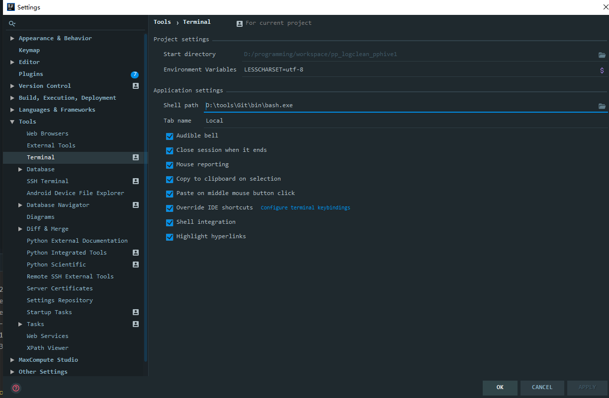
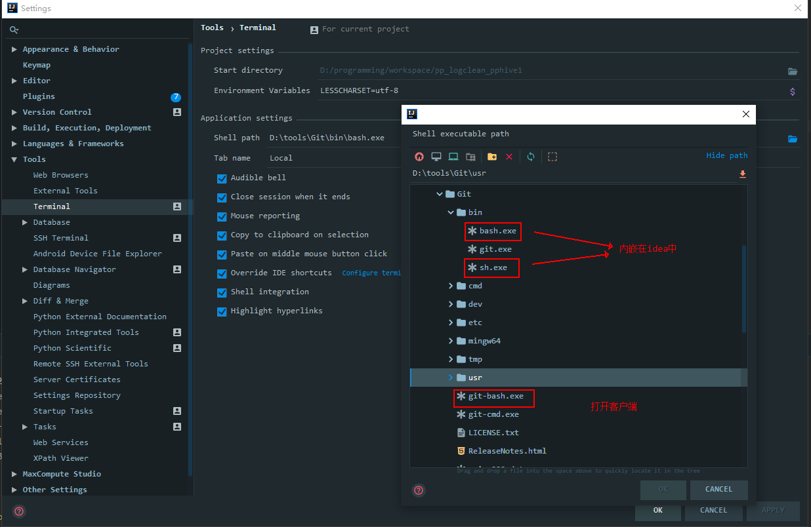

# Terminal更改为git的terminal

## IDEA Terminal替换成Git Bash

在IDEA中，打开settings，设置相应的bash路径
`settings`–>`Tools`–>`Terminal`–>`Shell path:D:\tools\Git\bin\bash.exe`

之后重启IDEA或者关闭当前`Terminal`的`session`连接，然后`New Session`连接。

## git控制台乱码问题

- 在idea安装目录下找到idea.exe.vmoptions和idea64.exe.vmoptions文件，在文件的最后添加：

　　　-Dfile.encoding=UTF-8

- 在git安装目录下找到etc/bash.bashrc文件，在文件的最后添加：

　　　export LANG="zh_CN.UTF-8"

　　　export LC_ALL="zh_CN.UTF-8"

- 在Terminal控制台输入：set LESSCHARSET=utf-8
- 退出控制台，重新进入即可。

