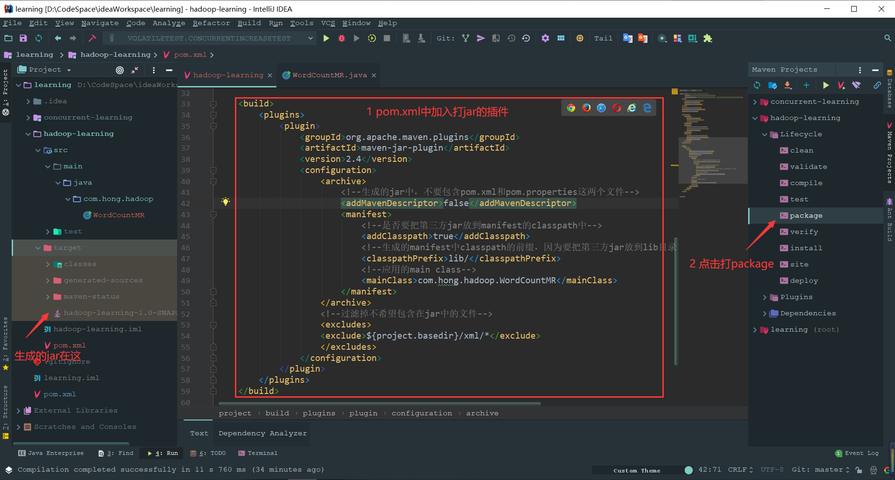

[toc]

# Maven打Jar包

## 1 打无依赖的包（相关的依赖不打入jar中，只对项目打jar）

在pom.xml中加入下面的：

```
    <build>
        <plugins>
            <plugin>
                <groupId>org.apache.maven.plugins</groupId>
                <artifactId>maven-jar-plugin</artifactId>
                <version>2.4</version>
                <configuration>
                    <archive>
                        <!--生成的jar中，不要包含pom.xml和pom.properties这两个文件-->
                        <addMavenDescriptor>false</addMavenDescriptor>
                        <manifest>
                            <!--是否要把第三方jar放到manifest的classpath中-->
                            <addClasspath>true</addClasspath>
                            <!--生成的manifest中classpath的前缀，因为要把第三方jar放到lib目录下，所以classpath的前缀是lib/-->
                            <classpathPrefix>lib/</classpathPrefix>
                            <!--应用的main class-->
                            <mainClass>com.hong.hadoop.WordCountMR</mainClass>
                        </manifest>
                    </archive>
                    <!--过滤掉不希望包含在jar中的文件-->
                    <excludes>
                    <exclude>${project.basedir}/xml/*</exclude>
                    </excludes>
                </configuration>
            </plugin>
        </plugins>
    </build>
```



## 2 打依赖的包（相关的依赖打入jar中）

在pom.xml中加入下面的：

```
    <build>
        <plugins>
            <plugin>
                <groupId>org.apache.maven.plugins</groupId>
                <artifactId>maven-compiler-plugin</artifactId>
                <version>3.1</version>
            </plugin>
            <plugin>
                <artifactId>maven-assembly-plugin</artifactId>
                <configuration>
                    <archive>
                        <manifest>
                            <!--应用的main class-->
                            <mainClass>com.test.app</mainClass>
                        </manifest>
                    </archive>
                    <!--有这个就会把相关的依赖打入jar中，最终打了2个jar一个是不包含依赖的，一个是包含依赖的-->
                    <descriptorRefs>
                        <descriptorRef>jar-with-dependencies</descriptorRef>
                    </descriptorRefs>
                </configuration>
                <!--下面是为了使用mvn package命令，如果不加则使用mvn assembly-->
                <executions>
                    <execution>
                        <id>make-assemble</id>
                        <phase>package</phase>
                        <goals>
                            <goal>single</goal>
                        </goals>
                    </execution>
                </executions>
            </plugin>
        </plugins>
    </build>
```

