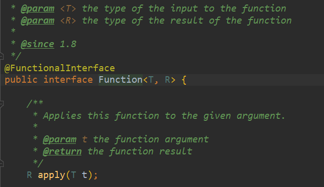
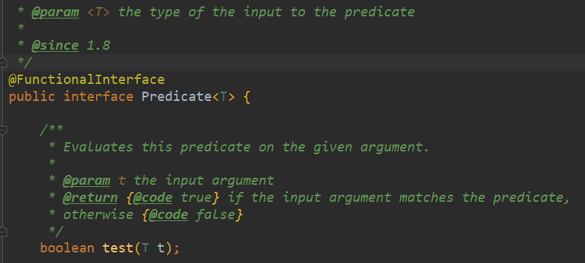
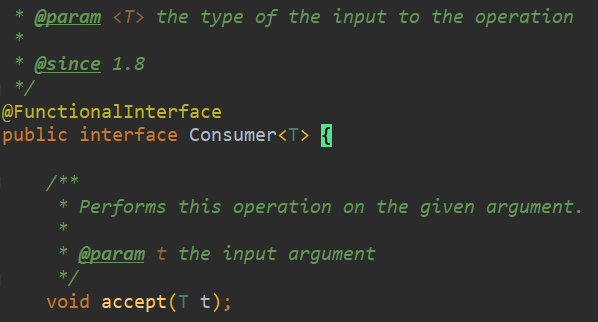
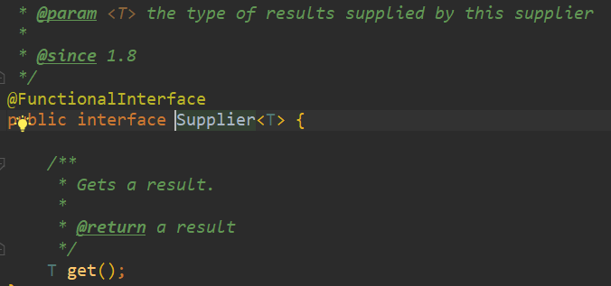

[toc]

# 函数式接口

## 1 什么是函数式接口

函数式接口(Functional Interface)：**有且仅有一个抽象方法并且可以有多个非抽象方法的接口**。

在Java中有很多的函数式接口，函数式接口存在的主要目的是：简化编程模型。

函数式接口可以被隐式转换为 lambda 表达式。

 如定义了一个函数式接口如下： 

```java
@FunctionalInterface // 需要被该注解修饰
interface GreetingService {
    void sayMessage(String message);
}
```

## 2 常见的函数式接口

```java
@FunctionalInterface
public interface Runnable {
    public abstract void run();
}

// foreach也引用了函数式编程：foreach(消费者类的函数式接口)
```


## 3 四大核心函数式接口

### 3.1 Function函数型接口

有一个输入参数以及一个输出参数

传入T型参数，输入R型参数



举例：

```java
    /**
     * 函数型接口
     * 有一个输入参数以及一个输出参数
     */
    public static void functionTest() {

        // 传入String，返回String
        Function function = new Function<String, String>() {
            @Override
            public String apply(String str) {
                return "output:" + str;
            }
        };
        System.out.println(function.apply("hello"));


        // 改装成lambda表达式
        Function function1 = (str) -> {
            return "output:" +str;
        };
        System.out.println(function1.apply("hello2"));

    }
```

### 3.2 Predicate断定型接口

有一个输入参数，返回值只能是布尔值



```java
    /**
     * 断定型接口
     * 有一个输入参数，返回值只能是布尔值
     */
    public static void PredicateTest() {
        Predicate<String> predicate = new Predicate<String>() {
            @Override
            public boolean test(String str) {
                return str.isEmpty();
            }
        };
        // 最终输出：false
        System.out.println(predicate.test("abc"));

        // 改装成lambda表达式
        Predicate<String> predicate2 = (str) -> {
            return str.isEmpty();
        };
        // 最终输出：false
        System.out.println(predicate2.test("abc"));

    }
```

### 3.3 Consomer消费型接口

只要输入没有返回值



```java
    /**
     * 消费型接口
     * 只有输入没有返回值
     */
    public static void ConsumerTest() {
        Consumer<String> consumer = new Consumer<String>() {
            @Override
            public void accept(String str) {
                System.out.println(str);
            }
        };
        consumer.accept("print this 1");


        Consumer<String> consumer2 = (str) -> {
            System.out.println(str);
        };
        consumer2.accept("print this 2");
    }
```

### 3.4 Supplier供给型接口

没有输入只有返回值



```java
    /**
     * 供给型接口
     * 只有输出没有输入
     */
    public static void supplierTest() {
        Supplier<String> supplier = new Supplier<String>() {
            @Override
            public String get() {
                return "this is supplier provide";
            }
        };
        System.out.println(supplier.get());


        Supplier<String> supplier1 = () -> {
            return "this is supplier provide 2";
        };
        System.out.println(supplier1.get());
    }
```