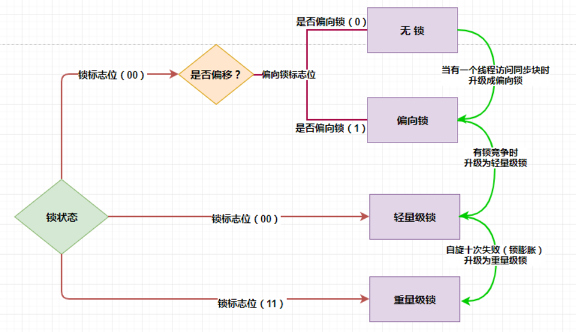

[toc]

# 锁

## 1 相关概念

### 1.1 公平锁与非公平锁

公平锁：线程获取锁的顺序与其申请顺序一致（队列）

非公平锁：线程获取锁的顺序并不是按照申请锁顺序，有可能后申请锁的线程先获取锁。

### 1.2 可重入锁与不可重入锁

可重入锁：线程获取锁后，可以重复进入同步代码区，不需要重复申请锁

不可重入锁：线程每次进入同步代码区时，均需要获取锁，即使已经获取过该锁。

### 1.3 悲观锁与乐观锁

悲观锁：总是持有悲观的态度，认为并发冲突一般会发生

乐观锁：总是持有乐观的态度，认为并发冲突一般不会发生

### 1.4 锁消除与锁粗化

锁消除：消除是Java虚拟机在JIT编译期间，通过对运行上下文的扫描，去除不可能存在共享资源竞争的锁，通过锁消除，可以节省毫无意义的请求锁时间。

锁粗化：在遇到一连串地对同一锁不断进行请求和释放的操作时，把所有的锁操作整合成对锁的一次请求，从而减少对锁的请求同步次数

### 1.5 自旋锁和自适应自旋

自旋锁：线程尝试获取锁，发现被占用后，不放弃cpu执行时间，进入阻塞状态，而是进入进行循环重试，重试指定次数后，仍未获取锁，则进入阻塞过程。

自适应自旋：重试次数不固定，而是由前一次在同一个锁上的自旋时间及锁的拥有者的状态来决定。

## 2 CAS

### 2.1 CAS介绍

CAS: Compare And Swap（比较以及交换）

CAS操作一般包含3个参数，期望值、内存值、新值。**如果期望值与内存值相等，则用新值去更新这个内存值。如果不相等，则可以再次进行比较，一直到成功为止**。

CAS是一种非阻塞的算法，线程在更新失败时，不需要挂起，因此省去了大量线程上下文切换的开销。

像`synchronized`这种独占锁属于**悲观锁**，它是在假设一定会发生冲突的，那么加锁恰好有用，除此之外，还有**乐观锁**，乐观锁的含义就是假设没有发生冲突，那么我正好可以进行某项操作，如果要是发生冲突呢，那我就重试直到成功，乐观锁最常见的就是`CAS`。

无论是**ReenterLock内部的AQS，还是各种Atomic开头的原子类**，内部都应用到了`CAS`。

### 2.2 CAS的问题

**ABA问题**

CAS需要在操作值的时候检查下值有没有发生变化，如果没有发生变化则更新，但是如果一个值原来是A，变成了B，又变成了A，那么使用CAS进行检查时会发现它的值没有发生变化，但是实际上却变化了。这就是CAS的ABA问题。 常见的解决思路是使用版本号。在变量前面追加上版本号，每次变量更新的时候把版本号加一，那么`A-B-A` 就会变成`1A-2B-3A`。 目前在JDK的atomic包里提供了一个类`AtomicStampedReference`来解决ABA问题。这个类的compareAndSet方法作用是首先检查当前引用是否等于预期引用，并且当前标志是否等于预期标志，如果全部相等，则以原子方式将该引用和该标志的值设置为给定的更新值。

**循环时间长开销大**

上面我们说过如果CAS不成功，则会原地自旋，如果长时间自旋会给CPU带来非常大的执行开销。synchronized是自旋10次就升级为重量级锁。

### 2.3 CAS与synchronized适用场景

- 线程冲突比较小时，CAS进行自旋操作，synchronized升级为轻量级锁，也是在自旋，两者的效率差不多。
- 线程冲突严重时，CAS绝大部分的自旋操作将大量浪费CPU的时间片，此时synchronized升级为重量级锁，但在这种情况下，synchronized的效率远高于CAS。(因为在线程冲突严重时，synchronized已经意识到轻量级锁的自旋操作效率低下，主动升级为重量级锁，所以这里的忙循环的开销远远大于线程切换的开销)。

## 3 锁状态&锁升级

### 3.1 锁的四种状态

锁的状态总共有四种，级别由低到高依次为：**无锁、偏向锁、轻量级锁(自旋锁)、重量级锁**。

其实在 JDK 1.6之前，**synchronized 还是一个重量级锁**，是一个效率比较低下的锁，但是在JDK 1.6后，Jvm为了提高锁的获取与释放效率对（**synchronized** ）进行了优化，引入了 **偏向锁 和 轻量级锁** ，从此以后锁的状态就有了四种（无锁、偏向锁、轻量级锁、重量级锁）。

#### 3.1.1 无锁

无锁是指没有对资源进行锁定，所有的线程都能访问并修改同一个资源，但同时只有一个线程能修改成功。

无锁的特点是修改操作会在循环内进行，线程会不断的尝试修改共享资源。如果没有冲突就修改成功并退出，否则就会继续循环尝试。如果有多个线程修改同一个值，必定会有一个线程能修改成功，而其他修改失败的线程会不断重试直到修改成功。

#### 3.1.2 偏向锁

初次执行到synchronized代码块的时候，锁对象变成偏向锁（通过CAS修改对象头里的锁标志位），字面意思是“偏向于第一个获得它的线程”的锁。执行完同步代码块后，线程并不会主动释放偏向锁。当第二次到达同步代码块时，线程会判断此时持有锁的线程是否就是自己（持有锁的线程ID也在对象头里），如果是则正常往下执行。由于之前没有释放锁，这里也就不需要重新加锁。如果自始至终使用锁的线程只有一个，很明显偏向锁几乎没有额外开销，性能极高。

偏向锁是指当一段同步代码一直被同一个线程所访问时，即不存在多个线程的竞争时，那么该线程在后续访问时便会自动获得锁，从而降低获取锁带来的消耗，即提高性能。

当一个线程访问同步代码块并获取锁时，会在 Mark Word 里存储锁偏向的线程 ID。在线程进入和退出同步块时不再通过 CAS 操作来加锁和解锁，而是检测 Mark Word 里是否存储着指向当前线程的偏向锁。轻量级锁的获取及释放依赖多次 CAS 原子指令，而偏向锁只需要在置换 ThreadID 的时候依赖一次 CAS 原子指令即可。

偏向锁只有遇到其他线程尝试竞争偏向锁时，持有偏向锁的线程才会释放锁，线程是不会主动释放偏向锁的。

关于偏向锁的撤销，需要等待全局安全点，即在某个时间点上没有字节码正在执行时，它会先暂停拥有偏向锁的线程，然后判断锁对象是否处于被锁定状态。如果线程不处于活动状态，则将对象头设置成无锁状态，并撤销偏向锁，恢复到无锁（标志位为01）或轻量级锁（标志位为00）的状态。

#### 3.1.3 轻量级锁（自旋锁）

轻量级锁是指当锁是偏向锁的时候，却被另外的线程所访问，此时偏向锁就会升级为轻量级锁，其他线程会通过自旋的形式尝试获取锁，线程不会阻塞，从而提高性能。

轻量级锁的获取主要由两种情况：
① 当关闭偏向锁功能时；
② 由于多个线程竞争偏向锁导致偏向锁升级为轻量级锁。

一旦有第二个线程加入锁竞争，偏向锁就升级为轻量级锁（自旋锁）。这里要明确一下什么是锁竞争：如果多个线程轮流获取一个锁，但是每次获取锁的时候都很顺利，没有发生阻塞，那么就不存在锁竞争。只有当某线程尝试获取锁的时候，发现该锁已经被占用，只能等待其释放，这才发生了锁竞争。

在轻量级锁状态下继续锁竞争，没有抢到锁的线程将自旋，即不停地循环判断锁是否能够被成功获取。获取锁的操作，其实就是通过CAS修改对象头里的锁标志位。先比较当前锁标志位是否为“释放”，如果是则将其设置为“锁定”，比较并设置是原子性发生的。这就算抢到锁了，然后线程将当前锁的持有者信息修改为自己。

长时间的自旋操作是非常消耗资源的，一个线程持有锁，其他线程就只能在原地空耗CPU，执行不了任何有效的任务，这种现象叫做忙等（busy-waiting）。如果多个线程用一个锁，但是没有发生锁竞争，或者发生了很轻微的锁竞争，那么synchronized就用轻量级锁，允许短时间的忙等现象。这是一种折衷的想法，短时间的忙等，换取线程在用户态和内核态之间切换的开销。

#### 3.1.4 重量级锁

重量级锁显然，此忙等是有限度的（有个计数器记录自旋次数，默认允许循环10次，可以通过虚拟机参数更改）。如果锁竞争情况严重，某个达到最大自旋次数的线程，会将轻量级锁升级为重量级锁（依然是CAS修改锁标志位，但不修改持有锁的线程ID）。当后续线程尝试获取锁时，发现被占用的锁是重量级锁，则直接将自己挂起（而不是忙等），等待将来被唤醒。

重量级锁是指当有一个线程获取锁之后，其余所有等待获取该锁的线程都会处于阻塞状态。

简言之，就是所有的控制权都交给了操作系统，由操作系统来负责线程间的调度和线程的状态变更。而这样会出现频繁地对线程运行状态的切换，线程的挂起和唤醒，从而消耗大量的系统资

### 3.2 锁升级

**锁的四种状态会随着竞争的情况逐渐升级，而且是不可逆的过程，即不可降级，也就是说只能进行锁升级（从低级别到高级别），不能锁降级（高级别到低级别）**，意味着偏向锁升级成轻量级锁后不能降级成偏向锁。这种锁升级不能降级的策略，目的是为了提高获得锁和释放锁的效率。

从无锁->偏向锁->轻量级锁(自旋锁)->重量级锁的过程就是锁升级的过程。

### 3.3 锁状态的思路以及特点

| 锁状态   | 存储内容                                              | 标志位 |
| -------- | ----------------------------------------------------- | ------ |
| 无锁     | 对象的hashCode、对象分代年龄、是否是偏向锁(0)         | 01     |
| 偏向锁   | 偏向线程ID、偏向时间戳、对象分代年龄、是否是偏向锁(1) | 01     |
| 轻量级锁 | 指向栈中锁记录的指针                                  | 00     |
| 重量级锁 | 指向互斥量的指针                                      | 11     |

### 3.4 锁对比

| 锁       | 优点                                                         | 缺点                                           | 适用场景                           |
| -------- | ------------------------------------------------------------ | ---------------------------------------------- | ---------------------------------- |
| 偏向锁   | 加锁和解锁不需要额外的消耗，和执行非同步方法相比仅存在纳秒级的差距 | 如果线程间存在锁竞争，会带来额外的锁撤销的消耗 | 适用于只有一个线程访问同步块场景   |
| 轻量级锁 | 竞争的线程不会阻塞，提高了程序的响应速度                     | 如果始终得不到索竞争的线程，使用自旋会消耗CPU  | 追求响应速度，同步块执行速度非常快 |
| 重量级锁 | 线程竞争不使用自旋，不会消耗CPU                              | 线程阻塞，响应时间缓慢                         | 追求吞吐量，同步块执行速度较慢     |

## ps-相关资料

[锁相关概念&&锁升级](https://blog.csdn.net/zycxnanwang/article/details/105337590)

[关于锁的四种状态与锁升级过程 图文详解](https://www.cnblogs.com/mingyueyy/p/13054296.html)

[CAS](https://juejin.cn/post/6844903558937051144)