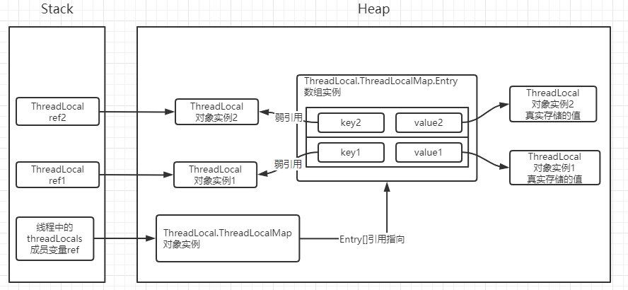

[toc]

# ThreadLocal

## 1 ThreadLocal 简介

ThreadLocal是解决线程安全问题一个很好的思路，它通过为每个线程提供一个独立的变量副本解决了变量并发访问的冲突问题。在很多情况下，ThreadLocal比直接使用synchronized同步机制解决线程安全问题更简单，更方便，且结果程序拥有更高的并发性。

在Java的多线程编程中，为保证多个线程对共享变量的安全访问，通常会使用synchronized来保证同一时刻只有一个线程对共享变量进行操作。这种情况下可以将[类变量](https://links.jianshu.com/go?to=https%3A%2F%2Fbaike.baidu.com%2Fitem%2F%E7%B1%BB%E5%8F%98%E9%87%8F)放到ThreadLocal类型的对象中，使变量在每个线程中都有独立拷贝，不会出现一个线程读取变量时而被另一个线程修改的现象。

ThreadLocal并不是一个Thread，而是Thread的局部变量，也许把它命名为ThreadLocalVariable更容易让人理解一些。

## 2 应用场景

最常见的ThreadLocal使用场景为用来解决数据库连接、Session管理等。

一个线程拥有一个数据库连接，这是后这个连接就可以通过ThreadLocal来管理。

## 3 分析

### 3.1 ThreadLocal中的重点方法

```java
public class ThreadLocal<T> {
    // 设置值
	public void set(T value) {
		//这一步是取得当前线程
	    Thread t = Thread.currentThread();
	    //获取到一个ThreadLocalMap对象
	    ThreadLocalMap map = getMap(t);
	    //获取到map如果是null就创建并赋值
	    if (map != null)
	    	//map中的键为线程对象，值为变量副本
	        map.set(this, value);
	    else
	        createMap(t, value);
	}
    
	void createMap(Thread t, T firstValue) {
        t.threadLocals = new ThreadLocalMap(this, firstValue);
    }
    
	ThreadLocalMap getMap(Thread t) {
		//这个返回的是Thread的成员变量threadLocals
	    return t.threadLocals;
	}
    
	//这个ThreadLocalMap 是个内部类
	static class ThreadLocalMap {
		//Entry继承自WeakReference将ThreadLocal作为弱引用，GC运行, ThreadLocal即被回收
		static class Entry extends WeakReference<ThreadLocal<?>> {
            /** The value associated with this ThreadLocal. */
            Object value;

            Entry(ThreadLocal<?> k, Object v) {
                super(k);
                value = v;
            }
        }
	}
}


// 单独说明下Thread类中的threadLocals变量
public class Thread implements Runnable {
	// Thread类中的threadLocals实际上就是ThreadLocalMap，并且ThreadLocalMap是ThreadLocal的内部类
	ThreadLocal.ThreadLocalMap threadLocals = null;
}
```

### 3.2 分析说明

- 每个线程是一个Thread实例，其内部维护一个threadLocals的实例成员，其类型是ThreadLocal.ThreadLocalMap。
- 通过实例化ThreadLocal实例，我们可以对当前运行的线程设置一些线程私有的变量，通过调用ThreadLocal的set和get方法存取。
- ThreadLocal本身并不是一个容器，我们存取的value实际上存储在ThreadLocalMap中，ThreadLocal只是作为TheadLocalMap的key。
- 每个线程实例都对应一个TheadLocalMap实例，我们可以在同一个线程里实例化很多个ThreadLocal来存储很多种类型的值，这些ThreadLocal实例分别作为key，对应各自的value，最终存储在Entry table数组中。
- 当调用ThreadLocal的set/get进行赋值/取值操作时，首先获取当前线程的ThreadLocalMap实例，然后就像操作一个普通的map一样，进行put和get。



图中左边是栈，右边是堆。线程的一些局部变量和引用使用的内存属于Stack（栈）区，而普通的对象是存储在Heap（堆）区。


## 总结

在每个线程Thread内部有一个ThreadLocal.ThreadLocalMap类型的成员变量threadLocals，这个threadLocals就是用来存储实际的变量副本的，键值为当前ThreadLocal变量，value为变量副本（即T类型的变量）。 初始时，在Thread里面，threadLocals为空，当通过ThreadLocal变量调用get()方法或者set()方法，就会对Thread类中的threadLocals进行初始化，并且以当前ThreadLocal变量为键值，以ThreadLocal要保存的副本变量为value，存到threadLocals。 然后在当前线程里面，如果要使用副本变量，就可以通过get方法在threadLocals里面查找。

1. 实际的通过ThreadLocal创建的副本是存储在每个线程自己的threadLocals中的；
2. 为何threadLocals的类型ThreadLocalMap的键值为ThreadLocal对象，因为每个线程中可有多个threadLocal变量，就像上面代码中的longLocal和stringLocal；
3. 在进行get之前，必须先set，否则会报空指针异常；如果想在get之前不需要调用set就能正常访问的话，必须重写initialValue()方法。 因为在上面的代码分析过程中，我们发现如果没有先set的话，即在map中查找不到对应的存储，则会通过调用setInitialValue方法返回i，而在setInitialValue方法中，有一个语句是T value = initialValue()， 而默认情况下，initialValue方法返回的是null。


## ps-相关资料

[ThreadLocal作用、场景、原理](https://www.jianshu.com/p/6fc3bba12f38)

[Java并发编程：深入剖析ThreadLocal](https://www.cnblogs.com/dolphin0520/p/3920407.html)

[ThreadLocal理解及应用](https://blog.csdn.net/zzg1229059735/article/details/82715741)

[ThreadLocal应用-多数据源切换](https://blog.csdn.net/csdn_mingss/article/details/86586322)

[TheadLocal 引起的内存泄露故障分析](https://mp.weixin.qq.com/s/Gf4MiHPz8DynY80UmwH04Q)