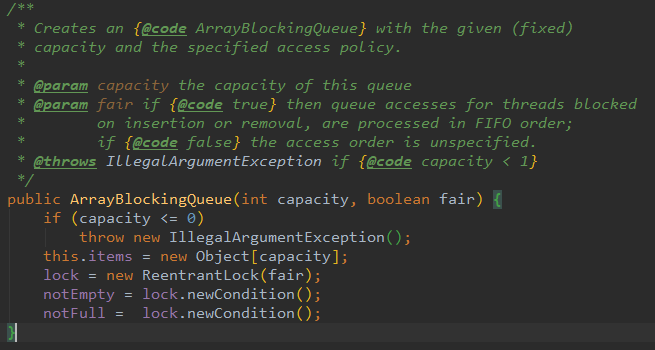

[toc]

# 阻塞队列-BlockingQueue

## 1 概述

阻塞队列 (BlockingQueue)是Java util.concurrent包下重要的数据结构，BlockingQueue提供了线程安全的队列访问方式：当阻塞队列进行插入数据时，如果队列已满，线程将会阻塞等待直到队列非满；从阻塞队列取数据时，如果队列已空，线程将会阻塞等待直到队列非空。并发包下很多高级同步类的实现都是基于BlockingQueue实现的。

## 2 BlockingQueue常用方法

| 方法类型 | 抛出异常  | 特殊值   | 阻塞   | 超时                  |
| -------- | --------- | -------- | ------ | --------------------- |
| 插入     | add(e)    | offer(e) | put(e) | offer(e,timeout,unit) |
| 移除     | remove()  | poll()   | take() | poll(timeout,unit)    |
| 检查     | element() | peek()   | 无     | 无                    |

引发异常：如果无法立即进行尝试的操作，则会引发异常。
特殊值：如果无法立即尝试操作，则会返回一个特殊值（通常为true / false）。
阻塞：如果无法立即进行尝试的操作，则该方法调用将一直阻塞直到可行为止。
超时：如果无法立即进行尝试的操作，则该方法调用将一直阻塞直到成功，但等待时间不得长于给定的超时。返回一个特殊值，告诉操作是否成功（通常为true / false）。

说明：BlockingQueue 不接受null 元素。试图add、put 或offer 一个null 元素时，某些实现会抛出NullPointerException。null 被用作指示poll 操作失败的警戒值。 

### 2.1 入队方法

| 方法                  | 说明                                                         |
| --------------------- | ------------------------------------------------------------ |
| add(e)                | 对象e入队，如果可以容纳则返回true，如果**入队前队列满了则抛出异常**。 |
| put(e)                | 对象e入队，如果入队前队列满了则**调用线程会被阻塞**，直到队列里面有空间再继续入队操作。 |
| offer(e)              | 对象e入队，如果可以容纳则返回true，如果**入队前队列满了返回false**。 |
| offer(e,timeout,unit) | 对象e入队，如果入队前队列满了则在timeout时间(单位unit)内会阻塞， 如果在timeout时间内入队成功则返回true 如果超过timeout则返回false |

### 2.2 出队方法

| 方法               | 说明                                                         |
| ------------------ | ------------------------------------------------------------ |
| remove()           | 出队，如果队列为空则**抛出异常**                             |
| take()             | 出队，如果队列为空则会**阻塞**，直到有对对象可以出队         |
| poll()             | 出队，如果不能立即取出则返回null                             |
| poll(timeout,unit) | 出队，若不能立即取出，则可以等timeout时间(单位unit)，再取不到则返回null |

## 3 BlockingQueue的几个注意点

1. 容量：BlockingQueue **可以是限定容量的**。它在任意给定时间都可以有一个remainingCapacity，超出此容量，便无法无阻塞地put 附加元素。没有任何内部容量约束的BlockingQueue 总是报告Integer.MAX_VALUE 的剩余容量。
2. BlockingQueue **实现主要用于生产者-使用者队列**，但它另外还支持`Collection`接口。因此，举例来说，使用remove(x) 从队列中移除任意一个元素是有可能的。然而，这种操作通常*不* 会有效执行，只能有计划地偶尔使用，比如在取消排队信息时。
3. BlockingQueue 实现是**线程安全**的。所有排队方法都可以使用内部锁或其他形式的并发控制来自动达到它们的目的。然而，*大量的* Collection 操作（addAll、containsAll、retainAll 和removeAll）*没有* 必要自动执行，除非在实现中特别说明。因此，举例来说，在只添加了c 中的一些元素后，addAll(c) 有可能失败（抛出一个异常）。
4. BlockingQueue 实质上**不支持使用任何一种“close”或“shutdown”操作来指示不再添加任何项**。这种功能的需求和使用有依赖于实现的倾向。例如，一种常用的策略是：对于生产者，插入特殊的*end-of-stream* 或*poison* 对象，并根据使用者获取这些对象的时间来对它们进行解释。

## 4 BlockingQueue常用的实现类

### 4.1 ArrayBlockingQueue

实现细节

- 基于数组实现循环队列： 也就意味着预分配了空间，不过基于数组在性能上比基于链表的实现性能高些（CPU cache更友好吧）
- 在读写队列的时候都是用一个ReentrantLock对整个队列上锁（默认非公平锁，公平锁会线程饥饿）。
    
- 一旦创建，大小固定，有界队列。比较适合作为有界缓冲。大小固定，也就不必纠结空间回收的问题了，这个是优点也是缺点，看怎么理解了。
- 实现中使用了Condition来控制notFull和notEmpty条件,
    例如take取数据的时候由于队列空了就会被阻塞；有新的数据put，就可以signal那些take数据被阻塞的线程了。
    不利用Condition的话自己利用Object的notify、wait方法也可以做，不过显然麻烦多了。

应用场景

- 比较适合作为有界缓冲。

### 4.2 LinkedBlockingQueue

实现细节

1.基于链表实现： 大小可变，更加灵活。默认最大大小为Integer.MAX_VALUE。

2.在队首（putLock）和队尾使用两把锁： 可以实现读写并发，吞吐性能比ArrayBlockingQueue好很多，

也利用Condition来做非空非满的条件判断

应用场景

常见的不涉及大量互斥资源的生产消费的情况，都可以用该类实现生产消费模型

### 4.3 SynchronousQueue

总结下有以下特点：

1.容量永远为0

2.适合一对一的生产消费场景，由于经过很多优化，性能是很好的。因此容量为1的队列，就别使用其他阻塞queue了

3.实现上也用了CAS、自旋锁

应用场景

性能比前面几种Queue都要高

适合当做一个生产者和消费者之间的汇合点，传递数据。

### 4.4 DelayedQueue

原理

1.延迟队列内部使用优先队列管理任务

2.使用一个availabe Condition条件来做唤醒

3.使用的heap数据结构（因为用的优先队列是基于堆得）

应用场景

延迟任务、定期任务、周期任务

### 4.5 PriorityBlockingQueue

原理

1.存储的对象必须是实现Comparable接口

2.基于heap的数据机构（array-based binary heap）

应用场景

有优先级的任务

### 4.6 LinkedTransferQueue

原理

1.非阻塞

2.基于CAS无锁

3.Doug Lea说从功能角度来讲，LinkedTransferQueue实际上是ConcurrentLinkedQueue、SynchronousQueue（公平模式）和LinkedBlockingQueue的超集。而且LinkedTransferQueue更好用，因为它不仅仅综合了这几个类的功能，同时也提供了更高效的实现。

## ps-相关引用

[bilibili-狂神-阻塞队列](https://www.bilibili.com/video/BV1B7411L7tE?p=19)

https://cloud.tencent.com/developer/article/1464278