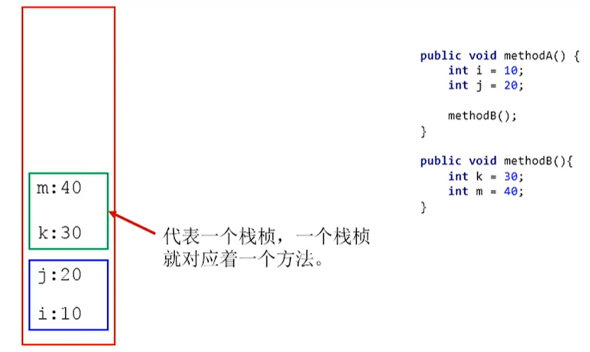
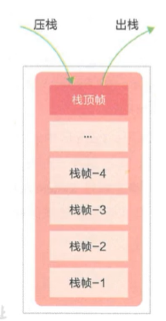
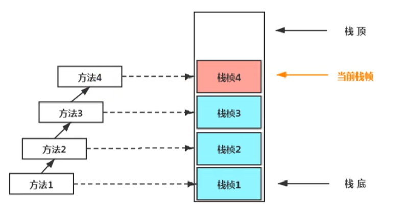
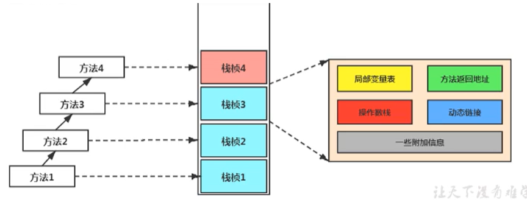
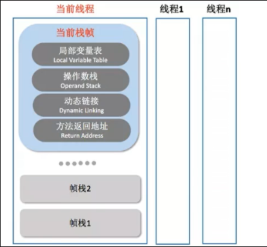
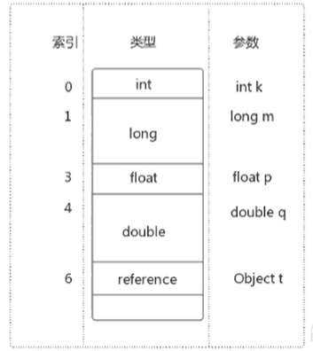
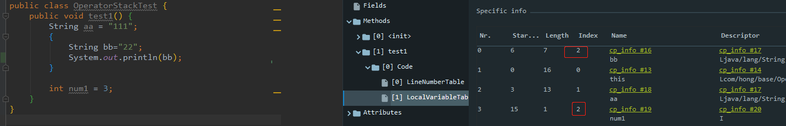
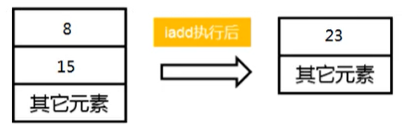
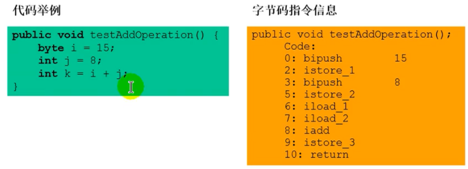

[toc]

# 虚拟机栈
## 1 概述
由于跨平台性的设计，Java的指令都是根据栈来设计的。不同平台CPU架构不同，所以不能设计为基于寄存器的。 优点是跨平台，指令集小，编译器容易实现，缺点是性能下降，实现同样的功能需要更多的指令。

### 1.1 Java虚拟机栈是什么

Java虚拟机栈（Java Virtual Machine Stack），早期也叫Java栈。每个线程在创建时都会创建一个虚拟机栈（线程私有），其内部保存一个个的栈帧（Stack Frame），对应着一次次的Java方法调用。


### 1.2 虚拟机栈生命周期

虚拟机栈的生命周期和线程一致，也就是线程结束了，该虚拟机栈也销毁了。

### 1.3 虚拟机栈作用

虚拟机栈主管Java程序的运行，它保存方法的局部变量、部分结果，并参与方法的调用和返回。

> 局部变量，它是相比于成员变量来说的（或属性）
>
> 基本数据类型变量 VS 引用类型变量（类、数组、接口）

### 1.3 虚拟机栈特点

栈是一种快速有效的分配存储方式，访问速度仅次于程序计数器。JVM直接对Java栈的操作只有两个：

- 每个方法执行，伴随着进栈（入栈、压栈）
- 执行结束后的出栈工作

对于栈来说不存在垃圾回收问题（栈存在溢出的情况）


### 1.4 关于栈的异常

Java 虚拟机规范允许Java栈的大小是动态的或者是固定不变的。

如果采用固定大小的Java虚拟机栈，那每一个线程的Java虚拟机栈容量可以在线程创建的时候独立选定。如果线程请求分配的栈容量超过Java虚拟机栈允许的最大容量，Java虚拟机将会抛出一个StackoverflowError 异常。（举例：递归次数过多）

如果Java虚拟机栈可以动态扩展，并且在尝试扩展的时候无法申请到足够的内存，或者在创建新的线程时没有足够的内存去创建对应的虚拟机栈，那Java虚拟机将会抛出一个 outofMemoryError 异常。

### 1.5 设置栈内存大小

我们可以使用参数 -Xss选项来设置线程的最大栈空间，栈的大小直接决定了函数调用的最大可达深度

```
-Xss1m -- 设置为1M内存大小
-Xss1024k -- 设置为1024k内存大小
-Xss1g -- 设置为1G内存大小
```

## 2 栈的存储单位-栈帧

### 2.1 栈的存储内容-栈帧

每个线程都有自己的栈，栈中的数据都是以**栈帧**（Stack Frame）的格式存在。
在这个线程上正在执行的每个方法都各自对应一个栈帧（Stack Frame）。
栈帧是一个内存区块，是一个数据集，维系着方法执行过程中的各种数据信息。

JVM直接对Java栈的操作只有两个，就是对栈帧的压栈和出栈，遵循“先进后出”/“后进先出”原则。

在一条活动线程中，一个时间点上，只会有一个活动的栈帧。即只有当前正在执行的方法的栈帧（栈顶栈帧）是有效的，这个栈帧被称为当前栈帧（Current Frame），与当前栈帧相对应的方法就是当前方法（Current Method），定义这个方法的类就是当前类（Current Class）。

执行引擎运行的所有字节码指令只针对当前栈帧进行操作。

如果在该方法中调用了其他方法，对应的新的栈帧会被创建出来，放在栈的顶端，成为新的当前帧。



### 2.2 栈运行原理

不同线程中所包含的栈帧是不允许存在相互引用的，即不可能在一个栈帧之中引用另外一个线程的栈帧。

如果当前方法调用了其他方法，方法返回之际，当前栈帧会传回此方法的执行结果给前一个栈帧，接着，虚拟机会丢弃当前栈帧（出栈），使得前一个栈帧重新成为当前栈帧。

Java方法有两种返回函数的方式，一种是正常的函数返回，使用return指令；另外一种是抛出异常。不管使用哪种方式，都会导致栈帧被弹出。

## 3 栈帧的内部结构

- 局部变量表（Local Variables）
- 操作数栈（operand Stack）（或表达式栈）
- 动态链接（Dynamic Linking）（或指向运行时常量池的方法引用）
- 方法返回地址（Return Address）（或方法正常退出或者异常退出的定义）
- 一些附加信息



并行每个线程下的栈都是私有的，因此每个线程都有自己各自的栈，并且每个栈里面都有很多栈帧，栈帧的大小主要由局部变量表 和 操作数栈决定的



### 3.1 局部变量表

#### 3.1.1 局部变量表概述

局部变量表：Local Variables，被称之为局部变量数组或本地变量表

定义为一个数字数组，主要用于存储方法参数和定义在方法体内的局部变量这些数据类型包括各类基本数据类型、对象引用（reference），以及return Address类型。

由于局部变量表是建立在线程的栈上，是线程的私有数据，因此不存在数据安全问题

局部变量表所需的容量大小是在编译期确定下来的，并保存在方法的Code属性的maximum local variables数据项中。在方法运行期间是不会改变局部变量表的大小的。

方法嵌套调用的次数由栈的大小决定。一般来说，栈越大，方法嵌套调用次数越多。对一个函数而言，它的参数和局部变量越多，使得局部变量表膨胀，它的栈帧就越大，以满足方法调用所需传递的信息增大的需求。进而函数调用就会占用更多的栈空间，导致其嵌套调用次数就会减少。

局部变量表中的变量只在当前方法调用中有效。在方法执行时，虚拟机通过使用局部变量表完成参数值到参数变量列表的传递过程。当方法调用结束后，随着方法栈帧的销毁，局部变量表也会随之销毁。

#### 3.1.2 局部变量表存储单位-slot

局部变量表，最基本的存储单元是Slot（变量槽）局部变量表中存放编译期可知的各种基本数据类型（8种），引用类型（reference），return Address类型的变量。

在局部变量表里，32位以内的类型只占用一个slot（包括return Address类型），64位的类型（long和double）占用两个slot。

```
byte、short、char 在存储前被转换为int，boolean也被转换为int，0表示false，非0表示true。 1ong和double则占据两个slot。
```

JVM会为局部变量表中的每一个Slot都分配一个访问索引，通过这个索引即可成功访问到局部变量表中指定的局部变量值

当一个实例方法被调用的时候，它的方法参数和方法体内部定义的局部变量将会按照顺序被复制到局部变量表中的每一个slot上

如果需要访问局部变量表中一个64位的局部变量值时，只需要使用前一个索引即可。（比如：访问long或double类型变量）

如果当前帧是由构造方法或者实例方法创建的，那么该对象引用this将会存放在index为0的slot处，其余的参数按照参数表顺序继续排列。



#### 3.1.3 slot的重复利用

栈帧中的局部变量表中的槽位是可以重用的，如果一个局部变量过了其作用域，那么在其作用域之后申明的新的局部变就很有可能会复用过期局部变量的槽位，从而达到节省资源的目的。

```java
public class OperatorStackTest {
    public void test1() {
        String aa = "111"; // slot开始的index:1
        {
            String bb="22"; // slot开始index:2 ，由于是局部的后续被收回复用
        }

        int num1 = 3; // slot开始index:2， 复用bb变量的slot
    }
}
```



#### 3.1.4 静态变量(类变量)与局部变量的对比

变量的分类：

- 按数据类型分：基本数据类型、引用数据类型
- 按类中声明的位置分：成员变量（类变量，实例变量）、局部变量
    - 类变量：linking的prepare阶段，给类变量默认赋值，initial阶段给类变量赋值即静态代码块
    - 实例变量：随着对象创建，会在堆空间中分配实例变量空间，并进行默认赋值
    - 局部变量：在使用前必须进行显式赋值，不然编译不通过。

参数表分配完毕之后，再根据方法体内定义的变量的顺序和作用域分配。

我们知道类变量表有两次初始化的机会，第一次是在“准备阶段”，执行系统初始化，对类变量设置零值，另一次则是在“初始化”阶段，赋予程序员在代码中定义的初始值。

和类变量初始化不同的是，局部变量表不存在系统初始化的过程，这意味着一旦定义了局部变量则必须人为的初始化，否则无法使用。

在栈帧中，与性能调优关系最为密切的部分就是前面提到的局部变量表。在方法执行时，虚拟机使用局部变量表完成方法的传递。

局部变量表中的变量也是重要的垃圾回收根节点，只要被局部变量表中直接或间接引用的对象都不会被回收。

### 3.2 操作数栈

操作数栈：Operand Stack

每一个独立的栈帧除了包含局部变量表以外，还包含一个后进先出（Last - In - First -Out）的 **操作数栈**，也可以称之为**表达式栈**（Expression Stack）

操作数栈，在方法执行过程中，根据字节码指令，往栈中写入数据或提取数据，即入栈（push）和 出栈（pop）

- 某些字节码指令将值压入操作数栈，其余的字节码指令将操作数取出栈。使用它们后再把结果压入栈
- 比如：执行复制、交换、求和等操作





操作数栈，主要用于保存计算过程的中间结果，同时作为计算过程中变量临时的存储空间。

操作数栈就是JVM执行引擎的一个工作区，当一个方法刚开始执行的时候，一个新的栈帧也会随之被创建出来，这个方法的操作数栈是空的。.

> 这个时候数组是有长度的，因为数组一旦创建，那么就是不可变的

每一个操作数栈都会拥有一个明确的栈深度用于存储数值，其所需的最大深度在编译期就定义好了，保存在方法的Code属性中，为maxstack的值。

栈中的任何一个元素都是可以任意的Java数据类型

- 32bit的类型占用一个栈单位深度
- 64bit的类型占用两个栈单位深度

操作数栈并非采用访问索引的方式来进行数据访问的，而是只能通过标准的入栈和出栈操作来完成一次数据访问

如果被调用的方法带有返回值的话，其返回值将会被压入当前栈帧的操作数栈中，并更新PC寄存器中下一条需要执行的字节码指令。

操作数栈中元素的数据类型必须与字节码指令的序列严格匹配，这由编译器在编译器期间进行验证，同时在类加载过程中的类检验阶段的数据流分析阶段要再次验证。

另外，我们说Java虚拟机的解释引擎是基于栈的执行引擎，其中的栈指的就是操作数栈。

### 3.3 动态链接

#### 3.3.1 静态链接

当一个字节码文件被装载进JVM内部时，如果被调用的目标方法在编译期可确定，且运行期保持不变时，调用方法时将符号引用转换为直接引用的过程称之为静态链接

#### 3.3.2  动态链接

如果被调用的方法在编译期无法被确定下来，也就是说只能够在程序运行期将调用的方法的符号引用转换为直接引用，由于这种引用转换过程具备动态性，因此也被称之为动态链接。

#### 3.3.3 绑定机制

对应的方法的绑定机制为：早期绑定（Early Binding）和晚期绑定（Late Binding）。绑定是一个字段、方法或者类在符号引用被替换为直接引用的过程，这仅仅发生一次。

1.  早期绑定
    早期绑定就是指被调用的目标方法如果在编译期可知，且运行期保持不变时，即可将这个方法与所属的类型进行绑定，这样一来，由于明确了被调用的目标方法究竟是哪一个，因此也就可以使用静态链接的方式将符号引用转换为直接引用。
2. 晚期绑定
    如果被调用的方法在编译期无法被确定下来，只能够在程序运行期根据实际的类型绑定相关的方法，这种绑定方式也就被称之为晚期绑定。

#### 3.3.4 虚方法和非虚方法

- 如果方法在编译期就确定了具体的调用版本，这个版本在运行时是不可变的。这样的方法称为**非虚方法**。
    - 静态方法、私有方法、final方法、实例构造器、父类方法都是非虚方法。
- 其他方法称为虚方法（即在运行时是可变的）。

> 子类对象的多态的使用前提
>
> - 类的继承关系
> - 方法的重写

虚拟机中提供了以下几种方法调用指令：

1. 普通调用指令：
    - invokestatic：调用静态方法，解析阶段确定唯一方法版本
    - invokespecial：调用方法、私有及父类方法，解析阶段确定唯一方法版本
    - invokevirtual：调用所有虚方法
    - invokeinterface：调用接口方法
2.  动态调用指令：
    - invokedynamic：动态解析出需要调用的方法，然后执行

普通调用指令固化在虚拟机内部，方法的调用执行不可人为干预，而invokedynamic指令则支持由用户确定方法版本。其中invokestatic指令和invokespecial指令调用的方法称为非虚方法，其余的（final修饰的除外）称为虚方法。

JVM字节码指令集一直比较稳定，一直到Java7中才增加了一个invokedynamic指令，这是Java为了实现动态类型语言支持而做的一种改进。
但是在Java7中并没有提供直接生成invokedynamic指令的方法，需要借助ASM这种底层字节码工具来产生invokedynamic指令。
直到Java8的Lambda表达式的出现，invokedynamic指令的生成，在Java中才有了直接的生成方式。
Java7中增加的动态语言类型支持的本质是对Java虚拟机规范的修改，而不是对Java语言规则的修改，这一块相对来讲比较复杂，增加了虚拟机中的方法调用，最直接的受益者就是运行在Java平台的动态语言的编译器。

### 3.4 方法返回地址

存放调用该方法的pc寄存器的值。一个方法的结束，有两种方式：

- 正常执行完成
- 出现未处理的异常，非正常退出

无论通过哪种方式退出，在方法退出后都返回到该方法被调用的位置。方法正常退出时，调用者的pc计数器的值作为返回地址，即调用该方法的指令的下一条指令的地址。而通过异常退出的，返回地址是要通过异常表来确定，栈帧中一般不会保存这部分信息。

当一个方法开始执行后，只有两种方式可以退出这个方法：

执行引擎遇到任意一个方法返回的字节码指令（return），会有返回值传递给上层的方法调用者，简称正常完成出口；

- 一个方法在正常调用完之后，究竟需要使用哪一个返回指令，还需要根据方法返回值的实际数据类型而定。
- 在字节码指令中，返回指令包含：
    - ireturn（当返回值是boolean，byte，char，short和int类型时使用[这些类型都被转换为int进行表示]）
    - lreturn（Long类型）
    - freturn（Float类型）
    - dreturn（Double类型）
    - areturn。
    - 另外还有一个return指令声明为void的方法，实例初始化方法，类和接口的初始化方法使用。

在方法执行过程中遇到异常（Exception），并且这个异常没有在方法内进行处理，也就是只要在本方法的异常表中没有搜索到匹配的异常处理器，就会导致方法退出，简称异常完成出口。

方法执行过程中，抛出异常时的异常处理，存储在一个异常处理表，方便在发生异常的时候找到处理异常的代码

### 3.5 附加信息

栈帧中还允许携带与Java虚拟机实现相关的一些附加信息。例如：对程序调试提供支持的信息。

## ps-相关资料

- [ 虚拟机栈](https://gitee.com/moxi159753/LearningNotes/tree/master/JVM/1_%E5%86%85%E5%AD%98%E4%B8%8E%E5%9E%83%E5%9C%BE%E5%9B%9E%E6%94%B6%E7%AF%87/5_%E8%99%9A%E6%8B%9F%E6%9C%BA%E6%A0%88)