[toc]

# 垃圾回收器

## 1 垃圾回收器概述

GC垃圾收集器是和JVM一脉相承的，它是和JVM进行搭配使用，在不同的使用场景对应的收集器也是有区别。

为什么要有很多收集器，一个不够吗？因为Java的使用场景很多，移动端，服务器等。所以就需要针对不同的场景，提供不同的垃圾收集器，提高垃圾收集的性能。

虽然我们会对各个收集器进行比较，但并非为了挑选一个最好的收集器出来。没有一种放之四海皆准、任何场景下都适用的完美收集器存在，更加没有万能的收集器。所以我们选择的只是对具体应用最合适的收集器。

## 2 垃圾回收器分类以及衡量指标

### 2.1 垃圾回收器分类

#### 2.1.1 按线程数分

**按线程数分**（垃圾回收线程数）可以分为串行垃圾回收器和并行垃圾回收器。 

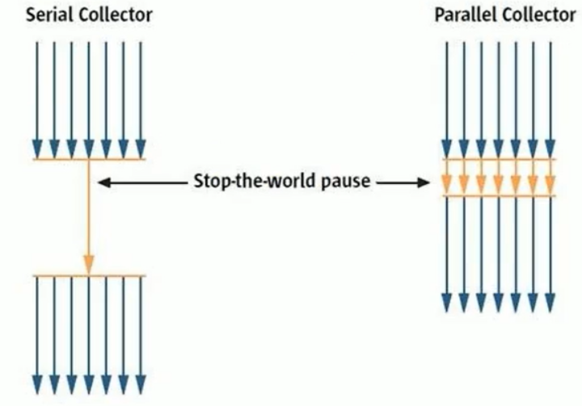

串行回收指的是在同一时间段内只允许有一个CPU用于执行垃圾回收操作，此时工作线程被暂停，直至垃圾收集工作结束。

- 在诸如**单CPU处理器**或者较小的应用内存等硬件平台不是特别优越的场合，串行回收器的性能表现可以超过并行回收器和并发回收器。所以，串行回收默认被应用在客户端的Client模式下的JVM中
- 在并发能力比较强的CPU上，并行回收器产生的停顿时间要短于串行回收器。

和串行回收相反，并行收集可以运用多个CPU同时执行垃圾回收，因此提升了应用的吞吐量，不过并行回收仍然与串行回收一样，采用独占式，使用了“stop-the-world”机制。

#### 2.1.2 按工作模式分

按照工作模式分可以分为并发式垃圾回收器和独占式垃圾回收器。

- 并发式垃圾回收器与应用程序线程交替工作，以尽可能减少应用程序的停顿时间。
- 独占式垃圾回收器（Stop the world）一旦运行，就停止应用程序中的所有用户线程，直到垃圾回收过程完全结束。

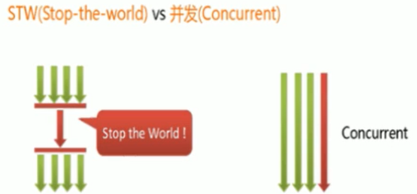

#### 2.1.3 按碎片处理方式分

按碎片处理方式分可分为压缩式垃圾回收器和非压缩式垃圾回收器。

- 压缩式垃圾回收器会在回收完成后，对存活对象进行压缩整理，消除回收后的碎片。
- 非压缩式的垃圾回收器不进行这步操作。

#### 2.1.4 按内存区间分

按工作的内存区间分，又可分为年轻代垃圾回收器和老年代垃圾回收器。

### 2.2 垃圾回收器的衡量指标

为了衡量垃圾回收器的好坏，即垃圾回收器的快慢、效率的高低等，衡量指标主要有下面几个：

- **吞吐量**：运行用户代码的时间占总运行时间的比例（总运行时间 = 程序的运行时间 + 内存回收的时间）
    - 吞吐量=运行用户代码时间 /（运行用户代码时间+垃圾收集时间） ，比如虚拟机总共运行了100分钟，其中垃圾收集花掉1分钟，那吞吐量就是99%。 
- **垃圾收集开销**：吞吐量的补数，垃圾收集所用时间与总运行时间的比例。
- **暂停时间**：执行垃圾收集时，程序的工作线程被暂停的时间。
- **收集频率**：相对于应用程序的执行，收集操作发生的频率。
- **内存占用**：Java堆区所占的内存大小。
- **快速**：一个对象从诞生到被回收所经历的时间。

吞吐量、暂停时间、内存占用 这三者共同构成一个“不可能三角”。

三者总体的表现会随着技术进步而越来越好，一款优秀的收集器通常最多同时满足其中的两项。 
这三项里，暂停时间的重要性日益凸显。因为随着硬件发展，内存占用多些越来越能容忍，硬件性能的提升也有助于降低收集器运行时对应用程序的影响，即提高了吞吐量。而内存的扩大，对延迟反而带来负面效果。 

## 3 常见的垃圾回收器以及分类

### 3.1 垃圾回收器按串并行分

- 串行回收器：Serial、Serial old
- 并行回收器：ParNew、Parallel Scavenge、Parallel old
- 并发回收器：CMS、G1

### 3.2 垃圾回收器与垃圾分代的关系(重点)

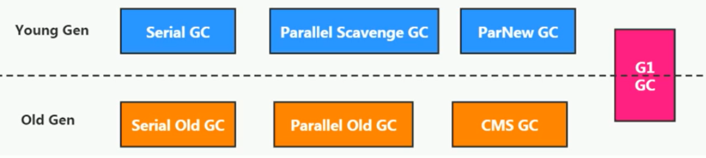

新生代收集器：Serial、ParNew、Parallel Scavenge；

老年代收集器：Serial old、Parallel old、CMS；

整堆收集器：G1

### 3.3 垃圾回收器的组合关系(重点)

图中，虚线上面的为年轻代的垃圾收集器，下面的是老年代的垃圾收集器，G1比较特殊两个都可以：

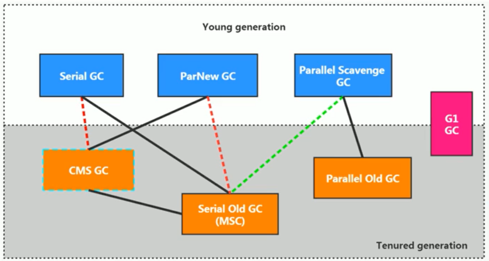

- 两个收集器间有连线，表明它们可以搭配使用：Serial/Serial old、Serial/CMS、ParNew/Serial old、ParNew/CMS、Parallel Scavenge/Serial Old、Parallel Scavenge/Parallel old、G1；
- 其中Serial old作为CMS出现"Concurrent Mode Failure"失败的后备预案。
- （红色虚线）由于维护和兼容性测试的成本，在JDK 8时将Serial+CMS、ParNew+Serial old这两个组合声明为废弃（JEP173），并在JDK9中完全取消了这些组合的支持（JEP214）即：移除。
- （绿色虚线）JDK14中：弃用Paralle1 Scavenge和Serialold GC组合（JEP366）
- （青色虚线）JDK14中：删除CMS垃圾回收器（JEP363）

## 4 垃圾回收器

### 4.1 Serial回收器

#### 4.1.1 Serial回收器-串行回收-年轻代

Serial收集器是最基本、历史最悠久的垃圾收集器，是JDK1.3之前回收新生代唯一的选择。

Serial收集器作为HotSpot中client模式下的默认**新生代垃圾收集器**，采用**复制算法**、串行回收和"stop-the-World"机制的方式执行内存回收。

#### 4.1.2 Serial old回收器-串行回收-老年代-标记压缩算法

除了年轻代之外，Serial收集器还提供用于执行**老年代垃圾收集**的**Serial old收集器**。
Serial old收集器同样也采用了串行回收和"Stop the World"机制，只不过内存回收算法使用的是**标记-压缩算法**。

- Serial old是运行在Client模式下默认的老年代的垃圾回收器
- Serial old在Server模式下主要有两个用途：
    1. 与新生代的Parallel scavenge配合使用
    2. 作为老年代CMS收集器的后备垃圾收集方案

#### 4.1.3 总结&优缺点

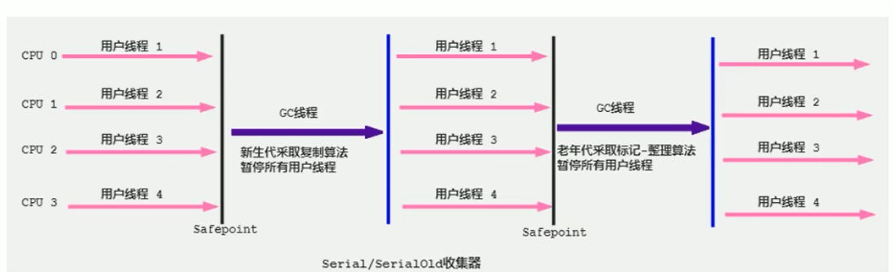

这个收集器是一个**单线程的收集器**，但它的“单线程”的意义并不仅仅说明它只会使用一个CPU或一条收集线程去完成垃圾收集工作，更重要的是在它进行垃圾收集时，必须暂停其他所有的工作线程，直到它收集结束（Stop The World）

- 优点：
    1. 简单而高效（与其他收集器的单线程比），对于限定单个cPU的环境来说，Serial收集器由于没有线程交互的开销，专心做垃圾收集自然可以获得最高的单线程收集效率。运行在client模式下的虚拟机是个不错的选择。
        在用户的桌面应用场景中，可用内存一般不大（几十MB至一两百MB），可以在较短时间内完成垃圾收集（几十ms至一百多ms），只要不频繁发生，使用串行回收器是可以接受的。
- 缺点：
    1. 串行执行，而且限定单核cpu才可以用，现在基本都不是单核的了
    2. 对于交互较强的应用而言，这种垃圾收集器是不能接受的。
        如一般在Java web应用程序中是不会采用串行垃圾收集器的。

在HotSpot虚拟机中，使用`-XX：+UseSerialGC`参数可以指定年轻代和老年代都使用串行收集器。(等价于新生代用Serial GC，且老年代用Serial old GC)

### 4.2 ParNew回收器-并行回收-年轻代-复制算法

如果说serialGC是年轻代中的单线程垃圾收集器，那么ParNew收集器则是serial收集器的多线程版本。

- Par是Parallel的缩写，New：只能处理的是新生代

ParNew 收集器除了采用**并行回收**的方式执行内存回收外，在其他方面两款垃圾收集器之间几乎没有任何区别。
ParNew收集器在年轻代中同样也是采用**复制算法**、"stop-the-World"机制。

ParNew 是很多JVM运行在Server模式下新生代的默认垃圾收集器。

- 对于新生代，回收次数频繁，使用并行方式高效。
- 对于老年代，回收次数少，使用串行方式节省资源。（CPU并行需要切换线程，串行可以省去切换线程的资源）

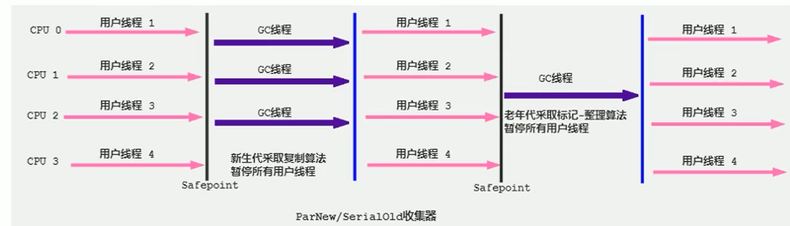

由于ParNew收集器是基于并行回收，那么是否可以断定ParNew收集器的回收效率在任何场景下都会比serial收集器更高效？

- ParNew收集器运行在**多个CPU的环境下**，由于可以充分使用多CPU、多核心等物理硬件资源，可以更快的完成垃圾收集，提高程序的吞吐量。
- 但是在**单个CPU的环境下**，ParNew收集器不比Serial收集器更高效（因为Serial不需要频繁的任务切换，省却了一些额外开销）

因为除Serial外，目前只有ParNew GC能与CMS收集器配合工作

在程序中开发人员可以通过选项"-XX：+UseParNewGC"手动指定使用ParNew收集器执行内存回收任务。它表示年轻代使用并行收集器，不影响老年代。

-XX:ParallelGCThreads限制线程数量，默认开启和CPU数据相同的线程数。

### 4.3 Parallel回收器-JDK8中默认

#### 4.3.1 Parallel Scavenge回收器-吞吐量优先-并行回收-年轻代-复制算法

HotSpot的年轻代中除了拥有ParNew收集器是基于并行回收的以外，`Parallel Scavenge收集器`同样也采用了**复制算法**、并行回收和"Stop the World"机制。

那么Parallel 收集器的出现是否多此一举？

- 和ParNew收集器不同，Parallel Scavenge收集器的目标则是达到一个**可控制的吞吐量**（Throughput），它也被称为吞吐量优先的垃圾收集器。
- 自适应调节策略也是Parallel Scavenge与ParNew一个重要区别。

应用场景：
高吞吐量则可以高效率地利用CPU时间，尽快完成程序的运算任务，主要适合在后台运算而不需要太多交互的任务。
因此，常见在服务器环境中使用。例如那些执行批量处理、订单处理、工资支付、科学计算的应用程序。

#### 4.3.2 Parallel old回收器-并行回收-老年代-标记压缩算法

Parallel收集器在JDK1.6时提供了用于执行老年代垃圾收集的Parallel old收集器，用来代替老年代的serial old收集器。

Parallel old收集器采用了**标记-压缩**算法，但同样也是基于**并行回收**和"Stop-the-World"机制。

#### 4.3.3 总结&优缺点

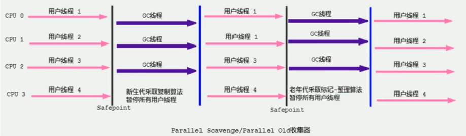

- 优点
    1. 在程序吞吐量优先的应用场景中，Parallel收集器和Parallel old收集器的组合，在server模式下的内存回收性能很不错。在Java8中，默认是此垃圾收集器。
    2. 可以控制吞吐量；
    3. 拥有自适应调节策略

#### 4.3.4 参数配置

- `-XX：+UseParallelGC` 手动指定年轻代使用Parallel并行收集器执行内存回收任务。（与ParalleloldGc互相激活，作用于新生代，默认jdk8是开启的）
- `-XX：+UseParalleloldGc` 手动指定老年代都是使用并行回收收集器。（与ParallelGC互相激活，作用于老年代，默认jdk8是开启的）
- `-XX:ParallelGcthreads`设置年轻代并行收集器的线程数。最好与CPU数量相等，以避免过多的线程数影响垃圾收集性能。
    - 当CPU数量大于8个，ParallelGCThreads的值等于3+[5*CPU Count]/8]
- `-XX:MaxGCPauseMillis` 设置垃圾收集器最大停顿时间（即STW的时间）,单位是毫秒。
    - 为了尽可能地把停顿时间控制在MaxGCPauseMills以内，收集器在工作时会调整Java堆大小或者其他一些参数。 对于用户来讲，停顿时间越短体验越好。但是在服务器端，我们注重高并发，整体的吞吐量。所以服务器端适合Parallel，进行控制。该参数使用需谨慎。
- `-XX:GCTimeRatio`垃圾收集时间占总时间的比例（=1/（N+1））。用于衡量吞吐量的大小。
    - 取值范围（0，100）。默认值99，也就是垃圾回收时间不超过1%。
    - 与前一个`-XX:MaxGCPauseMillis`参数有一定矛盾性。暂停时间越长，Radio参数就容易超过设定的比例。
- `-XX:+UseAdaptivesizepplicy` 设置Parallel scavenge收集器具有自适应调节策略
    - 在这种模式下，年轻代的大小、Eden和Survivor的比例、晋升老年代的对象年龄等参数会被自动调整，已达到在堆大小、吞吐量和停顿时间之间的平衡点。
    - 在手动调优比较困难的场合，可以直接使用这种自适应的方式，仅指定虚拟机的最大堆、目标的吞吐量（GCTimeRatio）和停顿时间（MaxGCPauseMills），让虚拟机自己完成调优工作。

### 4.4 CMS回收器-低延迟-并发-老年代-标记清除算法

#### 4.4.1 CMS概述

CMS（Concurrent-Mark-Sweep）收集器，这款收集器是HotSpot虚拟机中第一款真正意义上的**并发收集器**，**它第一次实现了让垃圾收集线程与用户线程同时工作**。CMS收集器在JDK1.5时期提出，是一款在强交互应用中几乎可认为有划时代意义的垃圾收集器。

CMS收集器的关注点是**尽可能缩短垃圾收集时用户线程的停顿时间**。停顿时间越短（低延迟）就越适合与用户交互的程序，良好的响应速度能提升用户体验。

目前很大一部分的Java应用集中在互联网站或者B/S系统的服务端上，这类应用尤其重视服务的响应速度，希望系统停顿时间最短，以给用户带来较好的体验。CMS收集器就非常符合这类应用的需求。

CMS的垃圾收集算法采用**标记-清除算法**，并且也会"stop-the-world"

不幸的是，CMS作为**老年代**的收集器，却无法与JDK1.4.0中已经存在的新生代收集器Parallel Scavenge配合工作，所以在JDK1.5中使用CMS来收集老年代的时候，新生代只能选择ParNew或者Serial收集器中的一个。

在G1出现之前，CMS使用还是非常广泛的。一直到今天，仍然有很多系统使用CMS GC。

#### 4.4.2 CMS垃圾收集过程

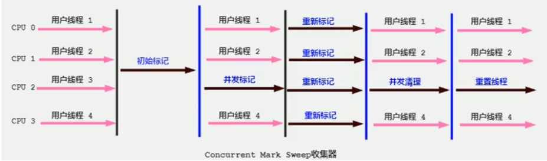

CMS整个过程比之前的收集器要复杂，整个过程分为4个主要阶段，即初始标记阶段、并发标记阶段、重新标记阶段和并发清除阶段。(**涉及STW的阶段主要是：初始标记 和 重新标记**)

1. **初始标记**（Initial-Mark）阶段：在这个阶段中，程序中所有的工作线程都将会因为“stop-the-world”机制而出现短暂的暂停，这个阶段的主要任务仅仅只是**标记出GCRoots能直接关联到的对象**。一旦标记完成之后就会恢复之前被暂停的所有应用线程。由于直接关联对象比较小，所以这里的速度非常快。
2. **并发标记**（Concurrent-Mark）阶段：从Gc Roots的直接关联对象开始遍历整个对象图的过程，这个过程耗时较长但是不需要停顿用户线程，可以与垃圾收集线程一起并发运行。
3. **重新标记**（Remark）阶段：由于在并发标记阶段中，程序的工作线程会和垃圾收集线程同时运行或者交叉运行，因此为了修正并发标记期间，因用户程序继续运作而导致标记产生变动的那一部分对象的标记记录，这个阶段的停顿时间通常会比初始标记阶段稍长一些，但也远比并发标记阶段的时间短。
4. **并发清除**（Concurrent-Sweep）阶段：此阶段清理删除掉标记阶段判断的已经死亡的对象，释放内存空间。由于不需要移动存活对象，所以这个阶段也是可以与用户线程同时并发的

尽管CMS收集器采用的是并发回收（非独占式），但是在其初始化标记和再次标记这两个阶段中仍然需要执行“Stop-the-World”机制暂停程序中的工作线程，不过暂停时间并不会太长，因此可以说明**目前所有的垃圾收集器都做不到完全不需要“stop-the-World”，只是尽可能地缩短暂停时间**。

由于最耗费时间的并发标记与并发清除阶段都不需要暂停工作，所以整体的回收是低停顿的。

另外，由于在垃圾收集阶段用户线程没有中断，所以在CMS回收过程中，还应该确保应用程序用户线程有足够的内存可用。因此，CMS收集器不能像其他收集器那样等到老年代几乎完全被填满了再进行收集，而是当堆内存使用率达到某一阈值时，便开始进行回收，以确保应用程序在CMS工作过程中依然有足够的空间支持应用程序运行。要是CMS运行期间预留的内存无法满足程序需要，就会出现一次“Concurrent Mode Failure” 失败，这时虚拟机将启动后备预案：临时启用Serial old收集器来重新进行老年代的垃圾收集，这样停顿时间就很长了。

CMS收集器的垃圾收集算法采用的是**标记清除算法**，这意味着每次执行完内存回收后，由于被执行内存回收的无用对象所占用的内存空间极有可能是不连续的一些内存块，不可避免地将会产生一些内存碎片。那么CMS在为新对象分配内存空间时，将无法使用指针碰撞（Bump the Pointer）技术，而只能够选择**空闲列表**（Free List）执行内存分配。

#### 4.4.3  CMS为什么不使用标记整理算法

答案其实很简答，因为当**并发清除**的时候，用Compact整理内存的话，原来的用户线程使用的内存还怎么用呢？要保证用户线程能继续执行，前提的它运行的资源不受影响嘛。Mark Compact更适合“stop the world” 这种场景下使用

一句话总结：
由于CMS采用**并发清除**的策略，所以在用户线程工作的时候**没办法进行标记压缩的压缩工作**（否则就让用户线程停下来，这就是stop the wrold了）。

#### 4.4.4 优缺点

- 优点
    1. 并发收集
    2. 低延迟，即响应速度快
- 缺点
    1. 会产生内存碎片，导致并发清除后，用户线程可用的空间不足。在无法分配大对象的情况下，不得不提前触发FullGC。
    2. CMS收集器对CPU资源非常敏感。在并发阶段，它虽然不会导致用户停顿，但是会因为占用了一部分线程而导致应用程序变慢，总吞吐量会降低。
    3. CMS收集器无法处理浮动垃圾。可能出现“Concurrent Mode Failure"失败而导致另一次Full GC的产生。在并发标记阶段由于程序的工作线程和垃圾收集线程是同时运行或者交叉运行的，那么在并发标记阶段如果产生新的垃圾对象，CMS将无法对这些垃圾对象进行标记，最终会导致这些新产生的垃圾对象没有被及时回收，从而只能在下一次执行GC时释放这些之前未被回收的内存空间。

#### 4.4.5 参数设置

- `-XX:+UseConcMarkSweepGC`手动指定使用CMS收集器执行内存回收任务。

    - 开启该参数后会自动将`-XX：+UseParNewGC`打开。即：ParNew（Young区用）+CMS（old区用）+Serial old的组合。

- `-XX:CMSInitiatingoccupanyFraction` 设置堆内存使用率的阈值，一旦达到该阈值，便开始进行回收。

    - JDK5及以前版本的默认值为68，即当老年代的空间使用率达到68%时，会执行一次cMs回收。JDK6及以上版本默认值为92%

        如果内存增长缓慢，则可以设置一个稍大的值，大的阀值可以有效降低CMS的触发频率，减少老年代回收的次数可以较为明显地改善应用程序性能。反之，如果应用程序内存使用率增长很快，则应该降低这个阈值，以避免频繁触发老年代串行收集器。因此通过该选项便可以有效降低FullGC的执行次数。

- `-XX:+UseCMSCompactAtFullCollection`用于指定在执行完FullGC后对内存空间进行压缩整理，以此避免内存碎片的产生。不过由于内存压缩整理过程无法并发执行，所带来的问题就是停顿时间变得更长了。

- `-XX:CMSFullGCsBeforecompaction` 设置在执行多少次FulLGC后对内存空间进行压缩整理。

- `-XX:ParallelcMSThreads` 设置CMS的线程数量。

    - CMS默认启动的线程数是（ParalleLGCThreads+3）/4，ParallelGCThreads是年轻代并行收集器的线程数。当CPU资源比较紧张时，受到CMS收集器线程的影响，应用程序的性能在垃圾回收阶段可能会非常糟糕。

#### 4.4.6 JDK后续版本中CMS的变化

**JDK9新特性**：CMS被标记为eprecate了（JEP291）>如果对JDK9及以上版本的HotSpot虚拟机使用参数`-XX:+UseConcMarkSweepGC`来开启CMS收集器的话，用户会收到一个警告信息，提示CMS未来将会被废弃。

JDK14新特性：删除CMs垃圾回收器（JEP363）移除了CMS垃圾收集器，如果在JDK14中使用 `-XX:+UseConcMarkSweepGC`的话，JVM不会报错，只是给出一个warning信息，但是不会exit。JVM会自动回退以默认GC方式启动JVM

### 4.5 G1回收器-区域化分代式-并行-分区算法

#### 4.5.1 既然我们已经有了前面几个强大的GC，为什么还要发布Garbage First（G1）？

原因就在于应用程序所应对的业务越来越庞大、复杂，用户越来越多，没有GC就不能保证应用程序正常进行，而经常造成STW的GC又跟不上实际的需求，所以才会不断地尝试对GC进行优化。

G1（Garbage-First）垃圾回收器是在Java7 update4之后引入的一个新的垃圾回收器，是当今收集器技术发展的最前沿成果之一。与此同时，为了适应现在不断扩大的内存和不断增加的处理器数量，进一步降低暂停时间（pause time），同时兼顾良好的吞吐量。
官方给G1设定的目标是**在延迟可控的情况下获得尽可能高的吞吐量**，所以才担当起“全功能收集器”的重任与期望。

#### 4.5.2 为什么叫 Garbage First(G1)？

因为G1是一个**并行回收器**，它把堆内存分割为很多不相关的区域（Region）（物理上不连续的）。使用不同的Region来表示Eden、幸存者0区，幸存者1区，老年代等。

G1 GC有计划地避免在整个Java堆中进行全区域的垃圾收集。G1跟踪各个Region里面的垃圾堆积的价值大小（回收所获得的空间大小以及回收所需时间的经验值），在后台维护一个优先列表，每次根据允许的收集时间，优先回收价值最大的Region。

由于这种方式的侧重点在于**回收垃圾最大量的区间**（Region），所以我们给G1一个名字：垃圾优先（Garbage First）。

G1（Garbage-First）是一款面向服务端应用的垃圾收集器，**主要针对配备多核CPU及大容量内存的机器**，以极高概率满足GC停顿时间的同时，还兼具高吞吐量的性能特征。

G1在JDK1.7版本正式启用，移除了Experimental的标识，是**JDK9以后的默认垃圾回收器**，取代了CMS回收器以及Parallel+Parallel old组合。被oracle官方称为“全功能的垃圾收集器”。

与此同时，**CMS已经在JDK9中被标记为废弃（deprecated）**。在jdk8中还不是默认的垃圾回收器，需要使用`-XX:+UseG1GC`来启用。

#### 4.5.3 G1的优缺点

##### 4.5.3.1 优点

与其他GC收集器相比，G1使用了全新的**分区算法**，其特点如下所示：

**并行与并发**

- 并行性：G1在回收期间，可以有多个GC线程同时工作，有效利用多核计算能力。此时用户线程STW
- 并发性：G1拥有与应用程序交替执行的能力，部分工作可以和应用程序同时执行，一般来说，不会在整个回收阶段发生完全阻塞应用程序的情况

**分代收集**

- 从分代上看，G1依然属于分代型垃圾回收器，它会区分年轻代和老年代，年轻代依然有Eden区和Survivor区。但从堆的结构上看，**它不要求整个Eden区、年轻代或者老年代都是连续的，也不再坚持固定大小和固定数量**。
- 将堆空间分为若干个区域（Region），这些区域中包含了逻辑上的年轻代和老年代。
- 和之前的各类回收器不同，它同时兼顾年轻代和老年代。对比其他回收器，或者工作在年轻代，或者工作在老年代；
- G1所谓的分代，已经不是前面我们看的那样，而是下面这样的：
    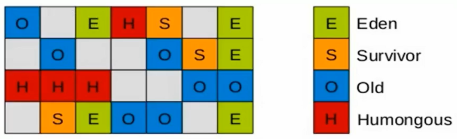

**空间整合**

- CMS：“标记-清除”算法、内存碎片、若干次Gc后进行一次碎片整理
- G1将内存划分为一个个的region。内存的回收是以region作为基本单位的。Region之间是**复制算法**，但整体上实际可看作是**标记-压缩**（Mark-Compact）算法，两种算法都可以避免内存碎片。这种特性有利于程序长时间运行，分配大对象时不会因为无法找到连续内存空间而提前触发下一次GC。**尤其是当Java堆非常大的时候，G1的优势更加明显**。

**可预测的停顿时间模型（即：软实时soft real-time）**

这是G1相对于CMS的另一大优势，G1除了追求低停顿外，还能建立可预测的停顿时间模型，能让使用者明确指定在一个长度为M毫秒的时间片段内，消耗在垃圾收集上的时间不得超过N毫秒。

- 由于分区的原因，G1可以只选取部分区域进行内存回收，这样缩小了回收的范围，因此对于全局停顿情况的发生也能得到较好的控制。
- G1跟踪各个Region里面的垃圾堆积的价值大小（回收所获得的空间大小以及回收所需时间的经验值），在后台维护一个优先列表，每次根据允许的收集时间，优先回收价值最大的Region。保证了G1收集器在有限的时间内可以获取尽可能高的收集效率。
- 相比于CMS，G1未必能做到CMS在最好情况下的延时停顿，但是最差情况要好很多。

##### 4.5.3.2 缺点

相较于CMS，G1还不具备全方位、压倒性优势。
比如在用户程序运行过程中，G1无论是为了垃圾收集产生的内存占用（Footprint）还是程序运行时的额外执行负载（overload）都要比CMS要高。

从经验上来说，在小内存应用上CMS的表现大概率会优于G1，而G1在大内存应用上则发挥其优势。平衡点在6-8GB之间。

#### 4.5.4 G1参数设置

- `-XX:+UseG1GC`：手动指定使用G1垃圾收集器执行内存回收任务
- `-XX:G1HeapRegionSize`设置每个Region的大小。值是2的幂，范围是1MB到32MB之间，
    目标是根据最小的Java堆大小划分出约2048个区域。默认是堆内存的1/2000。
- `-XX:MaxGCPauseMillis` 设置期望达到的最大Gc停顿时间指标（JVM会尽力实现，但不保证达到）。默认值是200ms
- `-XX:+ParallelGcThread` 设置STW工作线程数的值。最多设置为8
- `-XX:ConcGCThreads` 设置并发标记的线程数。将n设置为并行垃圾回收线程数（ParallelGcThreads）的1/4左右。
- `-XX:InitiatingHeapoccupancyPercent` 设置触发并发Gc周期的Java堆占用率阈值。超过此值，就触发GC。默认值是45。

#### 4.5.5 G1的性能调优步骤

G1的设计原则就是简化JVM性能调优，开发人员只需要简单的三步即可完成调优：

1. 第一步：开启G1垃圾收集器
2. 第二步：设置堆的最大内存
3. 第三步：设置最大的停顿时间

G1中提供了三种垃圾回收模式：YoungGC、Mixed GC和FullGC，在不同的条件下被触发。

#### 4.5.6 G1收集器的适用场景

面向服务端应用，针对具有大内存、多处理器的机器。（在普通大小的堆里表现并不惊喜）

最主要的应用是需要低GC延迟，并具有大堆的应用程序提供解决方案；

如：在堆大小约6GB或更大时，可预测的暂停时间可以低于0.5秒；（G1通过每次只清理一部分而不是全部的Region的增量式清理来保证每次Gc停顿时间不会过长）。 用来替换掉JDK1.5中的CMS收集器；

在下面的情况时，使用G1可能比CMS好：

- 超过50%的Java堆被活动数据占用；
- 对象分配频率或年代提升频率变化很大；
- GC停顿时间过长（长于0.5至1秒）

HotSpot垃圾收集器里，除了G1以外，其他的垃圾收集器使用内置的JVM线程执行GC的多线程操作，而G1GC可以采用应用线程承担后台运行的GC工作，即当JVM的GC线程处理速度慢时，系统会调用应用程序线程帮助加速垃圾回收过程。

#### 4.5.7 分区Region

使用G1收集器时，它将整个Java堆划分成约2048个大小相同的独立Region块，每个Region块大小根据堆空间的实际大小而定，整体被控制在1MB到32MB之间，且为2的N次幂，即1MB，2MB，4MB，8MB，16MB，32MB。
可以通过`-XX:G1HeapRegionsize`设定Region大小。所有的Region大小相同，且在JVM生命周期内不会被改变。

虽然还保留有新生代和老年代的概念，但新生代和老年代不再是物理隔离的了，它们都是一部分Region（不需要连续）的集合。通过Region的动态分配方式实现逻辑上的连续。

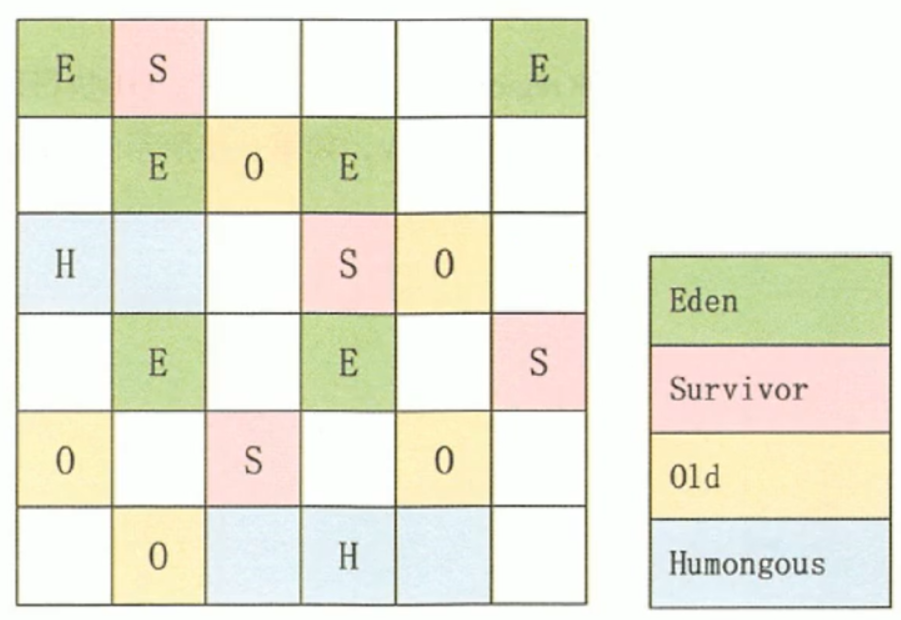

一个region有可能属于Eden、Survivor或者Old/Tenured，但是一个region只能属于其中一个角色。

G1垃圾收集器还增加了一种新的内存区域，叫做**Humongous内存区域**，主要用于存储大对象，如果超过1.5个region，就放到H。

**设置H的原因：**
对于堆中的对象，默认直接会被分配到老年代，但是如果它是一个短期存在的大对象就会对垃圾收集器造成负面影响。
为了解决这个问题，G1划分了一个Humongous区，它用来专门存放大对象。如果一个H区装不下一个大对象，那么G1会寻找连续的H区来存储。为了能找到连续的H区，有时候不得不启动FullGC。**G1的大多数行为都把H区作为老年代的一部分来看待**。

对于Regionl来说内存都是规整的，所以每个Region都是通过**指针碰撞**来分配空间。

#### 4.5.8  G1的回收过程

G1GC的垃圾回收过程主要包括如下三个环节：

1. 年轻代GC（Young GC）
2. 老年代并发标记过程（Concurrent Marking）
3. 混合回收（Mixed GC）

如果需要单线程、独占式、高强度的FullGC还是继续存在的。它针对GC的评估失败提供了一种失败保护机制，即强力回收。

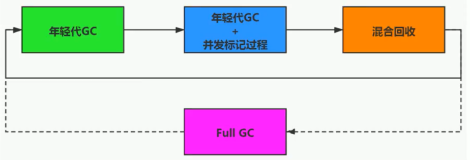

顺时针，Young GC -> Young GC+Concurrent Mark -> Mixed GC顺序，进行垃圾回收。

1. 应用程序分配内存，当年轻代的Eden区用尽时开始年轻代回收过程；
    **G1的年轻代收集阶段是一个并行的独占式收集器**。在年轻代回收期，G1GC暂停所有应用程序线程，启动多线程执行年轻代回收。然后从年轻代区间移动存活对象到Survivor区间或者老年区间，也有可能是两个区间都会涉及。
2. 当堆内存使用达到一定值（默认45%）时，开始**老年代并发标记过程**。
3. 标记完成马上开始**混合回收过程**。
    对于一个混合回收期，G1GC从老年区间移动存活对象到空闲区间，这些空闲区间也就成为了老年代的一部分。和年轻代不同，老年代的G1回收器和其他GC不同，G1的老年代回收器不需要整个老年代被回收，一次只需要扫描/回收一小部分老年代的Region就可以了。同时，这个老年代Region是和年轻代一起被回收的。

举个例子：
一个Web服务器，Java进程最大堆内存为4G，每分钟响应1500个请求，每45秒钟会新分配大约2G的内存。G1会每45秒钟进行一次年轻代回收，每31个小时整个堆的使用率会达到45%，会开始老年代并发标记过程，标记完成后开始四到五次的混合回收。

#### 4.5.9 Remembered Set（记忆集）

一个对象被不同区域引用的问题:
一个Region不可能是孤立的，一个Region中的对象可能被其他任意Region中对象引用，判断对象存活时，是否需要扫描整个Java堆才能保证准确？
在其他的分代收集器，也存在这样的问题（而G1更突出）回收新生代也不得不同时扫描老年代？这样的话会降低MinorGC的效率；

**解决方法：**

无论G1还是其他分代收集器，JVM都是使用Remembered Set来避免全局扫描：

每个Region都有一个对应的Remembered Set；每次Reference类型数据写操作时，都会产生一个Write Barrier暂时中断操作；

然后检查将要写入的引用指向的对象是否和该Reference类型数据在不同的Region（其他收集器：检查老年代对象是否引用了新生代对象）；如果不同，通过cardTable把相关引用信息记录到引用指向对象的所在Region对应的Remembered Set中；当进行垃圾收集时，在GC根节点的枚举范围加入Remembered Set；就可以保证不进行全局扫描，也不会有遗漏。

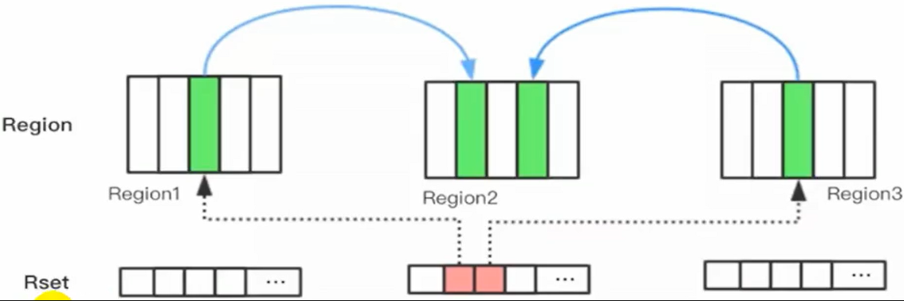

#### 4.5.10 G1回收过程-1-年轻代GC

JVM启动时，G1先准备好Eden区，程序在运行过程中不断创建对象到Eden区，当Eden空间耗尽时，G1会启动一次年轻代垃圾回收过程。

YGC时，首先G1停止应用程序的执行（stop-The-Wor1d），G1创建回收集（Collection Set），回收集是指需要被回收的内存分段的集合，年轻代回收过程的回收集包含年轻代Eden区和Survivor区所有的内存分段。

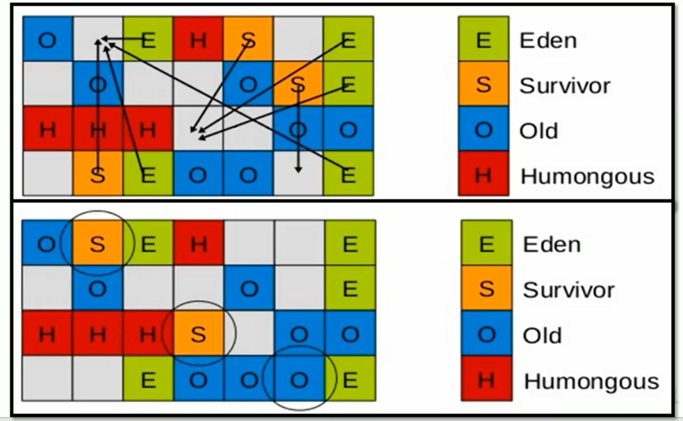

然后开始如下回收过程：

1. 第一阶段，扫描根
    根是指static变量指向的对象，正在执行的方法调用链条上的局部变量等。根引用连同RSet记录的外部引用作为扫描存活对象的入口。
2. 第二阶段，更新RSet
    处理dirty card queue中的card，更新RSet。此阶段完成后，RSet可以准确的反映老年代对所在的内存分段中对象的引用。
3. 第三阶段，处理RSet
    识别被老年代对象指向的Eden中的对象，这些被指向的Eden中的对象被认为是存活的对象。
4. 第四阶段，复制对象。
    此阶段，对象树被遍历，Eden区内存段中存活的对象会被复制到Survivor区中空的内存分段，Survivor区内存段中存活的对象如果年龄未达阈值，年龄会加1，达到阀值会被会被复制到o1d区中空的内存分段。如果Survivor空间不够，Eden空间的部分数据会直接晋升到老年代空间。
5. 第五阶段，处理引用处理Soft，Weak，Phantom，Final，JNI Weak 等引用。最终Eden空间的数据为空，GC停止工作，而目标内存中的对象都是连续存储的，没有碎片，所以复制过程可以达到内存整理的效果，减少碎片。

#### 4.5.11 G1回收过程-2-并发标记过程

1. 初始标记阶段：标记从根节点直接可达的对象。这个阶段是sTw的，并且会触发一次年轻代GC。
2. 根区域扫描（Root Region Scanning）：G1 Gc扫描survivor区直接可达的老年代区域对象，并标记被引用的对象。这一过程必须在youngGC之前完成。
3. 并发标记（Concurrent Marking）：在整个堆中进行并发标记（和应用程序并发执行），此过程可能被youngGC中断。在并发标记阶段，若发现区域对象中的所有对象都是垃圾，那这个区域会被立即回收。同时，并发标记过程中，会计算每个区域的对象活性（区域中存活对象的比例）。
4. 再次标记（Remark）：由于应用程序持续进行，需要修正上一次的标记结果。是STW的。G1中采用了比CMS更快的初始快照算法：snapshot-at-the-beginning（SATB）。
5. 独占清理（cleanup，STW）：计算各个区域的存活对象和GC回收比例，并进行排序，识别可以混合回收的区域。为下阶段做铺垫，是STW的。这个阶段并不会实际上去做垃圾的收集
6. 并发清理阶段：识别并清理完全空闲的区域。

#### 4.5.12 G1回收过程-3 - 混合回收

当越来越多的对象晋升到老年代old region时，为了避免堆内存被耗尽，虚拟机会触发一个混合的垃圾收集器，即Mixed GC，该算法并不是一个old GC，除了回收整个Young Region，还会回收一部分的old Region。这里需要注意：**是一部分老年代，而不是全部老年代**。可以选择哪些old Region进行收集，从而可以对垃圾回收的耗时时间进行控制。也要注意的是Mixed GC并不是Full GC。

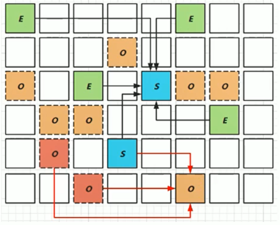

并发标记结束以后，老年代中百分百为垃圾的内存分段被回收了，部分为垃圾的内存分段被计算了出来。默认情况下，这些老年代的内存分段会分8次（可以通过-XX:G1MixedGCCountTarget设置）被回收

混合回收的回收集（Collection Set）包括八分之一的老年代内存分段，Eden区内存分段，Survivor区内存分段。混合回收的算法和年轻代回收的算法完全一样，只是回收集多了老年代的内存分段。具体过程请参考上面的年轻代回收过程。

由于老年代中的内存分段默认分8次回收，G1会优先回收垃圾多的内存分段。垃圾占内存分段比例越高的，越会被先回收。并且有一个阈值会决定内存分段是否被回收，

`XX:G1MixedGCLiveThresholdPercent`，默认为65%，意思是垃圾占内存分段比例要达到65%才会被回收。如果垃圾占比太低，意味着存活的对象占比高，在复制的时候会花费更多的时间。

混合回收并不一定要进行8次。有一个阈值`-XX:G1HeapWastePercent`，默认值为10%，意思是允许整个堆内存中有10%的空间被浪费，意味着如果发现可以回收的垃圾占堆内存的比例低于10%，则不再进行混合回收。因为GC会花费很多的时间但是回收到的内存却很少。

####  4.5.13 G1回收可选的过程4 - Full GC

G1的初衷就是要避免FullGC的出现。但是如果上述方式不能正常工作，G1会停止应用程序的执行（stop-The-world），使用单线程的内存回收算法进行垃圾回收，性能会非常差，应用程序停顿时间会很长。

要避免FullGC的发生，一旦发生需要进行调整。什么时候会发生FullGC呢？比如堆内存太小，当G1在复制存活对象的时候没有空的内存分段可用，则会回退到fullgc，这种情况可以通过增大内存解决。 导致G1 FullGC的原因可能有两个：

- EVacuation的时候没有足够的to-space来存放晋升的对象；
- 并发处理过程完成之前空间耗尽。

#### 4.5.14 G1回收的优化建议

从oracle官方透露出来的信息可获知，回收阶段（Evacuation）其实本也有想过设计成与用户程序一起并发执行，但这件事情做起来比较复杂，考虑到G1只是回一部分Region，停顿时间是用户可控制的，所以并不迫切去实现，而选择把这个特性放到了G1之后出现的低延迟垃圾收集器（即ZGC）中。另外，还考虑到G1不是仅仅面向低延迟，停顿用户线程能够最大幅度提高垃圾收集效率，为了保证吞吐量所以才选择了完全暂停用户线程的实现方案。

年轻代大小

- 避免使用-Xmn或-XX:NewRatio等相关选项显式设置年轻代大小
- 固定年轻代的大小会覆盖

暂停时间目标暂停时间目标不要太过严苛

- G1 GC的吞吐量目标是90%的应用程序时间和10%的垃圾回收时间
- 评估G1GC的吞吐量时，暂停时间目标不要太严苛。目标太过严苛表示你愿意承受更多的垃圾回收开销，而这些会直接影响到吞吐量。

## 5 垃圾回收器总结

截止JDK1.8，一共有7款不同的垃圾收集器。每一款的垃圾收集器都有不同的特点，在具体使用的时候，需要根据具体的情况选用不同的垃圾收集器。
GC发展阶段：Serial=> Parallel（并行）=> CMS（并发）=> G1 => ZGC

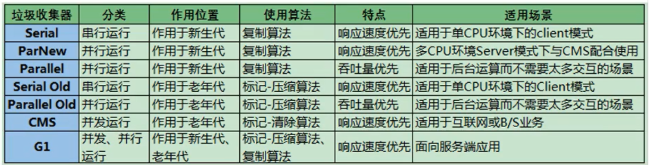

垃圾回收器组合关系：

## 6 怎样选择垃圾回收器

Java垃圾收集器的配置对于JVM优化来说是一个很重要的选择，选择合适的垃圾收集器可以让JVM的性能有一个很大的提升。怎么选择垃圾收集器？

- 优先调整堆的大小让JVM自适应完成。
- 如果内存小于100M，使用串行收集器
- 如果是单核、单机程序，并且没有停顿时间的要求，串行收集器
- 如果是多CPU、需要高吞吐量、允许停顿时间超过1秒，选择并行或者JVM自己选择
- 如果是多CPU、追求低停顿时间，需快速响应（比如延迟不能超过1秒，如互联网应用），使用并发收集器
- 官方推荐G1，性能高。现在互联网的项目，基本都是使用G1。

最后需要明确一个观点：

- 没有最好的收集器，更没有万能的收集
- 调优永远是针对特定场景、特定需求，不存在一劳永逸的收集器

## 7 GC日志分析

通过阅读Gc日志，我们可以了解Java虚拟机内存分配与回收策略。 内存分配与垃圾回收的参数列表

- -XX:+PrintGc输出GC日志。类似：-verbose:gc
- -XX:+PrintGcDetails输出Gc的详细日志
- -XX:+PrintGcTimestamps 输出Gc的时间戳（以基准时间的形式）
- -XX:+PrintGCDatestamps 输出Gc的时间戳（以日期的形式，如2013-05-04T21：53：59.234+0800）
- -XX:+PrintHeapAtGC在进行Gc的前后打印出堆的信息
- -Xloggc:../logs/gc.log日志文件的输出路径

## ps-相关资料

[垃圾回收器](https://gitee.com/moxi159753/LearningNotes/tree/master/JVM/1_%E5%86%85%E5%AD%98%E4%B8%8E%E5%9E%83%E5%9C%BE%E5%9B%9E%E6%94%B6%E7%AF%87/17_%E5%9E%83%E5%9C%BE%E5%9B%9E%E6%94%B6%E5%99%A8)