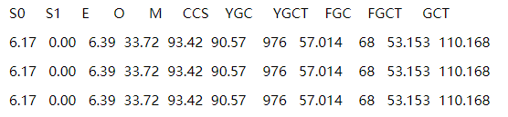
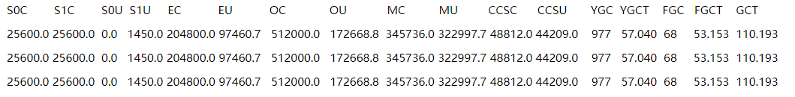

[toc]

# JVM监控和调优命令

## 1 JVM监控和调优

在Java应用和服务出现莫名的卡顿、CPU飙升等问题时总是要分析一下对应进程的JVM状态以定位问题和解决问题并作出相应的优化，在这过程中Java自带的一些状态监控命令和图形化工具就非常方便了。

## 2 调优命令

### 2.1 jps

Java版的ps命令(progress status)，查看java进程及其相关的信息，如果你想找到一个java进程的pid，那可以用jps命令替代linux中的ps命令了，简单而方便。

命令格式：`jps [options] [hostid]`

options参数解释：

- -l : 输出主类全名或jar路径
- -q : 只输出LVMID
- -m : 输出JVM启动时传递给main()的参数
- -v : 输出JVM启动时显示指定的JVM参数

最常用示例：

```shell
jps -l 输出jar包路径，类全名
jps -m 输出main参数
jps -v 输出JVM参数
```

### 2.2 jinfo

jinfo是用来查看JVM参数和动态修改部分JVM参数的命令

命令格式：`jinfo [option] <pid>`

options参数解释：

- `-flag <name>` 打印指定名称的参数
- `-flag [+|-]<name>` 打开或关闭参数
- `-flag <name>=<value>` 设置参数
- `-flags` 打印所有参数
- `-sysprops` 打印系统配置
- `<no option>` 打印上面两个选项

```shell
# 查看JVM参数和系统配置(pid为11666)
jinfo 11666
jinfo -flags 11666
jinfo -sysprops 11666

# 查看打印GC日志参数(pid为11666)
jinfo -flag PrintGC 11666
jinfo -flag PrintGCDetails 11666

# 打开GC日志参数(pid为11666)
jinfo -flag +PrintGC 11666
jinfo -flag +PrintGCDetails 11666

# 关闭GC日志参数(pid为11666)
jinfo -flag -PrintGC 11666
jinfo -flag -PrintGCDetails 11666

# 还可以使用下面的命令查看那些参数可以使用jinfo命令来管理：
java -XX:+PrintFlagsFinal -version | grep manageable
```

常用JVM参数：

- `-Xms`：初始堆大小，默认为物理内存的1/64(<1GB)；默认(MinHeapFreeRatio参数可以调整)空余堆内存小于40%时，JVM就会增大堆直到-Xmx的最大限制。
- `-Xmn`：新生代的内存空间大小，注意：此处的大小是（eden+ 2 survivor space)。与jmap -heap中显示的New gen是不同的。
    整个堆大小=新生代大小 + 老生代大小 + 永久代大小。 在保证堆大小不变的情况下，增大新生代后,将会减小老生代大小。此值对系统性能影响较大,Sun官方推荐配置为整个堆的3/8。
- `-XX:SurvivorRatio`：新生代中Eden区域与Survivor区域的容量比值，默认值为8。两个Survivor区与一个Eden区的比值为2:8,一个Survivor区占整个年轻代的1/10。
- `-Xss`：每个线程的堆栈大小。JDK5.0以后每个线程堆栈大小为1M,以前每个线程堆栈大小为256K。应根据应用的线程所需内存大小进行适当调整。在相同物理内存下, 减小这个值能生成更多的线程。但是操作系统对一个进程内的线程数还是有限制的，不能无限生成，经验值在3000~5000左右。一般小的应用， 如果栈不是很深， 应该是128k够用的， 大的应用建议使用256k。这个选项对性能影响比较大，需要严格的测试。
    如果出现:"-Xss is translated in a VM flag named ThreadStackSize”一般设置这个值就可以了。
- `-XX:PermSize`：设置永久代(perm gen)初始值。默认值为物理内存的1/64。
- `-XX:MaxPermSize`：设置持久代最大值。物理内存的1/4。

### 2.3 jstat

jstat命令是使用频率比较高的命令，主要用来查看JVM运行时的状态信息，包括内存状态、垃圾回收等。

命令格式：`jstat [option] LVMID [interval] [count]`

其中LVMID是进程id，interval是打印间隔时间（毫秒），count是打印次数（默认一直打印）

option参数解释：

- `-class` class loader的行为统计
- `-compiler` HotSpot JIT编译器行为统计
- `-gc` 垃圾回收堆的行为统计
- `-gccapacity` 各个垃圾回收代容量(young,old,perm)和他们相应的空间统计
- `-gcutil` 垃圾回收统计概述
- `-gccause` 垃圾收集统计概述（同-gcutil），附加最近两次垃圾回收事件的原因
- `-gcnew` 新生代行为统计
- `-gcnewcapacity` 新生代与其相应的内存空间的统计
- `-gcold` 年老代和永生代行为统计
- `-gcoldcapacity` 年老代行为统计
- `-gcpermcapacity` 永生代行为统计
- `-printcompilation` HotSpot编译方法统计

常用示例及打印字段解释：(11666为pid，每隔1000毫秒打印一次，打印3次)

```shell
jstat -gcutil 11666 1000 3
```



字段解释:

- `S0` survivor0使用百分比
- `S1` survivor1使用百分比
- `E` Eden区使用百分比
- `O` 老年代使用百分比
- `M` 元数据区使用百分比
- `CCS` 压缩使用百分比
- `YGC` 年轻代垃圾回收次数
- `YGCT` 年轻代垃圾回收消耗时间
- `FGC` 老年代垃圾回收次数
- `FGCT` 老年代垃圾回收消耗时间
- `GCT` 垃圾回收消耗总时间

```shell
# -gc和-gcutil参数类似，只不过输出字段不是百分比，而是实际的值。
jstat -gc 11666 1000 3
```



字段解释：

- `S0C` survivor0大小
- `S1C` survivor1大小
- `S0U` survivor0已使用大小
- `S1U` survivor1已使用大小
- `EC` Eden区大小
- `EU` Eden区已使用大小
- `OC` 老年代大小
- `OU` 老年代已使用大小
- `MC` 方法区大小
- `MU` 方法区已使用大小
- `CCSC` 压缩类空间大小
- `CCSU` 压缩类空间已使用大小
- `YGC` 年轻代垃圾回收次数
- `YGCT` 年轻代垃圾回收消耗时间
- `FGC` 老年代垃圾回收次数
- `FGCT` 老年代垃圾回收消耗时间
- `GCT` 垃圾回收消耗总时间

### 2.4 jstack

jstack是用来查看JVM线程快照的命令，线程快照是当前JVM线程正在执行的方法堆栈集合。使用jstack命令可以定位线程出现长时间卡顿的原因，例如死锁，死循环等。jstack还可以查看程序崩溃时生成的core文件中的stack信息。

命令格式：

- `jstack [-l] <pid> (连接运行中的进程)`
- `jstack -F [-m] [-l] <pid> (连接挂起的进程)`
- `jstack [-m] [-l] <executable> <core> (连接core文件)`
- `jstack [-m] [-l] [server_id@]<remote server IP or hostname> (连接远程debug服务器)`

option参数解释：

- `-F` 当使用`jstack <pid>`无响应时，强制输出线程堆栈。
- `-m` 同时输出java和本地堆栈(混合模式)
- `-l` 额外显示锁信息

常用示例：

```shell
# 查看快照信息
jstack -l 11666 | more


# 输出
Full thread dump Java HotSpot(TM) 64-Bit Server VM (25.25-b02 mixed mode):

"Attach Listener" #25525 daemon prio=9 os_prio=0 tid=0x00007fd374002000 nid=0x70e8 waiting on condition [0x0000000000000000]
   java.lang.Thread.State: RUNNABLE

   Locked ownable synchronizers:
    - None
......
```

### 2.5 jmap

jmap是用来生成堆dump文件和查看堆相关的各类信息的命令，例如查看finalize执行队列，heap的详细信息和使用情况。

命令格式：

`jmap [option] <pid> (连接正在执行的进程)`
`jmap [option] <executable <core> (连接一个core文件)`
`jmap [option] [server_id@]<remote server IP or hostname> (链接远程服务器)`

option参数解释：

- `<none>`  to print same info as Solaris pmap
- `-heap` 打印java heap摘要
- `-histo[:live]` 打印堆中的java对象统计信息
- `-clstats` 打印类加载器统计信息
- `-finalizerinfo` 打印在f-queue中等待执行finalizer方法的对象
- `-dump:<dump-options>` 生成java堆的dump文件
    - dump-options:
    - live 只转储存活的对象，如果没有指定则转储所有对象
    - format=b 二进制格式
    - `file=<file>` `转储文件到 <file>`

- `-F` 强制选项

 常用示例：

```shell
# 生成dump文件
jmap -dump:live,format=b,file=dump.hprof 11666

# 输出
Dumping heap to /dump.hprof ...
Heap dump file created
```

```shell
# 把java堆中的存活对象信息转储到dump.hprof文件
jmap -finalizerinfo 11666

# 输出
Attaching to process ID 11666, please wait...
Debugger attached successfully.
Server compiler detected.
JVM version is 24.71-b01
Number of objects pending for finalization: 0
```

```shell
# 输出结果的含义为当前没有在等待执行finalizer方法的对象
jmap -heap 11666

# 输出
Attaching to process ID 11666, please wait...
Debugger attached successfully.
Server compiler detected.
JVM version is 25.25-b02

using thread-local object allocation.
Parallel GC with 4 thread(s)

Heap Configuration: //堆内存初始化配置
   MinHeapFreeRatio         = 0 //对应jvm启动参数-XX:MinHeapFreeRatio设置JVM堆最小空闲比率(default 40)
   MaxHeapFreeRatio         = 100 //对应jvm启动参数 -XX:MaxHeapFreeRatio设置JVM堆最大空闲比率(default 70)
   MaxHeapSize              = 1073741824 (1024.0MB) //对应jvm启动参数-XX:MaxHeapSize=设置JVM堆的最大大小
   NewSize                  = 22020096 (21.0MB) //对应jvm启动参数-XX:NewSize=设置JVM堆的新生代的默认大小
   MaxNewSize               = 357564416 (341.0MB) //对应jvm启动参数-XX:MaxNewSize=设置JVM堆的新生代的最大大小
   OldSize                  = 45088768 (43.0MB) //对应jvm启动参数-XX:OldSize=<value>:设置JVM堆的老年代的大小
   NewRatio                 = 2 //对应jvm启动参数-XX:NewRatio=:新生代和老生代的大小比率
   SurvivorRatio            = 8 //对应jvm启动参数-XX:SurvivorRatio=设置新生代中Eden区与Survivor区的大小比值
   MetaspaceSize            = 21807104 (20.796875MB) // 元数据区大小
   CompressedClassSpaceSize = 1073741824 (1024.0MB) //类压缩空间大小
   MaxMetaspaceSize         = 17592186044415 MB //元数据区最大大小
   G1HeapRegionSize         = 0 (0.0MB) //G1垃圾收集器每个Region大小

Heap Usage: //堆内存使用情况
PS Young Generation 
Eden Space: //Eden区内存分布
   capacity = 17825792 (17.0MB) //Eden区总容量
   used     = 12704088 (12.115562438964844MB) //Eden区已使用
   free     = 5121704 (4.884437561035156MB) //Eden区剩余容量
   71.26801434685203% used //Eden区使用比率
From Space: //其中一个Survivor区的内存分布
   capacity = 2097152 (2.0MB)
   used     = 1703936 (1.625MB)
   free     = 393216 (0.375MB)
   81.25% used
To Space: //另一个Survivor区的内存分布
   capacity = 2097152 (2.0MB)
   used     = 0 (0.0MB)
   free     = 2097152 (2.0MB)
   0.0% used
PS Old Generation
   capacity = 52428800 (50.0MB) //老年代容量
   used     = 28325712 (27.013504028320312MB) //老年代已使用
   free     = 24103088 (22.986495971679688MB) //老年代空闲
   54.027008056640625% used //老年代使用比率

15884 interned Strings occupying 2075304 bytes.
```

```shell
# 输出存活对象统计信息
jmap -histo:live 11666 | head -n5

#打印信息
num     #instances         #bytes  class name
----------------------------------------------
1:         46608        1111232  java.lang.String
2:          6919         734516  java.lang.Class
3:          4787         536164  java.net.SocksSocketImpl
4:         15935         497100  java.util.concurrent.ConcurrentHashMap$Node
5:         28561         436016  java.lang.Object
```

### 2.6 jhat

jhat是用来分析jmap生成dump文件的命令，jhat内置了应用服务器，可以通过网页查看dump文件分析结果，jhat一般是用在离线分析上。

命令格式：`jhat [option] [dumpfile]`

option参数解释：

- `-stack false`: 关闭对象分配调用堆栈的跟踪
- `-refs false`: 关闭对象引用的跟踪
- `-port <port>`: HTTP服务器端口，默认是7000
- `-debug <int>`: debug级别
    - 0: 无debug输出
    - 1: Debug hprof file parsing
    - 2: Debug hprof file parsing, no server

- -version 分析报告版本

常用示例：

```shell
jhat dump.hprof
```

## 3 可视化工具 （jconsole, jvisualvm）

除了以上所述的常用命令行工具之外还有图形化工具，使用上比较简单。在命令行下执行jconsole和jvisualvm即可。

## ps-相关引用

[JVM监控和调优常用命令工具总结](https://www.cnblogs.com/wxisme/p/9878494.html)