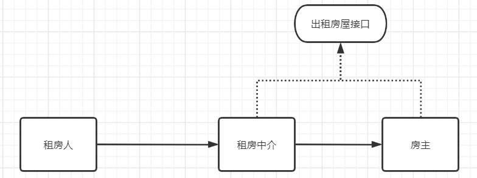
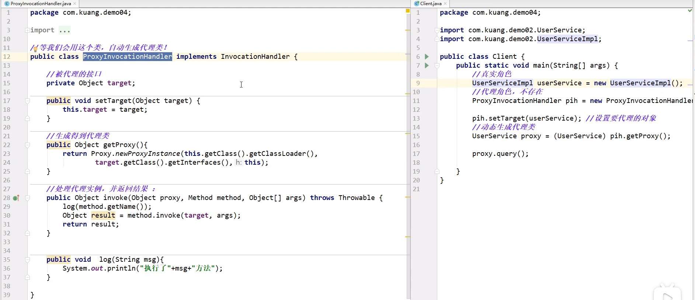

[TOC]

# 代理模式

## 1 简介

代理是一种常用的设计模式，其目的就是为其他对象提供一个代理以控制对某个对象的访问。代理类负责为委托类预处理消息、过滤消息并转发消息，以及进行消息被委托类执行后的后续处理。
1. 为了保持行为的一致性，代理类和委托类通常会实现相同的接口
2. 引入代理能够控制对委托对象的直接访问，可以很好的隐藏和保护委托对象，也更加具有灵活性。

代理的作用就是让我们关注自己的**正事**，其他的事情由代理商来帮我们办。

在Spring中AOP的底层就是使用的代理模式来实现的。

举例：拿租房来说，对于租房人来说租房人只想租到合适的房子，如果全权自己去找房再和房东签合同会很麻烦，而且房东也会很麻烦，因为房东也需要挂房源以及带人来看房，为了使双方更方便因此出现了房屋中介的角色，对于租房的人房屋中介负责带他们去找房以及后续的签合同等工作，对于房主也只需要把事情委托给中介，后续直接手房租就好了。这样能大大的简化双方的过程，能使租房人以及房主只干自己想干的事情（租房人：找到合适的房&租房，房主：出租房&收房租）



## 2 代理模式UML


## 3 静态代理

### 3.1 分析

角色分析：

- 抽象角色：一般会使用接口或者抽象类来实现，在里面定义能干什么（如：出租房屋这个动作）
- 真实角色：被代理的角色，主动发起一些动作（如：房主能发起出租房屋这个动作）
- 代理角色：代理真实角色，去做一定的事情，并且附加一些操作（房屋中介：代理房主出租房屋，并且在其中提供签合同以及后续的服务）
- 客户：客户可以访问代理对象，让代理对象帮我们做一些事情（租房人）

### 3.2 代码实现

#### 3.2.1 PS01Rent - 租房接口-定义行为

```java
package com.hong.designPattern.proxy.staticProxy;

/**
 * 租房接口
 * 定义出租房这个行为
 */
public interface PS01Rent {
    /**
     * 出租房屋
     */
    void rent();

}
```

#### 3.2.2 PS02Landlord - 房东-被代理方

```java
package com.hong.designPattern.proxy.staticProxy;

/**
 * 房东-出租房屋的人
 * 房东需要出租房屋，所以需要实现P01Rent接口来用户出租房屋这个动作
 * @author hongzh.zhang on 2021/03/21
 */
public class P02Landlord implements P01Rent {
    @Override
    public void rent() {
        System.out.println("房东：出租房屋");
    }
}

```

#### 3.2.3 PS03RentProxy - 租房中介-代理方

```java
package com.hong.designPattern.proxy.staticProxy;

/**
 * 出租房屋代理-租房中介
 * 代理需要向外出租房屋，所以也需要继承P01Rent接口，从而实现出租这个动作
 * @author hongzh.zhang on 2021/03/21
 */
public class PS03RentProxy implements PS01Rent {

    // 房主
    // 通过组合的形式放到代理里面，从而让代理帮我们做一些事情
    private PS02Landlord landlord;

    public PS03RentProxy() {

    }

    public PS03RentProxy(PS02Landlord landlord) {
        this.landlord = landlord;
    }

    @Override
    public void rent() {
        // 租房前做一些事情
        before();

        // 房主真实的把房租出去
        landlord.rent();

        // 租房后做一些事情
        after();
    }

    public void before() {
        System.out.println("中介：找房东拿房，带人看房。。。");
    }

    public void after() {
        System.out.println("中介：租房后续服务，催租。。。");
    }

}

```

#### 3.2.4 PS04Client - 租房人 - 客户端

```java
package com.hong.designPattern.proxy.staticProxy;

/**
 * 租房人
 * @author hongzh.zhang on 2021/03/21
 */
public class PS04Client {

    public static void main(String[] args) {
        // 房东角色，出租房屋
        PS02Landlord landlord = new PS02Landlord();
        // 中介，代理房东，帮房东做一些事情
        PS03RentProxy rentProxy = new PS03RentProxy(landlord);

        // 中介出租房屋
        rentProxy.rent();

        System.out.println("租房人：租到了房子");
    }
}

```

```
中介：找房东拿房，带人看房。。。
房东：出租房屋
中介：租房后续服务，催租。。。
租房人：租到了房子
```

### 3.3 静态代理优缺点

- 优点
    - 被代理的角色可以更加关注自己的业务（房主只关注出租房屋）
    - 便于扩展，当代理业务发生扩展的时候，方便集中管理（中介做的一系列事情）
- 缺点：
    - 当我们更改业务，比如代理出租房屋，而是代理婚礼等时，那么我们每一项业务都需要增加新的代理类，这样大大的**增大了程序的负担**。

## 4 动态代理

### 4.1 概述

- 动态代理和静态代理最终达成的目的一样，就是帮被代理类做事情
- 动态代理类相对于静态代理，真实的代理类是动态生成的
- 动态代理分为两类：
    - 基于接口的动态代理（JDK的动态代理）
    - 基于类的动态代理（cglib）

### 4.2 动态代理重点分析

#### 4.2.1 InvocationHandler接口

实现InvocationHandler接口后需要重写invoke方法，在该方法里可以做自己的业务（调用被代理的方法，并添加一些其他业务逻辑）

```java
package java.lang.reflect;
public interface InvocationHandler {
    
    /**
    * proxy  : 被代理的对象
    * method : 需要调用代理对象的哪个方法
    * args   : 调用代理对象方法所需的参数
    */
    public Object invoke(Object proxy, Method method, Object[] args) throws Throwable;
}
```

#### 4.2.2 Proxy类

```java
/**
 * 主要方法，用于生成被代理的对象
 * loader:类加载器，定义了使用哪个类加载器来来对生成的代理对象进行加载
 * interfaces: 表示给被代理的对象提供一组什么接口，这样就能调用这组接口中的方法了
 * h: 表示的是当这个动态代理对象在调用方法的时候，会关联到哪一个InvocationHandler对象上
 */
public static Object newProxyInstance(ClassLoader loader, Class<?>[] interfaces,  InvocationHandler h)  throws IllegalArgumentException
```

### 4.3 动态代理实现

#### 4.3.1 PD01Rent - 定义行为

```java
package com.hong.designPattern.proxy.dynamicProxy;

/**
 * 租房接口
 * 定义出租房这个行为
 */
public interface PD01Rent {
    /**
     * 出租房屋
     */
    void rent();

}
```

#### 4.3.2 PD02Landlord - 房东-需要被代理的对象

```java
package com.hong.designPattern.proxy.dynamicProxy;

/**
 * 房东-出租房屋的人
 * 房东需要出租房屋，所以需要实现P01Rent接口来用户出租房屋这个动作
 * @author hongzh.zhang on 2021/03/21
 */
public class PD02Landlord implements PD01Rent {
    @Override
    public void rent() {
        System.out.println("房东：出租房屋");
    }
}

```

#### 4.3.3 PD03ProxyInvocationHandler - 代理处理器

```java
package com.hong.designPattern.proxy.dynamicProxy;

import java.lang.reflect.InvocationHandler;
import java.lang.reflect.Method;

/**
 * 代理处理器，调用被代理的对象的方法
 * @author hongzh.zhang on 2021/03/21
 */
public class PD03ProxyInvocationHandler implements InvocationHandler {

    // 被代理的接口，定义需要代理的行为
    private Object target;

    // 代理处理器需要注入被代理的对象
    public PD03ProxyInvocationHandler(Object target) {
        this.target = target;
    }

    // 重点：InvocationHandler.invoke(Object proxy, Method method, Object[] args) 用于调用被代理的方法
    // 调用被代理的方法，当然可以做一些其他事情
    @Override
    public Object invoke(Object proxy, Method method, Object[] args) throws Throwable {
        before();

        // 通过反射调用被代理的方法
        Object result = method.invoke(target, args);

        after();

        return result;
    }


    private void before() {
        System.out.println("中介：带人看房子");
    }

    private void after() {
        System.out.println("中介：收中介费");
    }

}

```

#### 4.3.4 PD04Client - 租房人 - 客户端

```java
package com.hong.designPattern.proxy.dynamicProxy;

import java.lang.reflect.Proxy;

/**
 * 租房人
 * @author hongzh.zhang on 2021/03/21
 */
public class PD04Client {

    public static void main(String[] args) {
        // 房东角色，出租房屋，被代理的对象
        PD01Rent landlord = new PD02Landlord();

        // 代理处理器，帮被代理的角色做一些事情，做事情的时候可以附加做一些其他事情
        // 构造方法会注入被代理的对象
        PD03ProxyInvocationHandler proxyHandler = new PD03ProxyInvocationHandler(landlord);

        // 重点：Proxy用于生成我们最终的代理类对象
        // 生成代理对象
        PD01Rent proxy = (PD01Rent)Proxy.newProxyInstance(
                proxyHandler.getClass().getClassLoader(), // 指定类加载器
                landlord.getClass().getInterfaces(), // 指定需要被代理的类的接口
                proxyHandler);

        // 中介出租房屋
        proxy.rent();

        System.out.println("租房人：租到了房子");
    }
}

```

```
中介：带人看房子
房东：出租房屋
中介：收中介费
租房人：租到了房子
```

### 4.4 举例 - 对service的方法添加日志功能



### 4.5 动态代理和静态代理的区别

动态代理和静态代理最终达到的效果都一样，那为什么我们要使用动态代理而不用静态代理呢？（明明动态代理写起来更麻烦）。

在业务少的时候我们使用静态代理比使用动态代理更快，但是当我们业务量大的时候，就如我在**静态代理的缺点分析**中说到的一样，我们使用静态代理需要创建大量的代理类（增加了jvm类加载的负担，使系统更加臃肿），

这时我们就使用动态代理（当然业务类需要实现相应的接口），**动态代理就是根据业务类实现的接口，让代理类实现了相应的接口**，在运行时采用反射技术动态生成一个代理对象（减少我们写代理类的负担），在调用方法的业务方法的时候只需要进行一个强制的转换，就好了。

```
HandleInterface handleProxy = (HandleInterface)Proxy.newProxyInstance(
				handler.getClass().getClassLoader(), 
				realSubject.getClass().getInterfaces(), 
				handler);
```

### 4.6 动态代理的优缺点

- 优点：
    - 相对于静态代理不用写很多的代理类，代理类都是在运行时JVM通过反射动态生成的。
- 缺点：
    - 写起来相对的复杂
    - 反射会使程序运行的速度变慢。

## 5 代理模式的应用场景

在服务器中存放了一个很大的图片，这时如果用户直接访问包含这个图片的网页，则会出现网页出来了，图片等很久都没出来的情况，这时我们就可以使用代理模式，即在后台对图片进行一系列的处理（减少图片的像素），把处理过的图片用来代替原图片，这样就可以加快网页的显示。
