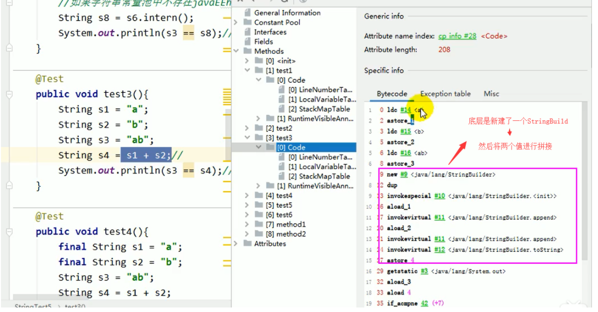
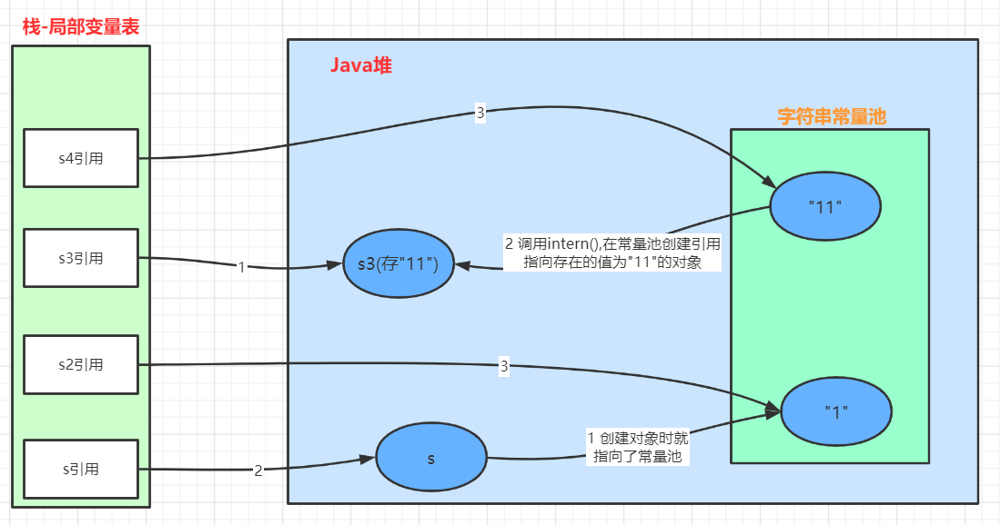
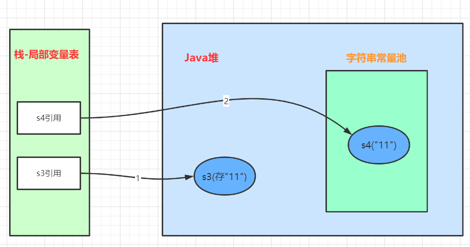

[toc]

# String相关

## 1 String的基本特性

- String：字符串，使用一对 ”” 引起来表示
    - String s1 = "mogublog" ; // 字面量的定义方式
    - String s2 = new String("moxi");
- String声明为final的，不可被继承
- String实现了Serializable接口：表示字符串是支持序列化的。
    实现了Comparable接口：表示string可以比较大小
- String在jdk8及以前内部定义了final char[] value用于存储字符串数据。JDK9时改为byte[]

## 2 为什么JDK9改变了结构

String类的当前实现将字符存储在char数组中，每个字符使用两个字节(16位)。从许多不同的应用程序收集的数据表明，字符串是堆使用的主要组成部分，而且数字符串对象只包含拉丁字符。这些字符只需要一个字节的存储空间，因此这些字符串对象的内部char数组中有一半的空间将不会使用。

我们建议改变字符串的内部表示clasš从utf - 16字符数组到字节数组+一个encoding-flag字段。新的String类将根据字符串的内容存储编码为ISO-8859-1/Latin-1(每个字符一个字节)或UTF-16(每个字符两个字节)的字符。编码标志将指示使用哪种编码。

结论：**String不用char[] 来存储了，改成了byte [] 加上编码标记，更加节约空间**

```java
// 之前
private final char value[];
// 之后
private final byte[] value
```

同时基于String的数据结构，例如StringBuffer和StringBuilder也同样做了修改

## 3 String的不可变性

### 3.1 介绍&&示例

String：代表不可变的字符序列。简称：不可变性。

> 当对字符串重新赋值时，需要重写指定内存区域赋值，不能使用原有的value进行赋值。 当对现有的字符串进行连接操作时，也需要重新指定内存区域赋值，不能使用原有的value进行赋值。 当调用string的replace（）方法修改指定字符或字符串时，也需要重新指定内存区域赋值，不能使用原有的value进行赋值。 通过字面量的方式（区别于new）给一个字符串赋值，此时的字符串值声明在字符串常量池中。

代码

```java
/**
 * String的不可变性
 */
public class StringTest1 {

    public static void test1() {
        // 字面量定义的方式，“abc”存储在字符串常量池中
        String s1 = "abc";
        String s2 = "abc";
        System.out.println(s1 == s2); // true
        s1 = "hello";
        System.out.println(s1 == s2); // false
        System.out.println(s1);
        System.out.println(s2);
        System.out.println("----------------");
    }

    public static void test2() {
        String s1 = "abc";
        String s2 = "abc";
        // 只要进行了修改，就会重新创建一个对象，这就是不可变性
        s2 += "def";
        System.out.println(s1); // abc
        System.out.println(s2); // abcdef
        System.out.println("----------------");
    }

    public static void test3() {
        String s1 = "abc";
        String s2 = s1.replace('a', 'm');
        System.out.println(s1); // abc
        System.out.println(s2); // mbc
    }

    public static void main(String[] args) {
        test1();
        test2();
        test3();
    }
}
```

### 3.2 面试题

```java
public class StringExer {
    String str = new String("good");
    char [] ch = {'t','e','s','t'};

    public void change(String str, char ch []) {
        str = "test ok";
        ch[0] = 'b';
    }

    public static void main(String[] args) {
        StringExer ex = new StringExer();
        ex.change(ex.str, ex.ch);
        System.out.println(ex.str); // good
        System.out.println(ex.ch); // best
    }
}
```

## 4 String的内存分配

### 4.1 简介

在Java语言中有8种基本数据类型和一种比较特殊的类型string。这些类型为了使它们在运行过程中速度更快、更节省内存，都提供了一种常量池的概念。

常量池就类似一个Java系统级别提供的缓存。8种基本数据类型的常量池都是系统协调的，String类型的常量池比较特殊。将福字符串放到常量池有两种方式：

1. 直接使用双引号声明出来的String对象会直接存储在常量池中。
    - 比如：String info="atguigu.com"；
2. 还可以使用String提供的`intern()`方法把字符串放到常量池中。

**字符串常量池中不会存储相同内容的字符串（类似一个Set结构）**

Java 6及以前，字符串常量池存放在**永久代**

Java 7中 oracle的工程师对字符串池的逻辑做了很大的改变，即将字符串常量池的位置调整到**Java堆**内

### 4.2 字符串常量池的长度

String的String Pool是一个固定大小的Hashtable，默认值大小长度是1009。如果放进string Pool的string非常多，就会造成Hash冲突严重，从而导致链表会很长，而链表长了后直接会造成的影响就是当调用string.intern时性能会大幅下降。

使用-XX:StringTablesize可设置StringTable的长度

在jdk6中StringTable是固定的，就是1009的长度，所以如果常量池中的字符串过多就会导致效率下降很快。StringTablesize设置没有要求

在jdk7中，StringTable的长度默认值是60013，

在JDK8中，StringTable可以设置的最小值为1009

### 4.3  为什么StringTable从永久代调整到堆中

在JDK 7中，调用**interne()**字符串不再在Java堆的永久代生成中分配，而是在Java堆的主要部分(年轻代/年老代)中分配，与应用程序创建的其他对象一起分配。此更改将导致驻留在主Java堆中的数据更多，驻留在永久生成中的数据更少，因此可能需要调整堆大小。由于这一变化，大多数应用程序在堆使用方面只会看到相对较小的差异，但加载许多类或大量使用字符串的较大应用程序会出现这种差异。**intern()**方法会看到更显著的差异。

1. 永久代的默认比较小
2. 永久代垃圾回收频率低

## 5 字符串拼接操作

### 5.1 基础

- 常量与常量的拼接结果在常量池(编译期优化)
- 常量池中不会存在相同内容的变量
- 只要其中有一个是变量(非final)，字符串就会在堆中。（变量拼接的原理是StringBuilder）
- 如果拼接的结果调用`intern()`，则主动将常量池中还没有的字符串对象放入池中，并返回此对象地址

```java
    public static void test1() {
        String s1 = "a" + "b" + "c";  // 得到 abc的常量池(编译器优化)
        String s2 = "abc"; // abc存放在常量池，直接将常量池的地址返回
        /**
         * 最终java编译成.class，再执行.class
         */
        System.out.println(s1 == s2); // true，因为存放在字符串常量池
        System.out.println(s1.equals(s2)); // true
    }

	public static void test2() {
        String s1 = "javaEE";
        String s2 = "hadoop";
        String s3 = "javaEEhadoop";
        String s4 = "javaEE" + "hadoop";    
        String s5 = s1 + "hadoop";
        String s6 = "javaEE" + s2;
        String s7 = s1 + s2;

        System.out.println(s3 == s4); // true
        System.out.println(s3 == s5); // false
        System.out.println(s3 == s6); // false
        System.out.println(s3 == s7); // false
        System.out.println(s5 == s6); // false
        System.out.println(s5 == s7); // false
        System.out.println(s6 == s7); // false

        String s8 = s6.intern();
        System.out.println(s3 == s8); // true
    }
```

### 5.2 底层原理

 字符串拼接操作的底层其实使用了StringBuilder 



s1 + s2的执行细节

1. StringBuilder s = new StringBuilder();

2. s.append(s1);

3. s.append(s2);

4. s.toString(); -> StringBuilder最后会调用toString()，内部类如下：

    ```java
        @Override
        public String toString() {
            // Create a copy, don't share the array
            return new String(value, 0, count);
        }
    ```

注意，我们左右两边如果是变量的话，就是需要new StringBuilder进行拼接，但是如果使用的是final修饰，则是从常量池中获取。所以说拼接符号左右两边都是字符串常量或常量引用则仍然使用编译器优化。也就是说被final修饰的变量，将会变成常量，类和方法将不能被继承。

### 5.3 拼接字符串的优化

```java
/*
 * 耗时4005ms
 */
public static void method1() {
	String src = "";
    for (int i = 0; i < 100000; i++) {
    	src += "a"; // 每次循环都会创建一个StringBuilder对象
	}
}


/*
 * 耗时7ms
 */
public static void method2() {
    StringBuilder sb = new StringBuilder();
    for (int i = 0; i < 100000; i++) {
        sb.append("a");
    }
}


/*
 * 耗时<7ms
 */
public static void method3() {
    // 初始给定一个大小，StringBuilder内部的数组就不需要扩容了
    StringBuilder sb = new StringBuilder(100000);
    for (int i = 0; i < 100000; i++) {
        sb.append("a");
    }
}
```

## 6 intern()的使用

intern是一个native方法，调用的是底层C的方法

字符串池最初是空的，由String类私有地维护。在调用intern方法时，如果池中已经包含了由equals(object)方法确定的与该字符串对象相等的字符串，则返回池中的字符串。否则，该字符串对象将被添加到池中，并返回对该字符串对象的引用。

如果不是用双引号声明的string对象，可以使用string提供的intern方法：intern方法会从字符串常量池中查询当前字符串是否存在，若不存在就会将当前字符串放入常量池中。

## 7 面试题1： new String("ab")会创建几个对象

```java
public class StringNewTest {
    public static void main(String[] args) {
        String str = new String("ab");
    }
}
```

答案：2个，字符串常量池中的“ab”一个，new String()一个。

从编译的角度看：

```
 0 new #2 <java/lang/String>
 3 dup
 4 ldc #3 <ab>
 6 invokespecial #4 <java/lang/String.<init>>
 9 astore_1
10 return
```

这里面就是两个对象

- 一个对象是：new关键字在堆空间中创建（new #2 <java/lang/String>）
- 另一个对象：字符串常量池中的对象(ldc #3 <ab>)

## 8 面试题2： new String("a") + new String("b") 会创建几个对象

```java
public class StringNewTest {
    public static void main(String[] args) {
        String str = new String("a") + new String("b");
    }
}
```

答案：6个

从编译的角度看：

```
 0 new #2 <java/lang/StringBuilder>
 3 dup
 4 invokespecial #3 <java/lang/StringBuilder.<init>>
 7 new #4 <java/lang/String>
10 dup
11 ldc #5 <a>
13 invokespecial #6 <java/lang/String.<init>>
16 invokevirtual #7 <java/lang/StringBuilder.append>
19 new #4 <java/lang/String>
22 dup
23 ldc #8 <b>
25 invokespecial #6 <java/lang/String.<init>>
28 invokevirtual #7 <java/lang/StringBuilder.append>
31 invokevirtual #9 <java/lang/StringBuilder.toString>
34 astore_1
35 return
```

总共创建了6个对象

1. 对象1：new StringBuilder()
2. 对象2：new String("a")操作的new
3. 对象3：常量池的 “a”
4. 对象4：new String("b")操作的new
5. 对象5：常量池的 “b”
6. 对象6：StringBuilder的toString中会创建一个 new String("ab")
    - 调用toString方法，不会在常量池中生成ab

## 9 intern相关面试题

### 9.1 JDK6的intern方法(常量池在永久代)

```java
String s = new String("1");  // 在常量池中已经有了
s.intern(); // 将该对象放入到常量池。但是调用此方法没啥用，因为已经存在了1
String s2 = "1";
System.out.println(s == s2); // false
							 // (因为本来就是两个对象一个是new String(),一个是常量池的"1")


String s3 = new String("1") + new String("1"); // 这中方式拼接出来的“ab”不会放到常量池
s3.intern(); // 将该对象放入到常量池，这里是在常量池中创建一个“11”对象
String s4 = "11";
System.out.println(s3 == s4); // flase
```

### 9.2 JDK7及以后的intern方法(常量池在堆空间)

```java
String s = new String("1"); // 常量池中有“1”，并创建new String()
s.intern(); // 没起啥作用
String s2 = "1";
System.out.println(s == s2); // false


String s3 = new String("1") + new String("1"); // 这中方式拼接出来的“ab”不会放到常量池
s3.intern(); // 注意：这里不同于jdk6,由于常量池在堆空间，这里只是在常量池创建一个引用，
			 // 最后指向了上面拼接出来的“11”对象
String s4 = "11";
System.out.println(s3 == s4); // true
```



### 9.3 intern扩展

9.2扩展，把intern()换个位置

```java
String s3 = new String("1") + new String("1");
String s4 = "11";  // 在常量池中生成的字符串
s3.intern();  // 然后s3就会从常量池中找，发现有了，就什么事情都不做
System.out.println(s3 == s4); // false，对比一下和9.2的区别
```



### 9.4 intern总结

总结string的intern（）的使用：

JDK1.6中，将这个字符串对象尝试放入串池。

- 如果串池中有，则并不会放入。返回已有的串池中的对象的地址
- 如果没有，会把此**对象复制一份**，放入串池，并返回串池中的对象地址

JDK1.7起，将这个字符串对象尝试放入串池。

- 如果串池中有，则并不会放入。返回已有的串池中的对象的地址
- 如果没有，则会把**对象的引用地址**复制一份，放入串池，并返回串池中的引用地址

## 10 StringTable的垃圾回收

```java
/**
 * String的垃圾回收
 * -Xms15m -Xmx15m -XX:+PrintStringTableStatistics -XX:+PrintGCDetails
 */
public class StringGCTest {
    public static void main(String[] args) {
        for (int i = 0; i < 100000; i++) {
            String.valueOf(i).intern();
        }
    }
}
```

### 10.1 垃圾回收器G1中的String去重操作

这里说的重复，指的是在堆中的数据，而不是常量池中的，因为常量池中的本身就不会重复 。

背景：对许多Java应用（有大的也有小的）做的测试得出以下结果：

- 堆存活数据集合里面string对象占了25%
- 堆存活数据集合里面重复的string对象有13.5%
- string对象的平均长度是45

许多大规模的Java应用的瓶颈在于内存，测试表明，在这些类型的应用里面，Java堆中存活的数据集合差不多25%是string对象。更进一步，这里面差不多一半string对象是重复的，重复的意思是说： stringl.equals（string2）= true。堆上存在重复的string对象必然是一种内存的浪费。在G1垃圾收集器中实现自动持续对重复的string对象进行去重，这样就能避免浪费内存。

### 10.2 回收器G1中的String去重操作的实现

- 当垃圾收集器工作的时候，会访问堆上存活的对象。对每一个访问的对象都会检查是否是候选的要去重的string对象。
- 如果是，把这个对象的一个引用插入到队列中等待后续的处理。一个去重的线程在后台运行，处理这个队列。处理队列的一个元素意味着从队列删除这个元素，然后尝试去重它引用的string对象。
- 使用一个hashtable来记录所有的被string对象使用的不重复的char数组。当去重的时候，会查这个hashtable，来看堆上是否已经存在一个一模一样的char数组。
- 如果存在，string对象会被调整引用那个数组，释放对原来的数组的引用，最终会被垃圾收集器回收掉。
- 如果查找失败，char数组会被插入到hashtable，这样以后的时候就可以共享这个数组了。

## ps-相关资料

[StringTable](https://gitee.com/moxi159753/LearningNotes/tree/master/JVM/1_%E5%86%85%E5%AD%98%E4%B8%8E%E5%9E%83%E5%9C%BE%E5%9B%9E%E6%94%B6%E7%AF%87/13_StringTable)

[美团-深入解析String#intern](https://tech.meituan.com/2014/03/06/in-depth-understanding-string-intern.html)