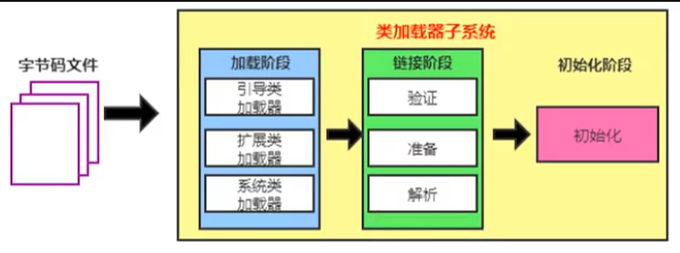
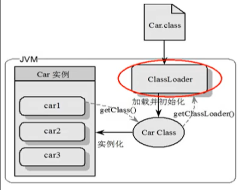
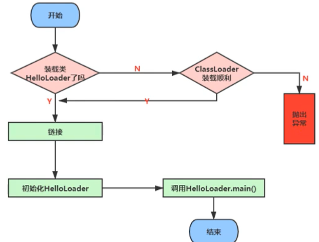
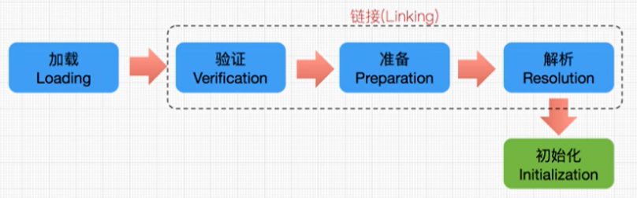
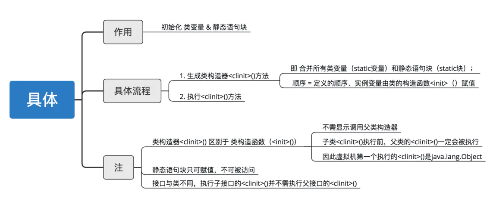
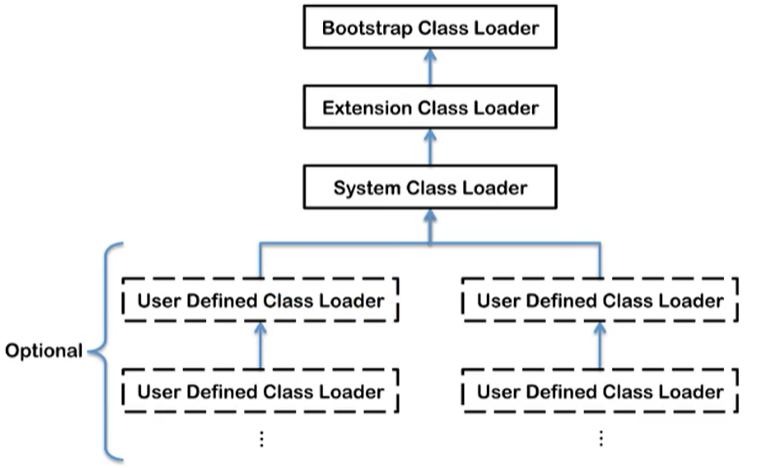

[TOC]

# 虚拟机类加载子系统

## 1 基础

Java从代码到最终执行，一般需要两个过程：

1. 编译
2. 运行

**编译**：把Java文件通过javac命令编译成字节码，也就是.class文件。
**运行**：把编译好的.class文件交给JVM运行。

这里说的类加载过程指的是JVM把.class文件中类信息加载进内存，并进行解析生成对应的class对象的过程。

## 2 类加载器子系统作用

类加载器子系统负责从文件系统或者网络中加载Class文件，class文件在文件开头有特定的文件标识。

ClassLoader只负责class文件的加载，至于它是否可以运行，则由Execution Engine决定。

加载的类信息存放于一块称为方法区的内存空间。除了类的信息外，方法区中还会存放运行时常量池信息，可能还包括字符串字面量和数字常量（这部分常量信息是Class文件中常量池部分的内存映射）



- class file存在于本地硬盘上，可以理解为设计师画在纸上的模板，而最终这个模板在执行的时候是要加载到JVM当中来根据这个文件实例化出n个一模一样的实例。
- class file加载到JVM中，被称为DNA元数据模板，放在方法区。
- 在.class文件->JVM->最终成为元数据模板，此过程就要一个运输工具（类装载器Class Loader），扮演一个快递员的角色。



## 3 类加载过程

例如下面的一段简单的代码

```java
public class HelloLoader {
    public static void main(String[] args) {
        System.out.println("我已经被加载啦");
    }
}
```

它的加载过程如下：



完整的流程图如下所示



### 3.1-加载阶段(Loading)

通过一个类的全限定名获取定义此类的二进制字节流
将这个字节流所代表的静态存储结构转化为方法区的运行时数据结构
在内存中生成一个代表这个类的java.lang.Class对象，作为方法区这个类的各种数据的访问入口

加载class文件的方式:

- 从本地系统中直接加载
- 通过网络获取，典型场景：Web Applet
- 从zip压缩包中读取，成为日后jar、war格式的基础
- 运行时计算生成，使用最多的是：动态代理技术
- 由其他文件生成，典型场景：Jsp应用从专有数据库中提取.class文件，比较少见
- 从加密文件中获取，典型的防Class文件被反编译的保护措施

### 3.2-链接阶段(Linking)

链接阶段主要分为三步：验证(verify)、准备(prepare)、解析(resolve)

#### 3.2.1 验证-verify

目的在于确保Class文件的字节流中包含信息符合当前虚拟机要求，保证被加载类的正确性，不会危害虚拟机自身安全。
主要包括四种验证，文件格式验证、元数据验证、字节码验证、符号引用验证。

- **文件格式**的验证：是否以魔数oxCAFEBABE开头、常量中是否有不被支持的常量。
- **元数据**的验证：保证其描述信息符合Java语言规范的要求。如：这类是否有父类等。
- **字节码**的验证：保证语义是合法的。如：保证类型转换的合理性。
- **符号引用**的验证：对类自身以外的信息进行匹配性校验。如：通过全限定名是否能找到对应的类。

#### 3.2.2 准备-prepare

主要是为**类变量(特指静态变量)**分配内存，并且**赋初值**(这里的初值指的是JVM根据变量类型的默认初始值，不是代码中的初始值)。不同类型对应的初始值：

| 元素类型 | 初始值   |
| -------- | -------- |
| byte     | 0        |
| short    | 0        |
| int      | 0        |
| long     | 0L       |
| float    | 0.0f     |
| double   | 0.0d     |
| char     | "\u0000" |
| boolean  | false    |
| 对象引用 | null     |

```java
public class HelloApp {
    private static int a = 1;  // 准备阶段为0，在下个阶段，也就是初始化的时候才是1
    public static void main(String[] args) {
        System.out.println(a);
    }
}
```

上面的变量a在准备阶段会赋初始值为0，在下个阶段，也就是初始化的时候才是1。
**这里不包含用final修饰的static**，因为final在编译的时候就会分配了，准备阶段会显式初始化(直接赋值),
ps：常量的初值即为代码中设置的值如final static int temp=22， 那么该阶段(准备阶段)temp的初值就是22。

#### 3.2.3 解析-resolve

将常量池内的**符号引用**替换为**直接引用**的过程。

- 符号引用：即一个字符串，但是这个字符串给出了一些能够唯一性识别一个方法，一个变量，一个类的相关信息。
- 直接引用：可以理解为一个内存地址，或者一个偏移量。比如类方法，类变量的直接引用是指向方法区的指针；而实例方法，实例变量的直接引用则是从实例的头指针开始算起到这个实例变量位置的偏移量。

例如：调用方法test()，方法地址为2222，test就是符号引用，2222就是直接引用。

解析动作主要针对类、接口、字段、类方法、接口方法、方法类型等。对应常量池中的CONSTANT Class info、CONSTANT Fieldref info、CONSTANT Methodref info等

### 3.3-初始化阶段(initialization)



在链接的准备阶段(3.2.2的prepare)，变量已经赋过一次系统要求的初始值，而在初始化阶段，则根据程序制定的主观计划去初始化**类变量(静态变量)**和其他资源，或者从另外一个角度表达：初始化过程是执行类构造器<client>()方法的过程。<client>()方法解释如下：

- <client>()方法是由编译器自动收集类中的所有类变量（静态变量）的赋值动作和静态语句块（static{}）中的语句合并产生的，编译器收集的顺序是由语句在源文件中出现的顺序决定的，静态语句块只能访问到定义在静态语句块之前的变量，定义在它之后的变量，静态语句块能进行赋值操作，但是不能进行访问。

    ```java
    public class Test {
        static{
            i = 0;                 // 这句能编译通过
            System.out.println(i); // 这里编译会报错，提示“非法向前引用”
        }
        static int i;
    }
    ```

- <client>()方法与类的构造函数不同，它不需要显式的调用父类构造器，虚拟机会保证在<client>()方法执行之前，父类的<client>()方法已经执行完毕。因此在虚拟机中第一个被执行的<client>()方法肯定是java.lang.Object的<client>()方法。

- 由于父类的<client>()方法先执行，也就意味着父类中定义的静态语句块要优先于子类的变量赋值操作，如下代码，字段B的值会是2而不会是1

    ```java
    public class Test {
        static class Parent{
            public static int A = 1;
            static{
                A = 2;
            }
        }
    
        static class Sub extends Parent{
            public static int B = A;
        }
        
        public static void main(String[] args) {
            System.out.println(Sub.B);
        }
    }
    ```

- <client>()方法对于类或接口来说并不是必需的，如果一个类中没有静态语句块，也没有静态变量的赋值操作，那么编译器可以不为这个类生成<client>()方法。

- 接口中不能使用静态语句块，但仍然有变量赋值初始化的操作，因此接口和类一样都会生成<client>()方法。但接口与类不同的是，执行接口的<client>()方法不需要执行父接口的<client>()方法，只有当父接口定义的变量被使用时父接口才会初始化。另外接口的实现进行初始化时，也不会执行接口的<client>()方法，同理除非访问了接口中定义的静态变量才会初始化接口。如果通过子类访问定义在父类中的静态变量时，只有父类会被初始化，子类则不会被初始化，如下代码清单：

类初始化时机：只有当对类主动使用的时候才会导致类的初始化，类的主动使用包括以下6种：

- 创建类的实例，也就是new的方式；
- 访问某个类或接口的静态变量，或者对该静态变量赋值；
- 调用类的静态方法；
- 反射（如Class.forName("…")）；
- 初始化某个类的子类，则其父类也会被初始化；
- Java虚拟机启动时被标明为启动类的类，直接使用java.exe命令来运行某个主类。

## 4 类加载器

JVM支持两种类型的类加载器 。分别为引导类加载器（Bootstrap ClassLoader）和自定义类加载器（User-Defined ClassLoader）。

从概念上来讲，自定义类加载器一般指的是程序中由开发人员自定义的一类类加载器，但是Java虚拟机规范却没有这么定义，而是将所有派生于抽象类ClassLoader的类加载器都划分为自定义类加载器。

无论类加载器的类型如何划分，在程序中我们最常见的类加载器始终只有3个，如下所示：



这里的四者之间是包含关系，不是上层和下层，也不是子系统的继承关系。

```java
public class ClassLoaderTest {
    public static void main(String[] args) {
        // 获取系统类加载器
        ClassLoader systemClassLoader = ClassLoader.getSystemClassLoader();
        System.out.println(systemClassLoader); // sun.misc.Launcher$AppClassLoader@18b4aac2

        // 获取其上层的：扩展类加载器
        ClassLoader extClassLoader = systemClassLoader.getParent();
        System.out.println(extClassLoader); // sun.misc.Launcher$ExtClassLoader@1540e19d

        // 试图获取 根加载器
        ClassLoader bootstrapClassLoader = extClassLoader.getParent();
        System.out.println(bootstrapClassLoader); // null

        // 获取自定义加载器
        ClassLoader classLoader = ClassLoaderTest.class.getClassLoader();
        System.out.println(classLoader); // sun.misc.Launcher$AppClassLoader@18b4aac2
        
        // 获取String类型的加载器
        ClassLoader classLoader1 = String.class.getClassLoader();
        System.out.println(classLoader1); // null
    }
}
```

### 4.1 类加载器分类

#### 4.1.1 启动类加载器（引导类加载器，Bootstrap ClassLoader）

- 这个类加载使用C/C++语言实现的，嵌套在JVM内部。
- 它用来加载Java的核心库（JAVAHOME/jre/1ib/rt.jar、resources.jar或sun.boot.class.path路径下的内容），用于提供JVM自身需要的类
- 并不继承自ava.lang.ClassLoader，没有父加载器。
- 加载扩展类和应用程序类加载器，并指定为他们的父类加载器。
- 出于安全考虑，Bootstrap启动类加载器只加载包名为java、javax、sun等开头的类

#### 4.1.2 扩展类加载器（Extension ClassLoader）

- Java语言编写，由sun.misc.Launcher$ExtClassLoader实现。
- 派生于ClassLoader类
- 父类加载器为启动类加载器
- 从java.ext.dirs系统属性所指定的目录中加载类库，或从JDK的安装目录的jre/1ib/ext子目录（扩展目录）下加载类库。如果用户创建的JAR放在此目录下，也会自动由扩展类加载器加载。

#### 4.1.3  应用程序类加载器（系统类加载器，AppClassLoader）

- java语言编写，由sun.misc.LaunchersAppClassLoader实现
- 派生于ClassLoader类
- 父类加载器为扩展类加载器
- 它负责加载环境变量classpath或系统属性java.class.path指定路径下的类库
- 该类加载是程序中默认的类加载器，一般来说，Java应用的类都是由它来完成加载
- 通过classLoader#getSystemclassLoader（）方法可以获取到该类加载器

### 4.2 用户自定义类加载器

在Java的日常应用程序开发中，类的加载几乎是由上述3种类加载器相互配合执行的，在必要时，我们还可以自定义类加载器，来定制类的加载方式。 为什么要自定义类加载器？

- 隔离加载类
- 修改类加载的方式
- 扩展加载源
- 防止源码泄漏

用户自定义类加载器实现步骤：

- 开发人员可以通过继承抽象类ava.1ang.ClassLoader类的方式，实现自己的类加载器，以满足一些特殊的需求
- 在JDK1.2之前，在自定义类加载器时，总会去继承ClassLoader类并重写1oadClass（）方法，从而实现自定义的类加载类，但是在JDK1.2之后已不再建议用户去覆盖1oadclass（）方法，而是建议把自定义的类加载逻辑写在findclass（）方法中
- 在编写自定义类加载器时，如果没有太过于复杂的需求，可以直接继承URIClassLoader类，这样就可以避免自己去编写findclass（）方法及其获取字节码流的方式，使自定义类加载器编写更加简洁。

### 4.3 双亲委派机制

Java虚拟机对class文件采用的是按需加载的方式，也就是说当需要使用该类时才会将它的class文件加载到内存生成class对象。而且加载某个类的class文件时，Java虚拟机采用的是双亲委派模式，即把请求交由父类处理，它是一种任务委派模式。

#### 4.3.1 双亲委派机制


## ps-相关资料

- [类加载子系统](https://gitee.com/moxi159753/LearningNotes/tree/master/JVM/1_%E5%86%85%E5%AD%98%E4%B8%8E%E5%9E%83%E5%9C%BE%E5%9B%9E%E6%94%B6%E7%AF%87/2_%E7%B1%BB%E5%8A%A0%E8%BD%BD%E5%AD%90%E7%B3%BB%E7%BB%9F)
- [JVM：类加载的五个过程：加载、验证、准备、解析、初始化](https://www.jianshu.com/p/d432a94be182)
- 《深入理解Java虚拟机》第二版


## 2 类加载器

### 2.1 启动类加载器（bootstrap class loader）

用来加载Java的核心库，用原生代码实现（c++）。

### 2.2 扩展类加载器（extensions class loader）

加载Java的扩展库。

### 2.3 应用程序加载器/系统类加载器（system class loader）

它根据Java应用的类路径（classpath)来加载类。

### 2.4 自定义类加载器

自己定义的类加载器。

### 2.5 双亲委托模型

说到类加载器那么就要谈谈类加载器之间的关系，加载器之间的关系称作为**双亲委派模型**（除了bootstrap ClassLoader外，其他的类加载器都有自己的父类加载器，类加载器都是使用组合关系来复用父类加载器的代码）

**双亲委派模型**工作过程：如果一个类加载器收到了类加载的请求，它首先不会自己去加载这个类，而是把这个请求委派给父类加载器去完成，每个层次的类加载器都是这样的，因此所有的加载器请求最终都应该传送到顶层的启动类加载器，之后当父类加载器反馈自己无法完成这个加载请求时，子加载器才会尝试自己去加载。


