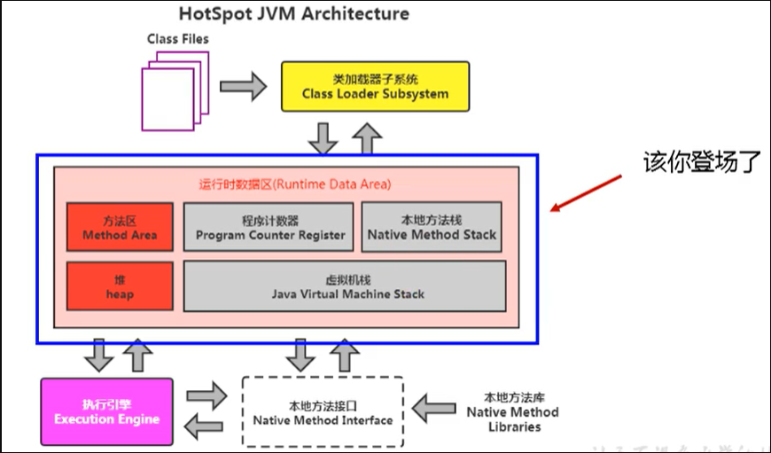
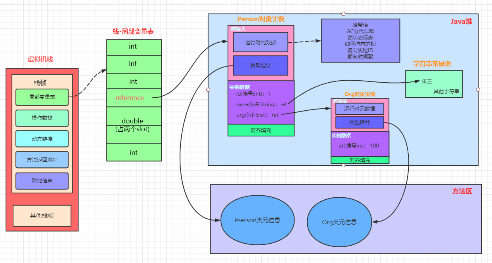

[TOC]

# 运行时数据区

Java虚拟机在执行Java程序的过程中会把它所管理的内存划分为若干个不同的数据区域。

如：方法区、虚拟机栈、本地方法栈、堆、程序计数器。

## 1 程序计数器（线程私有）

程序计数器可以看做当前线程所执行字节码的行号指示器。在虚拟机的概念模型中，字节码指示器就是通过改变这个计数器的值来选取下一条需要执行的字节码指令。

程序计数器是线程私有的只有这样才能使各条线程之间的计数器互不影响。

1. 如果线程正在执行的是一个Java方法，则计数器记录的是正在执行的虚拟机字节码指令的地址。
2. 如果线程正在执行Native方法，这个计数器的值为空（undefined)。

   **程序计数器是唯一一个在Java虚拟机规范中没有规定任何OutOfMemoryError情况的区域**

## 2 Java虚拟机栈（线程私有）

Java虚拟机栈也是线程私有的，它的生命周期和线程相同。

虚拟机栈描述的是Java方法执行的内存模型：每个方法在执行的同时都会创建一个**栈帧**（Stack Frame，方法运行时的基础数据结构）用于存储局部变量表、操作数栈、动态链接、方法出口信息等。每一个方法从调用直到执行完成的过程，就对应着一个栈帧在虚拟机栈中入栈到出栈的过程。

**我们平常指的“栈”其实指的虚拟机栈，或者说是虚拟机栈中的局部变量表**。

局部变量表存放了编译期可知的各种基本数据结构（byte、boolean、char、short、int、float、long、double）、对象引用（reference类型）、returnAddress类型（指向一条字节码指令的地址）

其中64位的long和double类型的数据会占用两个局部变量空间、其余的类型只占用一个。局部变量表所需的内存空间在编译期间完成分配。

在虚拟机规范中，对这个区域规定了两种异常情况：

1.如果线程请求的栈深度大于虚拟机所允许的深度，则抛出StackOverflowError异常；

2.如果虚拟机栈可以动态扩展，如果扩展时无法申请到足够的内存，则抛出OutOfMemoryError异常。

## 3 本地方法栈

本地方法栈与虚拟机栈非常相似，只不过虚拟机栈为虚拟机执行Java方法服务，而本地方法栈为虚拟机使用到的Native方法服务。

与虚拟机栈一样本地方法栈也会抛出StackOverflowError和OutOfMemoryError异常。

## 4 Java堆（所有线程共享，存放对象实例）

Java堆是被所有线程共享的一块内存区域，在虚拟机启动时创建。Java堆就是为了存放对象实例。

Java堆是垃圾收集器管理的主要区域。从内存角度看，现在的收集器都是基于采用**分代收集算法**，所以Java堆还可以分为**新生代**和**老年代**。

Java堆可以处于物理不连续的内存空间中，只要逻辑上是连续的即可。

如果堆中没有内存完成实例分配，并且堆也无法再扩展时，将会抛出OutOfMemoryError异常。

## 5 方法区（线程共享，简称：永久代）

方法区是线程共享的，用于存储已被虚拟机加载的类信息、 常量、静态变量、即时编译器编译后的代码等数据。

可以不需要连续的内存和可以选择固定固定大小或者可扩展。这个区域的内存回收目标主要是针对常量池的回收和对类型的卸载。

当方法区无法满足内存分配需求时，将抛出OutOfMemoryError异常。

## 6 运行时常量池

运行时常量池也是**方法区**的一部分。用于存放编译期生成的各种字面量和符号引用，这部分内容将在类加载后进入方法区的运行时常量池中存放。

当常量池无法再申请到内存将抛出OutOfMemoryError异常。

## ps-相关资料

- 《深入理解Java虚拟机》第二版
- [ 运行时数据区概述及线程](https://gitee.com/moxi159753/LearningNotes/tree/master/JVM/1_%E5%86%85%E5%AD%98%E4%B8%8E%E5%9E%83%E5%9C%BE%E5%9B%9E%E6%94%B6%E7%AF%87/3_%E8%BF%90%E8%A1%8C%E6%97%B6%E6%95%B0%E6%8D%AE%E5%8C%BA%E6%A6%82%E8%BF%B0%E5%8F%8A%E7%BA%BF%E7%A8%8B)
