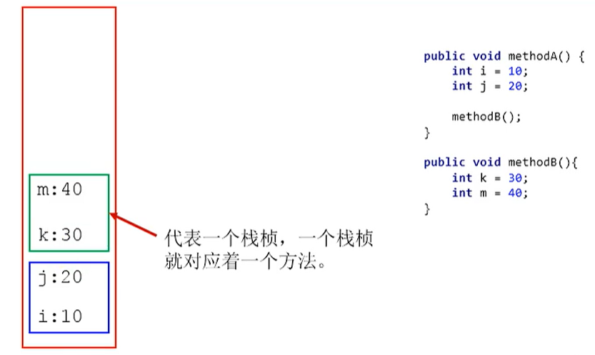
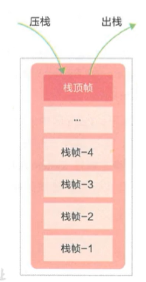
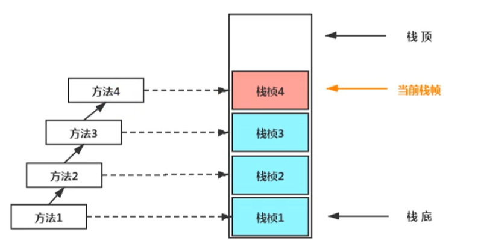
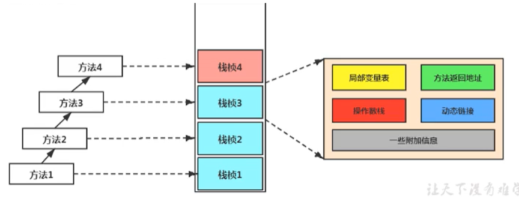
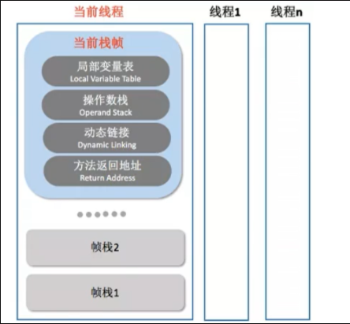

[toc]

# 虚拟机栈
## 1 概述
由于跨平台性的设计，Java的指令都是根据栈来设计的。不同平台CPU架构不同，所以不能设计为基于寄存器的。 优点是跨平台，指令集小，编译器容易实现，缺点是性能下降，实现同样的功能需要更多的指令。

### 1.1 Java虚拟机栈是什么

Java虚拟机栈（Java Virtual Machine Stack），早期也叫Java栈。每个线程在创建时都会创建一个虚拟机栈（线程私有），其内部保存一个个的栈帧（Stack Frame），对应着一次次的Java方法调用。


### 1.2 生命周期

虚拟机栈的生命周期和线程一致，也就是线程结束了，该虚拟机栈也销毁了。

### 1.3 作用

虚拟机栈主管Java程序的运行，它保存方法的局部变量、部分结果，并参与方法的调用和返回。

> 局部变量，它是相比于成员变量来说的（或属性）
>
> 基本数据类型变量 VS 引用类型变量（类、数组、接口）

### 1.3 特点

栈是一种快速有效的分配存储方式，访问速度仅次于程序计数器。JVM直接对Java栈的操作只有两个：

- 每个方法执行，伴随着进栈（入栈、压栈）
- 执行结束后的出栈工作

对于栈来说不存在垃圾回收问题（栈存在溢出的情况）


### 1.4 关于栈的异常

Java 虚拟机规范允许Java栈的大小是动态的或者是固定不变的。

如果采用固定大小的Java虚拟机栈，那每一个线程的Java虚拟机栈容量可以在线程创建的时候独立选定。如果线程请求分配的栈容量超过Java虚拟机栈允许的最大容量，Java虚拟机将会抛出一个StackoverflowError 异常。（举例：递归次数过多）

如果Java虚拟机栈可以动态扩展，并且在尝试扩展的时候无法申请到足够的内存，或者在创建新的线程时没有足够的内存去创建对应的虚拟机栈，那Java虚拟机将会抛出一个 outofMemoryError 异常。

### 1.5 设置栈内存大小

我们可以使用参数 -Xss选项来设置线程的最大栈空间，栈的大小直接决定了函数调用的最大可达深度

```
-Xss1m -- 设置为1M内存大小
-Xss1024k -- 设置为1024k内存大小
-Xss1g -- 设置为1G内存大小
```

## 2 栈的存储单位-栈帧

### 2.1 栈的存储内容-栈帧

每个线程都有自己的栈，栈中的数据都是以**栈帧**（Stack Frame）的格式存在。
在这个线程上正在执行的每个方法都各自对应一个栈帧（Stack Frame）。
栈帧是一个内存区块，是一个数据集，维系着方法执行过程中的各种数据信息。

JVM直接对Java栈的操作只有两个，就是对栈帧的压栈和出栈，遵循“先进后出”/“后进先出”原则。

在一条活动线程中，一个时间点上，只会有一个活动的栈帧。即只有当前正在执行的方法的栈帧（栈顶栈帧）是有效的，这个栈帧被称为当前栈帧（Current Frame），与当前栈帧相对应的方法就是当前方法（Current Method），定义这个方法的类就是当前类（Current Class）。

执行引擎运行的所有字节码指令只针对当前栈帧进行操作。

如果在该方法中调用了其他方法，对应的新的栈帧会被创建出来，放在栈的顶端，成为新的当前帧。



### 2.2 栈运行原理

不同线程中所包含的栈帧是不允许存在相互引用的，即不可能在一个栈帧之中引用另外一个线程的栈帧。

如果当前方法调用了其他方法，方法返回之际，当前栈帧会传回此方法的执行结果给前一个栈帧，接着，虚拟机会丢弃当前栈帧（出栈），使得前一个栈帧重新成为当前栈帧。

Java方法有两种返回函数的方式，一种是正常的函数返回，使用return指令；另外一种是抛出异常。不管使用哪种方式，都会导致栈帧被弹出。

## 3 栈帧的内部结构

- 局部变量表（Local Variables）
- 操作数栈（operand Stack）（或表达式栈）
- 动态链接（DynamicLinking）（或指向运行时常量池的方法引用）
- 方法返回地址（Return Address）（或方法正常退出或者异常退出的定义）
- 一些附加信息



并行每个线程下的栈都是私有的，因此每个线程都有自己各自的栈，并且每个栈里面都有很多栈帧，栈帧的大小主要由局部变量表 和 操作数栈决定的



### 3.1 局部变量表


### 3.2 操作数栈


### 3.3 动态链接


### 3.4 方法返回地址


### 3.5 附加信息


## ps-相关资料

- [ 虚拟机栈](https://gitee.com/moxi159753/LearningNotes/tree/master/JVM/1_%E5%86%85%E5%AD%98%E4%B8%8E%E5%9E%83%E5%9C%BE%E5%9B%9E%E6%94%B6%E7%AF%87/5_%E8%99%9A%E6%8B%9F%E6%9C%BA%E6%A0%88)