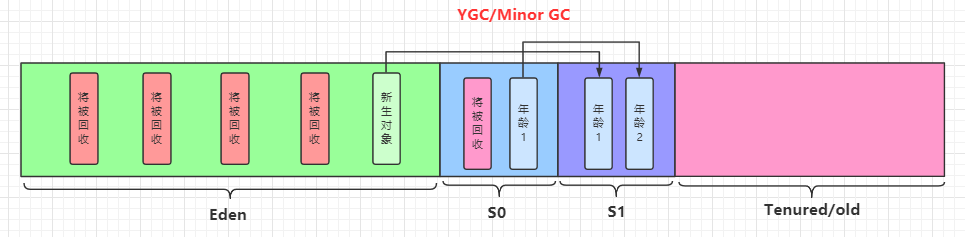

[toc]

# 堆

## 1 堆核心概念

### 1.1 基础


一个JVM实例只存在一个堆内存，堆也是Java内存管理的核心区域。

Java堆区在JVM启动的时候即被创建，其空间大小也就确定了。是JVM管理的最大一块内存空间。

《Java虚拟机规范》规定，堆可以处于物理上不连续的内存空间中，但在逻辑上它应该被视为连续的。所有的线程共享Java堆，在这里还可以划分线程私有的缓冲区（Thread Local Allocation Buffer，TLAB）。

《Java虚拟机规范》中对Java堆的描述是：所有的对象实例以及数组都应当在运行时分配在堆上。（The heap is the run-time data area from which memory for all class instances and arrays is allocated）

```
这里也不是很绝对：因为还有一些对象是在栈上分配的
```

数组和对象可能永远不会存储在栈上，因为栈帧中保存引用，这个引用指向对象或者数组在堆中的位置。

在方法结束后，堆中的对象不会马上被移除，仅仅在垃圾回收的时候才会被移除。

- 也就是触发了GC的时候，才会进行回收
- 进行GC的时候，会发生stop the word，此时用户线程就会阻塞，等待stop the word完成再执行。

堆是GC（Garbage Collection，垃圾收集器）执行垃圾回收的重点区域。


### 1.2 堆的细分

Java 7及之前堆内存逻辑上分为三部分：新生区+养老区+永久区

- Young Generation Space 新生区 Young/New 又被划分为Eden区和Survivor区
- Tenure generation space 养老区 Old/Tenure
- Permanent Space永久区 Perm

Java 8及之后堆内存逻辑上分为三部分：新生区养老区+元空间

- Young Generation Space新生区 Young/New 又被划分为Eden区和Survivor区
- Tenure generation space 养老区 Old/Tenure
- Meta Space 元空间 Meta


堆空间内部结构，JDK1.8及之后从永久代 替换成 元空间


### 1.3 设置堆内存大小

Java堆区用于存储Java对象实例，那么堆的大小在JVM启动时就已经设定好了，大家可以通过选项"-Xmx"和"-Xms"来进行设置。

- “-Xms"用于表示堆区的起始内存，等价于-xx:InitialHeapSize
- “-Xmx"则用于表示堆区的最大内存，等价于-XX:MaxHeapSize

```
-Xms10m：设置最小堆内存为10M
-Xmx10m：设置最大堆内存为10M
```

一旦堆区中的内存大小超过“-xmx"所指定的最大内存时，将会抛出outofMemoryError异常。

通常会将-Xms和-Xmx两个参数配置相同的值，其目的是**为了能够在ava垃圾回收机制清理完堆区后不需要重新分隔计算堆区的大小，从而提高性能**。

默认情况下

- 初始内存大小：物理电脑内存大小/64
- 最大内存大小：物理电脑内存大小/4

```java
/**
 * -Xms 用来设置堆空间（年轻代+老年代）的初始内存大小
 *    -X：是jvm运行参数
 *    ms：memory start
 * -Xmx：用来设置堆空间（年轻代+老年代）的最大内存大小
 *
 * 查看堆空间大小
 */
public class HeapSpaceInitial {
    public static void main(String[] args) {
        // 返回Java虚拟机中的堆内存总量
        long initialMemory = Runtime.getRuntime().totalMemory() / 1024 / 1024;
        // 返回Java虚拟机试图使用的最大堆内存
        long maxMemory = Runtime.getRuntime().maxMemory() / 1024 / 1024;
        System.out.println("-Xms:" + initialMemory + "M"); // -Xms:245M
        System.out.println("-Xmx:" + maxMemory + "M"); // -Xmx:3614M
    }
}
```

### 1.4 堆空间可视化工具- Java VisualVM

通过Java VisualVM可以查看堆空间的内容，Java VisualVM所在位置：JDK安装目录/bin/jvisualvm.exe

启动程序后需要安装一个插件：Visual GC


## 2 年轻代与老年代

### 2.1 简介

存储在JVM中的Java对象可以被划分为两类：

1. 生命周期较短的瞬时对象，这类对象的创建和消亡都非常迅速(生命周期短的，及时回收即可)
2. 生命周期却非常长，在某些极端的情况下还能够与JVM的生命周期保持一致

Java堆区进一步细分的话，可以划分为年轻代（YoungGen）和老年代（oldGen），
其中年轻代又可以划分为Eden空间、Survivor0空间和Survivor1空间（有时也叫做from区、to区）


几乎所有的Java对象都是在Eden区被new出来的。绝大部分的Java对象的销毁都在新生代进行了。（有些大的对象在Eden区无法存储时候，将直接进入老年代）


### 2.2 内存比例

通常默认的内存比例如下：

- Eden : From : To  =  8 ：1 ：1
    - 在HotSpot中，Eden空间和另外两个survivor空间缺省所占的比例是8：1：1
    - 开发人员可以通过参数“-xx:SurvivorRatio”调整这个空间比例，比如-xx:SurvivorRatio=8
- 新生代：老年代  = 1 : 2
    - 当发现在整个项目中，生命周期长的对象偏多，那么就可以通过调整老年代的大小，来进行调优
    - 默认-XX:NewRatio=2，表示新生代占1，老年代占2，新生代占整个堆的1/3
    - 可以修改-XX:NewRatio=4，表示新生代占1，老年代占4，新生代占整个堆的1/5

## 3 对象分配过程

### 3.1 分配过程简述

为新对象分配内存是一件非常严谨和复杂的任务，JVM的设计者们不仅需要考虑内存如何分配、在哪里分配等问题，并且由于内存分配算法与内存回收算法密切相关，所以还需要考虑GC执行完内存回收后是否会在内存空间中产生内存碎片。


分配过程如下：

1. new的对象先放伊甸园区。
2. 当伊甸园的空间填满时，程序又需要创建对象，JVM的垃圾回收器会对伊甸园区进行垃圾回收（MinorGC），
    将伊甸园区中的不再被其他对象所引用的对象进行销毁，再加载新的对象放到伊甸园区。
3. 然后将伊甸园中的幸存对象移动到survivor0区（年龄记为1）。
4. 如果再次触发垃圾回收，没被回收的对象就会放到survivor1区（并且年龄+1）。
5. 如果再次经历垃圾回收，没被回收的对象会重新放回survivor0区，依次往复的在survivor0和survivor1中搬移（每次搬移年龄+1）。
6. 当对象的年龄到达某个阈值(默认是15)后，再次发生垃圾回收对象就会被放到养老区。
7. 在养老区，相对悠闲。当养老区内存不足时，养老区会触发GC（Major GC），进行养老区的内存清理。
8. 若养老区执行了Major GC之后，发现依然无法进行对象的保存，就会产生OOM。

可以设置参数：-Xx:MaxTenuringThreshold= N进行设置

### 3.2 图解对象分配过程

1. 新生对象放到Eden区。
    
2. 当我们Eden区满了后，就会触发GC操作，一般被称为 YGC / Minor GC操作，
    没有引用的对象会被会回收，有引用的对象会放到Survivor To区（此时为S0）,年龄记为1。
    
3. 当Eden再次满的时候会再次出发MinorGC, 此时GC将会把Eden区和Survivor From(此时为S0)中的对象进行一次收集，
    把存活的对象放到 Survivor To(此时为S1)区，同时让年龄+1。
    
4. 如果再次经历垃圾回收，没被回收的对象会重新放回survivor0区，依次往复的在survivor0和survivor1中搬移（每次搬移年龄+1）。
    
5. 当对象的年龄到达某个阈值(默认是15)后，再次发生垃圾回收，将会触发一次 Promotion晋升的操作，对象就会被放到养老区。
    
6. 当养老区内存不足时，养老区会触发GC（Major GC），进行养老区的内存清理，
    若养老区执行了Major GC之后，发现依然无法进行对象的保存，就会产生OOM。
    

### 3.3 触发YGC/MinorGC的条件

当Eden区满了之后就会出发YGC，这里特别注意，**当幸存者区满了后，不会触发MinorGC操作**。

如果Survivor区满了后，将会触发一些特殊的规则，也就是可能直接晋升老年代。

```
举例：以当兵为例，正常人的晋升可能是 ： 新兵 -> 班长 -> 排长 -> 连长
但是也有可能有些人因为做了非常大的贡献，直接从 新兵 -> 连长
```


## ps-相关资料

- [堆空间](https://gitee.com/moxi159753/LearningNotes/tree/master/JVM/1_%E5%86%85%E5%AD%98%E4%B8%8E%E5%9E%83%E5%9C%BE%E5%9B%9E%E6%94%B6%E7%AF%87/8_%E5%A0%86)