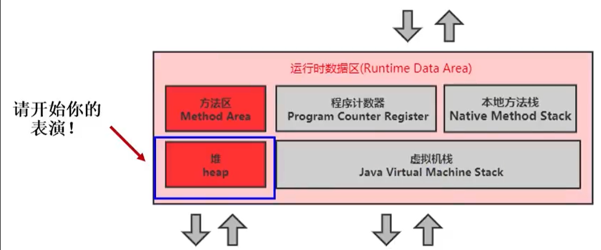

[toc]

# 堆

## 1 堆核心概念

### 1.1 基础



一个JVM实例只存在一个堆内存，堆也是Java内存管理的核心区域。

Java堆区在JVM启动的时候即被创建，其空间大小也就确定了。是JVM管理的最大一块内存空间。

- 堆内存的大小是可以调节的。

    ```
    -Xms10m：设置最小堆内存为10M
    -Xmx10m：设置最大堆内存为10M
    ```

《Java虚拟机规范》规定，堆可以处于物理上不连续的内存空间中，但在逻辑上它应该被视为连续的。所有的线程共享Java堆，在这里还可以划分线程私有的缓冲区（Thread Local Allocation Buffer，TLAB）。

《Java虚拟机规范》中对Java堆的描述是：所有的对象实例以及数组都应当在运行时分配在堆上。（The heap is the run-time data area from which memory for all class instances and arrays is allocated）

```
这里也不是很绝对：因为还有一些对象是在栈上分配的
```

数组和对象可能永远不会存储在栈上，因为栈帧中保存引用，这个引用指向对象或者数组在堆中的位置。

在方法结束后，堆中的对象不会马上被移除，仅仅在垃圾回收的时候才会被移除。

- 也就是触发了GC的时候，才会进行回收
- 进行GC的时候，会发生stop the word，此时用户线程就会阻塞，等待stop the word完成再执行。

堆是GC（Garbage Collection，垃圾收集器）执行垃圾回收的重点区域。


### 1.2 Java VisualVM堆空间可视化

通过Java VisualVM可以查看堆空间的内容，Java VisualVM所在位置：JDK安装目录/bin/jvisualvm.exe

启动程序后需要安装一个插件：Visual GC


## ps-相关资料

- [堆空间](https://gitee.com/moxi159753/LearningNotes/tree/master/JVM/1_%E5%86%85%E5%AD%98%E4%B8%8E%E5%9E%83%E5%9C%BE%E5%9B%9E%E6%94%B6%E7%AF%87/8_%E5%A0%86)