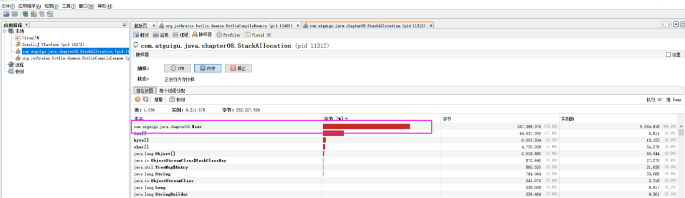

[toc]

# 堆

## 1 堆核心概念

### 1.1 基础


一个JVM实例只存在一个堆内存，堆也是Java内存管理的核心区域。

Java堆区在JVM启动的时候即被创建，其空间大小也就确定了。是JVM管理的最大一块内存空间。

《Java虚拟机规范》规定，堆可以处于物理上不连续的内存空间中，但在逻辑上它应该被视为连续的。所有的线程共享Java堆，在这里还可以划分线程私有的缓冲区（Thread Local Allocation Buffer，TLAB）。

《Java虚拟机规范》中对Java堆的描述是：所有的对象实例以及数组都应当在运行时分配在堆上。（The heap is the run-time data area from which memory for all class instances and arrays is allocated）

```
这里也不是很绝对：因为还有一些对象是在栈上分配的
```

数组和对象可能永远不会存储在栈上，因为栈帧中保存引用，这个引用指向对象或者数组在堆中的位置。

在方法结束后，堆中的对象不会马上被移除，仅仅在垃圾回收的时候才会被移除。

- 也就是触发了GC的时候，才会进行回收
- 进行GC的时候，会发生stop the word，此时用户线程就会阻塞，等待stop the word完成再执行。

堆是GC（Garbage Collection，垃圾收集器）执行垃圾回收的重点区域。


### 1.2 堆的细分

Java 7及之前堆内存逻辑上分为三部分：新生区+养老区+永久区

- Young Generation Space 新生区 Young/New 又被划分为Eden区和Survivor区
- Tenure generation space 养老区 Old/Tenure
- Permanent Space永久区 Perm

Java 8及之后堆内存逻辑上分为三部分：新生区养老区+元空间

- Young Generation Space新生区 Young/New 又被划分为Eden区和Survivor区
- Tenure generation space 养老区 Old/Tenure
- Meta Space 元空间 Meta


堆空间内部结构，JDK1.8及之后从永久代 替换成 元空间


### 1.3 设置堆内存大小

Java堆区用于存储Java对象实例，那么堆的大小在JVM启动时就已经设定好了，大家可以通过选项"-Xmx"和"-Xms"来进行设置。

- “-Xms"用于表示堆区的起始内存，等价于-xx:InitialHeapSize
- “-Xmx"则用于表示堆区的最大内存，等价于-XX:MaxHeapSize

```
-Xms10m：设置最小堆内存为10M
-Xmx10m：设置最大堆内存为10M
```

一旦堆区中的内存大小超过“-xmx"所指定的最大内存时，将会抛出outofMemoryError异常。

通常会将-Xms和-Xmx两个参数配置相同的值，其目的是**为了能够在ava垃圾回收机制清理完堆区后不需要重新分隔计算堆区的大小，从而提高性能**。

默认情况下

- 初始内存大小：物理电脑内存大小/64
- 最大内存大小：物理电脑内存大小/4

```java
/**
 * -Xms 用来设置堆空间（年轻代+老年代）的初始内存大小
 *    -X：是jvm运行参数
 *    ms：memory start
 * -Xmx：用来设置堆空间（年轻代+老年代）的最大内存大小
 *
 * 查看堆空间大小
 */
public class HeapSpaceInitial {
    public static void main(String[] args) {
        // 返回Java虚拟机中的堆内存总量
        long initialMemory = Runtime.getRuntime().totalMemory() / 1024 / 1024;
        // 返回Java虚拟机试图使用的最大堆内存
        long maxMemory = Runtime.getRuntime().maxMemory() / 1024 / 1024;
        System.out.println("-Xms:" + initialMemory + "M"); // -Xms:245M
        System.out.println("-Xmx:" + maxMemory + "M"); // -Xmx:3614M
    }
}
```

### 1.4 堆空间可视化工具- Java VisualVM

通过Java VisualVM可以查看堆空间的内容，Java VisualVM所在位置：JDK安装目录/bin/jvisualvm.exe

启动程序后需要安装一个插件：Visual GC


## 2 年轻代与老年代

### 2.1 简介

存储在JVM中的Java对象可以被划分为两类：

1. 生命周期较短的瞬时对象，这类对象的创建和消亡都非常迅速(生命周期短的，及时回收即可)
2. 生命周期却非常长，在某些极端的情况下还能够与JVM的生命周期保持一致

Java堆区进一步细分的话，可以划分为年轻代（YoungGen）和老年代（oldGen），
其中年轻代又可以划分为Eden空间、Survivor0空间和Survivor1空间（有时也叫做from区、to区）


几乎所有的Java对象都是在Eden区被new出来的。绝大部分的Java对象的销毁都在新生代进行了。（有些大的对象在Eden区无法存储时候，将直接进入老年代）


### 2.2 内存比例

通常默认的内存比例如下：

- Eden : From : To  =  8 ：1 ：1
    - 在HotSpot中，Eden空间和另外两个survivor空间缺省所占的比例是8：1：1
    - 开发人员可以通过参数“-xx:SurvivorRatio”调整这个空间比例，比如-xx:SurvivorRatio=8
- 新生代：老年代  = 1 : 2
    - 当发现在整个项目中，生命周期长的对象偏多，那么就可以通过调整老年代的大小，来进行调优
    - 默认-XX:NewRatio=2，表示新生代占1，老年代占2，新生代占整个堆的1/3
    - 可以修改-XX:NewRatio=4，表示新生代占1，老年代占4，新生代占整个堆的1/5

## 3 对象分配过程

### 3.1 分配过程简述

为新对象分配内存是一件非常严谨和复杂的任务，JVM的设计者们不仅需要考虑内存如何分配、在哪里分配等问题，并且由于内存分配算法与内存回收算法密切相关，所以还需要考虑GC执行完内存回收后是否会在内存空间中产生内存碎片。


分配过程如下：

1. new的对象先放伊甸园区。
2. 当伊甸园的空间填满时，程序又需要创建对象，JVM的垃圾回收器会对伊甸园区进行垃圾回收（MinorGC），
    将伊甸园区中的不再被其他对象所引用的对象进行销毁，再加载新的对象放到伊甸园区。
3. 然后将伊甸园中的幸存对象移动到survivor0区（年龄记为1）。
4. 如果再次触发垃圾回收，没被回收的对象就会放到survivor1区（并且年龄+1）。
5. 如果再次经历垃圾回收，没被回收的对象会重新放回survivor0区，依次往复的在survivor0和survivor1中搬移（每次搬移年龄+1）。
6. 当对象的年龄到达某个阈值(默认是15)后，再次发生垃圾回收对象就会被放到养老区。
7. 在养老区，相对悠闲。当养老区内存不足时，养老区会触发GC（Major GC），进行养老区的内存清理。
8. 若养老区执行了Major GC之后，发现依然无法进行对象的保存，就会产生OOM。

可以设置参数：-Xx:MaxTenuringThreshold= N进行设置

### 3.2 图解对象分配过程

1. 新生对象放到Eden区。
    
2. 当我们Eden区满了后，就会触发GC操作，一般被称为 YGC / Minor GC操作，
    没有引用的对象会被会回收，有引用的对象会放到Survivor To区（此时为S0）,年龄记为1。
    
3. 当Eden再次满的时候会再次出发MinorGC, 此时GC将会把Eden区和Survivor From(此时为S0)中的对象进行一次收集，
    把存活的对象放到 Survivor To(此时为S1)区，同时让年龄+1。
    
4. 如果再次经历垃圾回收，没被回收的对象会重新放回survivor0区，依次往复的在survivor0和survivor1中搬移（每次搬移年龄+1）。
    
5. 当对象的年龄到达某个阈值(默认是15)后，再次发生垃圾回收，将会触发一次 Promotion晋升的操作，对象就会被放到养老区。
    
6. 当养老区内存不足时，养老区会触发GC（Major GC），进行养老区的内存清理，
    若养老区执行了Major GC之后，发现依然无法进行对象的保存，就会产生OOM。
    

### 3.3 触发YGC/MinorGC的条件

当Eden区满了之后就会出发YGC，这里特别注意，**当幸存者区满了后，不会触发MinorGC操作**。

如果Survivor区满了后，将会触发一些特殊的规则，也就是可能直接晋升老年代。

```
举例：以当兵为例，正常人的晋升可能是 ： 新兵 -> 班长 -> 排长 -> 连长
但是也有可能有些人因为做了非常大的贡献，直接从 新兵 -> 连长
```

### 3.4 代码演示

```java
/**
 * @author create by hongzh.zhang on 2020-12-22
 * 堆空间oom示例
 * 运行前设置参数(Idea中Run->Edit Configurations设置)： -Xms400m -Xmx400m
 * cmd中通过jvisualvm调出堆可视化工具
 */
public class HeapOOMTest {
    byte[] array = new byte[new Random().nextInt(1024*100)];

    public static void main(String[] args) throws Exception {
        ArrayList<HeapOOMTest> list = new ArrayList<>();
        while (true) {
            list.add(new HeapOOMTest());
            Thread.sleep(5);
        }
    }
}
```

动态图：


最终，在老年代和新生代都满了，就出现OOM

```
Exception in thread "main" java.lang.OutOfMemoryError: Java heap space
	at com.hong.base.HeapOOMTest.<init>(HeapOOMTest.java:13)
	at com.hong.base.HeapOOMTest.main(HeapOOMTest.java:18)
```

### 3.5 总结

- 针对幸存者s0，s1区的总结：复制之后有交换，谁空谁是to
- 关于垃圾回收：频繁在新生区收集，很少在老年代收集，几乎不再永久代和元空间进行收集
- 新生代采用复制算法的目的：是为了减少内碎片

## 4 Minor GC，MajorGC、Full GC

- Minor GC：新生代的GC
- Major GC：老年代的GC
- Full GC：整堆收集，收集整个Java堆和方法区的垃圾收集

JVM在进行GC时，并非每次都对上面三个内存区域一起回收的，大部分时候回收的都是指新生代。针对Hotspot VM的实现，它里面的GC按照回收区域又分为两大种类型：一种是部分收集（Partial GC），一种是整堆收集（FullGC）

部分收集：不是完整收集整个Java堆的垃圾收集。其中又分为：

- 新生代收集（MinorGC/YoungGC）：只是新生代的垃圾收集
- 老年代收集（MajorGC/o1dGC）：只是老年代的圾收集。
    - 目前，只有CMSGC会有单独收集老年代的行为。
    - 注意，很多时候Major GC会和Fu11GC混淆使用，需要具体分辨是老年代回收还是整堆回收。
- 混合收集（MixedGC）：收集整个新生代以及部分老年代的垃圾收集。（目前，只有G1 GC会有这种行为）

整堆收集（FullGC）：收集整个java堆和方法区的垃圾收集。

### 4.1 Minor GC

当年轻代空间不足时，就会触发MinorGC，这里的年轻代满指的是Eden代满，Survivor满不会引发GC。（每次Minor GC会清理年轻代的内存。）

因为Java对象大多都具备 **朝生夕灭** 的特性，所以Minor GC非常频繁，一般回收速度也比较快。这一定义既清晰又易于理解。

Minor GC会引发STW，暂停其它用户的线程，等垃圾回收结束，用户线程才恢复运行。

### 4.2 MajorGC

指发生在老年代的GC，对象从老年代消失时，我们说 “Major Gc” 或 “Full GC” 发生了

出现了MajorGC，经常会伴随至少一次的Minor GC（但非绝对的，在Parallel Scavenge收集器的收集策略里就有直接进行MajorGC的策略选择过程）

- 也就是在老年代空间不足时，会先尝试触发MinorGC。如果之后空间还不足，则触发Major GC

**Major GC的速度一般会比MinorGC慢10倍以上**，STW的时间更长，如果Major GC后，内存还不足，就报OOM了.

### 4.3 Full GC

触发FullGC执行的情况有如下五种：

- 调用System.gc()时，系统建议执行FullGC，但是不必然执行
- 老年代空间不足
- 方法区空间不足
- 通过Minor GC后进入老年代的平均大小大于老年代的可用内存
- 由Eden区、survivor space（From Space）区向survivor space（To Space）区复制时，对象大小大于To Space可用内存，则把该对象转存到老年代，且老年代的可用内存小于该对象大小

说明：Full GC 是开发或调优中尽量要避免的。这样暂时时间会短一些

## 5 堆空间分代思想

Java堆分代主要原因是：不同对象的生命周期不同，70%-99%的对象是临时对象。

其实不分代完全可以，分代的唯一理由就是优化GC性能。如果没有分代，那所有的对象都在一块，就如同把一个学校的人都关在一个教室。GC的时候要找到哪些对象没用，这样就会对堆的所有区域进行扫描。而很多对象都是朝生夕死的，如果分代的话，把新创建的对象放到某一地方，当GC的时候先把这块存储“朝生夕死”对象的区域进行回收，这样就会腾出很大的空间出来。


## 6 线程本地分配缓存-TLAB

### 6.1 什么是TLAB

TLAB（Thread Local Allocation Buffer ）即线程本地分配缓存，jvm为每个线程单独分配了一个缓冲区，这就是TLAB。

堆区是线程共享区域，任何线程都可以访问到堆区中的共享数据,由于对象实例的创建在JVM中非常频繁，因此在并发环境下从堆区中划分内存空间是线程不安全的，为避免多个线程操作同一地址，需要使用加锁等机制，进而影响分配速度，所以为每个线程都创建了TLAB。

从内存模型而不是垃圾收集的角度，对Eden区域继续进行划分，JVM为每个线程分配了一个私有缓存区域，它包含在Eden空间内。多线程同时分配内存时，使用TLAB可以避免一系列的非线程安全问题，同时还能够提升内存分配的吞吐量，因此我们可以将这种内存分配方式称之为快速分配策略。


尽管不是所有的对象实例都能够在TLAB中成功分配内存，但JVM确实是将TLAB作为内存分配的首选。在程序中，开发人员可以通过选项“-Xx:UseTLAB”设置是否开启TLAB空间。默认情况下，TLAB空间的内存非常小，仅占有整个Eden空间的1%，当然我们可以通过选项“-Xx:TLABWasteTargetPercent”设置TLAB空间所占用Eden空间的百分比大小。

一旦对象在TLAB空间分配内存失败时，JVM就会尝试着通过使用加锁机制确保数据操作的原子性，从而直接在Eden空间中分配内存。

### 6.2 TLAB分配过程


## 7 堆空间的常用参数设置

| 参数值                      | 含义                                                   | 备注 |
| --------------------------- | ------------------------------------------------------ | ---- |
| -XX：+PrintFlagsInitial     | 查看所有的参数的默认初始值                             |      |
| -XX：+PrintFlagsFinal       | 查看所有的参数的最终值（可能会存在修改，不再是初始值） |      |
| -Xms                        | 初始堆空间内存（默认为物理内存的1/64）                 |      |
| -Xmx                        | 最大堆空间内存（默认为物理内存的1/4）                  |      |
| -Xmn                        | 设置新生代的大小。（初始值及最大值）                   |      |
| -XX:NewRatio                | 配置新生代与老年代在堆结构的占比                       |      |
| -XX:SurvivorRatio           | 设置新生代中Eden和S0/S1空间的比例                      |      |
| -XX:MaxTenuringThreshold    | 设置新生代垃圾的最大年龄                               |      |
| -XX：+PrintGCDetails        | 输出详细的GC处理日志                                   |      |
| -XX:HandlePromotionFalilure | 是否设置空间分配担保                                   |      |

在发生Minor GC之前，虚拟机会检查老年代最大可用的连续空间是否大于新生代所有对象的总空间。

1. 如果大于，则此次Minor GC是安全的
2. 如果小于，则虚拟机会查看-xx:HandlePromotionFailure设置值是否允担保失败。
    - 如果HandlePromotionFailure=true，那么会继续检查老年代最大可用连续空间是否大于历次晋升到老年代的对象的平均大小。
        1. 如果大于，则尝试进行一次Minor GC，但这次Minor GC依然是有风险的；
        2. 如果小于，则改为进行一次FullGC。
    - 如果HandlePromotionFailure=false，则改为进行一次Full GC。

## 8 逃逸分析

### 8.1 逃逸分析简介

随着JIT编译器（及时编译器just in time）的发展与逃逸分析技术逐渐成熟，栈上分配、标量替换优化技术将会导致一些微妙的变化，所有的对象都分配到堆上也渐渐变得不那么“绝对”了。

在Java虚拟机中，对象是在Java堆中分配内存的，这是一个普遍的常识。但是也有一种特殊情况，那就是如果经过逃逸分析（Escape Analysis）后发现，如果一个对象并没有逃逸出方法的话，那么就可能被优化成栈上分配。这样就无需在堆上分配内存，也无须进行垃圾回收了，这也是最常见的堆外存储技术。

如何想让对象在栈上分配，需要使用逃逸分析手段，这是一种可以有效减少Java程序中同步负载和内存堆分配压力的跨函数全局数据流分析算法。通过逃逸分析，Java Hotspot编译器能够分析出一个新的对象的引用的使用范围从而决定是否要将这个对象分配到堆上，逃逸分析的基本行为就是分析对象动态作用域：

- 当一个对象在方法中被定义后，对象**只在方法内部使用**，则认为**没有发生逃逸**。
- 当一个对象在方法中被定义后，它**被外部方法所引用**，则认为**发生逃逸**。例如作为调用参数传递到其他地方中。

### 8.2 逃逸分析举例

```java
/**
 * 该方法发生了逃逸，因为创建的sb对象可以被外部方法使用
 */
public static StringBuffer createStringBuffer1(String s1, String s2) {
    StringBuffer sb = new StringBuffer();
    sb.append(s1);
    sb.append(s2);
    return sb;
}


/**
 * 该方法未发生逃逸，外部无法引用方法内部出创建的对象
 */
public static StringBuffer createStringBuffer2(String s1, String s2) {
    StringBuffer sb = new StringBuffer();
    sb.append(s1);
    sb.append(s2);
    return sb.toString();
}
```

### 8.3 逃逸分析参数设置

在JDK 1.7 版本之后，HotSpot中默认就已经开启了逃逸分析，如果使用的是较早的版本，开发人员则可以通过：

- 设置参数“-xx：+DoEscapeAnalysis"显式开启逃逸分析
- 设置参数“-xx：+PrintEscapeAnalysis"查看逃逸分析的筛选结果

### 8.4 逃逸分析编译器会做的优化

开发中能使用局部变量的，就不要使用在方法外定义。

使用逃逸分析，编译器可以对代码做如下优化：

- 栈上分配：将堆分配转化为栈分配。如果一个对象在子程序中被分配，要使指向该对象的指针永远不会发生逃逸，对象可能是栈上分配的候选，而不是堆上分配
- 同步省略：如果一个对象被发现只有一个线程被访问到，那么对于这个对象的操作可以不考虑同步。
- 分离对象或标量替换：有的对象可能不需要作为一个连续的内存结构存在也可以被访问到，那么对象的部分（或全部）可以不存储在内存，而是存储在CPU寄存器中。

#### 8.4.1 栈上分配

JIT编译器在编译期间根据逃逸分析的结果，发现如果一个对象并没有逃逸出方法的话，就可能被优化成栈上分配。分配完成后，继续在调用栈内执行，最后线程结束，栈空间被回收，局部变量对象也被回收，这样就无须进行垃圾回收了。

举例：

```java
/**
 * 栈上分配
 * -Xmx1G -Xms1G -XX:-DoEscapeAnalysis -XX:+PrintGCDetails
 */
class User {
    private String name;
    private String age;
    private String gender;
    private String phone;
}
public class StackAllocation {
    public static void main(String[] args) throws InterruptedException {
        long start = System.currentTimeMillis();
        for (int i = 0; i < 100000000; i++) {
            alloc();
        }
        long end = System.currentTimeMillis();
        System.out.println("花费的时间为：" + (end - start) + " ms");

        // 为了方便查看堆内存中对象个数，线程sleep
        Thread.sleep(10000000);
    }

    private static void alloc() {
        // 未发生逃逸
        User user = new User(); 
    }
}
```

1. 设置参数**关闭逃逸分析**结果
    - 参数： -Xmx1G -Xms1G -XX:-DoEscapeAnalysis -XX:+PrintGCDetails  （备注：DoEscapeAnalysis 前是-号代表关闭）
    - 结果：总花费时间：664 ms
    - 然后查看内存的情况，发现有大量的User存储在堆中：
        
2. 设置参数**开启逃逸分析**结果
    - 参数：-Xmx1G -Xms1G -XX:+DoEscapeAnalysis -XX:+PrintGCDetails（备注：DoEscapeAnalysis 前是+号代表开启）
    - 结果：总花费时间：5 ms
    - 在看内存情况，我们发现只有很少的User对象，说明User未发生逃逸，因为它存储在栈中，随着栈的销毁而消失：
        

#### 8.4.2 同步省略（锁消除）

线程同步的代价是相当高的，同步的后果是降低并发和性能。

在动态编译同步块的时候，JIT编译器可以借助逃逸分析来判断同步块所使用的锁对象是否只能够被一个线程访问而没有被发布到其他线程。如果没有，那么JIT编译器在编译这个同步块的时候就会取消对这部分代码的同步。这样就能大大提高并发性和性能。这个取消同步的过程就叫同步省略，也叫锁消除。

例如下面的代码：

```java
public void f() {
    Object obj = new Object();
    synchronized(obj) {
        System.out.println(obj);
    }
}
```

代码中对obj这个对象加锁，但是obj对象的生命周期只在f()方法中，并不会被其他线程所访问到，所以在JIT编译阶段就会被优化掉，优化成：

```java
public void f() {
    Object obj = new Object();
	System.out.println(obj);
}
```

#### 8.4.3 分离对象(标量替换)

参数`-XX：+EliminateAllocations`：可以开启标量替换（默认打开）。

标量（scalar）是指一个无法再分解成更小的数据的数据，Java中的原始数据类型就是标量。

相对的，那些还可以分解的数据叫做聚合量（Aggregate），Java中的对象就是聚合量，因为他可以分解成其他聚合量和标量。

在JIT阶段，如果经过逃逸分析，发现一个对象(聚合量)不会被外界访问的话，那么经过JIT优化，就会把这个对象拆解成若干个成员变量(标量)来代替。这个过程就是标量替换。

```java
public static void main(String args[]) {
    alloc();
}

class Point {
    private int x;
    private int y;
}

private static void alloc() {
    Point point = new Point(1,2);
    System.out.println("point.x" + point.x + ";point.y" + point.y);
}
```

以上代码，经过标量替换后，就会变成

```java
private static void alloc() {
    int x = 1;
    int y = 2;
    System.out.println("point.x = " + x + "; point.y=" + y);
}
```

可以看到，Point这个聚合量经过逃逸分析后，发现他并没有逃逸，就被替换成两个标量了。

标量替换的好处：就是可以大大减少堆内存的占用。因为一旦不需要创建对象了，那么就不再需要分配堆内存了。 标量替换为栈上分配提供了很好的基础。

### 8.5 逃逸分析的不足

逃逸分析的不足点在于**无法保证逃逸分析的性能消耗一定能高于他本身的消耗**。

虽然经过逃逸分析可以做标量替换、栈上分配、和锁消除。但是逃逸分析自身也是需要进行一系列复杂的分析的，**这其实也是一个相当耗时的过程**。 
一个极端的例子，就是经过逃逸分析之后，发现没有一个对象是不逃逸的，那这个逃逸分析的过程就白白浪费掉了。

## ps-相关资料

- [堆空间](https://gitee.com/moxi159753/LearningNotes/tree/master/JVM/1_%E5%86%85%E5%AD%98%E4%B8%8E%E5%9E%83%E5%9C%BE%E5%9B%9E%E6%94%B6%E7%AF%87/8_%E5%A0%86)