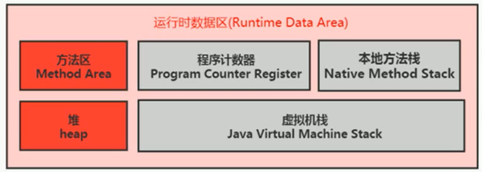
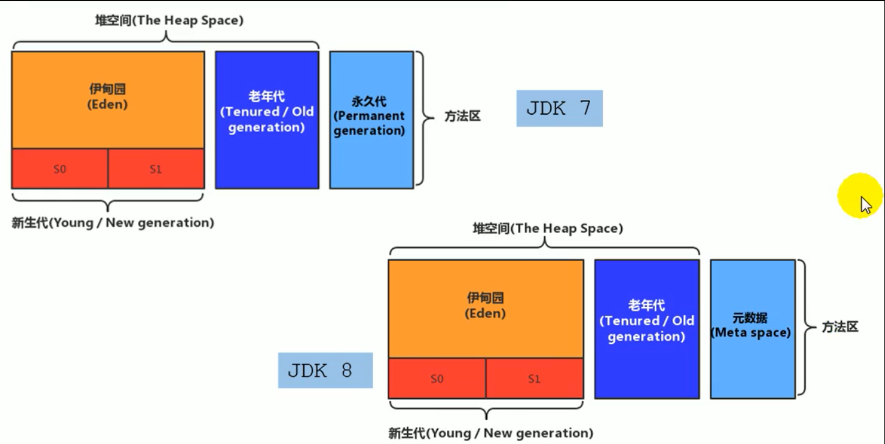
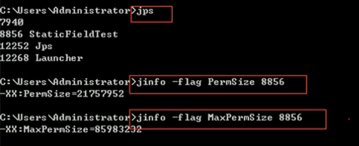
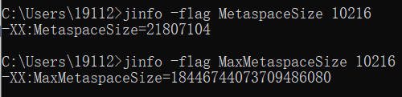
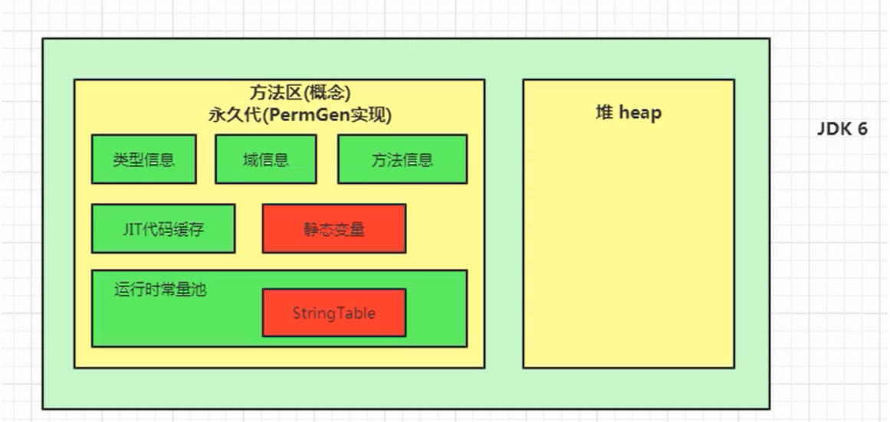
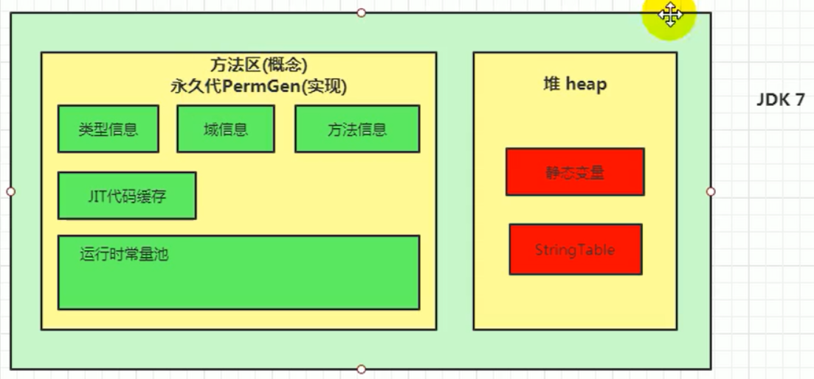
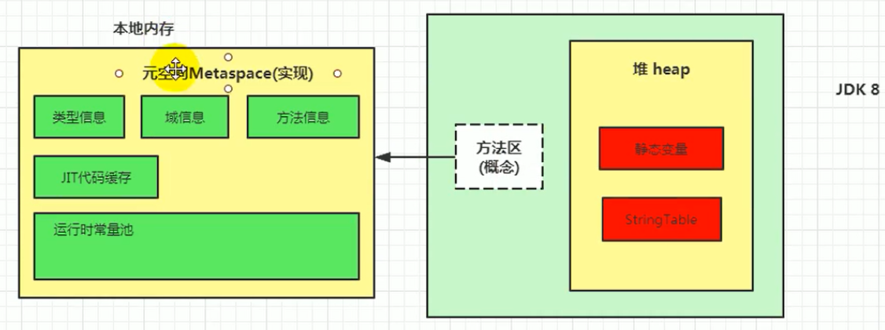

[toc]

# 方法区

## 1 堆、栈、方法区的关系


## 2 方法区的理解

《Java虚拟机规范》中明确说明：“尽管所有的方法区在逻辑上是属于堆的一部分，但一些简单的实现可能不会选择去进行垃圾收集或者进行压缩。”但对于HotSpotJVM而言，方法区还有一个别名叫做Non-Heap（非堆），目的就是要和堆分开。 

所以，方法区看作是一块独立于Java堆的内存空间。 



方法区主要存放的是 Class，而堆中主要存放的是 实例化的对象

- 方法区（Method Area）与Java堆一样，是各个线程共享的内存区域。
- 方法区在JVM启动的时候被创建，并且它的实际的物理内存空间中和Java堆区一样都可以是不连续的。
- 方法区的大小，跟堆空间一样，可以选择固定大小或者可扩展。
- 方法区的大小决定了系统可以保存多少个类，如果系统定义了太多的类，导致方法区内存溢出，虚拟机同样会抛出内存溢出错误：
    - java.lang.OutOfMemoryError:PermGen space(JDK1.7及之前) 
    - java.lang.OutOfMemoryError:Metaspace(JDK1.8及之后) 
- 方法区内存溢出的主要原因：
    1. 加载大量的第三方的jar包
    2. Tomcat部署的工程过多（30~50个）
    3. 大量动态的生成反射类
- 关闭JVM就会释放这个区域的内存。

## 3 HotSpot中方法区的演进

在jdk7及以前，习惯上把方法区称为永久代。jdk8开始，使用元空间取代了永久代。

- JDK 1.8后，元空间存放在堆外内存中

本质上，方法区和永久代并不等价。仅是对hotspot而言的。《Java虚拟机规范》对如何实现方法区没有统一要求。例如：BEAJRockit / IBM J9 中不存在永久代的概念。 

到了JDK8，终于完全废弃了永久代的概念，改用与JRockit、J9一样在本地内存中实现的元空间（Metaspace）来代替 。

元空间与永久代最大的区别在于：元空间不在虚拟机设置的内存中，而是使用本地内存 。



## 4 不同版本JDK设置方法区大小与OOM

### 4.1 JDK7及之前

- 通过-xx:Permsize来设置永久代初始分配空间。默认值是20.75M
- -XX:MaxPermsize来设定永久代最大可分配空间。32位机器默认是64M，64位机器模式是82M
- 当JVM加载的类信息容量超过了这个值，会报异常OutofMemoryError:PermGen space。



### 4.2 JDK8及之后

-  元数据区大小可以使用参数 -XX:MetaspaceSize 和 -XX:MaxMetaspaceSize指定
-  默认值依赖于平台。windows下，-XX:MetaspaceSize是21M，-XX:MaxMetaspaceSize的值是-1，即没有限制。  与永久代不同，如果不指定大小，默认情况下，虚拟机会耗尽所有的可用系统内存。如果元数据区发生溢出，虚拟机一样会抛出异常OutOfMemoryError:Metaspace 。



对于一个64位的服务器端JVM来说，其默认的-xx:MetaspaceSize值为21MB。这就是初始的高水位线，一旦触及这个水位线，FullGC将会被触发并卸载没用的类（即这些类对应的类加载器不再存活）然后这个高水位线将会重置。新的高水位线的值取决于GC后释放了多少元空间。如果释放的空间不足，那么在不超过MaxMetaspaceSize时，适当提高该值。如果释放空间过多，则适当降低该值。 

如果初始化的高水位线设置过低，上述高水位线调整情况会发生很多次。通过垃圾回收器的日志可以观察到FullGC多次调用。为了避免频繁地GC，建议将-XX:MetaspaceSize设置为一个相对较高的值。 

## 5 如何解决OOM

要解决OOM异常或heap space的异常，一般的手段是首先通过内存映像分析工具（如Eclipse Memory Analyzer）对dump出来的堆转储快照进行分析，**重点是确认内存中的对象是否是必要的**，也就是要先分清楚到底是出现了内存泄漏（Memory Leak）还是内存溢出（Memory Overflow） 

### 5.1 内存泄漏

内存泄漏就是 有大量的引用指向某些对象，但是这些对象以后不会使用了，但是因为它们还和GC ROOT有关联，所以导致以后这些对象也不会被回收，这就是内存泄漏的问题 。（**简而言之就是对象已经没用了但引用还在**）

如果是内存泄漏，可进一步通过工具查看泄漏对象到GC Roots的引用链。于是就能找到泄漏对象是通过怎样的路径与GCRoots相关联并导致垃圾收集器无法自动回收它们的。掌握了泄漏对象的类型信息，以及GCRoots引用链的信息，就可以比较准确地定位出泄漏代码的位置。 

### 5.2 内存溢出

即无法回收内存或使用更多的内存。

如果不存在内存泄漏，换句话说就是内存中的对象确实都还必须存活着，那就应当检查虚拟机的堆参数（-Xmx与-Xms），与机器物理内存对比看是否还可以调大，从代码上检查是否存在某些对象生命周期过长、持有状态时间过长的情况，尝试减少程序运行期的内存消耗。 

## 6 方法区内部结构

《深入理解Java虚拟机》书中对方法区（Method Area）存储内容描述如下：它用于存储已被虚拟机加载的类型信息、常量、静态变量、即时编译器编译后的代码缓存等。 

### 6.1 类型信息

对每个加载的类型（类class、接口interface、枚举enum、注解annotation），JVM必须在方法区中存储以下类型信息：

- 这个类型的完整有效名称（全名=包名.类名）
- 这个类型直接父类的完整有效名（对于interface或是java.lang.object，都没有父类）
- 这个类型的修饰符（public，abstract，final的某个子集）
- 这个类型直接接口的一个有序列表

### 6.2 域信息

JVM必须在方法区中保存类型的所有域的相关信息以及域的声明顺序。

域的相关信息包括：域名称、域类型、域修饰符（public，private，protected，static，final，volatile，transient的某个子集）

### 6.3 方法（Method）信息

JVM必须保存所有方法的以下信息，同域信息一样包括声明顺序：

- 方法名称
- 方法的返回类型（或void）
- 方法参数的数量和类型（按顺序）
- 方法的修饰符（public，private，protected，static，final，synchronized，native，abstract的一个子集）
- 方法的字节码（bytecodes）、操作数栈、局部变量表及大小（abstract和native方法除外）
- 异常表（abstract和native方法除外）

> 每个异常处理的开始位置、结束位置、代码处理在程序计数器中的偏移地址、被捕获的异常类的常量池索引

### 6.4 类变量(不被final修饰)

静态变量和类关联在一起，随着类的加载而加载，他们成为类数据在逻辑上的一部分

类变量被类的所有实例共享，即使没有类实例时也可以访问它

```java
/**
 * non-final的类变量
 */
public class MethodAreaTest {
    public static void main(String[] args) {
        Order order = null;
        order.hello(); // 执行方法不会报错，应为hello()被static修饰
        System.out.println(order.count);
    }
}
class Order {
    public static int count = 1;
    public static final int number = 2;
    public static void hello() {
        System.out.println("hello!");
    }
}
```

### 6.3 全局变量

全局常量就是使用 final static 进行修饰， 被声明为final的类变量的处理方法则不同，每个全局常量在编译的时候就会被分配了。 

### 6.4 运行时常量池

常量池表（Constant Pool Table）是Class文件的一部分，用于存放编译期生成的各种字面量与符号引用，这部分内容将在**类加载**后存放到方法区的**运行时常量池**中。

在加载类和接口到虚拟机后，就会创建对应的运行时常量池。

JVM为每个已加载的类型（类或接口）都维护一个常量池。池中的数据项像数组项一样，是通过索引访问的。

运行时常量池中包含多种不同的常量，包括编译期就已经明确的数值字面量，也包括到运行期解析后才能够获得的方法或者字段引用。此时不再是常量池中的符号地址了，这里换为真实地址。

运行时常量池，相对于Class文件常量池的另一重要特征是：具备动态性。

运行时常量池类似于传统编程语言中的符号表（symboltable），但是它所包含的数据却比符号表要更加丰富一些。

当创建类或接口的运行时常量池时，如果构造运行时常量池所需的内存空间超过了方法区所能提供的最大值，则JVM会抛OutOfMemoryError异常。

## 7 方法区的演进细节

### 7.1 不同版本JDK方法区说明

首先明确：只有Hotspot才有永久代。BEA JRockit、IBMJ9等来说，是不存在永久代的概念的。原则上如何实现方法区属于虚拟机实现细节，不受《Java虚拟机规范》管束，并不要求统一 。

Hotspot中方法区的变化：

| 版本         | 说明                                                         |
| ------------ | ------------------------------------------------------------ |
| JDK1.6及以前 | 有永久代，静态变量存储在永久代上                             |
| JDK1.7       | 有永久代，但已经逐步 “去永久代”，字符串常量池，静态变量移除，保存在堆中 |
| JDK1.8       | 无永久代，类型信息，字段，方法，常量保存在本地内存的元空间，<br />但字符串常量池、静态变量仍然在堆中。 |







### 7.2 永久代被元空间替代的原因

1.  JRockit是和HotSpot融合后的结果，因为JRockit没有永久代，所以他们不需要配置永久代 。（任性）
2.  永久代很设置空间大小。 
3.  元空间并不在虚拟机中，而是使用本地内存。 因此元空间的大小仅受本地内存限制。 
4.  对永久代进行调优是很困难的 。
5.  主要是为了降低Full GC （FULL GC的STW花费的代价远远超过MinorGC）。

### 7.3 字符串常量池(StringTable)从方法区调整到堆空间的原因

主要原因：**避免方法区的FULL GC，用堆的Minor GC代替**。

JDK7中将StringTable放到了堆空间中，因为永久代的回收效率很低，只有在FULL GC的时候才会触发（FULL GC在老年代的空间不足或者永久代不足时才会触发）。

这就导致StringTable回收效率不高，而我们开发中会有大量的字符串被创建，回收效率低，导致永久代内存不足，放到堆里能及时回收内存，代价也相对的低一些。

### 7.4 静态变量存放在哪里？

静态引用对应的对象实体始终都存在堆空间， JDK7及其以后版本的HotSpot虚拟机选择把静态变量与类型在Java语言一端的映射class对象存放在一起存储于Java堆之中。

##  8 方法区的垃圾回收

方法区的垃圾收集主要回收两部分内容：常量池中**废弃的常量**和**不再使用的类型**。

### 8.1 回收废弃的常量

方法区的常量池中主要存放两大类常量：字面量和符号引用。

1. **字面量**比较接近Java语言层次中常量概念，如文本字符串、被声明为final的常量值等。
2. **符号引用**则属于编译原理方面的概念，包括下面三类常量：
    - 类和接口的全限定名
    - 字段的名称和描述符
    - 方法的名称和描述符

HotSpot虚拟机对常量池的回收策略是很明确的，只要常量池中的常量没有被任何地方引用，就可以被回收。 

回收废弃常量与回收Java堆中的对象非常类似。

### 8.2 回收不再使用的类型

判定一个类型是否属于“不再被使用的类”的条件就比较苛刻了，需要同时满足下面三个条件： 

1. **该类所有的实例都已经被回收**，也就是Java堆中不存在该类及其任何派生子类的实例。加载该类的类加载器已经被回收，这个条件除非是经过精心设计的可替换类加载器的场景，如osGi、JSP的重加载等，否则通常是很难达成的。
2. **该类对应的java.lang.Class对象没有在任何地方被引用**
3. **无法在任何地方通过反射访问该类的方法**。

Java虚拟机被允许对满足上述三个条件的无用类进行回收，这里说的仅仅是“被允许”，而并不是和对象一样，没有引用了就必然会回收。

关于是否要对类型进行回收，HotSpot虚拟机提供了-Xnoclassgc参数进行控制，还可以使用-verbose:class 以及 -XX：+TraceClass-Loading、-XX：+TraceClassUnLoading查看类加载和卸载信息

在大量使用反射、动态代理、CGLib等字节码框架，动态生成JSP以及oSGi这类频繁自定义类加载器的场景中，通常都需要Java虚拟机具备**类型卸载**的能力，以保证不会对方法区造成过大的内存压力。

### 9 常见的面试题

百度 三面：说一下JVM内存模型吧，有哪些区？分别干什么的？

蚂蚁金服： Java8的内存分代改进，JVM内存分哪几个区，每个区的作用是什么？ 一面：JVM内存分布/内存结构？栈和堆的区别？堆的结构？为什么两个survivor区？ 二面：Eden和survior的比例分配

小米： jvm内存分区，为什么要有新生代和老年代

字节跳动： 二面：Java的内存分区 二面：讲讲vm运行时数据库区 什么时候对象会进入老年代？

京东： JVM的内存结构，Eden和Survivor比例。 JVM内存为什么要分成新生代，老年代，持久代。新生代中为什么要分为Eden和survivor。

天猫： 一面：Jvm内存模型以及分区，需要详细到每个区放什么。 一面：JVM的内存模型，Java8做了什么改

拼多多： JVM内存分哪几个区，每个区的作用是什么？

美团： java内存分配 jvm的永久代中会发生垃圾回收吗？ 一面：jvm内存分区，为什么要有新生代和老年代？

## ps-相关资料

[方法区](https://gitee.com/moxi159753/LearningNotes/tree/master/JVM/1_%E5%86%85%E5%AD%98%E4%B8%8E%E5%9E%83%E5%9C%BE%E5%9B%9E%E6%94%B6%E7%AF%87/9_%E6%96%B9%E6%B3%95%E5%8C%BA)

