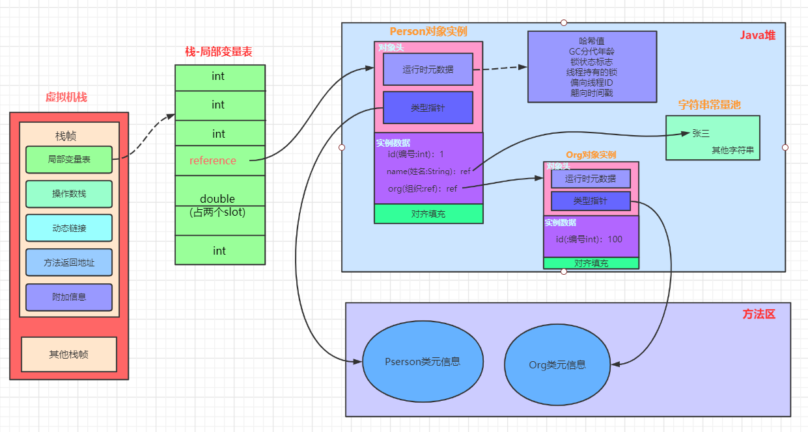

[toc]

# 对象的实例化、组成和访问定位

## 1 对象的实例化

### 1.1 对象的创建方式

1. new：最常见的方式、单例类中调用getInstance的静态类方法，XXXFactory的静态方法
2. Class的newInstance方法：在JDK9里面被标记为过时的方法，因为只能调用空参构造器
3. Constructor的newInstance(XXX)：反射的方式，可以调用空参的，或者带参的构造器
4. 使用clone()：不调用任何的构造器，要求当前的类需要实现Cloneable接口中的clone接口
5. 使用序列化：序列化一般用于Socket的网络传输
6. 第三方库 Objenesis

### 1.2 对象的创建步骤

#### 1.2.1 类加载检查

主要判断对象对应的类是否进行过加载、链接、初始化这些流程。

虚拟机遇到一条new指令，首先去检查这个指令的参数能否在Metaspace的常量池中定位到一个类的符号引用，并且检查这个符号引用代表的类是否已经被加载，解析和初始化。（即判断类元信息是否存在）。

如果没有，那么在双亲委派模式下使用当前类加载器以ClassLoader + 包名 + 类名为key进行查找对应的 .class文件，如果没有找到文件，则抛出ClassNotFoundException异常，如果找到则进行类加载并生成对应的Class对象。 

#### 1.2.2 新生对象分配内存（分配方法：指针碰撞、空闲列表）

**对象所需的内存大小在类加载完成后便完全确定**，为对象分配内存空间等同于把一块确定大小的内存从Java堆中划分出来。

新生对象的分配方法是由Java**堆内存是否规整**决定的，而Java堆是否规整由所采用的**垃圾收集器是否带有压缩整理功能**决定。

1. 如果Java堆内存是**规整**的，那么虚拟机将采用的是**指针碰撞法**（Bump The Point）来为对象分配内存 。
    所有用过的内存都放在一边，空闲的内存放在另一边，中间有一个指针作为分界点的指示器（类似车辆的油表指针），分配的内存就是把指针向空闲区域挪动一段与对象大小相等的距离（车辆加油的过程）。
2. 如果Java堆内存**不是规整**的，那么虚拟机将采用的是**空闲列表**（Free List）来为对象分配内存 。
    因为内存不是规整的已使用的内存和空闲的内存相互交错，就没法简单的进行指针碰撞了，所以虚拟机就必须维护一个列表记录哪些内存块是可用的，在内存分配的时候从列表中找到一块足够大的空间划分给对象实例，并更新列表上的记录。

#### 1.2.3 并发情况下对象内存分配

在并发情况下线程可能是线程不安全的，可能出现正在给对象A分配内存，指针还没来得及修改，对象B又同时使用了原来的指针来进行内存分配的情况。解决这种问题有两种方案：

1. 一种是对分配内存空间的动作进行**同步处理**——实际上虚拟机采用**CAS配上失败重试**的方式保证更新操作的原子性；
2. 另一种是把内存分配的动作按照线程划分在不同的空间之中进行，即每个线程在Java堆中预先分一小块内存，称为**本地线程分配缓冲**（Thread Local Allocation Buffer , TLAB）。哪个线程要分配内存，就在哪个线程的TLAB上分配，只有TLAB用完并分配新的TLAB时，才需要同步锁定。（ps:详见07-运行时数据区-4-堆中第6节TLAB）

#### 1.2.4 初始化分配到的内存

在这步主要是给对象属性赋值，包括下面的步骤

- 属性的默认初始化
- 显示初始化
- 代码块中的初始化
- 构造器初始化
- 所有属性设置默认值，保证对象实例字段在不赋值可以直接使用

内存分配完成后，虚拟机需要将分配到的内存空间都初始化为零值（不包括对象头），如果使用TLAB，这一工作过程也可以提前至TLAB分配是进行。

这一步骤保证了对象的实例字段在Java代码中可以不赋初值就直接使用，程序能访问到这些字段的数据类型所对应的零值。

#### 1.2.5 设置对象的对象头

将对象的所属类（即类的元数据信息）、对象的HashCode和对象的GC信息、锁信息等数据存储在对象的对象头中。这个过程的具体设置方式取决于JVM实现。 

#### 1.2.6 执行init方法进行初始化

在上述工作都完成后从虚拟机的视角来看，一个新的对象已经产生，但从Java程序的视角来看，对象创建才刚刚开始（因为<init>方法还没有执行，所有的字段都还为零）。

一般来说（由字节码中是否跟随invokespecial指令所决定），执行new指令之后会接着执行<init>方法，把对象按照程序员的意愿进行初始化（初始化成员变量，执行实例化代码块，调用类的构造方法，并把堆内对象的首地址赋值给引用变量），这样一个真正的对象才算完全产生。

## 2 对象的内存布局-组成

### 2.1 对象头

对象头包含了两部分，分别是 **运行时元数据**（Mark Word）和 **类型指针** 

#### 2.1.1 运行时元数据

 运行时元数据包含下面这些信息：

- 哈希值（HashCode）
- GC分代年龄
- 锁状态标志
- 线程持有的锁
- 偏向线程ID
- 翩向时间戳

#### 2.1.2 类型指针

 指向类元数据InstanceKlass，确定该对象所属的类型。指向的其实是方法区中存放的类元信息 

### 2.2 实例数据

对象真正存储的有效信息，包括程序代码中的各种类型字段（包含从父类继承下来的和本身的字段）

### 2.3 对齐填充

 对齐填充不是必须的，也没有特别的含义，仅仅起到占位符的作用 。

## 3 对象的访问定位-如何找到对象

 JVM是如何通过栈帧中的对象引用访问到其内部的对象实例呢？ 

### 3.1 直接指针（HotSpot采用）

直接指针是局部变量表中的引用，直接指向堆中的实例，在对象实例中有类型指针，指向的是方法区中的对象类型数据。

- 优点：直接简单，不需要额外空间，直接就是引用地址。
- 缺点：对象被移动(如在堆的S0和S1中移动)需要改变reference的指向。

### 3.2 句柄访问

句柄访问就是说栈的局部变量表中，记录的对象的引用，然后在堆空间中开辟了一块空间，也就是句柄池 。

- 优点： reference中存储稳定句柄地址，对象被移动（垃圾收集时移动对象很普遍）时只会改变句柄中实例数据指针即可，reference本身不需要被修改 。
- 缺点：需要额外的空间额外的维护。

## 4 面试题

- 对象在JVM中是怎么存储的？
- 对象头信息里面有哪些东西？

## ps-相关资料

[ 对象实例化内存布局与访问定位](https://gitee.com/moxi159753/LearningNotes/tree/master/JVM/1_%E5%86%85%E5%AD%98%E4%B8%8E%E5%9E%83%E5%9C%BE%E5%9B%9E%E6%94%B6%E7%AF%87/10_%E5%AF%B9%E8%B1%A1%E5%AE%9E%E4%BE%8B%E5%8C%96%E5%86%85%E5%AD%98%E5%B8%83%E5%B1%80%E4%B8%8E%E8%AE%BF%E9%97%AE%E5%AE%9A%E4%BD%8D)

