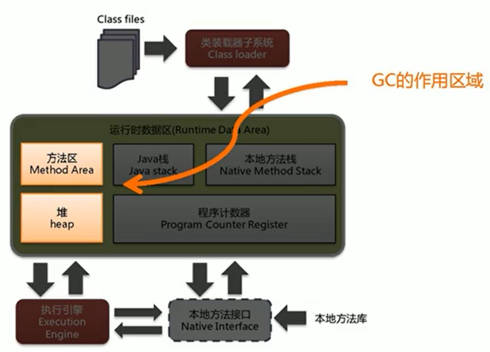

[toc]

# 垃圾回收概述

## 1 什么是垃圾

垃圾是指在运行程序中没有任何指针指向的对象，这个对象就是需要被回收的垃圾。

如果不及时对内存中的垃圾进行清理，那么这些垃圾对象所占的内存空间会一直保留到应用程序的结束，被保留的空间无法被其它对象使用，这样就会导致内存溢出。

## 2 为什么需要垃圾回收

对于高级语言来说，一个基本认知是如果不进行垃圾回收，内存迟早都会被消耗完，因为不断地分配内存空间而不进行回收，就好像不停地生产生活垃圾而从来不打扫一样。

除了释放没用的对象，垃圾回收也可以清除内存里的记录碎片。碎片整理将所占用的堆内存移到堆的一端，以便JVM将整理出的内存分配给新的对象。

随着应用程序所应付的业务越来越庞大、复杂，用户越来越多，没有GC就不能保证应用程序的正常进行。而经常造成STW的GC又跟不上实际的需求，所以才会不断地尝试对GC进行优化。

## 3 垃圾回收的优缺点

### 3.1 优点

垃圾回收会自动对内存管理，无需开发人员手动参与内存的分配与回收，这样降低内存泄漏和内存溢出的风险。

没有垃圾回收器，java也会和cpp一样，各种悬垂指针，野指针，泄露问题让你头疼不已。

自动内存管理机制，将程序员从繁重的内存管理中释放出来，可以更专心地专注于业务开发。

**总结：简化开发流程，开发人员不需要对内存进行管理，降低门槛。**

### 3.2 缺点

对于Java开发人员而言，自动内存管理就像是一个黑匣子，如果过度依赖于“自动”，那么这将会是一场灾难，最严重的就会弱化Java开发人员在程序出现内存溢出时定位问题和解决问题的能力。

此时，了解JVM的自动内存分配和内存回收原理就显得非常重要，只有在真正了解JVM是如何管理内存后，我们才能够在遇见outofMemoryError时，快速地根据错误异常日志定位问题和解决问题。

当需要排查各种内存溢出、内存泄漏问题时，当垃圾收集成为系统达到更高并发量的瓶颈时，我们就必须对这些“自动化”的技术实施必要的监控和调节。

**总结：垃圾回收让内存管理变成了黑盒子，如果出现内存的问题开发很难定位问题。**

## 4 垃圾回收的主要区域



垃圾收集器可以对年轻代回收，也可以对老年代回收，甚至是全栈和方法区的回收，Java堆是垃圾收集器的工作重点。

从次数上讲：

- 频繁收集Young区
- 较少收集Old区
- 基本不收集Perm区（元空间）

## 5 System.gc()方法

在默认情况下，通过`system.gc()`者`Runtime.getRuntime().gc()` 的调用会显式触发FullGC，同时对老年代和新生代进行回收，尝试释放被丢弃对象占用的内存。

然而`system.gc()`调用附带一个免责声明，无法保证对垃圾收集器的调用。(不能确保立即生效)

JVM实现者可以通过`system.gc()`调用来决定JVM的GC行为。而一般情况下，垃圾回收应该是自动进行的，无须手动触发，否则就太过于麻烦了。在一些特殊情况下，如我们正在编写一个性能基准，我们可以在运行之间调用`System.gc()`

```java
/**
 * 局部变量回收
 */
public class LocalVarGC {

    /**
     * 触发Minor GC没有回收对象，然后在触发Full GC将该对象存入old区
     */
    public void localvarGC1() {
        byte[] buffer = new byte[10*1024*1024];
        System.gc();
    }

    /**
     * 触发YoungGC的时候，已经被回收了
     */
    public void localvarGC2() {
        byte[] buffer = new byte[10*1024*1024];
        buffer = null;
        System.gc();
    }

    /**
     * 不会被回收，因为它还存放在局部变量表索引为1的槽中
     */
    public void localvarGC3() {
        {
            byte[] buffer = new byte[10*1024*1024];
        }
        System.gc();
    }

    /**
     * 会被回收，因为它还存放在局部变量表索引为1的槽中，但是后面定义的value把这个槽给替换了
     */
    public void localvarGC4() {
        {
            byte[] buffer = new byte[10*1024*1024];
        }
        int value = 10;
        System.gc();
    }

    /**
     * localvarGC5中的数组已经被回收
     */
    public void localvarGC5() {
        localvarGC1();
        System.gc();
    }

    public static void main(String[] args) {
        LocalVarGC localVarGC = new LocalVarGC();
        localVarGC.localvarGC3();
    }
}
```

## 6 内存溢出

内存溢出即OutOfMemoryError, javadoc中对outofMemoryError的解释是：没有空闲内存，并且垃圾收集器也无法提供更多内存。

由于GC一直在发展，所有一般情况下，除非应用程序占用的内存增长速度非常快，造成垃圾回收已经跟不上内存消耗的速度，否则不太容易出现OOM的情况。
大多数情况下，GC会进行各种年龄段的垃圾回收，实在不行就来一次独占式的FullGC操作，这时候会回收大量的内存，供应用程序继续使用。

没有空闲内存的原因：

1. Java虚拟机的堆内存设置不够。
    比如：可能存在内存泄漏问题；也很有可能就是堆的大小不合理，比如我们要处理比较可观的数据量，但是没有显式指定JVM堆大小或者指定数值偏小。我们可以通过参数-Xms 、-Xmx来调整。
2. 代码中创建了大量大对象，并且长时间不能被垃圾收集器收集（存在被引用）。

对于老版本的oracle JDK，因为永久代的大小是有限的，并且JVM对永久代垃圾回收（如，常量池回收、卸载不再需要的类型）非常不积极，所以当我们不断添加新类型的时候，永久代出现OutOfMemoryError也非常多见，尤其是在运行时存在大量动态类型生成的场合；类似intern字符串缓存占用太多空间，也会导致OOM问题。对应的异常信息，会标记出来和永久代相关：“java.lang.OutOfMemoryError:PermGen space"。

随着元数据区的引入，方法区内存已经不再那么窘迫，所以相应的ooM有所改观，出现ooM，异常信息则变成了：“java.lang.OutofMemoryError:Metaspace"。
直接内存不足，也会导致OOM。

这里面隐含着一层意思是，在抛出OutofMemoryError之前，通常垃圾收集器会被触发，尽其所能去清理出空间。

> 例如：在引用机制分析中，涉及到JVM会去尝试回收软引用指向的对象等。 在java.nio.BIts.reserveMemory（）方法中，我们能清楚的看到，System.gc（）会被调用，以清理空间。

当然，也不是在任何情况下垃圾收集器都会被触发的，比如我们去分配一个超大对象，类似一个超大数组超过堆的最大值，JVM可以判断出垃圾收集并不能解决这个问题，所以直接抛出OutofMemoryError。

## 7 内存泄漏


## xx-面试题

####  蚂蚁金服

- 你知道哪几种垃圾回收器，各自的优缺点，重点讲一下cms和G1？
- JVM GC算法有哪些，目前的JDK版本采用什么回收算法？
- G1回收器讲下回收过程GC是什么？为什么要有GC？
- GC的两种判定方法？CMS收集器与G1收集器的特点

#### 百度

- 说一下GC算法，分代回收说下
- 垃圾收集策略和算法

#### 天猫

- JVM GC原理，JVM怎么回收内存
- CMS特点，垃圾回收算法有哪些？各自的优缺点，他们共同的缺点是什么？

#### 滴滴

Java的垃圾回收器都有哪些，说下g1的应用场景，平时你是如何搭配使用垃圾回收器的

#### 京东

- 你知道哪几种垃圾收集器，各自的优缺点，重点讲下cms和G1，
- 包括原理，流程，优缺点。垃圾回收算法的实现原理

#### 阿里

- 讲一讲垃圾回收算法。
- 什么情况下触发垃圾回收？
- 如何选择合适的垃圾收集算法？
- JVM有哪三种垃圾回收器？

#### 字节跳动

- 常见的垃圾回收器算法有哪些，各有什么优劣？
- System.gc（）和Runtime.gc（）会做什么事情？
- Java GC机制？GC Roots有哪些？
- Java对象的回收方式，回收算法。
- CMS和G1了解么，CMS解决什么问题，说一下回收的过程。
- CMS回收停顿了几次，为什么要停顿两次?

## ps-相关资料

[垃圾回收概述](https://gitee.com/moxi159753/LearningNotes/tree/master/JVM/1_%E5%86%85%E5%AD%98%E4%B8%8E%E5%9E%83%E5%9C%BE%E5%9B%9E%E6%94%B6%E7%AF%87/14_%E5%9E%83%E5%9C%BE%E5%9B%9E%E6%94%B6%E6%A6%82%E8%BF%B0)

[垃圾回收概念](https://gitee.com/moxi159753/LearningNotes/tree/master/JVM/1_%E5%86%85%E5%AD%98%E4%B8%8E%E5%9E%83%E5%9C%BE%E5%9B%9E%E6%94%B6%E7%AF%87/16_%E5%9E%83%E5%9C%BE%E5%9B%9E%E6%94%B6%E7%9B%B8%E5%85%B3%E6%A6%82%E5%BF%B5)