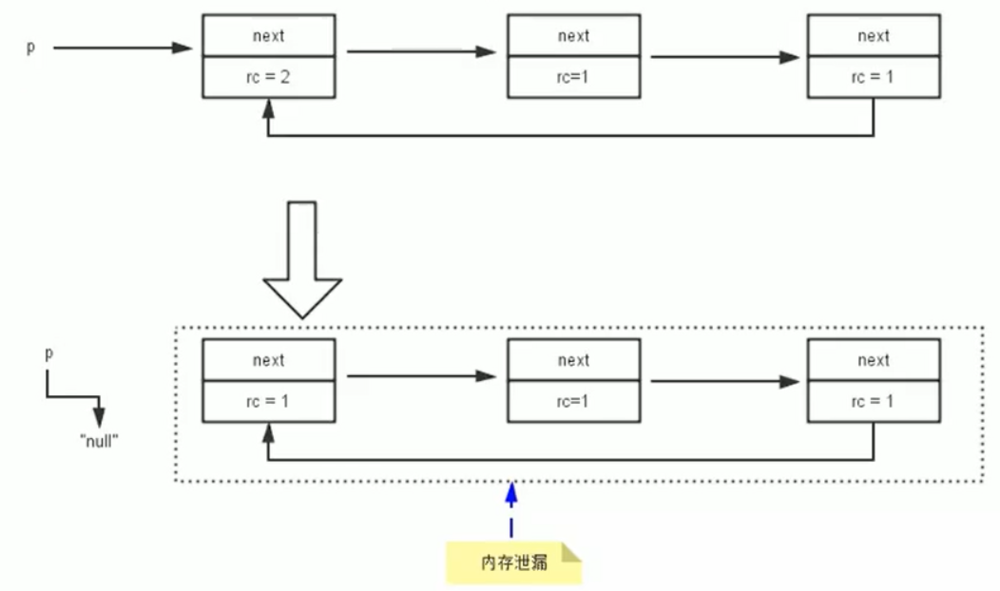
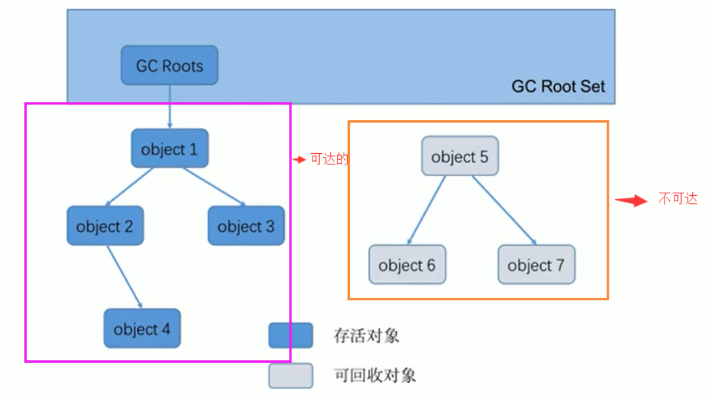
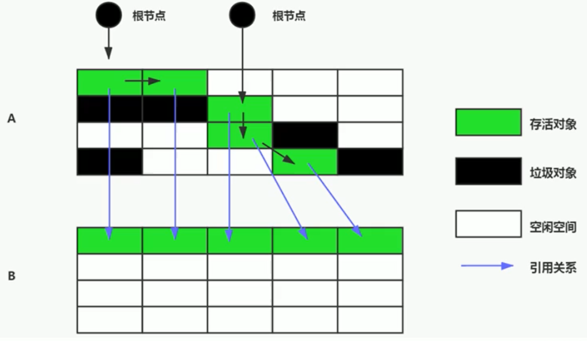
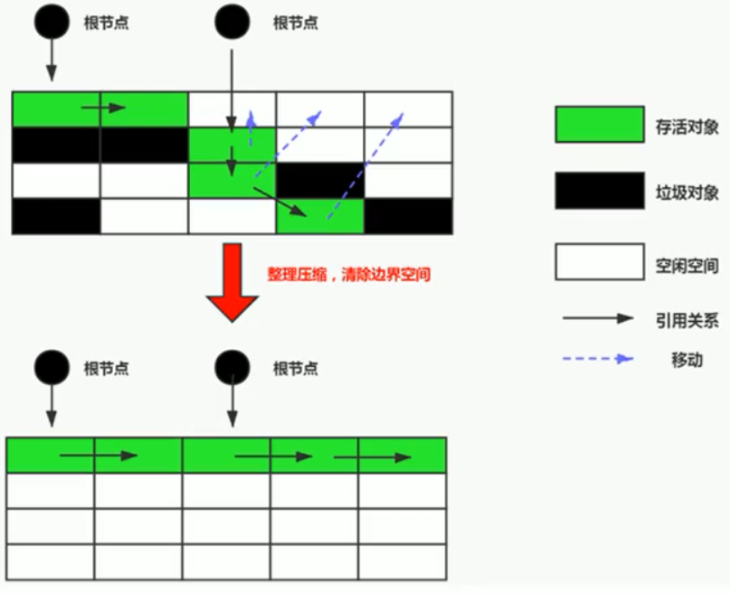
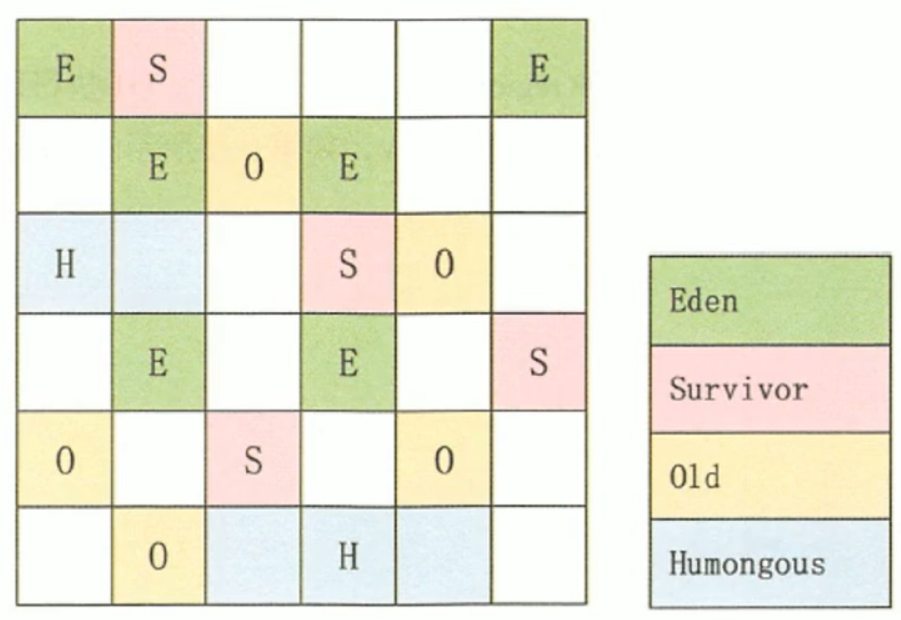

[toc]

# 垃圾回收算法

## 1 标记阶段

在堆里存放着几乎所有的Java对象实例，在GC执行垃圾回收之前，首先需要区分出内存中哪些是存活对象，哪些是已经死亡的对象。只有被标记为己经死亡的对象，GC才会在执行垃圾回收时，释放掉其所占用的内存空间，因此这个过程我们可以称为**垃圾标记阶段**。 

 判断对象存活一般有两种方式：**引用计数算法**和**可达性分析算法。** 

### 1.1 引用计数法（Java未使用该算法）

#### 1.1.1 概念

引用计数算法（Reference Counting）：对每个对象保存一个整型的**引用计数器属性**，用于记录对象被引用的情况。 

对于一个对象A，只要有任何一个对象引用了A，则A的引用计数器就加1；当引用失效时，引用计数器就减1。只要对象A的引用计数器的值为0，即表示对象A不可能再被使用，可进行回收。 

#### 1.1.2 优缺点

- 优点
    1.  实现简单，垃圾对象便于辨识；
    2.  判定效率高，回收没有延迟性。 
- 缺点
    1.  它需要单独的字段存储计数器，这样的做法增加了存储空间的开销；
    2.  每次赋值都需要更新计数器，伴随着加法和减法操作，这增加了时间开销。；
    3.  **无法处理循环引用**的情况 , 这是一条致命缺陷，导致在Java的垃圾回收器中没有使用这类算法。 
        循环引用举例：
        当p的指针断开的时候，内部的引用形成一个循环，这就是循环引用，从而造成内存泄漏 
        

#### 1.1.3 Python中的引用计数算法

引用计数算法，是很多语言的资源回收选择，例如因人工智能而更加火热的Python，它更是同时支持引用计数和垃圾收集机制。 

python中如何解决循环引用这个问题：

1.  手动解除：很好理解，就是在合适的时机，解除引用关系。  
2.  使用弱引用weakref，weakref是Python提供的标准库，旨在解决循环引用。 

### 1.2 可达性分析算法（根搜索算法、追踪性垃圾收集）

#### 1.2.1 概念

可达性分析算法：也可以称为 根搜索算法、追踪性垃圾收集。

**基本思路**：通过一系列称为“**GC Roots**”的对象作为起始点，从这些节点开始向下搜索，搜索走过的路径称为**引用链**（Reference Chain），当一个对象到GC Roots没有任何引用链相连（**用图论的话来说就是从GC Roots到这个对象不可达**）时，则证明此对象引用不可用，此时就会被判定为可回收对象。

相对于引用计数算法而言，可达性分析算法可以有效地解决循环引用的问题，防止内存泄漏的发生。



#### 1.2.2 GC Roots包括哪些

1. 虚拟机栈中引用的对象
    - 比如：各个线程被调用的方法中使用到的参数、局部变量等。
2. 本地方法栈内JNI（通常说的本地方法）引用的对象方法区中类静态属性引用的对象
    - 比如：Java类的引用类型静态变量
3. 方法区中静态属性引用的对象
4. 所有被同步锁synchronized持有的对象
5. Java虚拟机内部的引用。
    - 基本数据类型对应的Class对象，一些常驻的异常对象（如：NullPointException、OutOfMemoryError），系统类加载器。
6. 反映java虚拟机内部情况的JMXBean、JVMTI中注册的回调、本地代码缓存等

## 2 对象的finalization机制

即使在可达性分析算法中不可达的对象，也并非是非死不可的，要真正宣告一个对象死亡，至少要经历**两次标记**过程：**如果对象在进行可达性分析后发现没有GC Roots相链接的引用链，那它将会被第一次标记并且进行一次筛选，筛选的条件是此对象是否有必要执行finalize()方法**。当对象没有覆盖finalize()方法，或者finalize()方法已经被虚拟机调用过，虚拟机将这两种情况视为没有必要执行操作。

如果这个对象被判定为有必要执行finalize()方法，那么这个对象将会放置在一个叫做F-Queue的队列之中，并在稍后由一个虚拟机自动建立的、低优先级的Finalizer线程去执行它。finalize()方法是对象逃脱死亡命运的最后一次机会，稍后GC将对F-Queue中的对象进行第二次小规模的标记，如果对象要在finalize()方法中成功解救自己，只需要重新与引用链上的任何一个对象建立关联即可，这样在第二次标记时它将被溢出“即将收回”的集合；如果对象这个时候还没有逃脱，那基本上它就真的被回收了。

**任何一个对象的finalize()方法都只会被系统自动调用一次**，如果执行了一次，那么下一次对象面临回收时，它的finalize()方法将不会执行。finalize()方法并不被提倡使用，它的运行代价很高，不确定大，无法保证各个对象的调用顺序。

永远不要主动调用某个对象的finalize（）方法I应该交给垃圾回收机制调用。理由包括下面三点：

- 在finalize（）时可能会导致对象复活。
- finalize（）方法的执行时间是没有保障的，它完全由Gc线程决定，极端情况下，若不发生GC，则finalize（）方法将没有执行机会。
    - 因为优先级比较低，即使主动调用该方法，也不会因此就直接进行回收
- 一个糟糕的finalize（）会严重影响Gc的性能。

从功能上来说，finalize（）方法与c++中的析构函数比较相似，但是Java采用的是基于垃圾回收器的自动内存管理机制，所以finalize（）方法在本质上不同于C++中的析构函数。

由于finalize（）方法的存在，虚拟机中的对象一般处于三种可能的状态：

1. 可触及的：从根节点开始，可以到达这个对象。
2. 可复活的：对象的所有引用都被释放，但是对象有可能在finalize（）中复活。
3. 不可触及的：对象的finalize（）被调用，并且没有复活，那么就会进入不可触及状态。不可触及的对象不可能被复活，因为**finalize()只会被调用一次**。

```java
/**
 * 测试Object类中finalize()方法
 * 对象复活场景
 */
public class CanReliveObj {
    // 类变量，属于GC Roots的一部分
    public static CanReliveObj canReliveObj;

    @Override
    protected void finalize() throws Throwable {
        super.finalize();
        System.out.println("调用当前类重写的finalize()方法");
        canReliveObj = this;
    }

    public static void main(String[] args) throws InterruptedException {
        canReliveObj = new CanReliveObj();
        canReliveObj = null;
        System.gc();
        System.out.println("-----------------第一次gc操作------------");
        // 因为Finalizer线程的优先级比较低，暂停2秒，以等待它
        Thread.sleep(2000);
        if (canReliveObj == null) {
            System.out.println("obj is dead");
        } else {
            System.out.println("obj is still alive");
        }

        System.out.println("-----------------第二次gc操作------------");
        canReliveObj = null;
        System.gc();
        // 下面代码和上面代码是一样的，但是 canReliveObj却自救失败了
        Thread.sleep(2000);
        if (canReliveObj == null) {
            System.out.println("obj is dead");
        } else {
            System.out.println("obj is still alive");
        }

    }
}
```

## 3 清除阶段

当成功区分出内存中存活对象和死亡对象后，GC接下来的任务就是执行垃圾回收，释放掉无用对象所占用的内存空间，以便有足够的可用内存空间为新对象分配内存。目前在JVM中比较常见的三种垃圾收集算法是

- 标记-清除算法（Mark-Sweep）
- 复制算法（copying）
- 标记-压缩算法（Mark-Compact）

### 3.1 标记-清除算法（Mark-Sweep）

算法分为两个阶段，**标记**和**清除**，首先标记出所有需要回收的对象，在标记完成后统一收回所有被标记的对象。

该算法主要有连个**不足**：第一就是标记和清除的效率都不高；第二就是空间问题，标记清除之后会**产生大量不连续的内存碎片**，空间碎片太多可能会导致以后在程序运行过程中需要分配较大对象时，无法找到足够的连续内存而不得不提前触发另一次垃圾收集动作。


#### 3.1.1 简介

标记-清除算法（Mark-Sweep）是一种非常基础和常见的垃圾收集算法，该算法被J.McCarthy等人在1960年提出并并应用于Lisp语言。 

#### 3.1.2 执行过程

当堆中的有效内存空间（available memory）被耗尽的时候，就会停止整个程序（也被称为stop the world），然后进行两项工作，第一项则是标记，第二项则是清除 

1. **标记**：Collector从引用根节点开始遍历，标记所有被引用的对象（**标记的是引用的对象，不是垃圾！！！**），一般是在对象的Header中记录是否为可达对象。
2. **清除**：Collector对堆内存从头到尾进行线性的遍历，如果发现某个对象在其Header中没有标记为可达对象，则将其回收。

#### 3.1.3 什么是清除

这里所谓的清除并不是真的置空，而是把需要清除的对象地址保存在空闲的地址列表里。下次有新对象需要加载时，判断垃圾的位置空间是否足够，如果足够就存放覆盖原有的地址。 

空闲列表详见：09-对象的实例化、组成和访问定位-1.2.2

- 如果内存规整
    - 采用指针碰撞的方式进行内存分配
- 如果内存不规整
    - 虚拟机需要维护一个列表
    - 空闲列表分配

#### 3.1.4 优缺点

- 优点
    1. 实现简单，易于理解
- 缺点
    1.  标记清除算法的效率不算高(需要多次遍历所有对象)
    2.  在进行GC的时候，需要STW，用户体验较差
    3.  这种方式清理出来的空闲内存是不连续的，产生内碎片，需要维护一个空闲列表 

### 3.2 复制算法（copying）

#### 3.2.1 简介

为了解决效率问题，复制算法就出现了，它将可用的内存按容量划分为大小先等的两块，每次只使用其中的一块。当着一块的内存用完了，就将还存活的对象复制到另外一块上面去，然后再把已经使用过的内存空间一次清理掉。这样使得每次都是针对整个半区进行内存回收，就不用考虑内存碎片等复杂情况。



把可达的对象，直接复制到另外一个区域中复制完成后，A区就没有用了，里面的对象可以直接清除掉，其实里面的新生代里面就用到了复制算法 ：

[image-20201222130214564](picture/image-20201222130214564.png)


#### 3.2.2 适用场景

复制算法**最终复制的是存活下来的对象**，所以如果存活的对象很多那么需要复制的对象也会很多，负担就很大；在年轻代大部分对象都是朝生夕死的，存活的对象很少，这样就很适合复制算法。（相反老年代对象一般都是要活很久的所以不适合复制算法）

#### 3.2.3 优缺点

- 优点：
    1. 没有标记和清除过程，实现简单，运行高效
    2. 复制过去以后保证空间的连续性，不会出现“碎片”问题。
-  缺点:
    1.  需要两倍的内存空间。 
    2.  对于G1这种分拆成为大量region的GC，复制而不是移动，意味着GC需要维护region之间对象引用关系，不管是内存占用或者时间开销也不小 

### 3.3 标记-整理算法（Mark-Compact）

#### 3.3.1 简介

复制算法的高效性是建立在存活对象少、垃圾对象多的前提下的。这种情况在新生代经常发生，但是在**老年代**，更常见的情况是大部分对象都是存活对象。如果依然使用复制算法，由于存活对象较多，复制的成本也将很高。因此，基于老年代垃圾回收的特性，需要使用其他的算法。 

标记一清除算法的确可以应用在老年代中，但是该算法不仅执行效率低下，而且在执行完内存回收后还会产生内存碎片，所以JvM的设计者需要在此基础之上进行改进。标记-压缩（Mark-Compact）算法由此诞生。

1970年前后，G.L.Steele、C.J.Chene和D.s.Wise等研究者发布标记-压缩算法。在许多现代的垃圾收集器中，人们都使用了标记-压缩算法或其改进版本。

#### 3.3.2 执行过程

第一阶段和标记清除算法一样，从根节点开始标记所有被引用对象

第二阶段将所有的存活对象压缩到内存的一端，按顺序排放。之后，清理边界外所有的空间。



#### 3.3.3 标清和标整的区别

标记-压缩算法的最终效果等同于标记-清除算法执行完成后，再进行一次内存碎片整理，因此，也可以把它称为标记-清除-压缩（Mark-Sweep-Compact）算法。

二者的本质差异在于标记-清除算法是一种非移动式的回收算法，标记-压缩是移动式的。是否移动回收后的存活对象是一项优缺点并存的风险决策。可以看到，标记的存活对象将会被整理，按照内存地址依次排列，而未被标记的内存会被清理掉。如此一来，当我们需要给新对象分配内存时，JVM只需要持有一个内存的起始地址即可，这比维护一个空闲列表显然少了许多开销。

#### 3.3.4 优缺点

- 优点
    1. 消除了标记-清除算法当中，内存区域分散的缺点，我们需要给新对象分配内存时，JVM只需要持有一个内存的起始地址即可。
    2. 消除了复制算法当中，内存减半的高额代价。
- 缺点
    1. 从效率上来说，标记-整理算法要低于复制算法，当然也低于标记清除算法。
    2. 移动对象的同时，如果对象被其他对象引用，则还需要调整引用的地址
    3. 移动过程中，需要全程暂停用户应用程序。即：STW

### 3.4 三种算法总结

效率上来说，复制算法是当之无愧的老大，但是却浪费了太多内存。

而为了尽量兼顾上面提到的三个指标，标记-整理算法相对来说更平滑一些，但是效率上不尽如人意，它比复制算法多了一个标记的阶段，比标记-清除多了一个整理内存的阶段。

|              | 标记清除           | 标记整理         | 复制                                  |
| ------------ | ------------------ | ---------------- | ------------------------------------- |
| **速率**     | 中等               | 最慢             | 最快                                  |
| **空间开销** | 少（但会堆积碎片） | 少（不堆积碎片） | 通常需要活对象的2倍空间（不堆积碎片） |
| **移动对象** | 否                 | 是               | 是                                    |

综合来说，没有最好的算法，只有最合适的算法。

## 4 分代收集算法

前面所有这些算法中，并没有一种算法可以完全替代其他算法，它们都具有自己独特的优势和特点。分代收集算法应运而生。

分代收集算法，是基于这样一个事实：**不同的对象的生命周期是不一样的，因此不同生命周期的对象可以采取不同的收集方式，以便提高回收效率**。一般是把Java堆分为新生代和老年代，这样就可以根据各个年代的特点使用不同的回收算法，以提高垃圾回收的效率。

在Java程序运行的过程中，会产生大量的对象，其中有些对象是与业务信息相关，比如Http请求中的Session对象、线程、Socket连接，这类对象跟业务直接挂钩，因此生命周期比较长。但是还有一些对象，主要是程序运行过程中生成的临时变量，这些对象生命周期会比较短，比如：string对象，由于其不变类的特性，系统会产生大量的这些对象，有些对象甚至只用一次即可回收。

目前几乎所有的GC都采用分代手机算法执行垃圾回收的。

在HotSpot中，基于分代的概念，GC所使用的内存回收算法必须结合年轻代和老年代各自的特点。

- 年轻代（Young Gen）
    - 年轻代特点：区域相对老年代较小，对象生命周期短、存活率低，回收频繁。
    - 这种情况复制算法的回收整理，速度是最快的。复制算法的效率只和当前存活对象大小有关，因此很适用于年轻代的回收。而复制算法内存利用率不高的问题，通过hotspot中的两个survivor的设计得到缓解。
- 老年代（Tenured Gen）
    - 老年代特点：区域较大，对象生命周期长、存活率高，回收不及年轻代频繁。
    - 这种情况存在大量存活率高的对象，复制算法明显变得不合适。一般是由标记-清除或者是标记-清除与标记-整理的混合实现。

关于开销：

- Mark阶段的开销与存活对象的数量成正比。
- Sweep阶段的开销与所管理区域的大小成正相关。
- compact阶段的开销与存活对象的数据成正比。

以HotSpot中的CMS回收器为例，CMS是基于Mark-Sweep实现的，对于对象的回收效率很高。而对于碎片问题，CMS采用基于Mark-Compact算法的Serial old回收器作为补偿措施：当内存回收不佳（碎片导致的Concurrent Mode Failure时），将采用serial old执行FullGC以达到对老年代内存的整理。

## 5 其他相关算法

### 5.1 增量收集算法

上述现有的算法，在垃圾回收过程中，应用软件将处于一种stop the World的状态。在stop the World状态下，应用程序所有的线程都会挂起，暂停一切正常的工作，等待垃圾回收的完成。如果垃圾回收时间过长，应用程序会被挂起很久，将严重影响用户体验或者系统的稳定性。为了解决这个问题，即对实时垃圾收集算法的研究直接导致了增量收集（Incremental Collecting）算法的诞生。

如果一次性将所有的垃圾进行处理，需要造成系统长时间的停顿，那么就可以让垃圾收集线程和应用程序线程交替执行。每次，垃圾收集线程只收集一小片区域的内存空间，接着切换到应用程序线程。依次反复，直到垃圾收集完成。

总的来说，增量收集算法的基础仍是传统的标记-清除和复制算法。**增量收集算法通过对线程间冲突的妥善处理**，允许垃圾收集线程以分阶段的方式完成标记、清理或复制工作

缺点：

使用这种方式，由于在垃圾回收过程中，间断性地还执行了应用程序代码，所以能减少系统的停顿时间。但是，因为线程切换和上下文转换的消耗，会使得垃圾回收的总体成本上升，造成系统吞吐量的下降。 

### 5.2 分区算法

一般来说，在相同条件下，堆空间越大，一次Gc时所需要的时间就越长，有关GC产生的停顿也越长。为了更好地控制GC产生的停顿时间，将一块大的内存区域分割成多个小块，根据目标的停顿时间，每次合理地回收若干个小区间，而不是整个堆空间，从而减少一次GC所产生的停顿。

分代算法将按照对象的生命周期长短划分成两个部分，分区算法将整个堆空间划分成连续的不同小区间。 每一个小区间都独立使用，独立回收。这种算法的好处是可以控制一次回收多少个小区间。



## ps-相关资料

[垃圾回收算法](https://gitee.com/moxi159753/LearningNotes/tree/master/JVM/1_%E5%86%85%E5%AD%98%E4%B8%8E%E5%9E%83%E5%9C%BE%E5%9B%9E%E6%94%B6%E7%AF%87/15_%E5%9E%83%E5%9C%BE%E5%9B%9E%E6%94%B6%E7%9B%B8%E5%85%B3%E7%AE%97%E6%B3%95)