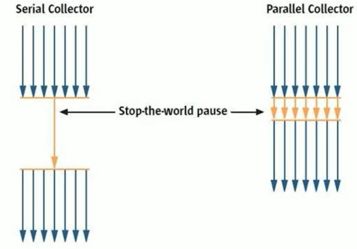
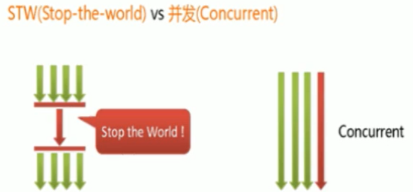
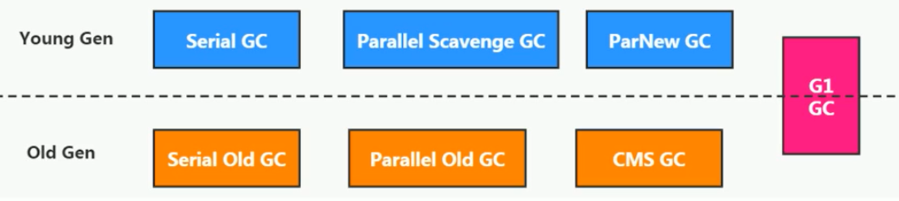
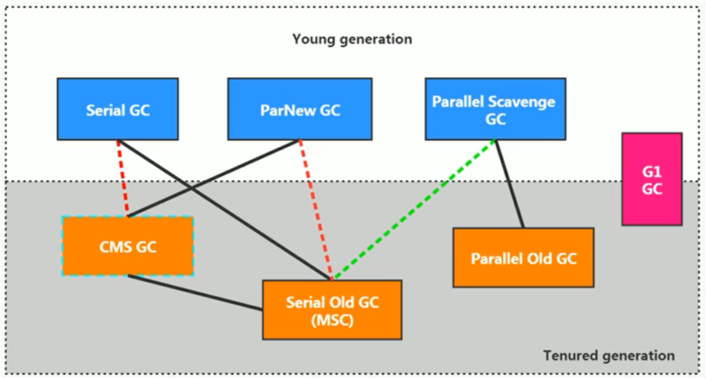
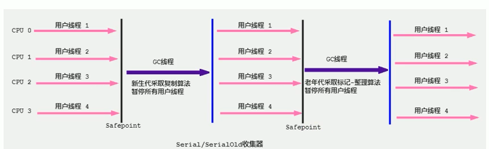
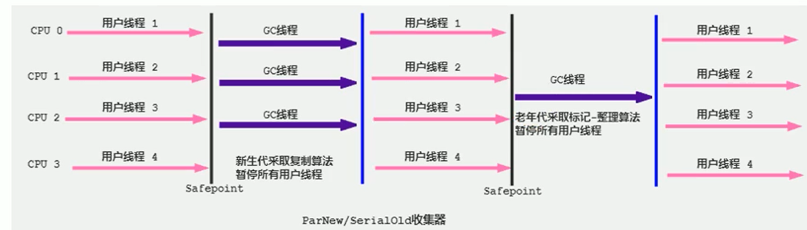
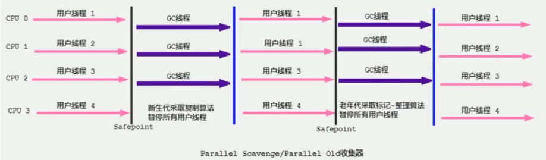

[toc]

# 垃圾回收器

## 1 垃圾回收器概述

GC垃圾收集器是和JVM一脉相承的，它是和JVM进行搭配使用，在不同的使用场景对应的收集器也是有区别。

为什么要有很多收集器，一个不够吗？因为Java的使用场景很多，移动端，服务器等。所以就需要针对不同的场景，提供不同的垃圾收集器，提高垃圾收集的性能。

虽然我们会对各个收集器进行比较，但并非为了挑选一个最好的收集器出来。没有一种放之四海皆准、任何场景下都适用的完美收集器存在，更加没有万能的收集器。所以我们选择的只是对具体应用最合适的收集器。

## 2 垃圾回收器分类

### 2.1 按线程数分

**按线程数分**（垃圾回收线程数）可以分为串行垃圾回收器和并行垃圾回收器。 

串行回收指的是在同一时间段内只允许有一个CPU用于执行垃圾回收操作，此时工作线程被暂停，直至垃圾收集工作结束。

- 在诸如**单CPU处理器**或者较小的应用内存等硬件平台不是特别优越的场合，串行回收器的性能表现可以超过并行回收器和并发回收器。所以，串行回收默认被应用在客户端的Client模式下的JVM中
- 在并发能力比较强的CPU上，并行回收器产生的停顿时间要短于串行回收器。

和串行回收相反，并行收集可以运用多个CPU同时执行垃圾回收，因此提升了应用的吞吐量，不过并行回收仍然与串行回收一样，采用独占式，使用了“stop-the-world”机制。

### 2.2 按工作模式分

按照工作模式分可以分为并发式垃圾回收器和独占式垃圾回收器。

- 并发式垃圾回收器与应用程序线程交替工作，以尽可能减少应用程序的停顿时间。
- 独占式垃圾回收器（Stop the world）一旦运行，就停止应用程序中的所有用户线程，直到垃圾回收过程完全结束。

### 2.3 按碎片处理方式分

按碎片处理方式分可分为压缩武垃圾回收器和非压缩式垃圾回收器。

- 压缩式垃圾回收器会在回收完成后，对存活对象进行压缩整理，消除回收后的碎片。
- 非压缩式的垃圾回收器不进行这步操作。

按工作的内存区间分，又可分为年轻代垃圾回收器和老年代垃圾回收器。

## 3 垃圾回收器的衡量指标

为了衡量垃圾回收器的好坏，即垃圾回收器的快慢、效率的高低等，衡量指标主要有下面几个：

- **吞吐量**：运行用户代码的时间占总运行时间的比例（总运行时间 = 程序的运行时间 + 内存回收的时间）
    - 吞吐量=运行用户代码时间 /（运行用户代码时间+垃圾收集时间） ，比如虚拟机总共运行了100分钟，其中垃圾收集花掉1分钟，那吞吐量就是99%。 
- **垃圾收集开销**：吞吐量的补数，垃圾收集所用时间与总运行时间的比例。
- **暂停时间**：执行垃圾收集时，程序的工作线程被暂停的时间。
- **收集频率**：相对于应用程序的执行，收集操作发生的频率。
- **内存占用**：Java堆区所占的内存大小。
- **快速**：一个对象从诞生到被回收所经历的时间。

吞吐量、暂停时间、内存占用 这三者共同构成一个“不可能三角”。

三者总体的表现会随着技术进步而越来越好，一款优秀的收集器通常最多同时满足其中的两项。 
这三项里，暂停时间的重要性日益凸显。因为随着硬件发展，内存占用多些越来越能容忍，硬件性能的提升也有助于降低收集器运行时对应用程序的影响，即提高了吞吐量。而内存的扩大，对延迟反而带来负面效果。 

## 3 常见的垃圾回收器以及分类

### 3.1 垃圾回收器按串并行分

- 串行回收器：Serial、Serial old
- 并行回收器：ParNew、Parallel Scavenge、Parallel old
- 并发回收器：CMS、G1

### 3.2 垃圾回收器与垃圾分代的关系(重点)

新生代收集器：Serial、ParNew、Parallel Scavenge；

老年代收集器：Serial old、Parallel old、CMS；

整堆收集器：G1

### 3.3 垃圾回收器的组合关系(重点)

图中，虚线上面的为年轻代的垃圾收集器，下面的是老年代的垃圾收集器，G1比较特殊两个都可以：

- 两个收集器间有连线，表明它们可以搭配使用：Serial/Serial old、Serial/CMS、ParNew/Serial old、ParNew/CMS、Parallel Scavenge/Serial Old、Parallel Scavenge/Parallel old、G1；
- 其中Serial old作为CMS出现"Concurrent Mode Failure"失败的后备预案。
- （红色虚线）由于维护和兼容性测试的成本，在JDK 8时将Serial+CMS、ParNew+Serial old这两个组合声明为废弃（JEP173），并在JDK9中完全取消了这些组合的支持（JEP214）即：移除。
- （绿色虚线）JDK14中：弃用Paralle1 Scavenge和Serialold GC组合（JEP366）
- （青色虚线）JDK14中：删除CMS垃圾回收器（JEP363）

## 4 垃圾回收器

### 4.1 Serial回收器

#### 4.1.1 Serial回收器-串行回收-年轻代

Serial收集器是最基本、历史最悠久的垃圾收集器，是JDK1.3之前回收新生代唯一的选择。

Serial收集器作为HotSpot中client模式下的默认**新生代垃圾收集器**，采用**复制算法**、串行回收和"stop-the-World"机制的方式执行内存回收。

#### 4.1.2 Serial old回收器-串行回收-老年代-标记压缩算法

除了年轻代之外，Serial收集器还提供用于执行**老年代垃圾收集**的**Serial old收集器**。
Serial old收集器同样也采用了串行回收和"Stop the World"机制，只不过内存回收算法使用的是**标记-压缩算法**。

- Serial old是运行在Client模式下默认的老年代的垃圾回收器
- Serial old在Server模式下主要有两个用途：
    1. 与新生代的Parallel scavenge配合使用
    2. 作为老年代CMS收集器的后备垃圾收集方案

#### 4.1.3 总结&优缺点

这个收集器是一个**单线程的收集器**，但它的“单线程”的意义并不仅仅说明它只会使用一个CPU或一条收集线程去完成垃圾收集工作，更重要的是在它进行垃圾收集时，必须暂停其他所有的工作线程，直到它收集结束（Stop The World）

- 优点：
    1. 简单而高效（与其他收集器的单线程比），对于限定单个cPU的环境来说，Serial收集器由于没有线程交互的开销，专心做垃圾收集自然可以获得最高的单线程收集效率。运行在client模式下的虚拟机是个不错的选择。
        在用户的桌面应用场景中，可用内存一般不大（几十MB至一两百MB），可以在较短时间内完成垃圾收集（几十ms至一百多ms），只要不频繁发生，使用串行回收器是可以接受的。
- 缺点：
    1. 串行执行，而且限定单核cpu才可以用，现在基本都不是单核的了
    2. 对于交互较强的应用而言，这种垃圾收集器是不能接受的。
        如一般在Java web应用程序中是不会采用串行垃圾收集器的。

在HotSpot虚拟机中，使用`-XX：+UseSerialGC`参数可以指定年轻代和老年代都使用串行收集器。(等价于新生代用Serial GC，且老年代用Serial old GC)

### 4.2 ParNew回收器-并行回收-年轻代-复制算法

如果说serialGC是年轻代中的单线程垃圾收集器，那么ParNew收集器则是serial收集器的多线程版本。

- Par是Parallel的缩写，New：只能处理的是新生代

ParNew 收集器除了采用**并行回收**的方式执行内存回收外，在其他方面两款垃圾收集器之间几乎没有任何区别。
ParNew收集器在年轻代中同样也是采用**复制算法**、"stop-the-World"机制。

ParNew 是很多JVM运行在Server模式下新生代的默认垃圾收集器。

- 对于新生代，回收次数频繁，使用并行方式高效。
- 对于老年代，回收次数少，使用串行方式节省资源。（CPU并行需要切换线程，串行可以省去切换线程的资源）

由于ParNew收集器是基于并行回收，那么是否可以断定ParNew收集器的回收效率在任何场景下都会比serial收集器更高效？

- ParNew收集器运行在**多个CPU的环境下**，由于可以充分使用多CPU、多核心等物理硬件资源，可以更快的完成垃圾收集，提高程序的吞吐量。
- 但是在**单个CPU的环境下**，ParNew收集器不比Serial收集器更高效（因为Serial不需要频繁的任务切换，省却了一些额外开销）

因为除Serial外，目前只有ParNew GC能与CMS收集器配合工作

在程序中开发人员可以通过选项"-XX：+UseParNewGC"手动指定使用ParNew收集器执行内存回收任务。它表示年轻代使用并行收集器，不影响老年代。

-XX:ParallelGCThreads限制线程数量，默认开启和CPU数据相同的线程数。

### 4.3 Parallel回收器-JDK8中默认

#### 4.3.1 Parallel Scavenge回收器-吞吐量优先-并行回收-年轻代-复制算法

HotSpot的年轻代中除了拥有ParNew收集器是基于并行回收的以外，`Parallel Scavenge收集器`同样也采用了**复制算法**、并行回收和"Stop the World"机制。

那么Parallel 收集器的出现是否多此一举？

- 和ParNew收集器不同，Parallel Scavenge收集器的目标则是达到一个**可控制的吞吐量**（Throughput），它也被称为吞吐量优先的垃圾收集器。
- 自适应调节策略也是Parallel Scavenge与ParNew一个重要区别。

应用场景：
高吞吐量则可以高效率地利用CPU时间，尽快完成程序的运算任务，主要适合在后台运算而不需要太多交互的任务。
因此，常见在服务器环境中使用。例如那些执行批量处理、订单处理、工资支付、科学计算的应用程序。

#### 4.3.2 Parallel old回收器-并行回收-老年代-标记压缩算法

Parallel收集器在JDK1.6时提供了用于执行老年代垃圾收集的Parallel old收集器，用来代替老年代的serial old收集器。

Parallel old收集器采用了**标记-压缩**算法，但同样也是基于**并行回收**和"Stop-the-World"机制。

#### 4.3.3 总结&优缺点

- 优点
    1. 在程序吞吐量优先的应用场景中，Parallel收集器和Parallel old收集器的组合，在server模式下的内存回收性能很不错。在Java8中，默认是此垃圾收集器。
    2. 可以控制吞吐量；
    3. 拥有自适应调节策略

#### 4.3.4 参数配置

- `-XX：+UseParallelGC` 手动指定年轻代使用Parallel并行收集器执行内存回收任务。（与ParalleloldGc互相激活，作用于新生代，默认jdk8是开启的）
- `-XX：+UseParalleloldGc` 手动指定老年代都是使用并行回收收集器。（与ParallelGC互相激活，作用于老年代，默认jdk8是开启的）
- `-XX:ParallelGcthreads`设置年轻代并行收集器的线程数。最好与CPU数量相等，以避免过多的线程数影响垃圾收集性能。
    - 当CPU数量大于8个，ParallelGCThreads的值等于3+[5*CPU Count]/8]
- `-XX:MaxGCPauseMillis` 设置垃圾收集器最大停顿时间（即STW的时间）,单位是毫秒。
    - 为了尽可能地把停顿时间控制在MaxGCPauseMills以内，收集器在工作时会调整Java堆大小或者其他一些参数。 对于用户来讲，停顿时间越短体验越好。但是在服务器端，我们注重高并发，整体的吞吐量。所以服务器端适合Parallel，进行控制。该参数使用需谨慎。
- `-XX:GCTimeRatio`垃圾收集时间占总时间的比例（=1/（N+1））。用于衡量吞吐量的大小。
    - 取值范围（0，100）。默认值99，也就是垃圾回收时间不超过1%。
    - 与前一个`-XX:MaxGCPauseMillis`参数有一定矛盾性。暂停时间越长，Radio参数就容易超过设定的比例。
- `-XX:+UseAdaptivesizepplicy` 设置Parallel scavenge收集器具有自适应调节策略
    - 在这种模式下，年轻代的大小、Eden和Survivor的比例、晋升老年代的对象年龄等参数会被自动调整，已达到在堆大小、吞吐量和停顿时间之间的平衡点。
    - 在手动调优比较困难的场合，可以直接使用这种自适应的方式，仅指定虚拟机的最大堆、目标的吞吐量（GCTimeRatio）和停顿时间（MaxGCPauseMills），让虚拟机自己完成调优工作。

### 4.4 CMS回收器-低延迟

### 4.5 G1回收器-区域化分代式

## 5 总结

## ps-相关资料