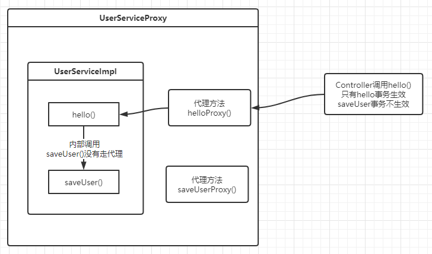
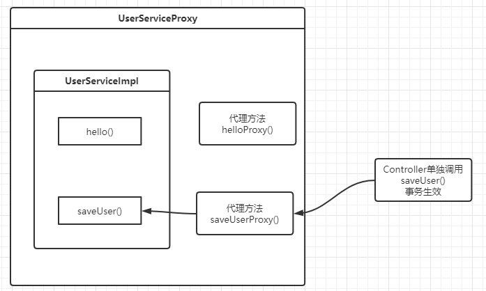

[toc]

# AOP失效原理以及处理

## 1 AOP失效现象

在spring 中使用 @Transactional 、 @Cacheable 、@Async 或 自定义 AOP 注解时，会发现个问题：在对象内部的方法中调用该对象的其他使用AOP注解的方法，被调用方法的AOP注解失效。

```java
public interface UserService {
    void saveUser();
    void hello();
}

public class UserServiceImpl {
    
    // 如果controller直接调用saveUser()，事务正常触发
    @Transactional
    public void saveUser(){
        User user = new User();
        user.setName("zhangsan");
        System.out.println("将用户存入数据库");
    }
    
    
    // hello()的事务正常触发，但是在方法里调用的saveUser()事务会失效
    @Transactional
    public void hello(){
        System.out.println("开始hello方法");
        try {
            //在同一个类中的方法，再调用AOP注解（@Transactional注解也是AOP注解）的方法，会使AOP注解失效
            //此时如果saveUser()存数据库动作失败抛出异常，“存入数据库“动作不会回滚,数据仍旧存入数据库
            saveUser();
        } catch (Exception  e) {
            logger.error("发送消息异常");
        }
    }
}
```

## 2 失效原因

AOP的底层实现原理其实使用的是动态代理

Spring AOP的java动态代理简单示例：

```java
public interface PersonService {
    void hello();
}
 
public class PersonServiceImpl implements PersonService {
    @Override
    public void hello() {
	System.out.println("你好我好大家好");
    }
}
```

```java
// 代理类实现InvovationHandler接口，来帮助被代理类去实现方法
public class ProxyHandler implements InvocationHandler {
 
	private PersonService target;
 
	/**
	 * 获取被代理对象
	 */
	public Object getInstance(PersonService target) {
		this.target = target;
		Class clazz = target.getClass();
         // 通过Proxy生成代理对象
		Object obj = Proxy.newProxyInstance(clazz.getClassLoader(), clazz.getInterfaces(), this);
		return obj;
	}
 
	/**
	 * 调用被代理对象的底层方法
	 * 并添加一些逻辑
	 */
	@Override
	public Object invoke(Object proxy, Method method, Object[] args) throws Throwable {
		System.out.println("我是来打招呼的");
		method.invoke(target, args);
		System.out.println("我已经打完招呼了");
		return null;
	}
 
	public static void main(String[] args) {
		//获取被代理对象
		PersonService personProxy = (PersonService) new ProxyHandler().getInstance(new PersonServiceImpl());
		//调用被代理对象的方法
		personProxy.hello();
	}
}
```

通过上面的代码，我们可以看出当对象(PersonService类型的对象)被代理时，其实是动态生成了一个代理对象，代理对象去执行 invoke()，invoke()会执行被代理对象的业务方法并且可以加上一些附加操作（如：上面的打招呼）。**当在被代理对象的方法中（就是上面的hello()）调用被代理对象的方法（就是上面的saveUser()）时，其实是没有用代理对象调用，是通过被代理对象本身调用的，这也就是AOP失效的原因**

在最上面的例子中，真实的情况如下：

1. 首先有个真实的类实现了UserService接口（暂且叫它**UserServiceImpl**）
2. Spring的动态代理会帮我们动态生成一个代理对象（暂且叫它**UserServiceProxy**），代理对象UserServiceProxy对UserService中方法进行了代理，我们把最终代理出来的方法叫做**helloProxy()以及saveUserProxy()**
3. 当外层调用UserServiceImpl中的hello()方法时，其实是调用的**代理对象的代理方法（即：UserServiceProxy.helloProxy()）**，所以这里的代理会生效。
4. 但是如果在hello()方法内调用同一个类的另外一个注解方法saveUser()时，
    1. 这时真实调用的其实并不是UserServiceProxy.saveUserProxy()，
    2. 而是调用的this.saveUser()（这里的this指向的是UserServiceImpl），**即调用UserServiceImpl.saveUser()**，**这里就没有走代理，所以注解失效**

## 3 图解

Controller调用hello()方法图解



Controller调用saveUser()方法图解



## 4 解决方案

### 4.1 Spring解决方案


### 4.2 SpringBoot解决方案


## ps-相关引用

- [bilibili-Spring AOP注解失效爬坑记](https://www.bilibili.com/video/BV1ft411f7Rc?from=search&seid=12553432421832948995)
- [Spring之AOP注解失效原因和解决方法- 事务失效&自定义AOP失效](https://blog.csdn.net/fumushan/article/details/80090947)