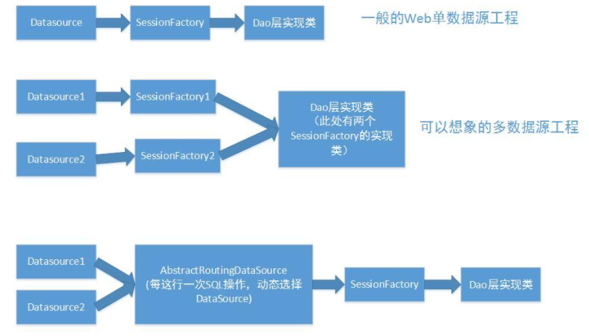

[toc]

# 动态数据源

## 1 需求场景

web项目中需要配置多个数据源，在某种情况下使用特定的数据源。

举例

1. 项目中需要进行读写分离，读是一个数据库来，写是另一个数据库
2. 特殊场景下，传入什么数据源就要用这个数据源进行查询，也就是数据源不确定。



## 2 多数据源简单实现

在一个普通Spring + Mybatis项目中，如果使用了多数据源，可以通过在dao层注入不同的SqlSessionTemplate来实现与不同数据库交互的目的。单个SqlSessionTemplate注入容器的过程如下：

```xml
    <!-- 配置数据源 -->
    <bean id="dataSource" class="com.alibaba.druid.pool.DruidDataSource">
        <property name="driverClassName" value="${jdbc.driver}"/>
        <property name="url" value="${jdbc.url}"/>
        <property name="username" value="${jdbc.username}"/>
        <property name="password" value="${jdbc.password}"/>
    </bean>

    <!-- 注册sqlSessionFactory -->
    <bean id="sqlSessionFactory" class="org.mybatis.spring.SqlSessionFactoryBean">
        <property name="dataSource" ref="dataSource"/>
        <property name="configLocation" value="classpath:config/mybatis-config.xml"/>
        <property name="typeAliasesPackage" value="com.wch.base.domain"/>
        <property name="mapperLocations" value="classpath:mapper/*.xml"/>
    </bean>

    <!-- 配置dao接口扫描，配置sqlSessionTemplate -->
    <context:component-scan base-package="com.wch.base.mapper"/>
    <bean id="sqlSessionTemplate" class="org.mybatis.spring.SqlSessionTemplate">
        <constructor-arg ref="sqlSessionFactory"/>
    </bean>
```

缺点：

- 如果项目需要连接多个数据源，从DataSource、SqlSessionFactory、SqlSessionTemplate都需要配置多次，难于维护和管理。
- 而且这种情况只适用于数据源确定的情况（也就是我们一开始就知道要访问哪些数据源）。

## 3 AbstractRoutingDataSource & 原理

AbstractRoutingDataSource是spring-jdbc包提供的一个AbstractDataSource的抽象类，它实现了DataSource接口用于获取数据库连接的方法。
下面的几个方法时AbstractRoutingDataSource中的几个关键方法：

```java
    // 用于获取数据库连接
	@Override
    public Connection getConnection() throws SQLException {
        return determineTargetDataSource().getConnection();
    }

	// 用于获取数据库连接
    @Override
    public Connection getConnection(String username, String password) throws SQLException {
        return determineTargetDataSource().getConnection(username, password);
    }

    protected DataSource determineTargetDataSource() {
        Assert.notNull(this.resolvedDataSources, "DataSource router not initialized");
        
        // 获取指定数据源关键字，
        // determineCurrentLookupKey()需要用户自己去实现，也就是告诉它一个key，后续会根据key找到一个已注册的数据源
        Object lookupKey = determineCurrentLookupKey();
        
        // 根据key，返回此路由器管理的已解析目标数据源
        DataSource dataSource = this.resolvedDataSources.get(lookupKey);
        if (dataSource == null && (this.lenientFallback || lookupKey == null)) {
            // 如果根据key找到的数据源为空，那么使用默认的数据源
            dataSource = this.resolvedDefaultDataSource;
        }
        if (dataSource == null) {
            throw new IllegalStateException("Cannot determine target DataSource for lookup key [" + lookupKey + "]");
        }
        return dataSource;
    }

	// 设置目标数据源列表
	// 其他的方法可以从这个列表中根据key拿到对应的数据源
    public void setTargetDataSources(Map<Object, Object> targetDataSources) {
        this.targetDataSources = targetDataSources;
    }
```

AbstractRoutingDataSource的内部维护了一个名为targetDataSources的Map，并提供的setter方法用于设置数据源关键字与数据源的关系，实现类被要求实现其determineCurrentLookupKey()方法，由此方法的返回值决定具体从哪个数据源中获取连接。

## 4 动态数据源代码实现

### 4.1 DataSourceContextHolder - 线程本地标识当前数据源key

```java
package com.hong.springboot.util.dynamicDataSource;

import lombok.extern.slf4j.Slf4j;

/**
 * @author create by hongzh.zhang on 2021-03-17
 * 数据源上下文，保存key值，用于动态切换使用
 * 用于给当前线程提供设置、获取、移除数据源key的操作
 */
@Slf4j // 使用lombook注入Slf4j
public class DataSourceContextHolder {

    /**
     * ThreadLocal 用于提供线程局部变量，在多线程环境可以保证各个线程里的变量独立于其它线程里的变量。
     * 这里采用ThreadLocal的主要原因是为了保证每个线程获取的数据源名称都是线程独属于这个线程的
     */
    private static final ThreadLocal<String> CONTEXT_HOLDER =new ThreadLocal<>();

    /**
     * 给当前线程更换数据源
     * @param datasource
     */
    public static void setDataSource(String datasource) {
        CONTEXT_HOLDER.set(datasource);
        log.info("已更换到数据源:{}", datasource);
    }

    /**
     * 获取数据源
     */
    public static String getDataSource(){
        return CONTEXT_HOLDER.get();
    }

    /**
     * 移除特定数据源，及切换到默认数据源
     */
    public static void removeDataSource() {
        CONTEXT_HOLDER.remove();
        log.info("切换为【默认数据源】");
    }
}

```

### 4.2 DynamicDataSource - 动态数据源关键类

```java
package com.hong.springboot.util.dynamicDataSource;

import com.alibaba.druid.pool.DruidDataSource;

import org.springframework.jdbc.datasource.lookup.AbstractRoutingDataSource;

import java.sql.Connection;
import java.sql.DriverManager;
import java.util.Map;
import java.util.concurrent.ConcurrentHashMap;

import lombok.extern.slf4j.Slf4j;

/**
 * @author create by hongzh.zhang on 2021-03-17
 * 动态数据源
 * 继承spring框架的AbstractRoutingDataSource来实现动态数据源功能
 * 该类的bean实例在DruidConfig中创建
 */
@Slf4j
public class DynamicDataSource extends AbstractRoutingDataSource {

    /**
     * 动态数据源-目标数据源map
     * 决定使用哪个数据源之前需要把多个数据源的信息以及默认数据源信息配置好
     */
    private Map<Object, Object> dynamicTargetDataSources = new ConcurrentHashMap<>();

    /**
     * 从DataSourceContextHolder拿到当前线程需要的数据源
     * AbstractRoutingDataSource会根据数据源key去拿到已经注入AbstractRoutingDataSource.targetDataSources的数据库连接
     */
    @Override
    protected Object determineCurrentLookupKey() {
        // 从ThreadLocal中获取当前线程要使用的数据源key
        return DataSourceContextHolder.getDataSource();
    }


    /**
     * 根据传入的数据库信息初始化动态数据源
     * @param dataSourceName 数据源名称
     * @param driverClass 数据库驱动(如：com.mysql.jdbc.Driver)
     * @param url 数据库url(如：jdbc:mysql://xxx:3306/xxx?useSSL=false&characterEncoding=UTF-8)
     * @param username 数据库用户名
     * @param password 数据库密码
     */
    public void useDynamicDataSource(String dataSourceName, String driverClass,
                                     String url, String username, String password) throws Exception {

        if (!dynamicTargetDataSources.containsKey(dataSourceName)) { // 数据源未创建，创建数据源
            log.info("数据源【{}】未创建，准备创建数据源...", dataSourceName);
            try {
                Class.forName(driverClass); // 加载驱动类到内存中
                DriverManager.getConnection(url, username, password);

                DruidDataSource druidDataSource = new DruidDataSource(); // 创建数据库连接池
                druidDataSource.setName(dataSourceName);
                druidDataSource.setDriverClassName(driverClass);
                druidDataSource.setUrl(url);
                druidDataSource.setUsername(username);
                druidDataSource.setPassword(password);
                druidDataSource.setInitialSize(50); // 初始化时建立物理连接的个数
                druidDataSource.setMinIdle(40); // 最小连接池数量
                druidDataSource.setMaxActive(200); // 最大连接池数量
                druidDataSource.setMaxWait(60000); // 获取连接时最大等待时间，单位毫秒。

                // 初始化数据库连接池
                druidDataSource.init();

                // 向动态数据源-目标数据源map添加数据源
                this.dynamicTargetDataSources.put(dataSourceName, druidDataSource);

                // 将map赋值给父类(AbstractRoutingDataSource)的TargetDataSources
                super.setTargetDataSources(dynamicTargetDataSources);

                // 将TargetDataSources中的连接信息放入父类的resolvedDataSources管理, 通知spring有bean更新
                super.afterPropertiesSet();

                // 给线程上下文添加数据源key
                DataSourceContextHolder.setDataSource(dataSourceName);
            } catch (Exception e) {
                log.error("数据源【{}】创建失败", dataSourceName);
                e.printStackTrace();
            }
        } else { // 数据源已创建
            log.info("数据源【{}】已创建，测试连接是否正常...", dataSourceName);
            // 从目标数据源map获取到指定的数据源连接池
            DruidDataSource druidDataSource = (DruidDataSource)dynamicTargetDataSources.get(dataSourceName);

            Connection connection = null;
            try { // 测试数据源连接
                log.info("数据源【{}】->最大连接数【{}】，活跃连接数【{}】", dataSourceName,
                        druidDataSource.getPoolingCount(), druidDataSource.getActiveCount());
                connection = druidDataSource.getConnection();

                // 给线程上下文添加数据源key
                DataSourceContextHolder.setDataSource(dataSourceName);
            } catch(Exception e) {
                log.error("数据源【{}】连接测试失败", dataSourceName);
                e.printStackTrace();
            } finally {
                if (connection != null) {
                    connection.close();
                }
            }
        }
    }

}
```

### 4.3 DruidConfig - 数据库连接池配置类-初始化数据源

```java
package com.hong.springboot.util.dynamicDataSource;

import com.alibaba.druid.pool.DruidDataSource;

import org.apache.ibatis.session.SqlSessionFactory;
import org.mybatis.spring.SqlSessionFactoryBean;
import org.springframework.beans.factory.annotation.Value;
import org.springframework.context.annotation.Bean;
import org.springframework.context.annotation.Configuration;
import org.springframework.transaction.annotation.EnableTransactionManagement;

import java.util.HashMap;
import java.util.Map;

import javax.sql.DataSource;

import lombok.extern.slf4j.Slf4j;

/**
 * @author create by hongzh.zhang on 2021-03-18
 */
@Configuration // 配置类，@Bean相当于spring的xml配置文件中的<bean>
@EnableTransactionManagement // 允许事务管理
@Slf4j
public class DruidConfig {

    @Value("${spring.datasource.url}") // 手动注入，参数值在application-xxx.yml中
    private String dbUrl;

    @Value("${spring.datasource.username}")
    private String username;

    @Value("${spring.datasource.password}")
    private String password;

    @Value("${spring.datasource.driver-class-name}")
    private String driverClassName;


    @Bean // 得到druid数据源bean实例
    public DataSource druidDataSource() {
        // 创建druid数据源
        DruidDataSource druidDataSource = new DruidDataSource();

        // 基础连接信息
        druidDataSource.setUrl(this.dbUrl);
        druidDataSource.setUsername(username);
        druidDataSource.setPassword(password);
        druidDataSource.setDriverClassName(driverClassName);

        druidDataSource.setInitialSize(5);
        druidDataSource.setMinIdle(5);
        druidDataSource.setMaxActive(20);
        druidDataSource.setMaxWait(60000);
        // 是否缓存preparedStatement，也就是PSCache。
        // PSCache对支持游标的数据库性能提升巨大，比如说oracle。在mysql下建议关闭。
        druidDataSource.setPoolPreparedStatements(false);
        druidDataSource.setMaxPoolPreparedStatementPerConnectionSize(50);

        return druidDataSource;
    }

    @Bean(name = "dynamicDataSource")
    public DynamicDataSource dynamicDataSource() {
        log.info("注入bean： dynamicDataSource");
        DynamicDataSource dynamicDataSource = new DynamicDataSource();

        DataSource druidDataSource = druidDataSource(); // 得到druid数据库连接池实例
        dynamicDataSource.setDefaultTargetDataSource(druidDataSource); // 设置默认数据源

        Map<Object, Object> targetDataSources = new HashMap<>();
        targetDataSources.put("defaultDataSource", druidDataSource);
        dynamicDataSource.setTargetDataSources(targetDataSources); // 设置可路由的列表

        return dynamicDataSource;
    }

    @Bean // 声明SqlSessionFactoryBean
    public SqlSessionFactory sqlSessionFactory() throws Exception {
        SqlSessionFactoryBean sqlSessionFactoryBean = new SqlSessionFactoryBean();
        sqlSessionFactoryBean.setDataSource(dynamicDataSource());

        return sqlSessionFactoryBean.getObject();
    }


}

```

### 4.4 TestServiceImpl-测试类

```java
package com.hong.springboot.service.impl;

import com.hong.springboot.mapper.TestMapper;
import com.hong.springboot.service.TestService;
import com.hong.springboot.util.WebResponse;
import com.hong.springboot.util.dynamicDataSource.DataSourceContextHolder;
import com.hong.springboot.util.dynamicDataSource.DynamicDataSource;

import org.springframework.beans.factory.annotation.Autowired;
import org.springframework.stereotype.Service;

import java.util.List;

import javax.annotation.Resource;

@Service
public class TestServiceImpl implements TestService {

    @Autowired // 在DruidConfig中配置的bean
    DynamicDataSource dynamicDataSource;

    @Resource
    TestMapper testMapper;

    @Override
    public WebResponse dynamicDataSourceTest(String type) {
        String dataSourceName;
        String driverClass;
        String url;
        String username;
        String password;

        if ("1".equals(type) || "2".equals(type)) {
            if ("1".equals(type)) {
                dataSourceName="test1";
                driverClass="com.mysql.cj.jdbc.Driver";
                url="jdbc:mysql://localhost:3306/test1?serverTimezone=GMT%2B8&useUnicode=true&characterEncoding=utf-8";
                username="test1";
                password="test1";
            } else {
                dataSourceName = "test2";
                driverClass = "com.mysql.cj.jdbc.Driver";
                url = "jdbc:mysql://localhost:3306/test2?serverTimezone=GMT%2B8&useUnicode=true&characterEncoding=utf-8";
                username = "test1";
                password = "test1";
            }

            try {
                // 根据连接信息切换数据源
                dynamicDataSource.useDynamicDataSource(dataSourceName, driverClass,
                        url, username, password);
            } catch (Exception e) {
                e.printStackTrace();
            }
        }

        List<Object> list = testMapper.getTestList();

        // 切换至默认数据源
        DataSourceContextHolder.removeDataSource();

        return WebResponse.success(list);
    }
}
```

## 5 附加-注解以及切面应用动态数据源

这里在上面第4节的基础上增加注解以及aop，从而实现使用注解就可以动态切换数据源的目的

### 5.1 SpecifyDataSource - 注解类

```java
package com.hong.springboot.util.dynamicDataSource;

import java.lang.annotation.ElementType;
import java.lang.annotation.Retention;
import java.lang.annotation.RetentionPolicy;
import java.lang.annotation.Target;

/**
 * 指定特别数据源的注解，后期切面会根据注解里的信息动态创建数据源
 * @author Create by hongzh.zhang on 2021/3/19
 */
@Retention(RetentionPolicy.RUNTIME) // 在运行时也有效
@Target({ElementType.METHOD})  // 可作用于方法上
public @interface SpecifyDataSource {
    // 数据源名称
    String dataSourceName();

    // 数据源驱动(如：com.mysql.cj.jdbc.Driver)
    String driverClass();

    // 数据库url(如：jdbc:mysql://xxx:3306/xxx?useSSL=false&characterEncoding=UTF-8)
    String url();

    // 数据库用户名
    String username();

    // 数据库密码
    String password();
}

```

### 5.2 DynamicDataSourceAspect - 切面类

```java

```

### 5.3使用注解切换数据源测试

```java

```

## ps-相关引用

[AbstractRoutingDataSource -- Spring提供的轻量级数据源切换方式](https://www.jianshu.com/p/b158476dd33c)

[详解AbstractRoutingDataSource(动态数据源切换)实现原理](https://blog.csdn.net/qq_31156277/article/details/85227415)