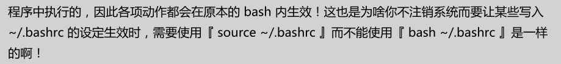

[TOC]

# shell学习

## 1 使用shell来encode和decode url

方法一：使用python的命令（但是没找到方法怎么在shell 中直接运行）

```shell
定义编码和解码
$ alias urldecode='python -c "import sys, urllib as ul; \
    print ul.unquote_plus(sys.argv[1])"'

$ alias urlencode='python -c "import sys, urllib as ul; \
    print ul.quote_plus(sys.argv[1])"'

范例：
$ urldecode 'q+werty%3D%2F%3B'
q werty=/;

$ urlencode 'q werty=/;'
q+werty%3D%2F%3B
```

方法二：使用解析

```shell
urldecode() { : "${*//+/ }"; echo -e "${_//%/\\x}"; }

url='qunariphoneyouth://web/url?browserType=1&url=https%3A%2F%2Fzt.dujia.qunar.com%2Fzts%2F2019shuqi%2Ftouch.php%3Fin_track%3Dpush_vacation_sqdc%26et%3Dpush_vacation_sqdc%26bd_source%3Dpush_020021781'

decode_result=$(urldecode "$url")

echo $decode_result
```

## 2 转码文件

```shell
# 在windows上打开过的linux脚本，换行符会变化
# 导致执行出现：$'\r': command not found

dos2unix -k fileName
```

## 3 Shell中source与sh和.的区别

使用sh和.运行程序，程序会在子程序中运行，这样的结果就是这里面的变量都相当于临时变量，运行后就失效了。

使用source运行程序，程序会在主程序中运行，这样变量就相当于全局变量，运行后还可以在，服务器看到。



## 4 shell中在脚本中第一行的#!/bin/bash的作用

#!/bin/bash的作用在于告诉shell用哪个shell来运行脚本（因为shell不止一个）

## 5 shell方法返回字符串

```shell
#!/bin/sh

# 示例方法
function get_str() {
	echo "string"
}

#写法一
echo `get_str` 

 #写法二
echo $(get_str)
```


