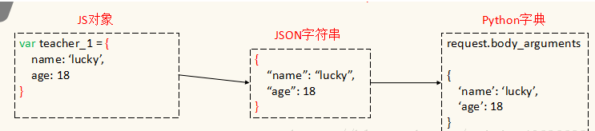

[TOC]

# Json相关

## 1 什么是Json&Json格式

JSON(JavaScript Object Notation) 是一种轻量级的数据交换格式，它是JavaScript的子集，易于人阅读和编写。

前端和后端进行数据交互，其实就是JS和Python进行数据交互



JSON注意事项：

1. 名称必须用双引号（即：""）来包括
2. 值可以是双引号包括的字符串、数字、true、false、null、JavaScript数组，或子对象。

## 2 python数据类型与json数据类型的映射关系

| Python           | JSON   |
| :--------------- | :----- |
| dict             | object |
| list, tuple      | array  |
| str, unicode     | string |
| int, long, float | number |
| True             | true   |
| False            | false  |
| None             | null   |

## 3 常用方法

### 3.1 json.dumps()-对象转JSON 字符串

```python
import json
 
data = {'name':'nanbei','age':18}
print(json.dumps(data)) # 对象转json字符串

# 输出（注： 在这里我们可以看到，原先的单引号已经变成双引号了）：
{"age": 18, "name": "nanbei"}


# 格式化：
data = {'name':'nanbei','age':18}
json_str=json.dumps(data, sort_keys=True, indent=4, separators=(',', ': '))
print(json_str)

# 输出
{
    "age": 18,
    "name": "nanbei"
}
```

### 3.2 json.loads()- JSON 字符串转对象

```python
import json

json_str='{"age": 18, "name": "nanbei"}'

json_object = json.loads(json_str) # json字符串转对象
print(type(json_object)) 
print(json_object)
# 输出（注：类型已经变味dict了）
<type 'dict'>
{u'age': 18, u'name': u'nanbei'}
```

### 3.3 json.dump()-将Python内置类型序列化为json对象后写入文件

```python
import json
 
data = {
    'nanbei':'haha',
    'a':[1,2,3,4],
    'b':(1,2,3)
}
with open('json_test.txt','w+') as f:
    json.dump(data,f)
    
{'a': [1, 2, 3, 4], 'b': [1, 2, 3], 'nanbei': 'haha'}
```

### 3.4 json.load()-读取文件中json形式的字符串元素转化为Python类型

```python

import json
 
data = {
    'nanbei':'haha',
    'a':[1,2,3,4],
    'b':(1,2,3)
}
with open('json_test.txt','w+') as f:
    json.dump(data,f)
 
with open('json_test.txt','r+') as f:
    print(json.load(f))
    
{'a': [1, 2, 3, 4], 'b': [1, 2, 3], 'nanbei': 'haha'}
```

## 4 其他

```python
# 字典字符串转json:
    json_data_str= '''
    [
        {
            'biz_name' : ['aaa'],
            'report_alias' : '消费'
        }
    ]
    '''

    # 上面的字符串非json字符串，所以这里转换为json字符串
    json_str=json_data_str.replace("\'", '\"')
    
    # 将json字符串
    json_object=json.loads(json_str)
    print(json_object)
```

