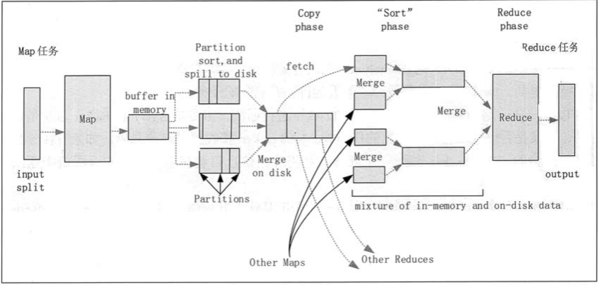

[TOC]

# MapReduce流程

## 1 MR详细流程

详情见：https://zhuanlan.zhihu.com/p/85666077

## 2 HadoopMapReduce 的 Shuffle 阶段

Hadoop MapReduce 的 Shuffle 阶段是指从 Map 的输出开始，包括系统执行排序，以及传送 Map 输出到 Reduce 作为输入的过程。
排序阶段是指对 Map 端输出的 Key 进行排序的过程。不同的 Map 可能输出相同的 Key，相同的 Key 必须发送到同一个 Reduce 端处理。Shuffle 阶段可以分为 Map 端的 Shuffle 阶段和 Reduce 端的 Shuffle 阶段。Shuffle 阶段的工作过程，如图 2所示

### 1 Map端的Shuffle阶段

1. 每个输入分片会让一个 Map 任务来处理，默认情况下，以 HDFS 的一个块的大小（默认为 64MB）为一个分片。Map 函数开始产生输出时，并不是简单地把数据写到磁盘中，因为频繁的磁盘操作会导致性能严重下降。它的处理过程是把数据首先写到内存中的一个缓冲区， 并做一些预排序，以提升效率。
2. 每个 Map 任务都有一个用来写入输出数据的循环内存缓冲区（默认大小为 100MB)，当缓冲区中的数据量达到一个特定阈值（默认是 80%）时，系统将会启动一个后台线程，把缓冲 区中的内容写到磁盘中（即 Spill 阶段)。在写磁盘过程中，Map 输出继续被写到缓冲区中，但如果在此期间缓冲区被填满，那么 Map 任务就会阻塞直到写磁盘过程完成。
3. 在写磁盘前，线程首先根据数据最终要传递到的 Reduce 任务把数据划分成相应的分区（Partition）。在每个分区中，后台线程按 Key 进行排序，如果有一个 Combiner，便会在排序后 的输出上运行。
4. 一旦内存缓冲区达到溢出写的阈值，就会创建一个溢出写文件，因此在 Map 任务完成其最后一个输出记录后，便会有多个溢出写文件。在 Map 任务完成前，溢出写文件被合并成一个索引文件和数据文件（多路归并排序）（Sort 阶段)。
5. 溢出写文件归并完毕后，Map 任务将删除所有的临时溢出写文件，并告知 TaskTracker 任务已完成，只要其中一个 Map 任务完成，Reduce 任务就会开始复制它的输出（Copy 阶段)。
6. Map 任务的输出文件放置在运行 Map 任务的 TaskTracker 的本地磁盘上，它是运行 Reduce 任务的 TaskTracker 所需要的输入数据。

### 2 Reduce端的Shuffle阶段

1. Reduce 进程启动一些数据复制线程，请求 Map 任务所在的 TaskTracker 以获取输出文件（Copy 阶段）。
2. 将 Map 端复制过来的数据先放入内存缓冲区中，Merge 有 3 种形式，分别是内存到内存，内存到磁盘，磁盘到磁盘。默认情况下，第一种形式不启用，第二种形式一直在运行（Spill 阶段），直到结束，第三种形式生成最终的文件（Merge 阶段）。
3. 最终文件可能存在于磁盘中，也可能存在于内存中，但是默认情况下是位于磁盘中的。当 Reduce 的输入文件已定，整个 Shuffle 阶段就结束了，然后就是 Reduce 执行，把结果放到 HDFS 中（Reduce 阶段）。

 

