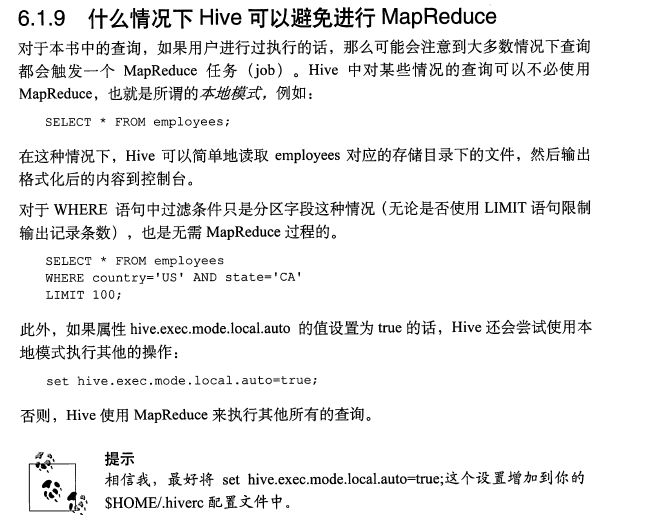

[TOC]

# hive基础学习

## 1 基本概念

Hive 是基于 Hadoop 的一个数据仓库工具，实质就是一款基于 HDFS 的 MapReduce 计算框架，对存储在 HDFS 中的数据进行分析和管理。

## 2 Hive优缺点

### 2.1 优点

1. 可扩展性,横向扩展，Hive 可以自由的扩展集群的规模，一般情况下不需要重启服务 
    横向扩展：通过分担压力的方式扩展集群的规模 纵向扩展：一台服务器cpu i7-6700k 4核心8线程，8核心16线程，内存64G => 128G
2. 延展性，Hive 支持自定义函数，用户可以根据自己的需求来实现自己的函数
3. 良好的容错性，可以保障即使有节点出现问题，SQL 语句仍可完成执行

### 2.2 缺点

1. Hive 不支持记录级别的增删改操作，但是用户可以通过查询生成新表或者将查询结 果导入到文件中（当前选择的 hive-2.3.2 的版本支持记录级别的插入操作）
2. Hive 的查询延时很严重，因为 MapReduce Job 的启动过程消耗很长时间，所以不能 用在交互查询系统中。
3. Hive 不支持事务（因为没有增删改，所以主要用来做 OLAP（联机分析处理），而不是 OLTP（联机事务处理），这就是数据处理的两大级别）。

## 3 partition的作用和使用方法

在hive中select查询一般会扫描整个表内容，会消耗很多时间，有时只需要扫描表中关心的一部分数据，因此建表时引入了partition概念。

使用分区后每个分区以文件夹的形式单独存在文件夹的目录下，表和列名不区分大小写，分区是以字段形式在表结构中存在，通过`describe table` 可以查看字段的存在，但改字段不存放实际的数据内容，仅仅是分区表示

总的说来partition就是辅助查询，缩小查询范围，加快数据的检索速度和对数据按照一定的规格和条件进行管理。

实现方为把每一个分区都以分区文件夹的形式单独存放在文件夹目录下(所以在load数据的时候就需要指定分区)。

```sql
-- 数据加载进分区表中语法：
LOAD DATA [LOCAL] INPATH 'filepath' [OVERWRITE] INTO TABLE tablename [PARTITION (partcol1=val1, partcol2=val2 ...)]
-- 例：
LOAD DATA INPATH '/user/pv.txt' INTO TABLE day_hour_table PARTITION(dt='2008-08- 08', hour='08'); LOAD DATA local INPATH '/user/hua/*' INTO TABLE day_hour partition(dt='2010-07- 07');
-- 当数据被加载至表中时，不会对数据进行任何转换。Load操作只是将数据复制至Hive表对应的位置。数据加载时在表下自动创建一个目录，文件存放在该分区下。

-- 基于分区的查询的语句：
SELECT day_table.* FROM day_table WHERE day_table.dt>= '2008-08-08';

-- 查看分区语句：
hive> show partitions day_hour_table; OK dt=2008-08-08/hour=08 dt=2008-08-08/hour=09 dt=2008-08-09/hour=09
```

## 4 避免MapReduce


