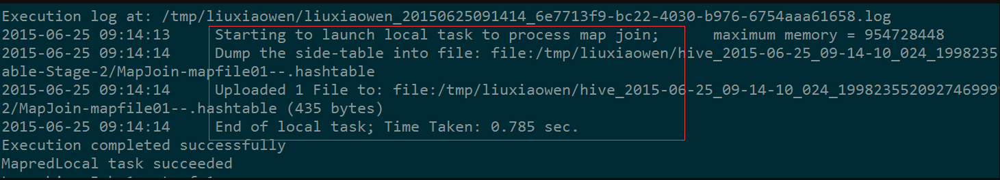

[toc]

# Join原理

Hive中的Join可分为Common Join（Reduce阶段完成join）和Map Join（Map阶段完成join）。

## 1 Hive Common Join

如果不指定MapJoin或者不符合MapJoin的条件，那么Hive解析器会将Join操作转换成Common Join,即：在Reduce阶段完成join.
整个过程包含Map、Shuffle、Reduce阶段。

- Map阶段

读取源表的数据，Map输出时候以Join on条件中的列为key，如果Join有多个关联键，则以这些关联键的组合作为key;
Map输出的value为join之后所关心的(select或者where中需要用到的)列；同时在value中还会包含表的Tag信息，用于标明此value对应哪个表；
按照key进行排序

- Shuffle阶段

根据key的值进行hash,并将key/value按照hash值推送至不同的reduce中，这样确保两个表中相同的key位于同一个reduce中

- Reduce阶段
    根据key的值完成join操作，期间通过Tag来识别不同表中的数据。

以下面的HQL为例，图解其过程：

```sql
SELECT 
 a.id,a.dept,b.age 
FROM a join b 
ON (a.id = b.id);
```


## 2 Hive Map Join

MapJoin通常用于一个很小的表和一个大表进行join的场景(实测有些场景会很快！！！)，

具体小表有多小，由参数**hive.mapjoin.smalltable.filesize**来决定，该参数表示小表的总大小，默认值为25000000字节，即25M。
Hive0.7之前，需要使用hint提示 /*+ mapjoin(table) */才会执行MapJoin,否则执行Common Join，但在0.7版本之后，默认自动会转换Map Join，由参数**hive.auto.convert.join**来控制，默认为true(可以自己验证一下).
仍然以9.1中的HQL来说吧，假设a表为一张大表，b为小表，并且hive.auto.convert.join=true,那么Hive在执行时候会自动转化为MapJoin。


- 如图中的流程，首先是Task A，它是一个Local Task（在客户端本地执行的Task），负责扫描小表b的数据，将其转换成一个HashTable的数据结构，并写入本地的文件中，之后将该文件加载到DistributeCache中，该HashTable的数据结构可以抽象为：

| key  | value |
| ---- | ----- |
| 1    | 26    |
| 2    | 34    |



图中红框圈出了执行Local Task的信息。

- 接下来是Task B，该任务是一个没有Reduce的MR，启动MapTasks扫描大表a,在Map阶段，根据a的每一条记录去和DistributeCache中b表对应的HashTable关联，并直接输出结果。
- 由于MapJoin没有Reduce，所以由Map直接输出结果文件，有多少个Map Task，就有多少个结果文件。

## ps-相关资料

[[一起学Hive]之十-Hive中Join的原理和机制](http://lxw1234.com/archives/2015/06/313.htm) 

[Hive mapjoin](https://www.cnblogs.com/qiuhong10/p/7698277.html)