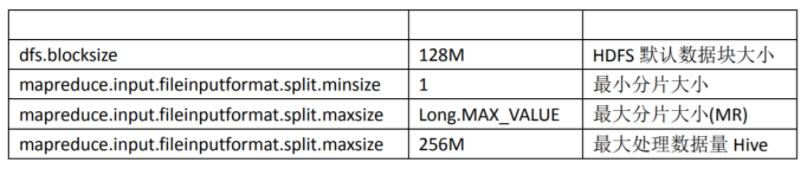

[TOC]

# Hive优化

## 1 Hadoop 框架计算特性

1、数据量大不是问题，数据倾斜是个问题

2、jobs 数比较多的作业运行效率相对比较低，比如即使有几百行的表，如果多次关联多次 汇总，产生十几个 jobs，耗时很长。原因是 map reduce 作业初始化的时间是比较长的

3、sum,count,max,min 等 UDAF，不怕数据倾斜问题，hadoop 在 map 端的汇总合并优化，使 数据倾斜不成问题

4、count(distinct userid)，在数据量大的情况下，效率较低，如果是多 count(distinct userid,month)效率更低，因为 count(distinct)是按 group by 字段分组，按 distinct 字段排序， 一般这种分布方式是很

倾斜的，比如 PV 数据，淘宝一天 30 亿的 pv，如果按性别分组，分 配 2 个 reduce，每个 reduce 期望处理 15 亿数据，但现实必定是男少女多

## 2 优化常用手段

1、好的模型设计事半功倍

2、解决数据倾斜问题

3、减少 job 数

4、设置合理的 MapReduce 的 task 数，能有效提升性能。(比如，10w+级别的计算，用 160个 reduce，那是相当的浪费，1 个足够)

5、了解数据分布，自己动手解决数据倾斜问题是个不错的选择。这是通用的算法优化，但 算法优化有时不能适应特定业务背景，开发人员了解业务，了解数据，可以通过业务逻辑精 确有效的解决数据倾斜问题

6、数据量较大的情况下，慎用 count(distinct)，group by 容易产生倾斜问题

7、对小文件进行合并，是行之有效的提高调度效率的方法，假如所有的作业设置合理的文 件数，对云梯的整体调度效率也会产生积极的正向影响

8、优化时把握整体，单个作业最优不如整体最优

## 3 排序选择

**cluster by**：对同一字段分桶并排序，不能和 sort by 连用

**distribute by + sort by**：分桶，保证同一字段值只存在一个结果文件当中，结合 sort by 保证 每个 reduceTask 结果有序

**sort by**：单机排序，单个 reduce 结果有序

**order by**：全局排序，缺陷是只能使用一个 reduce

**一定要区分这四种排序的使用方式和适用场景**

## 4 semi join

虽然经过测验，hive1.2.1 也支持 in/exists 操作，但还是推荐使用 hive 的一个高效替代方案：**left semi join**

比如说：

```
select a.id, a.name from a where a.id in (select b.id from b);
select a.id, a.name from a where exists (select id from b where a.id = b.id);
```

应该转换成：

```
select a.id, a.name from a left semi join b on a.id = b.id;
```

## 5 设置合理的 maptask 数量

Map 数过大

　　Map 阶段输出文件太小，产生大量小文件

　　初始化和创建 Map 的开销很大

Map 数太小

　　文件处理或查询并发度小，Job 执行时间过长

　　大量作业时，容易堵塞集群 

在 MapReduce 的编程案例中，我们得知，一个MR Job的 MapTask 数量是由输入分片 InputSplit 决定的。而输入分片是由 FileInputFormat.getSplit()决定的。一个输入分片对应一个 MapTask， 而输入分片是由三个参数决定的：



输入分片大小的计算是这么计算出来的：

**long splitSize = Math.max(minSize, Math.min(maxSize, blockSize))**

默认情况下，输入分片大小和 HDFS 集群默认数据块大小一致，也就是默认一个数据块，启 用一个 MapTask 进行处理，这样做的好处是避免了服务器节点之间的数据传输，提高 job 处 理效率

两种经典的控制 MapTask 的个数方案：减少 MapTask 数或者增加 MapTask 数

> **1、 减少 MapTask 数是通过合并小文件来实现，这一点主要是针对数据源**
>
> **2、 增加 MapTask 数可以通过控制上一个 job 的 reduceTask 个数** 

因为 Hive 语句最终要转换为一系列的 MapReduce Job 的，而每一个 MapReduce Job 是由一 系列的 MapTask 和 ReduceTask 组成的，默认情况下， MapReduce 中一个 MapTask 或者一个 ReduceTask 就会启动一个 JVM 进程，一个 Task 执行完毕后， JVM 进程就退出。这样如果任 务花费时间很短，又要多次启动 JVM 的情况下，JVM 的启动时间会变成一个比较大的消耗， 这个时候，就可以通过重用 JVM 来解决：

>  **set mapred.job.reuse.jvm.num.tasks=5** 

## 6 小文件合并

文件数目过多，会给 HDFS 带来压力，并且会影响处理效率，可以通过合并 Map 和 Reduce 的 结果文件来消除这样的影响：

```
set hive.merge.mapfiles = true ##在 map only 的任务结束时合并小文件

set hive.merge.mapredfiles = false ## true 时在 MapReduce 的任务结束时合并小文件

set hive.merge.size.per.task = 256*1000*1000 ##合并文件的大小

set mapred.max.split.size=256000000; ##每个 Map 最大分割大小

set mapred.min.split.size.per.node=1; ##一个节点上 split 的最少值

set hive.input.format=org.apache.hadoop.hive.ql.io.CombineHiveInputFormat; ##执行 Map 前进行小文件合并
```

## 7 设置合理的 reduceTask 的数量

adoop MapReduce 程序中，reducer 个数的设定极大影响执行效率，这使得 Hive 怎样决定 reducer 个数成为一个关键问题。遗憾的是 Hive 的估计机制很弱，不指定 reducer 个数的情 况下，Hive 会猜测确定一个 reducer 个数，基于以下两个设定：

> 1、hive.exec.reducers.bytes.per.reducer（默认为 256000000）
>
> 2、hive.exec.reducers.max（默认为 1009）
>
> 3、mapreduce.job.reduces=-1（设置一个常量 reducetask 数量）

计算 reducer 数的公式很简单： N=min(参数 2，总输入数据量/参数 1) 通常情况下，有必要手动指定 reducer 个数。考虑到 map 阶段的输出数据量通常会比输入有 大幅减少，因此即使不设定 reducer 个数，重设参数 2 还是必要的。

**依据 Hadoop 的经验，可以将参数 2 设定为 0.95\*(集群中 datanode 个数)。** 

## 8 join优化

总体原则：

　　1、 优先过滤后再进行 Join 操作，最大限度的减少参与 join 的数据量

　　2、 小表 join 大表，最好启动 mapjoin

　　3、 Join on 的条件相同的话，最好放入同一个 job，并且 join 表的排列顺序从小到大 

**在使用写有 Join 操作的查询语句时有一条原则：应该将条目少的表/子查询放在 Join 操作 符的左边。**原因是在 Join 操作的 Reduce 阶段，位于 Join 操作符左边的表的内容会被加 载进内存，将条目少的表放在左边，可以有效减少发生 OOM 错误的几率。对于一条语句 中有多个 Join 的情况，如果 Join 的条件相同，比如查询

```
INSERT OVERWRITE TABLE pv_users
SELECT pv.pageid, u.age FROM page_view p
JOIN user u ON (pv.userid = u.userid)
JOIN newuser x ON (u.userid = x.userid);
```

如果 Join 的 key 相同，不管有多少个表，都会则会合并为一个 Map-Reduce 任务，而不 是”n”个，在做 OUTER JOIN 的时候也是一样

如果 join 的条件不相同，比如：

```
INSERT OVERWRITE TABLE pv_users
 SELECT pv.pageid, u.age FROM page_view p
 JOIN user u ON (pv.userid = u.userid)
 JOIN newuser x on (u.age = x.age);
```

Map-Reduce 的任务数目和 Join 操作的数目是对应的，上述查询和以下查询是等价的

```
--先 page_view 表和 user 表做链接
INSERT OVERWRITE TABLE tmptable
 SELECT * FROM page_view p JOIN user u ON (pv.userid = u.userid);
-- 然后结果表 temptable 和 newuser 表做链接
INSERT OVERWRITE TABLE pv_users
 SELECT x.pageid, x.age FROM tmptable x JOIN newuser y ON (x.age = y.age); 
```

在编写 Join 查询语句时，如果确定是由于 join 出现的数据倾斜，那么请做如下设置：

> **set hive.skewjoin.key=100000; // 这个是 join 的键对应的记录条数超过这个值则会进行 分拆，值根据具体数据量设置**
>
> **set hive.optimize.skewjoin=true; // 如果是 join 过程出现倾斜应该设置为 true** 

## 9 group优化

### 9.1 map端部分聚合

并不是所有的聚合操作都需要在 Reduce 端完成，很多聚合操作都可以先在 Map 端进 行部分聚合，最后在 Reduce 端得出最终结果。

MapReduce 的 combiner 组件参数包括：

> **set hive.map.aggr = true 是否在 Map 端进行聚合，默认为 True**
>
> **set hive.groupby.mapaggr.checkinterval = 100000 在 Map 端进行聚合操作的条目数目**

9.2 使用 Group By 有数据倾斜的时候进行负载均衡

>  **set hive.groupby.skewindata = true**

当 sql 语句使用 groupby 时数据出现倾斜时，如果该变量设置为 true，那么 Hive 会自动进行 负载均衡。**策略就是把 MR 任务拆分成两个：第一个先做预汇总，第二个再做最终汇总**

在 MR 的第一个阶段中，Map 的输出结果集合会缓存到 maptaks 中，每个 Reduce 做部分聚 合操作，并输出结果，这样处理的结果是相同 Group By Key 有可能被分发到不同的 Reduce 中， 从而达到负载均衡的目的；第二个阶段 再根据预处理的数据结果按照 Group By Key 分布到 Reduce 中（这个过程可以保证相同的 Group By Key 被分布到同一个 Reduce 中），最后完成 最终的聚合操作。

## 10 并行化处理

一个 hive sql 语句可能会转为多个 mapreduce Job，每一个 job 就是一个 stage，这些 job 顺序 执行，这个在 cli 的运行日志中也可以看到。但是有时候这些任务之间并不是是相互依赖的， 如果集群资源允许的话，可以让多个并不相互依赖 stage 并发执行，这样就节约了时间，提 高了执行速度，但是如果集群资源匮乏时，启用并行化反倒是会导致各个 job 相互抢占资源 而导致整体执行性能的下降。启用并行化：

> **set hive.exec.parallel=true;**
>
> **set hive.exec.parallel.thread.number=8; //同一个 sql 允许并行任务的最大线程数**

## ps-相关资料

https://www.cnblogs.com/qingyunzong/p/8847775.html

