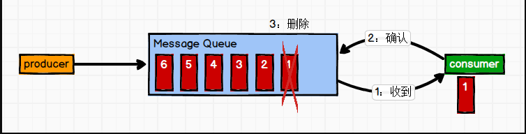
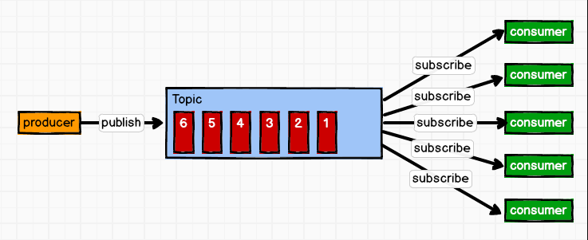

[toc]

# kafka-消息队列

## 1 kafka定义

Kafka 是一个**分布式**的基于**发布/订阅模式**的**消息队列**（Message Queue），主要应用于大数据实时处理领域。

## 2 消息队列的应用场景


## 3 消息队列的好处

1. 解耦（类似Spring的IOC）

    允许你独立的扩展或修改两边的处理过程，只要确保它们遵守同样的接口约束。

2. 可恢复性

    系统的一部分组件失效时，不会影响到整个系统。
    消息队列降低了进程间的耦合度，所以即使一个处理消息的进程挂掉，加入队列中的消息仍然可以在系统恢复后被处理。

3. 缓冲

    有助于控制和优化数据流经过系统的速度， 解决生产消息和消费消息的处理速度不一致的情况。

4. 灵活性 & 峰值处理能力（削峰）

    在访问量剧增的情况下，应用仍然需要继续发挥作用，但是这样的突发流量并不常见。
    如果为以能处理这类峰值访问为标准来投入资源随时待命无疑是巨大的浪费。
    使用消息队列能够使关键组件顶住突发的访问压力，而不会因为突发的超负荷的请求而完全崩溃。

5. 异步通信

    很多时候，用户不想也不需要立即处理消息。消息队列提供了异步处理机制，允许用户把一个消息放入队列，但并不立即处理它。
    想向队列中放入多少消息就放多少，然后在需要的时候再去处理它们。

## 4 消费模式

### 4.1 点对点模式

特点：**一对一，消费者主动拉取数据，消息收到后消息清除**

消息生产者生产消息发送到Queue中，然后消息消费者从Queue中取出并且消费消息。消息被消费以后， queue 中不再有存储，所以消息消费者不可能消费到已经被消费的消息。Queue 支持存在多个消费者，但是对一个消息而言，只会有一个消费者可以消费。



### 4.2 发布/订阅模式

特点：**一对多，消费者消费数据之后不会清除消息**

消息生产者（发布）将消息发布到 topic 中，同时有多个消息消费者（订阅）消费该消息。和点对点方式不同，发布到 topic 的消息会被所有订阅者消费。



## 5 工作流程


Kafka 中消息是以 topic 进行分类的， producer生产消息，consumer消费消息，都是面向 topic的。(从命令行操作看出)

```shell
bin\kafka-console-producer.sh --broker-list localhost:9092 --topic test

bin\kafka-console-consumer.sh --bootstrap-server localhost:9092 --topic test --from-beginning
```

topic 是逻辑上的概念，而 partition 是物理上的概念，每个 partition 对应于一个 log 文件，该 log 文件中存储的就是 producer 生产的数据。（topic = N partition，partition = log）

Producer 生产的数据会被不断追加到该log 文件末端，且每条数据都有自己的 offset。 consumer组中的每个consumer， 都会实时记录自己消费到了哪个 offset，以便出错恢复时，从上次的位置继续消费。（producer -> log with offset -> consumer(s)）

## 6 文件存储


由于生产者生产的消息会不断追加到 log 文件末尾， 为防止 log 文件过大导致数据定位效率低下， Kafka 采取了**分片**和**索引**机制，将每个 partition 分为多个 segment。

每个 segment对应两个文件——“.index”文件和“.log”文件。 这些文件位于一个文件夹下， 该文件夹的命名规则为： topic 名称+分区序号。例如， first 这个 topic 有三个分区，则其对应的文件夹为 first-0,first-1,first-2。

```
00000000000000000000.index
00000000000000000000.log
00000000000000170410.index
00000000000000170410.log
00000000000000239430.index
00000000000000239430.log
```

index 和 log 文件以当前 segment 的第一条消息的 offset 命名。下图为 index 文件和 log文件的结构示意图。


**“.index”文件存储大量的索引信息，“.log”文件存储大量的数据**，索引文件中的元数据指向对应数据文件中 message 的物理偏移地址。

## 7 生产者分区策略

### 7.1 分区的原因

1. **方便在集群中扩展**，每个 Partition 可以通过调整以适应它所在的机器，而一个 topic又可以有多个 Partition 组成，因此整个集群就可以适应适合的数据了；
2. **可以提高并发**，因为可以以 Partition 为单位读写了。（联想到ConcurrentHashMap在高并发环境下读写效率比HashTable的高效）

### 7.2 分区的原则

我们需要将 producer 发送的数据封装成一个 `ProducerRecord` 对象。


1. 指明 partition 的情况下，直接将指明的值直接作为 partiton 值；
2. 没有指明 partition 值但有 key 的情况下，将 key 的 hash 值与 topic 的 partition 数进行取余得到 partition 值；
3. 既没有 partition 值又没有 key 值的情况下，第一次调用时随机生成一个整数（后面每次调用在这个整数上自增），将这个值与 topic 可用的 partition 总数取余得到 partition值，也就是常说的 round-robin 算法。

## ps-相关资料

[Kafka学习笔记](https://my.oschina.net/jallenkwong/blog/4449224)