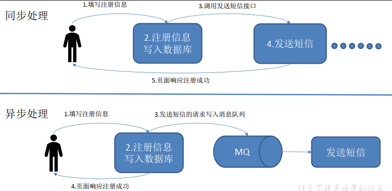
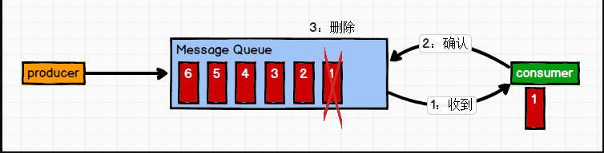
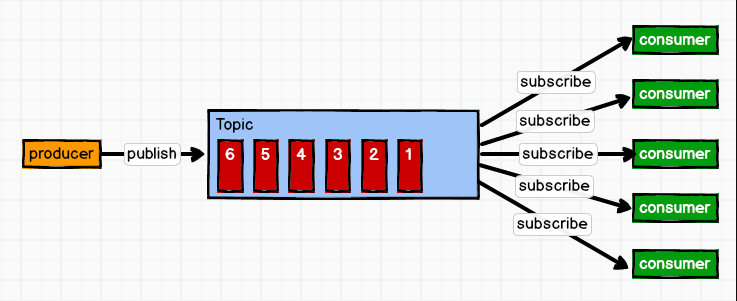

[toc]

# kafka-消息队列

## 1 kafka定义

Kafka 是一个**分布式**的基于**发布/订阅模式**的**消息队列**（Message Queue），主要应用于大数据实时处理领域。

## 2 消息队列的应用场景

## 3 消息队列的好处

1. 解耦（类似Spring的IOC）

    允许你独立的扩展或修改两边的处理过程，只要确保它们遵守同样的接口约束。

2. 可恢复性

    系统的一部分组件失效时，不会影响到整个系统。
    消息队列降低了进程间的耦合度，所以即使一个处理消息的进程挂掉，加入队列中的消息仍然可以在系统恢复后被处理。

3. 缓冲

    有助于控制和优化数据流经过系统的速度， 解决生产消息和消费消息的处理速度不一致的情况。

4. 灵活性 & 峰值处理能力（削峰）

    在访问量剧增的情况下，应用仍然需要继续发挥作用，但是这样的突发流量并不常见。
    如果为以能处理这类峰值访问为标准来投入资源随时待命无疑是巨大的浪费。
    使用消息队列能够使关键组件顶住突发的访问压力，而不会因为突发的超负荷的请求而完全崩溃。

5. 异步通信

    很多时候，用户不想也不需要立即处理消息。消息队列提供了异步处理机制，允许用户把一个消息放入队列，但并不立即处理它。
    想向队列中放入多少消息就放多少，然后在需要的时候再去处理它们。

## 4 消费模式

### 4.1 点对点模式

特点：**一对一，消费者主动拉取数据，消息收到后消息清除**

消息生产者生产消息发送到Queue中，然后消息消费者从Queue中取出并且消费消息。消息被消费以后， queue 中不再有存储，所以消息消费者不可能消费到已经被消费的消息。Queue 支持存在多个消费者，但是对一个消息而言，只会有一个消费者可以消费。

### 4.2 发布/订阅模式

特点：**一对多，消费者消费数据之后不会清除消息**

消息生产者（发布）将消息发布到 topic 中，同时有多个消息消费者（订阅）消费该消息。和点对点方式不同，发布到 topic 的消息会被所有订阅者消费。

## ps-相关资料

[Kafka学习笔记](https://my.oschina.net/jallenkwong/blog/4449224)