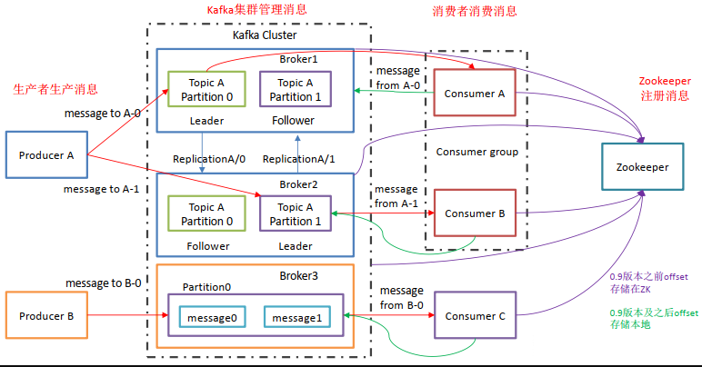

[toc]

# Kafka架构

## 1 架构图

## 2 概念解释

1. **Producer** ： 消息生产者，向 Kafka服务器发送消息 ；
2. **Consumer** ： 消息消费者，向 Kafka broker 取消息的客户端；
3. **Consumer Group （CG）**： 消费者组，由多个 consumer 组成。 
    消费者组内每个消费者负责消费不同分区的数据，一个分区只能由一个组内消费者消费；消费者组之间互不影响。 
    所有的消费者都属于某个消费者组，即消费者组是逻辑上的一个订阅者。
4. **Broker** ：经纪人 一台 Kafka 服务器就是一个 broker。一个集群由多个 broker 组成。一个 broker可以容纳多个 topic。
5. **Topic** ： 话题，可以理解为一个队列， 生产者和消费者面向的都是一个 topic；
6. **Partition**： 为了实现扩展性，一个非常大的 topic 可以分布到多个 broker（即服务器）上，一个 topic 可以分为多个 partition，每个 partition 是一个有序的队列；
7. **Replication**： 副本（Replication），为保证集群中的某个节点发生故障时， 该节点上的 partition 数据不丢失，且 Kafka仍然能够继续工作， Kafka 提供了副本机制，一个 topic 的每个分区都有若干个副本，一个 leader 和若干个 follower。
8. **Leader**： 每个分区多个副本的“主”，生产者发送数据的对象，以及消费者消费数据的对象都是 leader。
9. **Follower**： 每个分区多个副本中的“从”，实时从 leader 中同步数据，保持和 leader 数据的同步。 leader 发生故障时，某个 Follower 会成为新的 leader。

## ps-相关资料

[Kafka学习笔记](https://my.oschina.net/jallenkwong/blog/4449224)