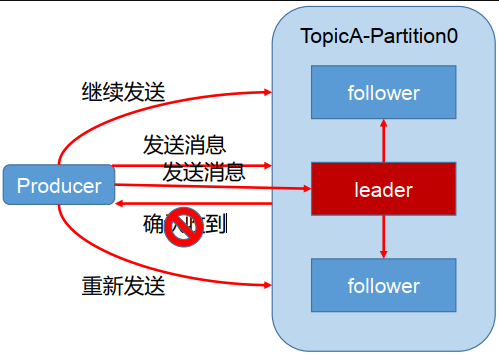
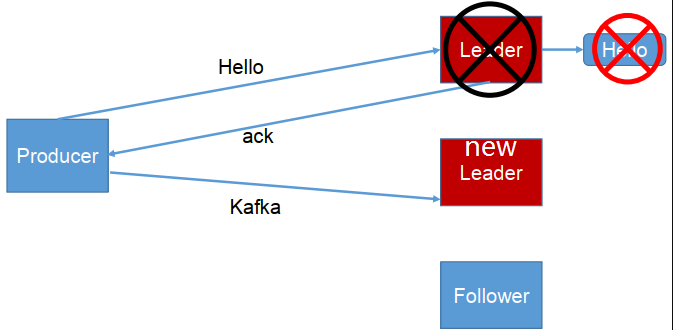
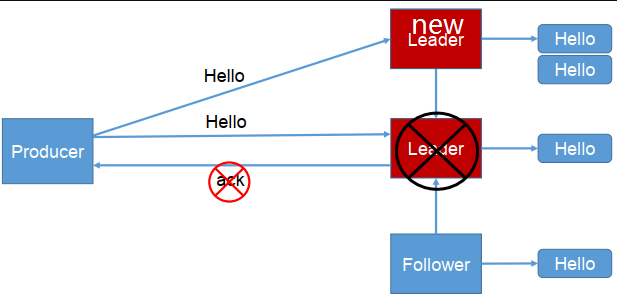
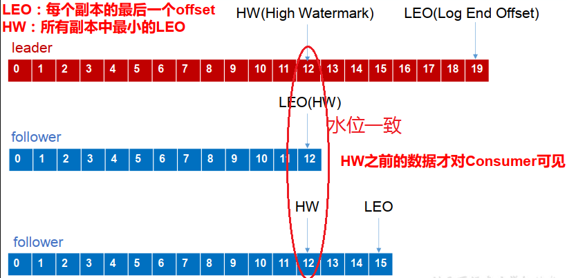

[toc]

# Kafka生产者ISR

## 1 消息的ack

为保证 producer 发送的数据，能可靠的发送到指定的 topic， topic 的每个 partition 收到producer 发送的数据后，都需要向 producer 发送 ack（acknowledgement 确认收到），如果producer 收到 ack， 就会进行下一轮的发送，否则重新发送数据。

## 2 副本同步策略

| 序号 | 方案                          | 优点                                                         | 缺点                                                         |
| ---- | ----------------------------- | ------------------------------------------------------------ | ------------------------------------------------------------ |
| 1    | 半数以上完成同步， 就发送 ack | 延迟低                                                       | 选举新的 leader 时，容忍 n 台节点的故障，需要 2n+1 个副本。（如果集群有2n+1台机器，选举leader的时候至少需要半数以上即n+1台机器投票，那么能容忍的故障，最多就是n台机器发生故障）容错率：1/2 |
| 2    | 全部完成同步，才发送ack       | 选举新的 leader 时， 容忍 n 台节点的故障，需要 n+1 个副本（如果集群有n+1台机器，选举leader的时候只要有一个副本就可以了）容错率：1 | 延迟高                                                       |

Kafka 选择了第二种方案，原因如下：

1. 同样为了容忍 n 台节点的故障，第一种方案需要 2n+1 个副本，而第二种方案只需要 n+1 个副本，而 Kafka 的每个分区都有大量的数据， 第一种方案会造成大量数据的冗余。
2. 虽然第二种方案的网络延迟会比较高，但网络延迟对 Kafka 的影响较小。

## 3 ISR( in-sync replica set)

采用 副本同步策略 的第二种方案之后，设想以下情景： leader 收到数据，所有 follower 都开始同步数据，但有一个 follower，因为某种故障，迟迟不能与 leader 进行同步，那 leader 就要一直等下去，直到它完成同步，才能发送 ack。这个问题怎么解决呢？

因此Leader 维护了一个动态的 **in-sync replica set** (ISR)，意为和 leader 保持同步的 follower 集合。当 ISR 中的 follower 完成数据的同步之后，就会给 leader 发送 ack。如果 follower长时间未向leader同步数据，则该follower将被踢出ISR，该时间阈值由`replica.lag.time.max.ms`参数设定。 Leader 发生故障之后，就会从 ISR 中选举新的 leader。

## 4 生产者ACK机制

对于某些不太重要的数据，对数据的可靠性要求不是很高，能够容忍数据的少量丢失，所以没必要等 ISR 中的 follower 全部接收成功。
所以 Kafka 为用户提供了三种可靠性级别，用户根据对可靠性和延迟的要求进行权衡，选择以下的配置。

**acks 参数配置**：【**助记：返ACK前，0无落盘，1一落盘，-1全落盘，（落盘：消息存到本地）**】

- 0： producer 不等待 broker 的 ack，这一操作提供了一个最低的延迟， broker 一接收到还没有写入磁盘就已经返回，当 broker 故障时有可能**丢失数据**；
- 1： producer 等待 broker 的 ack， partition 的 leader 落盘成功后返回 ack，如果在 follower同步成功之前 leader 故障，那么将会**丢失数据**；
    
- -1（all） ： producer 等待 broker 的 ack， partition 的 leader 和 ISR 的follower 全部落盘成功后才返回 ack。但是如果在 follower 同步完成后， broker 发送 ack 之前， leader 发生故障，那么会造成**数据重复**。
    

## 5 数据一致性问题

 **数据一致性主要是说不论是老的 Leader 还是新选举的 Leader，Consumer 都能读到一样的数据。** 

- LEO：（Log End Offset）每个副本的最后一个offset
- HW：（High Watermark）高水位，指的是消费者能见到的最大的 offset， **ISR 队列**中最小的 LEO

假设分区的副本为3，其中副本0是 Leader，副本1和副本2是 follower，并且在 ISR 列表里面。虽然副本0已经写入了 Message19，但是 Consumer 只能读取到 Message12。因为所有的 ISR 都同步了 Message12，只有 High Water Mark 以上的消息才支持 Consumer 读取，而 High Water Mark 取决于 ISR 列表里面偏移量最小的分区，对应于上图的副本2，**这个很类似于木桶原理**。

这样做的原因是还没有被足够多副本复制的消息被认为是“不安全”的，如果 Leader 发生崩溃，另一个副本成为新 Leader，那么这些消息很可能丢失了。如果我们允许消费者读取这些消息，可能就会破坏一致性。试想，一个消费者从当前 Leader（副本0） 读取并处理了 Message14，这个时候 Leader 挂掉了，选举了副本1为新的 Leader，这时候另一个消费者再去从新的 Leader 读取消息，发现这个消息其实并不存在，这就导致了数据不一致性问题。

当然，引入了 High Water Mark 机制，会导致 Broker 间的消息复制因为某些原因变慢，那么消息到达消费者的时间也会随之变长（因为我们会先等待消息复制完毕）。延迟时间可以通过参数 replica.lag.time.max.ms 参数配置，它指定了副本在复制消息时可被允许的最大延迟时间。

## 6 follower 故障和 leader 故障

- **follower 故障**：follower 发生故障后会被临时踢出 ISR，待该 follower 恢复后， follower 会读取本地磁盘记录的上次的 HW，并将 log 文件高于 HW 的部分截取掉，从 HW 开始向 leader 进行同步。等该 follower 的 LEO 大于等于该 Partition 的 HW，即 follower 追上 leader 之后，就可以重新加入 ISR 了。
- **leader 故障**：leader 发生故障之后，会从 ISR 中选出一个新的 leader，之后，为保证多个副本之间的数据一致性， 其余的 follower 会先将各自的 log 文件高于 HW 的部分截掉，然后从新的 leader同步数据。

注意： 这只能保证副本之间的数据一致性（ISR保证数据一致性），并不能保证数据不丢失或者不重复（ACK=-1保证数据不丢失，幂等性保证数据不重复）。

## ps-相关资料

[Kafka学习笔记](https://my.oschina.net/jallenkwong/blog/4449224)