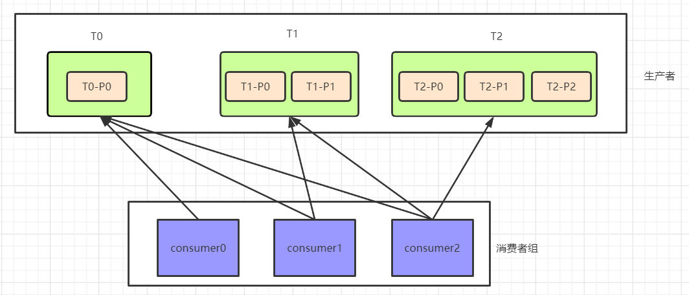

[toc]

# Kafka消费者分区分配策略--重平衡

## 1 消费方式

**consumer 采用 pull（拉） 模式从 broker 中读取数据**。

**push（推）模式很难适应消费速率不同的消费者，因为消息发送速率是由 broker 决定的**。它的目标是尽可能以最快速度传递消息，但是这样很容易造成 consumer 来不及处理消息，典型的表现就是拒绝服务以及网络拥塞。而 pull 模式则可以根据 consumer 的消费能力以适当的速率消费消息。

**pull 模式不足之处**是，如果 kafka 没有数据，消费者可能会陷入循环中， 一直返回空数据。 针对这一点， Kafka 的消费者在消费数据时会传入一个时长参数 timeout，如果当前没有数据可供消费， consumer 会等待一段时间之后再返回，这段时长即为 timeout。

## 2 Kafka消费者组

消费者组是由多个消费者组成的，**组内可以有一个或多个消费者实例**，而这些消费者实例共享一个id，称为group id，默认创建消费者的group id是在KAFKA_HOME/conf/consumer.properties文件中定义的，默认值为test-consumer-group。 

消费者组内的所有成员一起订阅某个主题的所有分区，注意**一个消费者组中，每一个分区只能由组内的一消费者订阅**。 

消费者组举例：

kafka cluster中有两台broker服务器（server1和server2），每一台都有两个分区，这四个分区都是同一个topic下的。下左的消费者组A，组内有两个消费者(c1和c2)，每个消费者负责两个分区的消费，而右边的消费者组B有四个消费者，每个负责消费一个分区。 

## 3 重平衡(分区分配)

### 3.1 什么是重平衡(分区分配)

重平衡其实就是一个协议，它规定了如何让消费者组下的所有消费者来分配topic中的每一个分区。比如一个topic有100个分区，一个消费者组内有20个消费者，在协调者的控制下让组内每一个消费者分配到5个分区，这个分配的过程就是重平衡。 

重平衡的触发条件主要有三个：

1. 消费者组内成员发生变更，这个变更包括了增加和减少消费者。注意这里的减少有很大的可能是被动的，就是某个消费者崩溃退出了
2. 主题的分区数发生变更，kafka目前只支持增加分区，当增加的时候就会触发重平衡
3. 订阅的主题发生变化，当消费者组使用正则表达式订阅主题，而恰好又新建了对应的主题，就会触发重平衡

### 3.2 为什么需要避免重平衡(分区分配)

因为重平衡过程中，消费者无法从kafka消费消息，这**对kafka的TPS影响极大**，而如果kafka集内节点较多，比如数百个，那重平衡可能会耗时极多。数分钟到数小时都有可能，而**这段时间kafka基本处于不可用状态**。所以在实际环境中，应该尽量避免重平衡发生。 

## 4 重平衡(分区分配)策略

一个 consumer group 中有多个 consumer，一个 topic 有多个 partition，所以必然会涉及到 partition 的分配问题，即确定那个 partition 由哪个 consumer 来消费。

Kafka 有三种分配策略：

- Round Robin
- Range（默认策略）
- Sticky ( 新版本中新增 )

[分配策略官网解释](http://kafka.apache.org/0110/documentation/#producerconfigs)

### 4.1 Round Robin

关于Round Robin重分配策略，其主要采用的是一种轮询的方式分配所有的分区，该策略主要实现的步骤如下。

这里我们首先假设有三个Topic：T0(1个分区)、T1(2个分区)和T2(3个分区)，那么总共有六个分区，这六个分区分别为：T0-P0、T1-P0、T1-P1、T2-P0、T2-P1和T2-P2。这里假设我们有三个consumer：C0、C1和C2，它们订阅情况为：C0订阅T0，C1订阅T0和T1，C2订阅T0、T1和T2，如下：

那么这些分区的分配步骤如下： 

1.  首先将所有的partition和consumer按照字典序进行排序，所谓的字典序，就是按照其名称的字符串顺序，那么上面的六个分区和三个consumer排序之后分别为： 
    
2. 然后依次以按顺序轮询的方式将这六个分区分配给三个consumer，如果当前consumer没有订阅当前分区所在的topic，则轮询的判断下一个consumer：
3. 尝试将t0-0分配给C0，由于C0订阅了t0，因而可以分配成功；
4. 尝试将t1-0分配给C1，由于C1订阅了t1，因而可以分配成功；
5. 尝试将t1-1分配给C2，由于C2订阅了t1，因而可以分配成功；
6. 尝试将t2-0分配给C0，由于C0没有订阅t2，因而会轮询下一个consumer；
7. 尝试将t2-0分配给C1，由于C1没有订阅t2，因而会轮询下一个consumer；
8. 尝试将t2-0分配给C2，由于C2订阅了t2，因而可以分配成功；
9. 同理由于t2-1和t2-2所在的topic都没有被C0和C1所订阅，因而都不会分配成功，最终都会分配给C2。

 按照上述的步骤将所有的分区都分配完毕之后，最终分区的订阅情况如下： 

从上面的步骤分析可以看出，Round robin轮询的策略就是简单的将所有的partition和consumer按照字典序进行排序之后，然后依次将partition分配给各个consumer，如果当前的consumer没有订阅当前的partition，那么就会轮询下一个consumer，直至最终将所有的分区都分配完毕。但是从上面的分配结果可以看出，轮询的方式可能会导致每个consumer所承载的分区数量不一致，从而导致各个consumer压力不均一。 

### 4.2 Range(默认)

`Range`重分配策略：首先会计算各个consumer将会承载的分区数量，然后将指定数量的分区分配给该consumer。

这里我们假设有有两个Topic：T0和T1，这两个Topic分别都有三个分区，所以总共分区有六个：T0-P0、T0-P1、T0-P2和T1-P0、T1-P1、T1-P2。消费者组有两个consumer：C0和C1，这两个消费者都订阅了T0和T1。

那么`Range`分配策略将会按照如下步骤进行分区的分配： 

1. 需要注意的是，`Range`策略是按照Topic依次进行分配的，比如我们以T0进行讲解，其首先会获取T0的所有分区：T0-P0、T0-P1和T0-P2，以及所有订阅了该Topic的consumer：C0和C1，并且会将这些分区和consumer按照字典序进行排序；
2. 然后按照平均分配的方式计算每个consumer会得到多少个分区，如果没有除尽，则会将多出来的分区依次计算到前面几个consumer。
    比如这里是三个分区和两个consumer，那么每个consumer至少会得到1个分区，而3除以2后还余1，那么就会将多余的部分依次算到前面几个consumer，也就是这里的1会分配给第一个consumer;
    总结来说，那么C0将会从第0个分区开始，分配2个分区，而C1将会从第2个分区开始，分配1个分区；
3. 同理，按照上面的步骤依次进行后面的topic的分配。
4. 最终上面六个分区的分配情况如下：

可以看到，如果按照`Range`分区方式进行分配，其本质上是依次遍历每个topic，然后将这些topic的分区按照其所订阅的consumer数量进行平均的范围分配。这种方式从计算原理上就会导致排序在前面的consumer分配到更多的分区，从而导致各个consumer的压力不均衡。 

### 4.3 Sticky

`Sticky`策略是新版本中新增的策略，顾名思义，这种策略会保证再分配时已经分配过的分区尽量保证其能够继续由当前正在消费的consumer继续消费，当然，前提是每个consumer所分配的分区数量都大致相同，这样能够保证每个consumer消费压力比较均衡。关于这种分配方式的分配策略，我们分两种情况进行讲解，即初始状态的分配和某个consumer宕机时的分配情况。 

#### 4.3.1 初始分配

初始状态分配的特点是，所有的分区都还未分配到任意一个consumer上。

这里我们假设有三个consumer：C0、C1和C2，三个topic：t0、t1和t2，这三个topic分别有1、2和3个分区，那么总共的分区为：t0-0、t1-0、t1-1、t2-0、t2-1和t2-2。关于订阅情况，这里C0订阅了t0，C1订阅了t0和1，C2则订阅了t0、t1和t2。

这里的分区分配规则如下： 

1. 首先将所有的分区进行排序，
    排序方式为：首先按照当前分区所分配的consumer数量从低到高进行排序，如果consumer数量相同，则按照分区的字典序进行排序。
    这里六个分区由于所在的topic的订阅情况各不相同，因而其排序结果如下： 
    
2.  然后将所有的consumer进行排序，
    其排序方式为：首先按照当前consumer已经分配的分区数量有小到大排序，如果两个consumer分配的分区数量相同，则会按照其名称的字典序进行排序。
    由于初始时，这三个consumer都没有分配任何分区，因而其排序结果即为其按照字典序进行排序的结果： 
    
3.  然后将各个分区依次遍历分配给各个consumer，首先需要注意的是，这里的遍历并不是C0分配完了再分配给C1，而是每次分配分区的时候都整个的对所有的consumer从头开始遍历分配，如果当前consumer没有订阅当前分区，则会遍历下一个consumer。然后需要注意的是，在整个分配的过程中，各个consumer所分配的分区数是动态变化的，而这种变化是会体现在各个consumer的排序上的，比如初始时C0是排在第一个的，此时如果分配了一个分区给C0，那么C0就会排到最后，因为其拥有的分区数是最多的。上面的六个分区整体的分配流程如下： 
4. 首先将t2-0尝试分配给C0，由于C0没有订阅t2，因而分配不成功，继续轮询下一个consumer；
5. 然后将t2-0尝试分配给C1，由于C1没有订阅t2，因而分配不成功，继续轮询下一个consumer；
6. 接着将t2-0尝试分配给C2，由于C2订阅了t2，因而分配成功，此时由于C2分配的分区数发生变化，各个consumer变更后的排序结果为：
    
7.  接下来的t2-1和t2-2，由于也只有C2订阅了t2，因而其最终还是会分配给C2，最终在t2-0、t2-1和t2-2分配完之后，各个consumer的排序以及其分区分配情况如下： 
    
8. 接着继续分配t1-0，首先尝试将其分配给C0，由于C0没有订阅t1，因而分配不成功，继续轮询下一个consumer；
9. 然后尝试将t1-0分配给C1，由于C1订阅了t1，因而分配成功，此时各个consumer以及其分配的分区情况如下：
    
10.  同理，接下来会分配t1-1，虽然C1和C2都订阅了t1，但是由于C1排在C2前面，因而该分区会分配给C1，即： 
    
11. 最后，尝试将t0-0分配给C0，由于C0订阅了t0，因而分配成功，最终的分配结果为：
    

上面的分配过程中，需要始终注意的是，虽然示例中的consumer顺序始终没有变化，但这是由于各个分区分配之后正好每个consumer所分配的分区数量的排序结果与初始状态一致。这种分配方式与前面的`Round Robin`进行对比，可以很明显的发现，`Sticky`重分配策略分配得更加均匀一些。 

#### 4.3.2 consumer宕机后Sticky分配策略

这里我们的示例的consumer有三个：C0、C1和C2，topic有四个：t0、t1、t2和t3，每个topic都有两个分区，那么总的分区有：t0-0、t0-1、t1-0、t1-1、t2-0、t2-1、t3-0和t3-1。这里的订阅情况为三个consumer订阅所有的主题，那么如果按照`Sticky`的分区分配策略，初始状态时，分配情况如下：

这里我们假设在消费的过程中，C1发生了宕机，此时就会发生再平衡，而根据`Sticky`策略，其再分配步骤如下：

- 首先会将宕机之后未分配的分区进行排序，排序方式为：首先按照分区所拥有的consumer数量从低到高进行排序，如果consumer数量相同，则按照分区的字典序进行排序。这里需要注意的是，由于只有C1宕机，因而未分配的分区为：t0-1、t2-0和t3-1，排序之后的结果为：
    

- 然后将所有的consumer进行排序，排序方式为：首先将consumer按照其所拥有的consumer数量从小到大排序，如果数量相同，则按照consumer名称的字典序进行排序，排序结果如下：
    

- 接着依次遍历各个分区，将其分配给各个consumer，需要注意的是，在分配的过程中，consumer所分配的分区数量是在变化的，而这种变化是会反应在consumer的排序上的：
- 首先尝试将t0-1分配给C2，由于C2订阅了t0，因而可以分配成功，此时consumer排序和分区分配情况如下，需要注意的是，虽然分配之后，C2和C0的分区数量相同，但是由于按照字典序，C0在C2前面，因而排序情况还是会发生变化：
    

- 然后尝试将t2-0分配给C0，由于C0订阅了t2，因而分配可以成功，此时consumer排序和分区分配情况如下：
    

- 最后尝试分配t3-1给C2，由于C2订阅了t3，因而分配可以成功，此时consumer排序与分区分配情况如下：
    

在上面的分区分配过程中，我们可以看到，由于分区的不断分配，各个consumer所拥有的分区数量也在不断变化，因而其排序情况也在变化，但是最终可以看到，各个分区是均匀的分配到各个consumer的，并且还保证了当前consumer已经消费的分区是不会分配到其他的consumer上的。

## ps-相关资料

[Kafka学习笔记](https://my.oschina.net/jallenkwong/blog/4449224)

[Kafka再平衡机制详解]( https://zhuanlan.zhihu.com/p/86718818 )

[详细解析kafka之 kafka消费者组与重平衡机制]( https://zhuanlan.zhihu.com/p/86718818 )