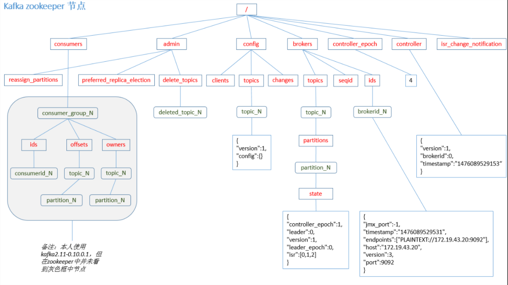

[toc]

# Kafka消费者offset的存储

由于 consumer 在消费过程中可能会出现断电宕机等故障， consumer 恢复后，需要从故障前的位置的继续消费，所以 **consumer 需要实时记录自己消费到了哪个 offset**，以便故障恢复后继续消费。

Kafka 0.9 版本之前， consumer 默认将 offset 保存在 Zookeeper 中，
从 0.9 版本开始，consumer 默认将 offset 保存在 Kafka 一个内置的 topic 中，该 topic 为`__consumer_offsets`。

## ps-相关资料

[Kafka学习笔记](https://my.oschina.net/jallenkwong/blog/4449224)