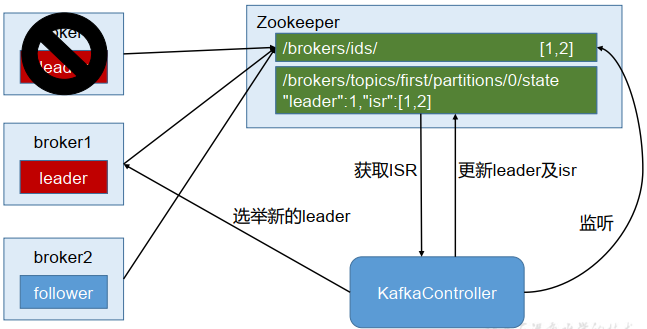

[toc]

# Kafka中Zookeeper的作用

## 1 broker中选举Controller

Kafka 集群中有一个 broker 会被选举为 Controller，负责管理集群 broker 的上下线，所有 topic 的分区副本分配和 leader 选举等工作。[Reference](http://kafka.apache.org/0110/documentation/#design_replicamanagment)

Controller 的管理工作都是依赖于 Zookeeper 的。

以下为 partition 的 leader 选举过程：

## 2 关于消费者的offset

Kafka 0.9 版本之前， consumer 默认将 offset 保存在 Zookeeper 中，
从 0.9 版本开始，consumer 默认将 offset 保存在 Kafka 一个内置的 topic 中，该 topic 为`__consumer_offsets`。

## ps-相关资料

[Kafka学习笔记](https://my.oschina.net/jallenkwong/blog/4449224)