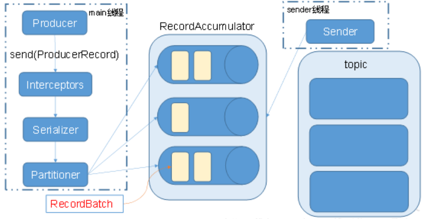

[toc]

# Kafka-面试问题

## 1 常见问题

### 1  Kafka中的HW、LEO等分别代表什么

HW : 又名高水位，根据同一分区中最低的LEO所决定，是消费者可见的最大的offset
LEO : 每个分区的最高offset

### 2 Kafka中是怎么体现消息顺序性的

每个分区内,每条消息都有offset,所以只能在同一分区内有序,但不同的分区无法做到消息顺序性

### 3 Kafka分区的目的

对于kafka集群来说,分区可以做到负载均衡,对于消费者来说,可以提高并发度,提高读取效率

### 4 Kafka 的高可靠性是怎么实现的

为了实现高可靠性,kafka使用了订阅的模式,并使用isr和ack应答机制
能进入isr中的follower和leader之间的速率不会相差10秒
当ack=0时,producer不等待broker的ack,不管数据有没有写入成功,都不再重复发该数据
当ack=1时,broker会等到leader写完数据后,就会向producer发送ack,但不会等follower同步数据,如果这时leader挂掉,producer会对新的leader发送新的数据,在old的leader中不同步的数据就会丢失
当ack=-1或者all时,broker会等到leader和isr中的所有follower都同步完数据,再向producer发送ack,有可能造成数据重复

### 5 topic的分区数可以增加或减少吗

分区可以增加，但是不能减少。
分区增加可以增加并发量，分区不能减少，主要原因是删除的分区数据难以处理。

### 6 简述Kafka的日志目录结构

每一个分区对应一个文件夹,命名为topic-0,topic-1,每个文件夹内有.index和.log文件

### 7 Kafka的那些设计让它有如此高的性能

1.kafka是分布式的消息队列
2.对log文件进行了segment,并对segment建立了索引
3.(对于单节点)使用了顺序读写,速度可以达到600M/s
4.引用了zero拷贝,在os系统就完成了读写操作

### 8 Kafka Controller的作用

负责kafka集群的上下线工作,所有topic的副本分区分配和选举leader工作

### 9 Kafka消息是采用Pull模式，还是Push模式

在producer阶段,是向broker用Push模式
在consumer阶段,是向broker用Pull模式
在Pull模式下,consumer可以根据自身速率选择如何拉取数据,避免了低速率的consumer发生崩溃的问题
但缺点是,consumer要时不时的去询问broker是否有新数据,容易发生死循环,内存溢出

### 10 Kafka中的事务是怎么实现的

kafka事务有两种：producer事务和consumer事务

1. producer事务是为了解决kafka跨分区跨会话问题，kafka不能跨分区跨会话的主要问题是每次启动的producer的PID都是系统随机给的，所以为了解决这个问题我们就要手动给producer一个全局唯一的id,也就是transaction id 简称TID，我们将TID和PID进行绑定,在producer带着TID和PID第一次向broker注册时,broker就会记录TID,并生成一个新的组件__transaction_state用来保存TID的事务状态信息，当producer重启后,就会带着TID和新的PID向broker发起请求,当发现TID一致时producer就会获取之前的PID,将覆盖掉新的PID,并获取上一次的事务状态信息,从而继续上次工作
2. consumer事务相对于producer事务就弱一点,需要先确保consumer的消费和提交位置为一致且具有事务功能,才能保证数据的完整,不然会造成数据的丢失或重复

### 11 Kafka中的分区器、序列化器、拦截器，它们间的处理顺序是什么

1. 拦截器：对于producer而言，interceptor使得用户在消息发送前以及producer回调逻辑前有机会对消息做一些定制化需求，比如修改消息等。同时，producer允许用户指定多个interceptor按序作用于同一条消息从而形成一个拦截链(interceptor chain)。
2. 序列化器：将key或value进行序列化，便于网络传输。生产者需要用序列化器（Serializer）将key和value序列化成字节数组才可以将消息传入Kafka。消费者需要用反序列化器（Deserializer）把从Kafka中收到的字节数组转化成相应的对象。
3. 分区器：消息通过send()方法发送broker的过程中，有可能会经过拦截器，序列化器，之后就会需要确定消息要发往的分区。如果ProducerRecord中指定了partition字段，那么就不需要分区器的作用。因为partition代表的就是需要发往的分区号。

处理顺序： 拦截器 -> 序列化器 -> 分区器

### 12 Kafka生产者客户端的整体结构是什么样子的？使用了几个线程来处理？分别是什么？

使用两个线程: main线程和sender线程
main线程会依次经过拦截器,序列化器,分区器将数据发送到RecourdAccumlator(线程共享变量)
再由sender线程从RecourdAccumlator中拉取数据发送到kafka broker
相关参数：
batch.size：只有数据积累到batch.size之后，sender才会发送数据。
linger.ms：如果数据迟迟未达到batch.size，sender等待linger.time之后就会发送数据。

### 13 Kafka有内部的topic吗？如果有是什么？有什么所用？

 __consumer_offsets,保存消费者offset

## ps 引用博客

[Kafka常见面试题](https://blog.csdn.net/C_Xiang_Falcon/article/details/100917145)

[20道经典的Kafka面试题详解](https://www.jianshu.com/p/511962462e58)

[18道kafka高频面试题哪些你还不会？](https://developer.aliyun.com/article/740170)

