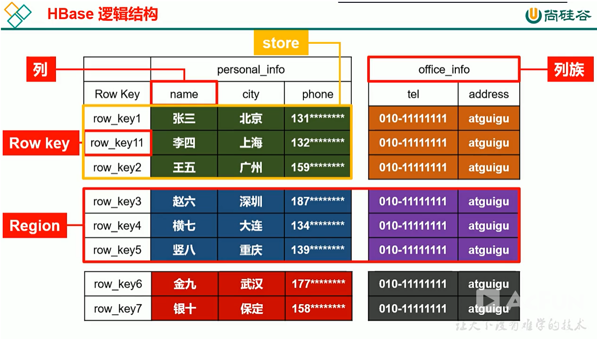
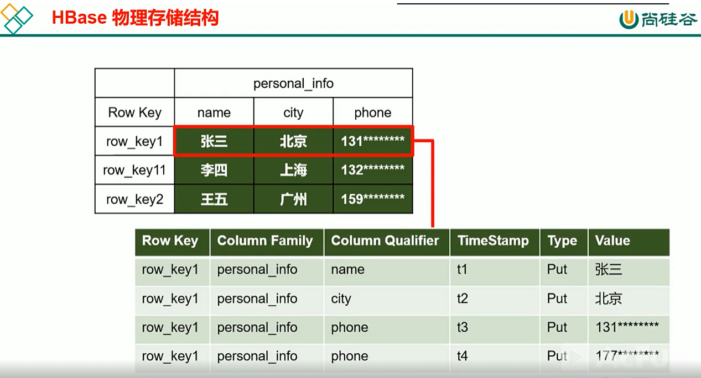

[TOC]

# Hbase基础

## 1 简介

 [HBase](http://c.biancheng.net/hbase/) 是基于 Apache Hadoop 的面向列的 [NoSQL](http://c.biancheng.net/nosql/) 数据库，是 Google 的 BigTable 的开源实现。HBase 是一个针对半结构化数据的开源的、多版本的、可伸缩的、高可靠的、高性能的、分布式的和面向列的动态模式数据库。

HBase 和传统关系数据库不同，它采用了 BigTable 的数据模型增强的稀疏排序映射表（Key/Value），其中，键由行关键字、列关键字和时间戳构成。

HBase 提供了对大规模数据的随机、实时读写访问。HBase 的目标是存储并处理大型的数据，也就是仅用普通的硬件配置，就能够处理上千亿的行和几百万的列所组成的超大型数据库。

Hadoop 是一个高容错、高延时的分布式文件系统和高并发的批处理系统，不适用于提供实时计算，而 HBase 是可以提供实时计算的分布式数据库，数据被保存在 HDFS (分布式文件系统）上，由 HDFS 保证其高容错性。

HBase 上的数据是以二进制流的形式存储在 HDFS 上的数据块中的，但是，HBase 上的存储数据对于 HDFS 是透明的。

HBase 可以直接使用本地文件系统，也可以使用 Hadoop 的HDFS。HBase 中保存的数据可以使用 MapReduce 来处理，它将数据存储和并行计算有机地结合在一起。

HBase 是按列族进行数据存储的。每个列族会包括许多列，并且这些列是经常需要同时处理的属性。也就是说，HBase 把经常需要一起处理的列构成列族一起存放，从而避免了需要对这些列进行重构的操作。

HBase 在充分利用列式存储优势的同时，通过列族减少列连接的需求。 

## 2 基本概念

HBase 中的数据被存储在表中，具有行和列，是一个多维的映射结构。

### 2.1  表（Table)

HBase采用表来组织数据，表由许多行和列组成，列划分为多个列族。

### 2.2  行（Row)

在表里面，每一行代表着一个数据对象。每一行都是由一个行键（Row Key）和一个或者多个列组成的。行键是行的唯一标识，行键并没有什么特定的数据类型，以二进制的字节来存储，按字母顺序排序。
因为表的行是按照行键顺序来进行存储的，所以行键的设计相当重要。设计行键的一个重要原则就是相关的行键要存储在接近的位置，例如，设计记录网站的表时，行键需要将域名反转（例如，org.apache.www、org.apache.mail、org.apache.jira），这样的设计能使与 apache 相关的域名在表中存储的位置非常接近。

### 2.3  列（Column）

列由列族（Column Family）和列限定符（Column Qualifier）联合标识，由“：”进行间隔，如 family:qualifiero

### 2.4  列族（Column Family)

在定义 HBase 表的时候需要提前设置好列族，表中所有的列都需要组织在列族里面。列族一旦确定后，就不能轻易修改，因为它会影响到 HBase 真实的物理存储结构，但是列族中的列限定符及其对应的值可以动态增删。
表中的每一行都有相同的列族，但是不需要每一行的列族里都有一致的列限定符，所以说是一种稀疏的表结构，这样可以在一定程度上避免数据的冗余。

### 2.5 列限定符（Column Qualifier）

列族中的数据通过列限定符来进行映射。列限定符不需要事先定义，也不需要在不同行之间保持一致。列限定符没有特定的数据类型，以二进制字节来存储。

### 2.6 单元（Cell）

行键、列族和列限定符一起标识一个单元，存储在单元里的数据称为单元数据，没有特定的数据类型，以二进制字节来存储。

### 2.7 时间戳（Timestamp）

默认情况下，每一个单元中的数据插入时都会用时间戳来进行版本标识。
读取单元数据时，如果时间戳没有被指定，则默认返回最新的数据；写入新的单元数据时，如果没有设置时间戳，则默认使用当前时间。每一个列族的单元数据的版本数量都被 HBase 单独维护，默认情况下，HBase 保留 3 个版本数据。

## 3 逻辑结构

## 4 物理结构

## 4 Phoenix

[介绍&使用](https://github.com/heibaiying/BigData-Notes/blob/master/notes/Hbase%E7%9A%84SQL%E4%B8%AD%E9%97%B4%E5%B1%82_Phoenix.md)

`Phoenix` 是 HBase 的开源 SQL 中间层，它允许你使用标准 JDBC 的方式来操作 HBase 上的数据。在 `Phoenix` 之前，如果你要访问 HBase，只能调用它的 Java API，但相比于使用一行 SQL 就能实现数据查询，HBase 的 API 还是过于复杂。`Phoenix` 的理念是 `we put sql SQL back in NOSQL`，即你可以使用标准的 SQL 就能完成对 HBase 上数据的操作。同时这也意味着你可以通过集成 `Spring Data JPA` 或 `Mybatis` 等常用的持久层框架来操作 HBase。

其次 `Phoenix` 的性能表现也非常优异，`Phoenix` 查询引擎会将 SQL 查询转换为一个或多个 HBase Scan，通过并行执行来生成标准的 JDBC 结果集。它通过直接使用 HBase API 以及协处理器和自定义过滤器，可以为小型数据查询提供毫秒级的性能，为千万行数据的查询提供秒级的性能。同时 Phoenix 还拥有二级索引等 HBase 不具备的特性，因为以上的优点，所以 `Phoenix` 成为了 HBase 最优秀的 SQL 中间层。

