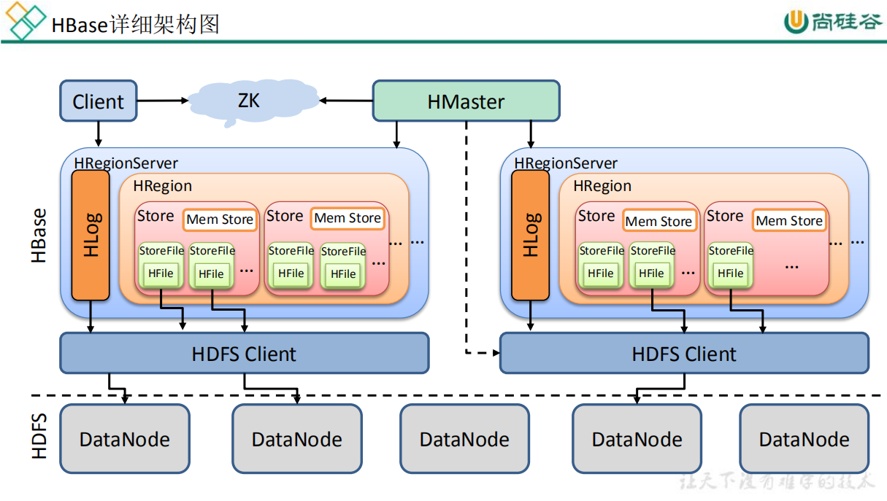
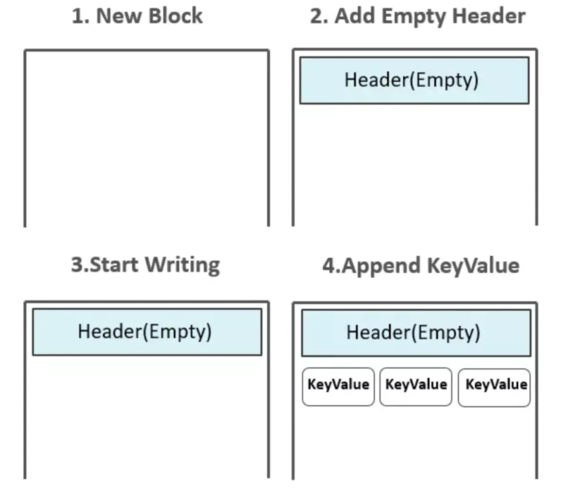
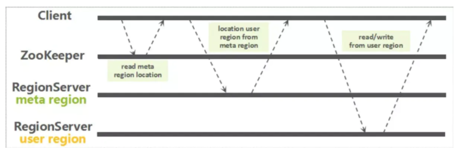

[TOC]

# HBase架构

## 1 详细架构

### 1.1 架构图



### 1.2 存储设计

在Hbase中，表被分割成多个更小的块然后分散的存储在不同的服务器上，这些小块叫做Regions，存放Regions的地方叫做RegionServer。Master进程负责处理不同的RegionServer之间的Region的分发。在Hbase实现中HRegionServer和HRegion类代表RegionServer和Region。HRegionServer除了包含一些HRegions之外，还处理两种类型的文件用于数据存储

- HLog， 预写日志文件，也叫做WAL(write-ahead log)
- HFile 真实的数据存储文件

#### 1.2.1 HLog

MasterProcWAL：HMaster记录管理操作，比如解决冲突的服务器，表创建和其它DDLs等操作到它的WAL文件中，这个WALs存储在MasterProcWALs目录下，它不像RegionServer的WALs，HMaster的WAL也支持弹性操作，就是如果Master服务器挂了，其它的Master接管的时候继续操作这个文件。

WAL记录所有的Hbase数据改变，如果一个RegionServer在MemStore进行FLush的时候挂掉了，WAL可以保证数据的改变被应用到。如果写WAL失败了，那么修改数据的完整操作就是失败的。

- 通常情况，每个RegionServer只有一个WAL实例。在2.0之前，WAL的实现叫做HLog

- WAL位于*/hbase/WALs/*目录下

- MultiWAL: 如果每个RegionServer只有一个WAL，由于HDFS必须是连续的，导致必须写WAL连续的，然后出现性能问题。MultiWAL可以让RegionServer同时写多个WAL并行的，通过HDFS底层的多管道，最终提升总的吞吐量，但是不会提升单个Region的吞吐量。

- ```jsx
    // 启用MultiWAL
    <property>
      <name>hbase.wal.provider</name>
      <value>multiwal</value>
    </property>
    ```

#### 1.2.2 HFile

HFile是Hbase在HDFS中**存储数据的格式**，它包含多层的索引，这样在Hbase检索数据的时候就不用完全的加载整个文件。索引的大小(keys的大小，数据量的大小)影响block的大小，在大数据集的情况下，block的大小设置为每个RegionServer 1GB也是常见的。

Hfile生成方式：

1. 起初，HFile中并没有任何Block，数据还存在于MemStore中，Flush发生时，创建HFile Writer，第一个空的Data Block出现。
2. 初始化后的Data Block中为Header部分预留了空间，Header部分用来存放一个Data Block的元数据信息。
3. 然后位于MemStore中的KeyValues被一个个append到位于内存中的第一个Data Block中

**注**：如果配置了Data Block Encoding，则会在Append KeyValue的时候进行同步编码，编码后的数据不再是单纯的KeyValue模式。Data Block Encoding是HBase为了降低KeyValue结构性膨胀而提供的内部编码机制。



### 1.3 读写简流程



## ps-相关引用

[HBase架构](https://www.jianshu.com/p/5aceaa02303b)

[视屏-尚硅谷HBase教程-详细架构](https://www.bilibili.com/video/BV1Y4411B7jy?t=368&p=14)

