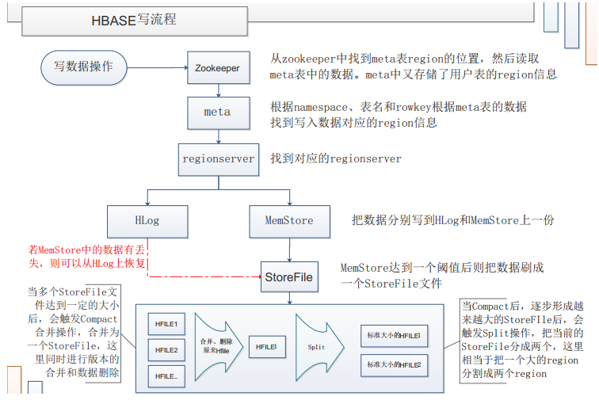
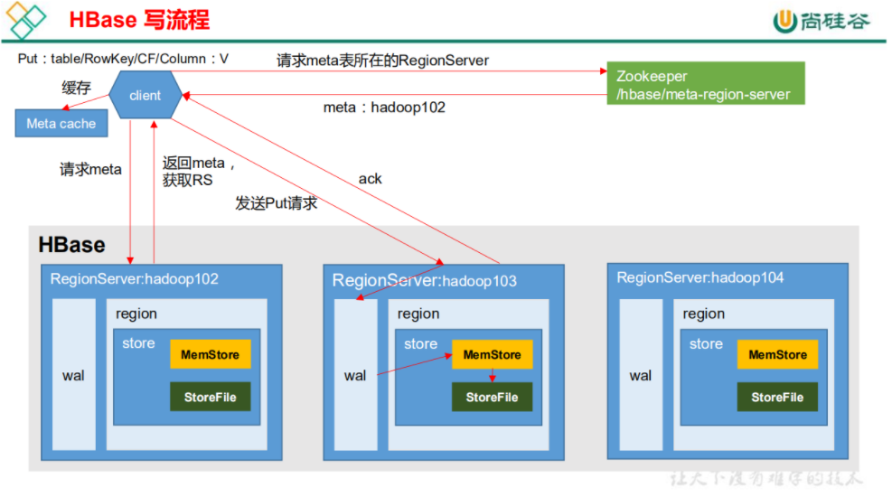
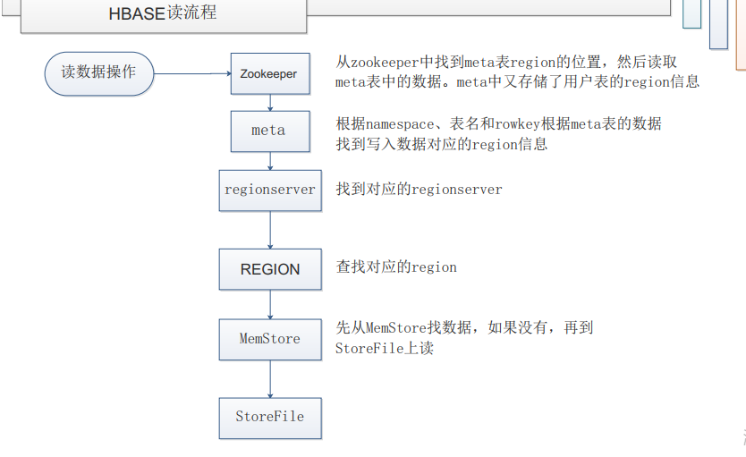
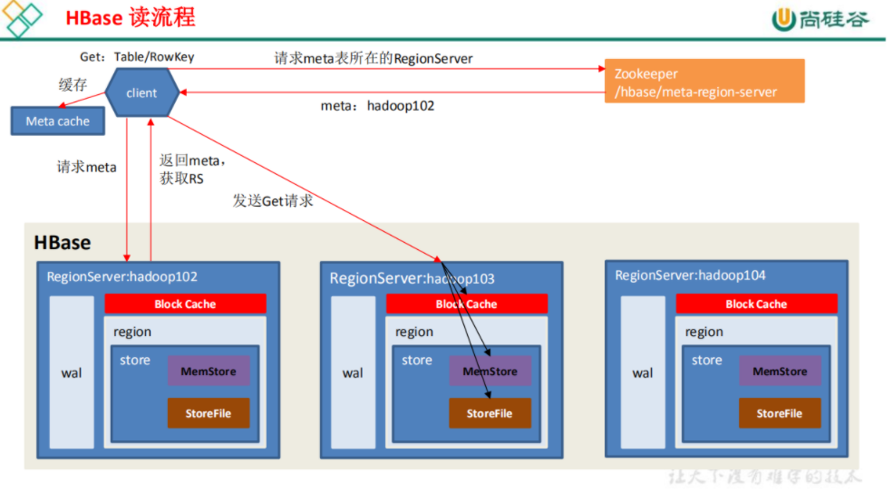

[TOC]

# HBase读写流程

## 1 写流程

1. Client先访问zookeeper，获取hbase:meta表位于哪个RegionServer。
2. 访问对应的RegionServer，获取hbase:meta表，根据读请求的namespace:table/rowkey，查询出目标数据位于哪个RegionServer中的哪个Region中。并将该table的region信息以及meta表的位置信息缓存在客户端的metacache，方便下次访问。
3. 与目标RegionServer进行通讯；
4. 将数据顺序写入（追加）到WAL（WAL存储在HDFS中，即使发生宕机，也可以通过WAL还原初始数据）；
5. 再将数据写入对应的MemStore，数据会在MemStore进行排序；
    HRegion中代码实现流程其实是这样的：数据先是写到WAL里，但是不直接写入HDFS，之后再写到MemStore中，最后把WAL写到HDFS，如果写WAL到HDFS最终是失败的（捕获了异常），那么这里就会把前面写入MeMStore中的数据擦除掉，所以我们直接理解HRegion先是把数据写到WAL再写到MemStore也是没错的。
6. 向客户端发送ack；
7. 等达到MemStore的刷写时机后（当增加到一定大小，达到预设的Flush size阈值时，会触发flush memstore），将数据刷写到StoreFile(HFile)。
8. 随着Storefile文件的不断增多，当增长到一定阈值后，触发compact合并操作，将多个storefile合并成一个，同时进行版本合并和数据删除。
9. storefile通过不断compact合并操作，逐步形成越来越大的storefile。
10. 单个storefile大小超过一定阈值后，触发split操作，把当前region拆分成两个，新拆分的2个region会被hbase master分配到相应的2个regionserver上。

## 2 读流程

1. Client先访问zookeeper，获取hbase:meta表位于哪个RegionServer。
2. 访问对应的RegionServer，获取hbase:meta表，根据读请求的namespace:table/rowkey，查询出目标数据位于哪个RegionServer中的哪个Region中。并将该table的region信息以及meta表的位置信息缓存在客户端的metacache，方便下次访问。
3. 与目标RegionServer进行通讯；
4. 分别在BlockCache（读缓存），MemStore和StoreFile（HFile）中查询目标数据，并将查到的所有数据进行合并。此处所有数据是指同一条数据的不同版本（timestamp）或者不同的类型（Put/Delete）。
5. 将从文件中查询到的数据块（Block，HFile数据存储单元，默认大小为64KB）缓存到BlockCache。
6. 将合并后的最终结果返回给客户端。

## 相关资料

[HBase读写流程](https://github.com/heibaiying/BigData-Notes/blob/master/notes/Hbase%E7%9A%84SQL%E4%B8%AD%E9%97%B4%E5%B1%82_Phoenix.md)

[HBase读写流程2](https://www.cnblogs.com/yfb918/p/10416906.html)

[HBase读写数据流程](https://www.cnblogs.com/noyouth/p/13124080.html)

[bilibili-尚硅谷HBase教程-读写流程](https://www.bilibili.com/video/BV1Y4411B7jy?p=15)