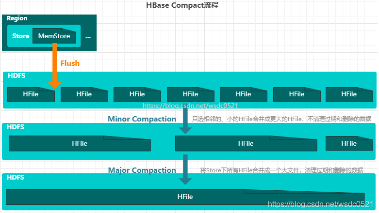

[toc]

# HBase Flush&Compact&Split流程

## 1 Flush(刷写)流程

Flush流程表示的就是将内存中的MemStore数据持久化到HDFS内，即可以避免内存压力过大又可以保证数据安全，我们知道一个Region内包含多个列族，即在同一个Region内的每个Store表示了不同的列族，而每次Flush都会将MemStore持久化到HDFS内的一个HFile中，因此一个Store的数据最终会落到很多HFile中。

MemStore触发Flush刷写的条件如下，基本上就是按时间和容量：

1. 当Region内某个MemStore 的大小达到了参数（ hbase.hregion.memstore.flush.size）的值（默认值 128M），该Region内所有 MemStore 都会刷写；
2. 当MemStore 的大小达到了公式 [hbase.hregion.memstore.flush.size（默认128MB） * hbase.hregion.memstore.block.multiplier（默认4）] 时，会阻止继续往该MemStore中写数据；
3. 当 RegionServer 中 MemStore 的总大小达到公式[java_heapsize * hbase.regionserver.global.memstore.size（默认值 0.4）*hbase.regionserver.global.memstore.size.lower.limit（默认值 0.95）] 时，Region会按照其所有MemStore 的大小顺序（由大到小）依次进行刷写。直到 该RegionServer 中所有 MemStore 的总大小减小到上述值以下。
4. 当 RegionServer 中 MemStore 的总大小达到公式[java_heapsize * hbase.regionserver.global.memstore.size（默认值 0.4）] 时，会阻止继续往该RegionServer 中所有MemStore中写数据；
5. 通过配置参数（hbase.regionserver.optionalcacheflushinterval）进行自动刷写（默认 1 小时）；
6. 当 WAL 文件的数量超过最大数量 hbase.regionserver.max.logs，region 会按照时间顺序依次进行刷写，直到 WAL 文件数量减小到 hbase.regionserver.max.log 以下（该属性名已经废弃，现无需手动设置，默认值为 32）。

## 2 Compact(合并)流程

由于MemStore 每次刷写都会生成一个新的HFile，且同一个字段的不同版本（timestamp）和不同类型（Put/Delete）有可能会分布在不同的 HFile 中，因此查询时需要遍历很多 HFile文件。为了减少 HFile 的个数，以及清理掉过期和删除的数据，HBase会对StoreFile 进行Compact操作。

HBase会将队列中的HFile 按照文件年龄排序（older to younger），Minor Compaction总是从older HFile 开始选择，然后将选择出来的HFiles进行Minor Compaction：

1. 如果该文件小于hbase.hstore.compaction.min.size（为memestoreFlushSize）则一定会被添加到合并队列中。
2. 如果该文件大于hbase.hstore.compaction.max.size（Long.MAX_VALUE）则一定会被排除，这个值很大，一般不会有。
3. 如果该文件的大小 小于它后面hbase.hstore.compaction.max（默认为10） 个HFile 的大小之和乘以一个ratio（配置项是hbase.hstore.compaction.ratio，默认为1.2），则该HFile 也将加入到minor compaction 中。如果他后面不足10个文件，那么也就是取他后面几个文件总和*ratio。

**相关参数**：

| 参数名           | 配置项                           | 默认值            | 含义                   |
| :--------------- | :------------------------------- | :---------------- | :--------------------- |
| minFileToCompact | hbase.hstore.compactionThreshold | 3                 | 最低合并HFile数量      |
| maxFileToCompact | hbase.hstore.compaction.max      | 10                | 最大合并HFile数量      |
| minCompactSize   | hbase.hstore.compaction.min.size | memstoreFlushSize | 最小合并HFile文件大小  |
| maxCompactSize   | hbase.hstore.compaction.max.size | Long.MAX_VALUE    | 最大合并HFile文件大小  |
| majorCompaction  | hbase.hregion.majorcompaction    | 7天               | 自动触发Major 间隔时间 |

## 3 Split(拆分)流程

默认情况下，每个 Table 起初只有一个 Region，随着数据的不断写入，Region 会越来越大然后自动进行**拆分（Split）**。刚拆分时，两个子 Region 都位于当前的 RegionServer，但出于负载均衡的考虑，HMaster 有可能会将某个 Region 转移给其他的 RegionServer。 

**Region 拆分时机**：

1. 当1个region中的某个Store下所有StoreFile的总大小超过hbase.hregion.max.filesize（默认10GB），该 Region 就会进行拆分（0.94 版本之前）。
2. 当1个region 中的某个 Store 下所有 StoreFile 的总大小超过公式Min(R^2 * "hbase.hregion.memstore.flush.size(默认128MB)",hbase.hregion.max.filesize(默认10GB)")，该 Region 就会进行拆分，其中 R 为当前 RegionServer 中属于该 Table 的Region个数（0.94 版本之后）。

可以看出，在新版之后，Region的拆分条件会默认从128MB不断的变大一直到10GB，这样就会导致某个表的不同Region内的数据不均衡的情况，因此在实际应用中都会提前设置预分区以及RowKey优化，避免因自动拆分导致的数据倾斜的情况。 

## 4 数据删除时间

当HBase中执行PUT修改相同RowKey的数据或者执行DELETE删除RowKey的数据时，我们可以通过命令查看到历史版本，那么什么时候这些过期数据和删除数据才会被删除呢？

其实失效数据在Flush和Compact都会被删除，但它们实现的地方不一样：

- **Flush刷写时**
    - Flush将MemStore内的数据进行合并然后去除小于该列族设置的VERSION号以前的数据，将剩余数据持久化到HFile；
    - 当执行DELETE时，Flush操作不会删掉MemStore里的该删除标记记录，只会删掉MemStore内该RowKey的在该删除标记操作的timestamp之前的操作，原因是可能在之前已持久化到HFile物理文件中也有该RowKey记录的历史版本，如果把内存里的删除标记也删除的话，再次查询就会将物理文件中的历史版本查出来，这样就不对了，因此Flush不会删除MemStore内的删除标记记录。
- **Compact合并时**
    - Compact命令会真正将内存和磁盘上的文件进行merge，去除小于该列族设置的VERSION号以前的数据，将剩余数据合并为一个新的HFile；

## ps-相关资料

[HBase系列（三）、读写原理，Flush刷写，HFile Compact合并，Region Split切分](https://blog.csdn.net/wsdc0521/article/details/108526266)