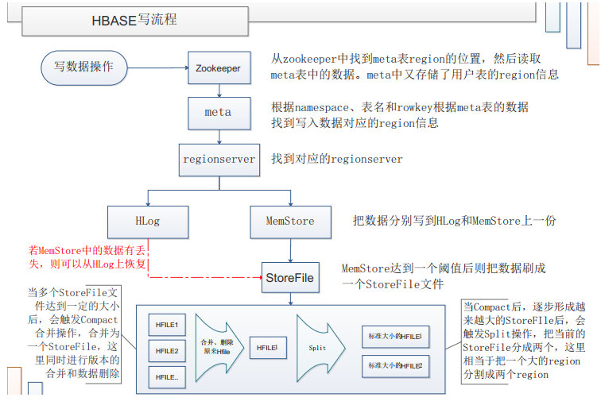
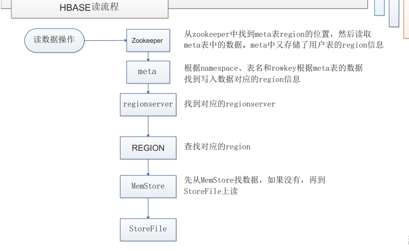

[TOC]

# HBase读写流程

## 1 写流程

## 2 读流程

## 相关资料

[HBase读写流程](https://github.com/heibaiying/BigData-Notes/blob/master/notes/Hbase%E7%9A%84SQL%E4%B8%AD%E9%97%B4%E5%B1%82_Phoenix.md)

[HBase读写流程](https://www.cnblogs.com/yfb918/p/10416906.html)