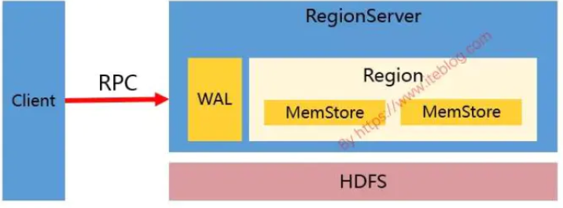
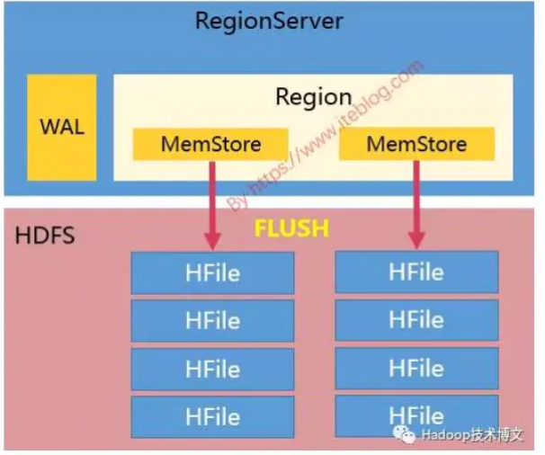

[toc]

# 为什么不建议在HBase中使用过多列族

 HBase官网建议每张表的列族数建议设在1-3之间，具体原因如下：

## 1 列族数对Flush的影响

在Hbase中，调用API往对应的表插入数据是会写入到Memstore，而Memstore是一种内存结构，每个列族对应一个Memsotre和零个或多个Hfile。如果表有两个列族，那么相应的Region中存在两个MemStore，如下图所示：

从上图可以看出，越多的列族，将会导致内存中存在越多的Memstore；而存储在Memstore中的数据在满足一定的条件将会进行Flush操作；每次Flush的时候，每个Memstore将在磁盘生成一个Hfile文件，如下：

如上所示，越多的列族最终持久化到磁盘的Hfile越多。更要命的是，当前Flush操作时Region级别的，也就是说，Region中某个Memstore被Flush，同一个Region的其他Memstore也会进行Flush操作。当表有很多列族，且列族之间数据不均匀，比如一个列族有100W行，一个列族只有10行，这样会导致持久化到磁盘的文件数很多，同时有很多小文件，而且每次Flush操作也涉及到一定的IO操作。

## 2 列族数对Split的影响

当Hbase表中某个Region过大(比如大于 hbase.hregion.max.filesize配置的大小)会被拆分成两个。如果我们有很多列族，而这些列族之间的数据量相差悬殊。比如：有些列有100W行，而有些列族只有10行，这样在Region Split的时候会导致原本数据量很小的Hfile文件进一步被拆分，从而产生更多的小文件。**注意：Region Split 是针对所有的列族进行的，这样做的目的是同一行的数据即使在Split后也是存在同一个Region的。**

- 注意：Region分裂并不是说整个Region大小加起来大于 hbase.hregion.max.filesize配置的大小就拆分，而是说Region中某个最大的Store/Hfile/StoreFile大于 hbase.hregion.max.filesize才会触发Region拆分的。

## 3 列族数对Compaction的影响

与Flush操作一样，目前Hbase的Compaction操作也是Region级别的，过多的列族也会产生不必要的IO。

## 4 列族数对HDFS的影响

HDFS其实对一个目录下的文件数是有限制的（dfs.namenode.fs-limits.max-directory-items）(hadoop不建议存小文件)。

如果我们有N个列族，M个Region，那么我们持久化到HDFS至少会产生NM个文件；而每个列族对应底层的HFile文件往往不止一个，我们假设为K个，那么最终表在HDFS目录下的文件数是NM*K，这可能会受到HDFS的限制。

## 5 列族数对RegionServer内存的影响

一个列族在RegionServer中对应一个MemStore。Hbase在0.90.1版本开始引入了MSLAB(Memstore-Local  Allocation Buffers)，这个功能是默认开启的，这使得每个Memstore在内存占用2MB的buffer。如果我们有很多的列族，那么光Memstore的缓存就会占用很多内存。 

- MSLAB默认开始配置项：hbase.hregion.memstore.mslab.enable
- memstore buffer大小配置项：hbase.hregion.memstore.mslab.chunksize

## ps-引用资料

[Hbase--为什么不建议在Hbase中使用过多列族]( https://www.jianshu.com/p/aedb2566cbc1 )