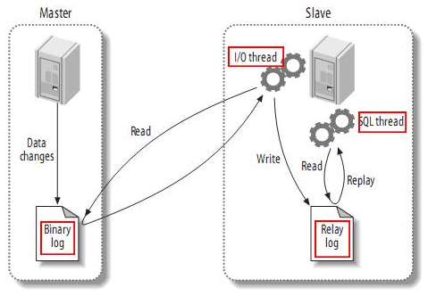
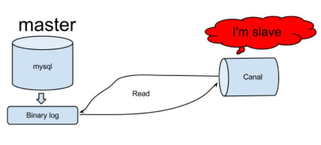
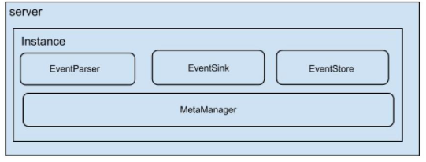

[toc]

# Canal简介

主要用途是基于 MySQL 数据库**增量**日志解析，提供增量数据订阅和消费

## 1 工作原理

### 1.1 Mysql主备复制原理

从上层来看，复制分成三步：

1. master将改变记录到二进制日志(binary log)中（这些记录叫做二进制日志事件，binary log events，可以通过show binlog events进行查看）；
2. slave将master的binary log events拷贝到它的中继日志(relay log)；
3. slave重做中继日志中的事件，将改变反映它自己的数据。

### 1.2 Canal的工作原理

1. canal模拟mysql slave的交互协议，伪装自己为mysql slave，向mysql master发送dump协议
2. mysql master收到dump请求，开始推送binary log给slave(也就是canal)
3. canal解析binary log对象(原始为byte流)

## 2 架构

说明：

- server代表一个canal运行实例，对应于一个jvm
- instance对应于一个数据队列 （1个server对应1..n个instance)

instance模块：

- eventParser (数据源接入，模拟slave协议和master进行交互，协议解析)
- eventSink (Parser和Store链接器，进行数据过滤，加工，分发的工作)
- eventStore (数据存储)
- metaManager (增量订阅&消费信息管理器)

## ps-相关资料

[Canal-github-简介](https://github.com/alibaba/canal/wiki/%E7%AE%80%E4%BB%8B)