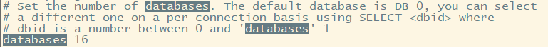

[toc]

# Redis基础

## 1 redis的数据库

redis默认有16个数据库，在redis.conf中有配置



默认使用的是第0个数据库

```shell
# 切换数据库
# 可以使用`select 数据库编号`进行切换数据库（如select 1）
127.0.0.1:6379> select 3
OK

# 通过dbsize可以查看数据库大小
127.0.0.1:6379> select 3
OK
127.0.0.1:6379[3]> dbsize
(integer) 1
127.0.0.1:6379[3]> 

# 查看所有的key
127.0.0.1:6379[3]> keys *
1) "tmp"
2) "name"

# 设置指定key的值
127.0.0.1:6379[3]> set tmp ttttt
OK

# 获取指定key的value
127.0.0.1:6379[3]> get tmp
"ttttt"

# 清空当前数据库的内容
127.0.0.1:6379[3]> flushdb
OK
127.0.0.1:6379[3]> keys *
(empty array)

# 清除所有数据库的内容
127.0.0.1:6379[3]> flushall
OK

# 判断当前key是否存在
exists key

# 设置key的过期时间（单位s)
expire key 10

# 查看当前key的剩余时间单(单位s)
ttl key

# 查看key的类型
type key

```

## 2 Redis之单线程

Redis是单线程的原因：

- Redis是基于内存的，CPU不是Redis性能瓶颈，Redis的瓶颈是机器的内存和网络带宽，既然可以使用单线程来实现，就直接使用单线程了。

## 3 Redis为什么这么快

- Redis是C语言实现的，底层优化比较好
- redis是将所有的数据全部放到内存中的，所以使用单线程去操作效率就是最高的（多线程需要上下文切换，会消耗cpu资源）

