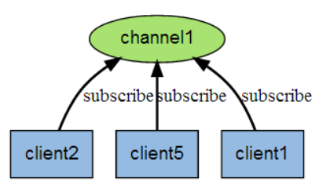
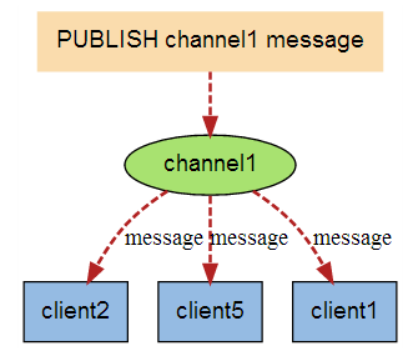

[toc]

# Redis发布订阅

## 1 发布订阅概述

进程间的一种消息通信模式：发送者(pub)发送消息，订阅者(sub)接收消息。 

下图展示了频道 channel1 ， 以及订阅这个频道的三个客户端 —— client2 、 client5 和 client1 之间 



 当有新消息通过 PUBLISH 命令发送给频道 channel1 时， 这个消息就会被发送给订阅它的三个客户端： 



## 2 常用命令

| 命令                                        | 描述                               |
| ------------------------------------------- | ---------------------------------- |
| PSUBSCRIBE pattern [pattern ...]            | 订阅一个或多个符合给定模式的频道。 |
| PUBSUB subcommand [argument [argument ...]] | 查看订阅与发布系统状态。           |
| PUBLISH channel message                     | 将信息发送到指定的频道。           |
| PUNSUBSCRIBE [pattern [pattern ...]]        | 退订所有给定模式的频道。           |
| SUBSCRIBE channel [channel ...]             | 订阅给定的一个或多个频道的信息。   |
| UNSUBSCRIBE [channel [channel ...]]         | 指退订给定的频道。                 |

## 3 实例

以下实例演示了发布订阅是如何工作的。在我们实例中我们创建了订阅频道名为 redisChat:

```
redis 127.0.0.1:6379> SUBSCRIBE redisChat

Reading messages... (press Ctrl-C to quit)
1) "subscribe"
2) "redisChat"
3) (integer) 1
```

现在，我们先重新开启个 redis 客户端，然后在同一个频道 redisChat 发布两次消息，订阅者就能接收到消息。

```
redis 127.0.0.1:6379> PUBLISH redisChat "Redis is a great caching technique"

(integer) 1

redis 127.0.0.1:6379> PUBLISH redisChat "Learn redis by runoob.com"

(integer) 1

# 订阅者的客户端会显示如下消息
1) "message"
2) "redisChat"
3) "Redis is a great caching technique"
1) "message"
2) "redisChat"
3) "Learn redis by runoob.com"
```

------

订阅多个通配符 *

```
PSUBSCRIBE new*
```

收取消息

```
PUBLISH new1 redis2015
```

