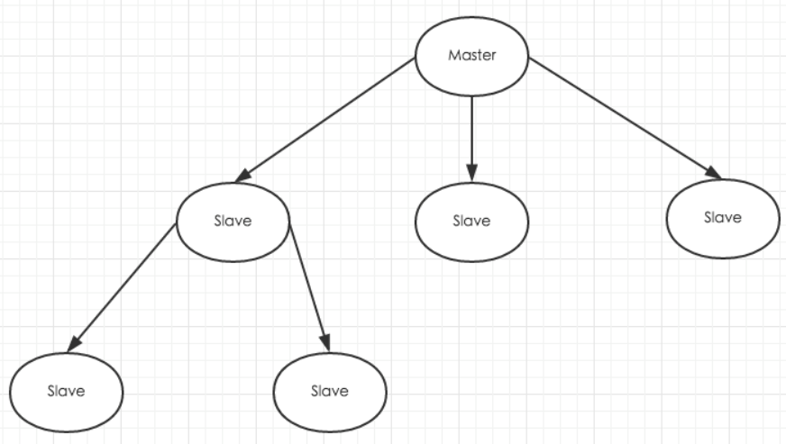
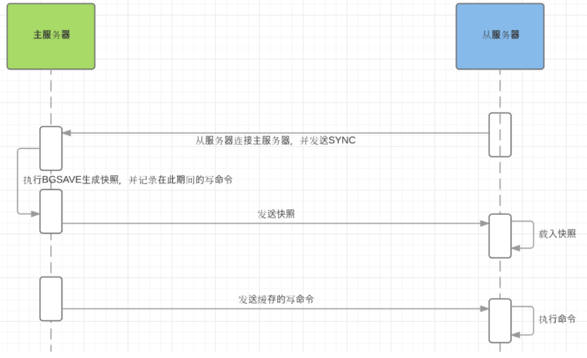

[toc]

# Redis主从复制

## 1 主从复制概述

Redis主从复制和Mysql主从复制的原因一样，Redis虽然读取写入的速度都特别快，但是也会产生读压力特别大的情况。为了分担读压力，Redis支持主从复制，Redis的主从结构可以采用一主多从或者级联结构，Redis主从复制可以根据是否是全量分为全量同步和增量同步。下图为级联结构。 

## 2 同步策略

### 2.1 同步策略概述

主从刚刚连接的时候，进行全量同步；全同步结束后，进行增量同步。当然，如果有需要，slave 在任何时候都可以发起全量同步。redis 策略是，无论如何，首先会尝试进行增量同步，如不成功，要求从机进行全量同步。 

### 2.2 同步方式

#### 2.2.1 全量同步

 Redis全量复制一般发生在Slave初始化阶段，这时Slave需要将Master上的所有数据都复制一份。具体步骤如下： 

1. 从服务器连接主服务器，发送SYNC命令； 
2. 主服务器接收到SYNC命名后，开始执行BGSAVE命令生成RDB文件并使用缓冲区记录此后执行的所有写命令； 
3. 主服务器BGSAVE执行完后，向所有从服务器发送快照文件，并在发送期间继续记录被执行的写命令； 
4. 从服务器收到快照文件后丢弃所有旧数据，载入收到的快照； 
5. 主服务器快照发送完毕后开始向从服务器发送缓冲区中的写命令； 
6. 从服务器完成对快照的载入，开始接收命令请求，并执行来自主服务器缓冲区的写命令； 

 完成上面几个步骤后就完成了从服务器数据初始化的所有操作，从服务器此时可以接收来自用户的读请求。 

#### 2.2.2 增量同步

Redis增量复制是指Slave初始化后开始正常工作时主服务器发生的写操作同步到从服务器的过程。 
增量复制的过程主要是主服务器每执行一个写命令就会向从服务器发送相同的写命令，从服务器接收并执行收到的写命令。 

### 2.3 注意点

如果多个Slave断线了，需要重启的时候，因为只要Slave启动，就会发送sync请求和主机全量同步，当多个同时出现的时候，**可能会导致Master IO剧增而宕机**。

Redis主从复制的配置十分简单，它可以使从服务器是主服务器的完全拷贝。

## 3 Redis主从复制的几点重要内容

1.  Redis使用异步复制。但从Redis 2.8开始，从服务器会周期性的应答从复制流中处理的数据量。 
2.  一个主服务器可以有多个从服务器。 
3. 从服务器也可以接受其他从服务器的连接。除了多个从服务器连接到一个主服务器之外，多个从服务器也可以连接到一个从服务器上，形成一个图状结构。
4. Redis主从复制不阻塞主服务器端。也就是说当若干个从服务器在进行初始同步时，主服务器仍然可以处理请求。 
5. 主从复制也不阻塞从服务器端。当从服务器进行初始同步时，它使用旧版本的数据来应对查询请求，假设你在redis.conf配置文件是这么配置的。否则的话，你可以配置当复制流关闭时让从服务器给客户端返回一个错误。但是，当初始同步完成后，需要删除旧的数据集和加载新的数据集，在这个短暂的时间内，**从服务器会阻塞连接进来的请求**。
6. 主从复制可以用来增强扩展性，使用多个从服务器来处理只读的请求（比如，繁重的排序操作可以放到从服务器去做），也可以简单的用来做数据冗余。 
7. 使用主从复制可以为主服务器免除把数据写入磁盘的消耗：在主服务器的redis.conf文件中配置“避免保存”（注释掉所有“保存“命令），然后连接一个配置为“进行保存”的从服务器即可。但是这个配置要确保主服务器不会自动重启

## 4 主从复制的一些特点

1. 采用异步复制；
2. 一个主redis可以含有多个从redis；
3. 每个从redis可以接收来自其他从redis服务器的连接；
4. 主从复制对于主redis服务器来说是非阻塞的，这意味着当从服务器在进行主从复制同步过程中，主redis仍然可以处理外界的访问请求；
5. 主从复制对于从redis服务器来说也是非阻塞的，这意味着，即使从redis在进行主从复制过程中也可以接受外界的查询请求，只不过这时候从redis返回的是以前老的数据，如果你不想这样，那么在启动redis时，可以在配置文件中进行设置，那么从redis在复制同步过程中来自外界的查询请求都会返回错误给客户端；（虽然说主从复制过程中对于从redis是非阻塞的，但是当从redis从主redis同步过来最新的数据后还需要将新数据加载到内存中，在加载到内存的过程中是阻塞的，在这段时间内的请求将会被阻，但是即使对于大数据集，加载到内存的时间也是比较多的）；
6. 主从复制提高了redis服务的扩展性，避免单个redis服务器的读写访问压力过大的问题，同时也可以给为数据备份及冗余提供一种解决方案；
7. 为了避免主redis服务器写磁盘压力带来的开销，可以配置让主redis不在将数据持久化到磁盘，而是通过连接让一个配置的从redis服务器及时的将相关数据持久化到磁盘，不过这样会存在一个问题，就是主redis服务器一旦重启，因为主redis服务器数据为空，这时候通过主从同步可能导致从redis服务器上的数据也被清空；

## 5 主从复制的配置

主从复制的配置十分简单，只需对从服务进行修改

如：把主服务器的信息如`slaveof 192.168.1.1 6379`加入到**从服务器**的配置文件中即可。

当然你需要把其中的192.168.1.1 6379替换为你自己的主服务器IP（或者主机名hostname）和端口。另外你可以调用SLAVEOF命令，主服务器就会开始与从服务器同步。

关于部分重新同步，还有一些针对复制内存缓冲区的优化参数。Redis.conf中有更详细的信息。

使用repl-diskless-sync配置参数来启动无磁盘复制。

使用repl-diskless-sync-delay 参数来配置传输开始的延迟时间，以便等待更多的从服务器连接上来。

## 6 从服务器的只读特性

从Redis 2.6开始，从服务器支持只读模式，并且是默认模式。这个行为是由Redis.conf文件中的`slave-read-only` 参数控制的，可以在运行中通过CONFIG SET来启用或者禁用。

**只读的从服务器会拒绝所有写命令，所以对从服务器不会有误写操作**。但这不表示可以把从服务器实例暴露在危险的网络环境下，因为像DEBUG或者CONFIG这样的管理命令还是可以运行的。不过你可以通过使用`rename-command`命令来为这些命令改名来增加安全性。

你可能想知道为什么只读限制还可以被还原，使得从服务器还可以进行写操作。虽然当主从服务器进行重新同步或者从服务器重启后，这些写操作都会失效，还是有一些使用场景会想从服务器中写入临时数据的，但将来这个特性可能会被去掉。

## ps-相关资料

[Redis主从复制原理总结](https://www.cnblogs.com/daofaziran/p/10978628.html)

[哨兵模式](https://www.jianshu.com/p/06ab9daf921d)