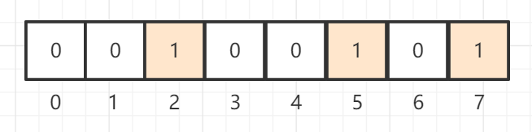
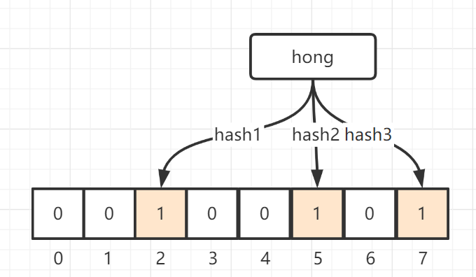

[toc]

# 布隆过滤器

## 1 什么是布隆过滤器

本质上布隆过滤器是一种比较巧妙的概率型数据结构（probabilistic data structure），
特点是高效地插入和查询，可以用来告诉你 **“某样东西一定不存在或者可能存在”**。 	

相比于传统的 List、Set、Map 等数据结构，它更高效、占用空间更少，但是缺点是其返回的结果是概率性的，而不是确切的。 	

##  2 底层数据结构&原理

 布隆过滤器底层可以说是一个 bit 数组，长这样： 

如果我们要映射一个值到布隆过滤器中，我们需要使用**多个不同的哈希函数**生成**多个哈希值，**并对每个生成的哈希值指向的 bit 下标对应的值置为1，例如针对值 “hong” 和三个不同的哈希函数分别生成了哈希值 2、5、7，则上图转变为： 

如果我们要判断一个key在不在集合里面

1. 首先对这个key进行多个hash运算（这里个数由同存入时用的hash算法个数决定）；
2. 如果**每一个hash运算**后的下标对应的值都为1，那么就说明这个key**可能在**这个集合里；
    - 为什么是可能在呢，这是因为在运算中可能会存在hash冲突的情况，其他的key可能刚好也把这几个下标置为了1，那么就会存在误判的情况。
3. 如果**有一个hash运算**后下标对应的值不为1，那么就说明这个key**肯定不在**这个集合里；
    - 就相当于通过hash映射没有找到对应的值，所以肯定不存在于这个集合里。

## 3 误算率

对于布隆过滤器有一个误算率（False Positive） 的概念，其实就是有多大概率会算错。

- 当我们降低误算率时（即期望判断更精准），会加大我们的时间复杂度以及空间复杂度
    常见的做法就是:
    1. 增加hash函数的个数；
    2. 增大底层bit数组的大小（降低hash冲突）
- 当我们提高误算率时（即期望判断不用很精准），就跟上面的降低误算率相反了

## 4 优缺点

- 优点
    1.  相比于其它的数据结构，布隆过滤器在空间和时间方面都有巨大的优势 ， 
        布隆过滤器存储空间和插入/查询时间都是常数；
    2.  布隆过滤器不需要存储元素本身，在某些对保密要求非常严格的场合有优势。 
- 缺点
    1. 布隆过滤器存在误算的情况
    2. 不支持删除数据

## 5 布隆过滤器在Redis的应用

针对布隆过滤器可以告诉我们 **“某样东西一定不存在或者可能存在”**这一特点，可以应用在解决Redis缓存穿透上（缓存穿透：在redis中查询没有数据，从而直接把请求打到数据库上）

## 6 总结

布隆过滤器底层是以bit数据存储的，通过多个hash算法来判断指定的key是否在该集合里面的一个数据结构，它能**精确的判断key是否不在集合**里，但是只能**模糊的判断这个key是否在集合**里。

## ps-相关资料

[bilibili-布隆过滤器详解](https://www.bilibili.com/video/BV1zK4y1h7pA?from=search&seid=17460081650815297817)

[详解布隆过滤器的原理，使用场景和注意事项](https://zhuanlan.zhihu.com/p/43263751)