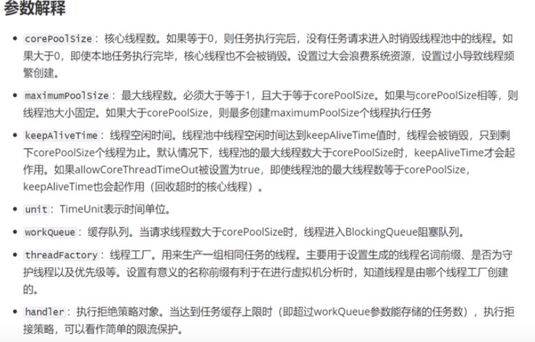

[toc]

## 框架

- Flink
- Flume
- Spark
- Netty
- EleasticSearch
- kyline

## Java相关

- 线程池
    - 原理
    - 常用参数
    - 拒接策略
    - 
- hashMap原理7&8
- 锁-AQS
- 锁-读写锁
- 设计模式-UML

## 算法相关

- 常见的排序算法以及代码实现-[数据结构可视化](https://visualgo.net/en)
- 红黑数、B+树
- 布隆过滤器
- 数据结构-跳表-[跳表](https://mp.weixin.qq.com/s?__biz=Mzk0MDIxNjU3OA==&mid=2247485981&idx=1&sn=9089a5df026c4103bbb73c0b94300399&chksm=c2e45270f593db66d47ca30dc5c86e024bed9864e1f35990f625bb6a9e591ba38039ba674346&scene=132#wechat_redirect)

## mysql相关

- 底层原理
- 优化
- 分库分表实现
- mysql主从复制原理
- 存储引擎，innodb myisam
- b树，b+树
- 索引相关
- 索引失效的场景

## web相关

- spring
- springmvc
- springboot
- springcloud
- dubbo
- 服务降级、限流、熔断
